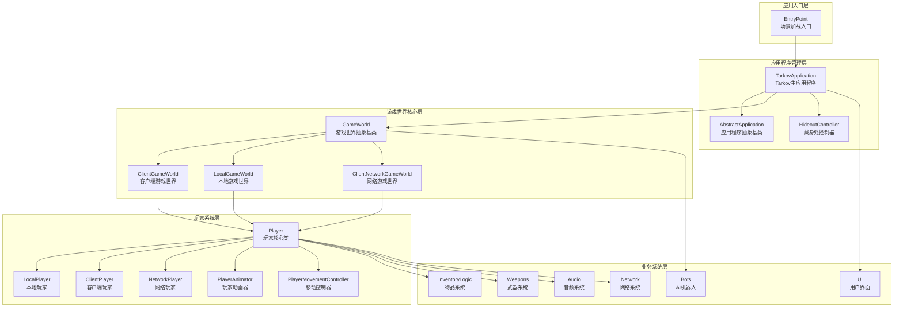

本文档是Unity Tarkov项目的入门指南,旨在帮助初级开发者快速了解项目的整体架构、核心价值和学习路径。Unity Tarkov是一个基于Unity引擎的《逃离塔科夫》(Escape from Tarkov)游戏源码反编译重构项目,通过系统性的代码重构和中文注释,为游戏开发者提供了宝贵的架构参考和学习资源。

## 项目定位与核心价值

Unity Tarkov项目不仅仅是一个游戏源码的简单导出,更是一个经过精心组织的架构学习平台。该项目将商业级射击游戏的核心系统完整保留,并在此基础上进行了系统的反编译重构工作。通过将混淆的类名、方法名和字段名重命名为具有明确语义的英文名称,并添加详细的中文注释,使得原本难以理解的代码变得清晰可读。这种处理方式让开发者能够直接学习到大型游戏项目的设计模式和最佳实践,而无需从零开始探索。

项目采用渐进式重构策略,从核心系统开始,逐步向外围扩展。根据重构映射文档显示,目前已经完成了包括Player类、ClientPlayer类、GameWorld类、TarkovApplication类等核心组件的重构工作,以及UI系统、物品系统、AI系统等模块的现代化改造。这种系统性的重构确保了代码的质量和可维护性,同时也保留了原始系统的性能特征和业务逻辑完整性。

Sources: [REFACTORING_MAPPING.md](REFACTORING_MAPPING.md#L1-L60), [TarkovApplication.cs](Assembly-CSharp/EFT/TarkovApplication.cs#L1-L45), [GameWorld.cs](Assembly-CSharp/EFT/GameWorld.cs#L1-L40), [Player.cs](Assembly-CSharp/EFT/Player.cs#L1-L30)

## 技术架构概览

项目采用分层架构设计,从底层引擎到高层业务逻辑形成了清晰的层次结构。最上层是应用程序入口点,由EntryPoint类负责根据游戏类型(EFT或Arena)加载相应的场景。中间层是应用程序管理层,TarkovApplication继承自AbstractApplication,负责管理整个游戏的生命周期,包括后端通信、场景加载、UI管理、匹配系统和游戏世界创建等核心功能。

核心游戏世界由GameWorld类管理,这是一个抽象基类,负责协调玩家、战利品、物理系统、网络同步等所有游戏世界的核心功能。GameWorld实现了多个接口以支持玩家管理(IPlayersCollection)、弹道计算(_EB4C)、枚举(IEnumerable)和资源释放(IDisposable)等功能。这种接口驱动的设计使得系统具有高度的可扩展性和可测试性。

玩家系统是项目的核心组件,Player类实现了IPlayer接口,并通过partial类的方式将庞大的功能拆分为多个文件,包括音频(Player.Audio.cs)、生命周期(Player.LifeCycle.cs)、运动(Player.Motion.cs)、背包控制器(Player.InventoryController.cs)、手部控制器(Player.HandsControllers.cs)、武器控制器(Player.FirearmController.cs)等模块。这种模块化的组织方式使得单个文件的功能聚焦,便于维护和理解。

Sources: [EntryPoint.cs](Assembly-CSharp/EFT/EntryPoint.cs#L1-L25), [AbstractApplication.cs](Assembly-CSharp/EFT/AbstractApplication.cs#L1-L60), [GameWorld.cs](Assembly-CSharp/EFT/GameWorld.cs#L1-L70), [Player.cs](Assembly-CSharp/EFT/Player.cs#L1-L50)

## 核心系统功能对比

项目包含多个核心系统,每个系统都有其特定的职责和设计特点。下表对比了主要系统的功能和特点:

| 系统名称 | 核心类 | 主要功能 | 技术特点 | 重构状态 |
|---------|--------|---------|---------|---------|
| 应用程序管理 | TarkovApplication | 游戏生命周期管理、后端通信、场景加载、匹配系统 | 继承自CommonClientApplication,使用依赖注入模式 | ✅ 已完成 |
| 游戏世界管理 | GameWorld | 玩家管理、战利品系统、物理同步、网络协调 | 抽象基类,实现多个接口,使用单例模式 | ✅ 已完成 |
| 玩家系统 | Player | 玩家状态、移动、交互、物品管理、战斗系统 | Partial类拆分,接口驱动,状态机模式 | ✅ 已完成 |
| 物品系统 | InventoryLogic | 物品创建、背包管理、交易逻辑、物品操作 | 组件化设计,命令模式,数据驱动 | ✅ 已完成 |
| 武器系统 | Weapons | 武器射击、弹道计算、配件管理、后坐力系统 | 数据驱动,状态机,物理模拟 | ✅ 已完成 |
| AI机器人 | Bots | AI决策、行为树、战斗AI、巡逻系统 | 行为状态机,目标导向,层次化AI | ✅ 已完成 |
| UI系统 | UI | 界面渲染、拖放操作、窗口管理、交互反馈 | 组件化UI,事件驱动,异步加载 | ✅ 已完成 |
| 音频系统 | Audio | 空间音频、环境音效、武器音效、语音通信 | 3D空间化,音频池,事件驱动 | ✅ 已完成 |
| 网络系统 | Network | 状态同步、预测插值、网络优化、防作弊 | 客户端-服务器架构,状态复制,延迟补偿 | ✅ 已完成 |

Sources: [REFACTORING_MAPPING.md](REFACTORING_MAPPING.md#L1-L200), [TarkovApplication.cs](Assembly-CSharp/EFT/TarkovApplication.cs#L45-L80), [GameWorld.cs](Assembly-CSharp/EFT/GameWorld.cs#L40-L90), [Player.cs](Assembly-CSharp/EFT/Player.cs#L50-L100)

## 项目结构可视化

项目采用清晰的目录结构组织代码,每个模块都有其独立的命名空间和物理位置。Assembly-CSharp命名空间下包含了大部分的核心游戏逻辑,其中EFT命名空间是主要的核心逻辑容器。在EFT命名空间内部,通过子文件夹进一步组织不同功能的代码:

- **根目录核心类**: 包含GameWorld、Player、TarkovApplication、Profile等核心类
- **功能模块子目录**: 如Animations、Audio、Ballistics、Bots、InventoryLogic、UI等
- **接口定义文件**: 以I开头的接口文件,如IPlayer、IPlayerOwner、IWeaponController等
- **枚举定义文件**: 以E开头的枚举文件,如EPlayerState、EBodyPart、EInteractionType等

这种组织方式使得开发者能够快速定位特定功能的代码,同时保持代码的模块化和可维护性。此外,项目还包含了大量的第三方库和工具代码,如GPUInstancer(实例化渲染)、Koenigz.PerfectCulling(遮挡剔除)、RootMotion.FinalIK(逆向动力学)等,这些都是在商业游戏中广泛使用的成熟解决方案。

Sources: [目录结构](.), [REFACTORING_MAPPING.md](REFACTORING_MAPPING.md#L1-L50), [GameWorld.cs](Assembly-CSharp/EFT/GameWorld.cs#L1-L30)

## 代码重构方法论

项目采用系统性的代码重构方法论,确保重构的质量和一致性。根据重构映射文档的记录,重构过程遵循以下核心原则:

**命名规范化**: 将所有混淆的类名、方法名、字段名重命名为具有明确语义的英文名称。例如,将`_E001`重命名为`NodeFinder`,将`_E000()`重命名为`ContainsTargetNode()`,将`_22F`重命名为`onSearchCanceled`。这种命名规范遵循了C#的最佳实践,使用PascalCase表示公共成员,camelCase表示私有成员,使得代码的意图一目了然。

**注释完善化**: 为所有重构的类、方法、字段添加详细的中文注释,说明其功能、参数、返回值和使用示例。注释采用XML文档格式,便于自动生成API文档。例如,TarkovApplication类的注释详细说明了它继承自CommonClientApplication,负责管理游戏的整个生命周期,包括游戏启动和初始化、后端通信和会话管理、场景加载和UI管理等核心功能。

**代码现代化**: 将旧的代码模式转换为现代C#语法,如使用var关键字、表达式体属性、模式匹配、switch表达式等。对于异步操作,将编译器生成的复杂状态机简化为标准的async/await模式。例如,BrowseCategoriesPanel的Filter方法通过现代化重构,将300多行的状态机代码简化为80行,同时保持了原有的异步性能特征。

**结构模块化**: 将大型类拆分为多个partial类文件,如Player类被拆分为Player.cs、Player.Audio.cs、Player.InventoryController.cs、Player.HandsControllers.cs等多个文件,每个文件聚焦于特定的功能领域。这种模块化使得代码更易于理解和维护。

**功能完整性**: 在重构过程中,确保所有原有的业务逻辑和性能特征都得到保留。通过对比重构前后的代码,验证功能的完整性,确保没有引入任何功能缺失或行为改变。

Sources: [REFACTORING_MAPPING.md](REFACTORING_MAPPING.md#L10-L100), [TarkovApplication.cs](Assembly-CSharp/EFT/TarkovApplication.cs#L12-L45), [Player.cs](Assembly-CSharp/EFT/Player.cs#L1-L30)

## 学习路径建议

对于初级开发者,建议按照以下顺序学习项目,逐步深入理解各个系统的设计和实现:

**第一阶段:基础概念理解** - 从本文档开始,了解项目的整体架构和核心价值。然后阅读[快速开始:项目环境搭建与运行](2-kuai-su-kai-shi-xiang-mu-huan-jing-da-jian-yu-yun-xing),了解如何在本地环境搭建和运行项目。

**第二阶段:重构方法论学习** - 阅读[反编译代码重构方法论](3-fan-bian-yi-dai-ma-zhong-gou-fang-fa-lun),了解项目的重构原则和最佳实践。然后学习[命名规范与代码组织原则](4-ming-ming-gui-fan-yu-dai-ma-zu-zhi-yuan-ze),掌握代码的可读性和维护性技巧。

**第三阶段:核心系统架构** - 深入学习[应用程序生命周期管理](6-ying-yong-cheng-xu-sheng-ming-zhou-qi-guan-li),理解游戏的启动和运行机制。然后学习[游戏世界核心管理器](7-you-xi-shi-jie-he-xin-guan-li-qi),掌握游戏世界的协调和管理逻辑。

**第四阶段:玩家系统深入** - 系统学习[玩家核心类架构](8-wan-jia-he-xin-lei-jia-gou),理解Player类的设计和实现。然后分别学习[移动系统与物理计算](9-yi-dong-xi-tong-yu-wu-li-ji-suan)和[手部控制器与武器系统集成](10-shou-bu-kong-zhi-qi-yu-wu-qi-xi-tong-ji-cheng),掌握玩家的移动和交互逻辑。

**第五阶段:业务系统扩展** - 根据个人兴趣,选择学习[物品与背包系统](11-wu-pin-ji-lei-yu-zu-jian-xi-tong)、[用户界面系统](14-uikuang-jia-ji-chu-jia-gou)、[网络与同步架构](19-wang-luo-you-xi-hui-hua-guan-li)或[战斗与物理系统](22-dan-dao-ji-suan-yu-shang-hai-xi-tong)等特定领域的知识。

Sources: [REFACTORING_MAPPING.md](REFACTORING_MAPPING.md#L1-L30), [TarkovApplication.cs](Assembly-CSharp/EFT/TarkovApplication.cs#L1-L20), [GameWorld.cs](Assembly-CSharp/EFT/GameWorld.cs#L1-L30)

## 适用场景与目标受众

本项目特别适合以下开发者群体学习和参考:

**Unity游戏开发者**: 可以学习到大型Unity项目的架构设计、资源管理、性能优化等实用技术。项目中使用的GPUInstancing、遮挡剔除、延迟渲染等技术都是在商业游戏中的成熟应用,可以直接借鉴到自己的项目中。

**游戏架构师**: 可以研究游戏的分层架构、模块化设计、接口驱动等架构模式。项目展示了如何将复杂的游戏系统分解为可管理的模块,如何通过接口实现系统间的解耦,如何使用设计模式解决常见问题。

**反编译与逆向工程爱好者**: 可以学习到系统的代码重构方法论,包括如何识别和重命名混淆代码,如何添加有意义的注释,如何现代化老旧代码。项目中记录的重构历程是宝贵的实践经验。

**C#开发者**: 可以学习到高级C#特性的实际应用,如异步编程、LINQ、反射、表达式树等。项目展示了如何在这些特性的基础上构建高效、可维护的代码。

**游戏设计者**: 可以理解到游戏系统的技术实现细节,有助于在游戏设计时考虑技术可行性和性能影响。通过阅读代码,设计者可以更好地理解各种游戏机制的技术基础。