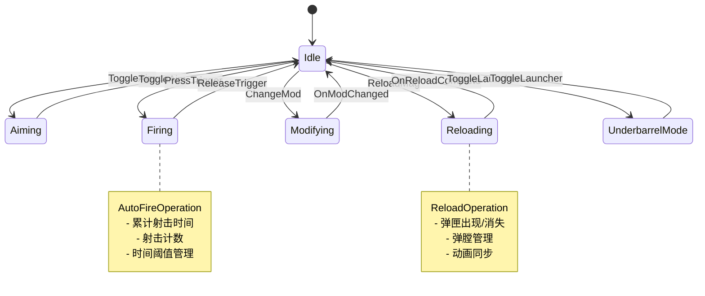
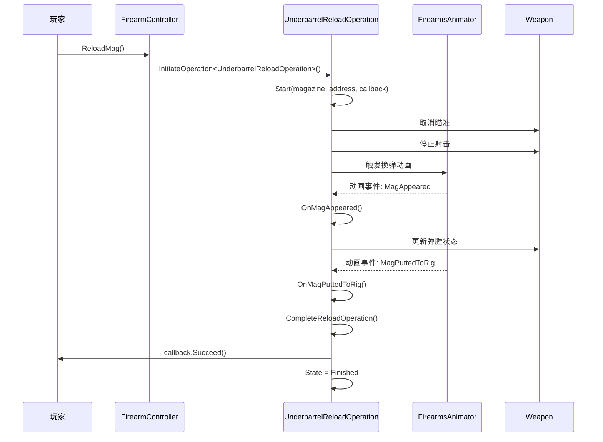
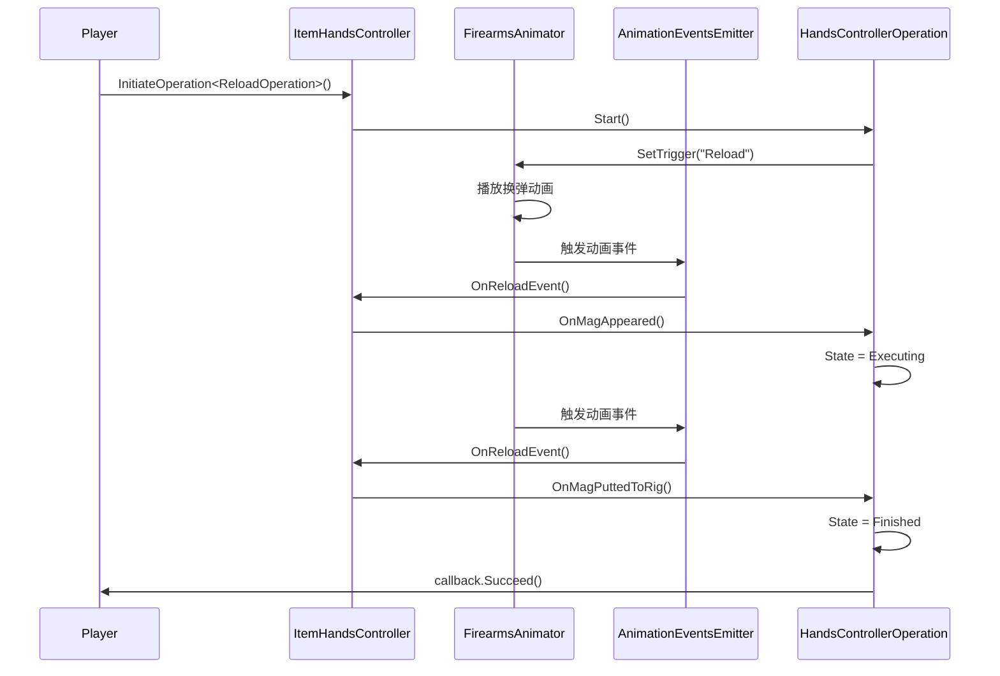
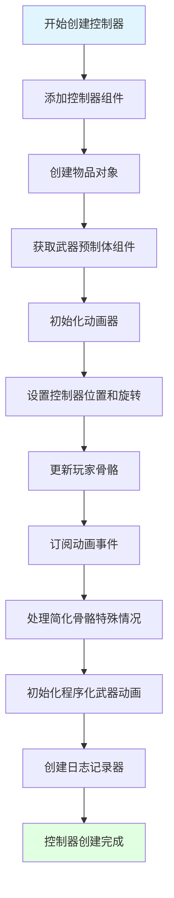
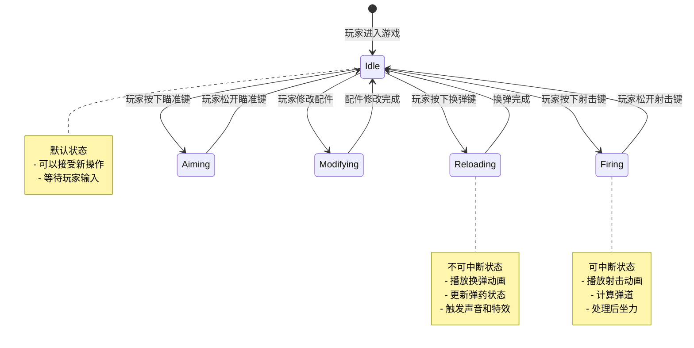

本文档深入分析 Unity Tarkov 项目中手部控制器与武器系统的集成架构，阐述控制器层次结构、操作系统、网络同步机制以及与玩家核心系统的交互模式。文档面向高级开发人员，提供系统级的设计理解和实现细节。

## 系统架构概览

手部控制器系统采用**分层接口设计**与**操作状态机**相结合的架构，通过统一接口抽象实现不同类型物品（武器、手榴弹、近战武器、医疗用品等）的统一管理。系统核心由三大部分组成：**接口抽象层**定义统一契约，**控制器实现层**处理具体逻辑，**操作执行层**管理状态转换和动画流程。

```mermaid
graph TB
    subgraph "接口层次结构"
        IItemInHandsController["IItemInHandsController<br/>基础手部控制器接口"]
        IWeaponController["IWeaponController<br/>武器控制器接口"]
        IFirearmController["IFirearmController<br/>枪械控制器接口"]
        IFirearmHandsController["IFirearmHandsController<br/>枪械手部控制器接口"]
        IUsableItemController["IUsableItemController<br/>可用物品控制器接口"]
        ICompassController["ICompassController<br/>指南针控制器接口"]
    end
    
    subgraph "控制器实现层"
        ItemHandsController["ItemHandsController<br/>物品控制器抽象基类"]
        FirearmController["FirearmController<br/>枪械控制器"]
        EmptyHandsController["EmptyHandsController<br/>空手控制器"]
        KnifeController["KnifeController<br/>近战武器控制器"]
        BaseGrenadeHandsController["BaseGrenadeHandsController<br/>手榴弹控制器基类"]
        MedsController["MedsController<br/>医疗用品控制器"]
        UsableItemController["UsableItemController<br/>可用物品控制器"]
    end
    
    subgraph "客户端实现层"
        ClientFirearmController["ClientFirearmController"]
        ClientEmptyHandsController["ClientEmptyHandsController"]
        ClientKnifeController["ClientKnifeController"]
        ClientGrenadeHandsController["ClientGrenadeHandsController"]
    end
    
    subgraph "操作系统"
        HandsControllerOperation["HandsControllerOperation<br/>操作基类"]
        FirearmOperationBase["FirearmOperationBase<br/>枪械操作基类"]
        EmptyHandsOperation["EmptyHandsOperation<br/>空手操作基类"]
        AutoFireOperation["AutoFireOperation<br/>自动射击操作"]
        ReloadOperation["ReloadOperation<br/>换弹操作"]
    end
    
    IItemInHandsController --> ItemHandsController
    IWeaponController --> EmptyHandsController
    IWeaponController --> KnifeController
    IFirearmController --> FirearmController
    IFirearmHandsController --> FirearmController
    IUsableItemController --> UsableItemController
    ICompassController --> EmptyHandsController
    ICompassController --> FirearmController
    ICompassController --> KnifeController
    
    ItemHandsController --> FirearmController
    ItemHandsController --> EmptyHandsController
    ItemHandsController --> BaseGrenadeHandsController
    ItemHandsController --> MedsController
    ItemHandsController --> UsableItemController
    ItemHandsController --> KnifeController
    
    FirearmController --> ClientFirearmController
    EmptyHandsController --> ClientEmptyHandsController
    KnifeController --> ClientKnifeController
    BaseGrenadeHandsController --> ClientGrenadeHandsController
    
    HandsControllerOperation --> FirearmOperationBase
    HandsControllerOperation --> EmptyHandsOperation
    FirearmOperationBase --> AutoFireOperation
    FirearmOperationBase --> ReloadOperation
    EmptyHandsOperation --> BackpackDropOperation
    
    style IItemInHandsController fill:#e1f5ff
    style IFirearmHandsController fill:#ffe1e1
    style ItemHandsController fill:#fff4e1
    style HandsControllerOperation fill:#e1ffe1
```



该架构实现了**关注点分离**原则：接口层定义行为契约，控制器层处理具体逻辑，操作层管理状态转换。客户端继承服务器端逻辑，添加网络数据包同步功能。这种设计确保了代码的**可扩展性**和**可维护性**，同时支持多种手持物品类型的无缝切换。

Sources: [EHandsControllerType.cs](Assembly-CSharp/EFT/EHandsControllerType.cs#L1-L17), [IItemInHandsController.cs](Assembly-CSharp/EFT/IItemInHandsController.cs#L1-L194), [IFirearmController.cs](Assembly-CSharp/EFT/IFirearmController.cs#L1-L54), [IFirearmHandsController.cs](Assembly-CSharp/EFT/IFirearmHandsController.cs#L1-L79)

## 核心接口层次结构

### 基础接口定义

`IItemInHandsController` 是所有手部控制器的**根本接口**，定义了手持物品系统的核心行为契约。该接口包含物品访问、操作执行、状态查询、动画控制、生命周期管理等六大功能区域。

**基础属性**区域提供控制器状态的直接访问：`Item` 属性返回当前手持的物品实例，`Destroyed` 标识控制器是否已销毁，`IsAiming` 指示当前瞄准状态，`AimingSensitivity` 获取瞄准时的鼠标灵敏度，`HandsHierarchy` 提供手部骨骼层级变换链接，`FirearmsAnimator` 返回枪械动画控制器。这些属性构成了控制器状态的基础视图。

**操作执行**区域定义了命令模式：`CanExecute()` 方法在执行前检查操作的可行性，`Execute()` 方法实际执行操作并支持回调通知。这种设计支持**命令模式**，允许操作被排队、延迟或取消。

**物品操作**区域涵盖交互场景：`Pickup()` 和 `SupportPickup()` 处理物品拾取，`Interact()` 管理交互操作（如搜身、开门），`Loot()` 处理战利品拾取，`CanRemove()` 检查物品移除可行性。这些方法映射游戏世界中的物理交互。

**状态查询**区域提供运行时状态信息：`IsHandsProcessing()` 检查手部是否繁忙（换弹、检视等），`IsPlacingBeacon()` 检查信标放置状态，`CanInteract()` 和 `IsInInteraction()` 管理交互状态，`InCanNotBeInterruptedOperation()` 识别不可中断的关键操作。这些查询支持**状态机**的决策逻辑。

**动画控制**区域桥接动画系统：`GetAnimatorFloatParam()` 获取动画器参数值，`ManualLateUpdate()` 手动触发延迟更新，`ShowGesture()` 显示手势动作，`BlindFire()` 处理盲射模式。这些方法实现了手部控制器与动画系统的紧密耦合。

**生命周期**区域管理控制器生命周期：`SetInventoryOpened()` 响应库存界面状态，`OnPlayerDead()` 处理玩家死亡事件，`OnGameSessionEnd()` 响应游戏会话结束，`Destroy()` 清理资源。这些方法确保控制器在关键时刻的正确行为。

Sources: [IItemInHandsController.cs](Assembly-CSharp/EFT/IItemInHandsController.cs#L1-L194)

### 武器专用接口扩展

`IFirearmController` 接口针对武器特性进行了专门扩展，定义了枪械系统的独特属性和行为。该接口继承自 `IItemInHandsController`，添加了武器人机工程学、射击口位置、鼠标控制等武器特有概念。

**武器属性**区域包含武器特有的物理和操作参数：`Weapon` 属性返回当前手持的武器实例，`ErgonomicWeight` 表示人机工程学权重（影响武器操作的舒适度），`TotalErgonomics` 提供武器配件的综合人机工程学评分，`CurrentFireport` 返回当前射击口位置（双面变换，支持左右切换），`MouseLookControl` 指示是否启用鼠标视角控制。这些属性直接映射到游戏平衡和操作手感。

**方法**区域提供武器动态管理：`RecalculateErgonomic()` 在武器配件发生变化时重新计算人机工程学值。这支持了**配件系统**的动态特性，每次修改武器配置都会重新评估操作手感。

`IFirearmHandsController` 接口进一步扩展了枪械控制器的功能，继承自 `IUsableItemController`、`IItemInHandsController` 和 `ICompassController`，形成了枪械控制器的完整接口定义。

该接口定义了丰富的武器操作方法：`SetTriggerPressed()` 控制扳机状态，`ChangeFireMode()` 切换射击模式（全自动、半自动、三连发），`CheckFireMode()` 验证射击模式可行性，`ChangeAimingMode()` 和 `ToggleAim()` 管理瞄准模式，`SetAim()` 设置瞄准状态。这些方法构成了武器操作的核心命令集。

**换弹系统**包含多个专门方法：`ReloadMag()` 标准弹匣换弹，`QuickReloadMag()` 快速换弹，`ReloadWithAmmo()` 使用弹药包换弹，`ReloadCylinderMagazine()` 转轮手枪换弹，`ReloadBarrels()` 双管枪换弹，`ReloadGrenadeLauncher()` 榴弹发射器换弹。这种细粒度的方法设计适应了不同武器类型的换弹机制。

**瞄准系统**支持光学瞄准具和机械瞄准具的多样化配置：`ExamineWeapon()` 检视武器，`RollCylinder()` 转动转轮手枪弹巢，`CheckAmmo()` 和 `CheckChamber()` 检查弹药状态，`SetScopeMode()` 设置瞄准镜模式，`OpticCalibrationSwitchUp()` 和 `OpticCalibrationSwitchDown()` 调整瞄准镜校准。这些方法支持了复杂的武器瞄准系统。

**战术配件**管理：`SetLightsState()` 控制战术灯和激光指示器，`ToggleLauncher()` 切换下挂榴弹发射器，`UnderbarrelSightingRangeUp()` 和 `UnderbarrelSightingRangeDown()` 调整下挂武器瞄准距离。这些方法体现了游戏中的**战术深度**。

**状态查询**方法：`CanStartReload()` 检查换弹可行性，`ShouldForceQuickReload()` 判断是否强制快速换弹，`CanPressTrigger()` 检查扳机操作可行性，`IsInLauncherMode()` 识别下挂模式，`HasScopeAimBone()` 检查瞄准镜瞄准骨骼。

Sources: [IFirearmController.cs](Assembly-CSharp/EFT/IFirearmController.cs#L1-L54), [IFirearmHandsController.cs](Assembly-CSharp/EFT/IFirearmHandsController.cs#L1-L79)

### 控制器类型枚举

`EHandsControllerType` 枚举定义了系统中支持的所有手部控制器类型，为控制器切换提供类型安全机制。该枚举包含十个值：`None`（无控制器）、`Empty`（空手）、`Firearm`（枪械）、`Meds`（医疗用品）、`Grenade`（手榴弹）、`Knife`（近战武器）、`QuickGrenade`（快速投掷手榴弹）、`QuickKnife`（快速近战攻击）、`UsableItem`（可用物品）、`QuickUseItem`（快速使用物品）。

这种枚举设计支持**状态机**的实现，玩家在不同情况下切换到相应的控制器类型。快速操作类型（如 `QuickGrenade`、`QuickKnife`）提供了无需完整动画序列的快速响应，提高了游戏节奏和操作流畅度。

Sources: [EHandsControllerType.cs](Assembly-CSharp/EFT/EHandsControllerType.cs#L1-L17)

## 手部控制器核心架构

### 物品控制器基类

`ItemHandsController` 抽象基类实现了 `IItemInHandsController` 接口，为所有手部控制器提供统一的基础架构。该类采用**模板方法模式**，定义了控制器创建、初始化、操作管理的通用流程，同时允许子类通过抽象方法定制具体行为。

**字段结构**揭示了控制器的核心组成：`_objectInHandsAnimator` 管理手中物品的动画器，`_controllerObject` 保存控制器游戏对象，`_handsHierarchy` 维护手部骨骼层级结构，`_player` 保存关联的玩家对象，`RadioTransmitterState` 管理无线电发射器状态，`Logger` 负责日志记录。

**操作缓存机制**体现了性能优化策略：`operationCache` 字典缓存已创建的操作实例，避免重复实例化；`operationFactoryDelegates` 字典存储操作工厂委托，支持延迟创建操作；`currentHandsOperation` 跟踪当前执行的操作。这种**对象池**模式减少了垃圾回收压力，提高了运行时性能。

**状态管理**：`itemInHands` 保存手中物品，`compassState` 管理指南针状态。这些状态通过响应式属性（`ReactiveProperty<bool>`）实现，支持数据绑定和自动通知。

**属性接口**提供了控制器的公共视图：`FirearmsAnimator`、`CompassState`、`SuitableForHandInput`、`CurrentCompassState`、`CurrentRadioTransmitterState`、`ControllerGameObject`、`AimingSensitivity`、`HandsHierarchy`、`CurrentHandsOperation`、`CurrentHandsOperationName`、`Item`。这些属性构成了控制器与外部系统交互的主要接口。

**操作管理**是控制器的核心功能：`InitiateOperation<TCreateOperation>()` 方法使用泛型和反射机制创建或获取缓存的操作实例，更新日志记录器，切换当前操作，并触发操作状态变更事件。该方法实现了**操作状态机**的核心逻辑。

```csharp
protected internal TCreateOperation InitiateOperation<TCreateOperation>() 
    where TCreateOperation : HandsControllerOperation
{
    if (operationFactoryDelegates == null)
    {
        operationFactoryDelegates = GetOperationFactoryDelegates();
    }
    
    Type operationType = typeof(TCreateOperation);
    if (!operationCache.ContainsKey(operationType))
    {
        operationCache[operationType] = operationFactoryDelegates[operationType]();
    }
    
    HandsControllerOperation operation = operationCache[operationType];
    operation.UpdateLoggerController(this);
    Logger.TraceStateChange(CurrentHandsOperation, operation);
    
    if (CurrentHandsOperation != null)
    {
        CurrentHandsOperation.OnEnd();
    }
    
    CurrentHandsOperation = operation;
    CurrentHandsOperation.Reset();
    
    return (TCreateOperation)CurrentHandsOperation;
}
```

**控制器创建**使用静态工厂方法：`CreateController<TController>()`、`CreateControllerWithFactory<TController>()`、`CreateControllerAsync<TController>()`、`CreateControllerWithFactoryAsync<TController>()`。这些方法支持同步和异步创建，允许自定义物品对象工厂委托。创建流程包括：添加控制器组件、创建物品对象、初始化控制器。

**初始化流程**涉及多个系统的协同：`InitializeController()` 静态方法从武器预制体获取动画器和事件发射器，设置控制器对象位置和旋转，更新玩家骨骼，订阅事件，处理简化骨骼特殊情况。这体现了**组合模式**和**观察者模式**的结合应用。

**事件订阅**建立了控制器与玩家系统的通信：`SubscribeToEvents()` 方法订阅背包丢弃、脚架切换、僵尸射击等事件。这些事件通过 `PlayerAnimatorEventsDispatcher` 分发，实现了**发布-订阅模式**。

**指南针管理**：`SetCompassState()` 检查状态变更可行性并更新响应式属性，`ApplyCompassPacket()` 处理网络数据包，`CompassStateHandler()` 创建指南针并更新动画器。这些方法展示了控制器如何集成到游戏UI系统。

**生命周期管理**：`Destroy()` 方法取消事件订阅并调用基类销毁逻辑，`ToString()` 生成控制器的字符串表示用于调试，`UnsubscribeFromEvents()` 清理事件订阅。这确保了资源的正确释放。

Sources: [Player.HandsControllers.cs](Assembly-CSharp/EFT/Player.HandsControllers.cs#L1-L799)

### 空手控制器实现

`EmptyHandsController` 处理玩家空手状态的所有操作，实现了 `IWeaponController`、`IItemInHandsController` 和 `ICompassController` 接口。该控制器主要负责背包丢弃、空手交互、指南针显示、武器隐藏/显示等功能。

**内部操作类**：`BackpackDropOperation` 处理背包丢弃逻辑，`IdleEmptyHandsOperation` 管理空手空闲状态，`HideWeaponOperation` 控制武器隐藏动画。这些操作类继承自 `EmptyHandsOperation` 基类，实现了特定的行为逻辑。

`BackpackDropOperation` 的执行流程：调用 `Start()` 方法开始操作，设置背包物品和完成回调，触发动画器参数，发送手部交互状态变更，设置玩家交互状态。动画事件触发 `OnBackpackDrop()` 方法，更新操作状态为已完成，发送手部交互状态恢复，调用完成回调，切换到空闲操作。

`IdleEmptyHandsOperation` 管理空手状态的循环：每隔 300 毫秒触发一次动画器空闲动画，处理武器隐藏、武器检视、指南针状态切换、物品移动等操作。该操作是空手控制器的默认状态。

`HideWeaponOperation` 处理武器隐藏流程：设置隐藏完成回调，触发动画器参数，调用 `HideWeaponComplete()` 方法完成隐藏。该操作通常在需要腾出双手的场景下触发。

Sources: [Player.HandsControllers.cs](Assembly-CSharp/EFT/Player.HandsControllers.cs#L800-L1200)

### 枪械控制器架构

`FirearmController` 是最复杂的手部控制器，处理武器的射击、换弹、配件管理、瞄准、故障处理等所有武器相关功能。该控制器实现了 `IFirearmHandsController`、`IUsableItemController`、`IItemInHandsController`、`ICompassController` 和 `IFirearmController` 接口，是整个手部控制器系统的核心组件。

**内部操作类**构成了枪械控制器的状态机：`UnderbarrelReloadOperation` 处理下挂榴弹发射器换弹，`WeaponModificationOperation` 管理武器配件修改，`AutoFireOperation` 控制自动射击，`ReloadOperation` 处理标准换弹流程。这些操作类继承自 `FirearmOperationBase` 基类，实现了武器特有的行为逻辑。

`UnderbarrelReloadOperation` 展示了复杂的换弹逻辑：开始时设置下挂武器项目、弹膛索引、弹药地址和完成回调，取消瞄准状态，停止射击，禁用盲射，触发动画器参数。动画事件触发 `OnMagAppeared()` 和 `OnMagPuttedToRig()` 方法，分别处理弹匣出现和弹匣放入装备的逻辑。`RemoveAmmoFromChamber()` 从弹膛移除弹药，`CompleteReloadOperation()` 完成换弹操作并更新武器状态。

`WeaponModificationOperation` 管理配件安装流程：开始时设置配件项目、安装位置和完成回调，设置动画器配件参数，停止射击，取消瞄准。动画事件触发 `OnModChanged()` 方法，创建配件游戏对象，更新武器模型，重新计算人机工程学，调整武器尺寸，更新握持姿态，处理下挂武器设置，发送网络数据包。该操作体现了武器系统的**模块化设计**。

`AutoFireOperation` 实现了自动射击的精确控制：使用多个时间阈值常量（0%、25%、75%、99%）控制射击节奏，维护当前射击计数、射击间隔时间、累计射击时间、射击计时器、单次射击数据等状态。该操作支持全自动和连发射击模式，通过时间管理和状态机实现流畅的射击体验。



Sources: [Player.FirearmController.cs](Assembly-CSharp/EFT/Player.FirearmController.cs#L1-L400)

## 操作系统深度解析

### 操作基类设计

`HandsControllerOperation` 是所有操作的抽象基类，定义了操作状态机的基础结构。该类实现了操作生命周期管理、状态转换、动画事件处理等核心功能，为具体操作提供统一的行为框架。

**操作状态枚举**定义了操作的三个主要状态：`Ready`（准备就绪）、`Executing`（执行中）、`Finished`（已完成）。这对应了**有限状态机**的基本模型，操作在这些状态之间转换。

**EmptyHandsOperation` 基类**实现了空手操作的通用逻辑：维护玩家对象和空手控制器引用，提供 `Start()`、`HideWeapon()`、`WeaponAppeared()`、`OnBackpackDrop()`、`HideWeaponComplete()`、`ExamineWeapon()`、`SetEmptyHandsCompassState()`、`FastForward()`、`SetInventoryOpened()`、`CanExecute()`、`Execute()` 等虚方法。这些方法定义了空手操作的标准行为。

`IdleEmptyHandsOperation` 是空手控制器的默认操作，实现了一个循环定时器：每隔 300 毫秒触发一次动画器空闲动画。该操作支持武器隐藏、武器检视、指南针状态切换、物品移动等功能。当检测到物品移动操作时，会切换到 `BackpackDropOperation`。

`HideWeaponOperation` 处理武器隐藏流程：设置隐藏完成回调，触发动画器参数，立即调用 `HideWeaponComplete()` 方法完成隐藏。该操作通常在需要腾出双手的场景下触发。

**操作切换机制**通过 `InitiateOperation<TCreateOperation>()` 方法实现：该方法从缓存获取或创建操作实例，更新日志记录器，记录状态变更，结束当前操作（如果存在），重置新操作，设置为新当前操作。这种设计支持了**操作状态机**的无缝切换。

**操作缓存**通过 `operationCache` 字典实现：使用操作类型作为键，存储已创建的操作实例。这种**对象池**模式减少了垃圾回收压力，提高了运行时性能。操作实例被重用，每次切换操作时调用 `Reset()` 方法恢复初始状态。

Sources: [Player.HandsControllers.cs](Assembly-CSharp/EFT/Player.HandsControllers.cs#L800-L1200)

### 枪械操作实现

枪械操作是操作系统中最复杂的部分，涉及射击、换弹、配件管理等多个方面。`FirearmOperationBase` 基类为所有枪械操作提供了通用功能，具体的操作类继承并扩展了这些功能。

`UnderbarrelReloadOperation` 实现了下挂榴弹发射器的换弹逻辑：维护下挂武器项目、弹药地址、操作完成回调、弹匣出现标志、弹匣放入装备标志、弹膛索引等状态。该操作通过动画事件触发状态变更：`OnMagAppeared()` 处理弹匣出现，`OnMagPuttedToRig()` 处理弹匣放入装备，`RemoveAmmoFromChamber()` 从弹膛移除弹药，`CompleteReloadOperation()` 完成换弹操作。



`WeaponModificationOperation` 管理武器配件的安装和移除：维护配件项目、安装位置、操作完成回调、配件安装完成标志等状态。该操作通过动画事件触发配件变更：`OnModChanged()` 创建配件游戏对象，更新武器模型，重新计算人机工程学，调整武器尺寸，更新握持姿态，处理下挂武器设置，发送网络数据包。

`AutoFireOperation` 实现了自动射击的精确控制：维护当前射击计数、射击间隔时间、累计射击时间、射击计时器、单次射击数据、开火事件标志、连发射击数量等状态。该操作使用多个时间阈值常量（0%、25%、75%、99%）控制射击节奏，通过时间管理和状态机实现流畅的射击体验。

Sources: [Player.FirearmController.cs](Assembly-CSharp/EFT/Player.FirearmController.cs#L1-L400)

## 客户端-服务器架构

### 客户端控制器实现

客户端控制器继承服务器端控制器逻辑，添加网络数据包同步功能。这种设计实现了**逻辑分离**：服务器端控制器包含核心游戏逻辑，客户端控制器负责网络同步和预测。

`ClientFirearmController` 继承自 `Player.FirearmController`，包含多个内部状态类：`_E000`、`_E001`、`_E002`、`_E003` 等。这些状态类管理客户端特有的网络同步逻辑，如数据包更新、状态预测、错误校正等。

`ClientFirearmController` 维护 `FirearmPacket` 数据包，用于同步射击、换弹、瞄准等状态到服务器。该数据包包含扳机状态、瞄准状态、射击模式、瞄准镜状态、下挂武器状态等信息。网络同步采用**状态同步**模式，定期发送控制器状态到服务器。

`ClientEmptyHandsController` 继承自 `Player.EmptyHandsController`，维护 `EmptyHandPacket` 数据包。该数据包包含指南针状态、手势、库存状态等信息。客户端通过 `CompassStateHandler()` 方法处理指南针状态变更，同步数据包到服务器。

`ClientKnifeController` 继承自 `Player.KnifeController`，维护 `KnifePacket` 数据包。该数据包包含武器检视、近战攻击、连招组合、击中信息等。客户端通过 `MakeKnifeKick()`、`MakeAlternativeKick()` 等方法处理近战攻击逻辑，同步击中数据到服务器。

Sources: [ClientFirearmController.cs](Assembly-CSharp/EFT/ClientFirearmController.cs#L1-L150), [ClientEmptyHandsController.cs](Assembly-CSharp/EFT/ClientEmptyHandsController.cs#L1-L42), [ClientKnifeController.cs](Assembly-CSharp/EFT/ClientKnifeController.cs#L1-L88)

### 网络同步机制

网络同步采用**数据包驱动**的模式，每个客户端控制器维护对应的数据包对象，在操作执行时更新数据包并发送到服务器。服务器验证数据包的有效性，广播状态变更到其他客户端。

`FirearmPacket` 包含枪械控制器的所有同步状态：扳机状态（`IsTriggerPressed`）、瞄准状态（`IsAiming`）、射击模式（`FireMode`）、换弹动作（`ReloadAction`）、瞄准镜状态（`ScopeStates`）、下挂武器状态（`LauncherState`）、脚架状态（`BipodState`）、战术灯状态（`LightStates`）等。这些状态通过网络广播到其他客户端，实现多人游戏的同步。

`EmptyHandPacket` 包含空手控制器的同步状态：指南针状态（`CompassPacket`）、手势（`Gesture`）、库存状态（`EnableInventoryPacket`）等。这些状态相对简单，但确保了空手操作的同步。

`KnifePacket` 包含近战控制器的同步状态：武器检视（`ExamineWeapon`）、近战攻击（`MakeKnifeKick`）、连招组合（`BrakeCombo`）、交替攻击（`AlternativeKick`）、击中信息（`HitData`）等。近战攻击的同步需要精确的时间戳和位置信息，服务器会验证攻击的有效性。

网络同步采用**状态插值**技术，客户端预测本地操作，同时接收服务器校正数据。这种设计减少了网络延迟的影响，提高了游戏的响应速度和流畅度。

Sources: [ClientFirearmController.cs](Assembly-CSharp/EFT/ClientFirearmController.cs#L1-L150), [ClientKnifeController.cs](Assembly-CSharp/EFT/ClientKnifeController.cs#L1-L88)

## 动画系统集成

### 动画器架构

手部控制器系统与动画系统紧密集成，通过 `FirearmsAnimator` 类实现动画参数控制、事件触发、状态管理等功能。`FirearmsAnimator` 封装了 Unity Animator 组件，提供了高级的动画控制接口。

`FirearmsAnimator` 维护以下核心组件：`Animator` 引用（Unity 动画器）、`AnimationEventsEmitter` 动画事件发射器、`ObjectInHands` 手中物品对象、`ProceduralWeaponAnimation` 程序化武器动画。这些组件协同工作，实现了流畅的武器动画效果。

`ItemHandsController` 通过 `_objectInHandsAnimator` 字段访问动画器，该字段在控制器初始化时从武器预制体获取。`FirearmsAnimator` 添加控制器为动画事件消费者，通过事件驱动机制触发操作状态变更。



Sources: [Player.HandsControllers.cs](Assembly-CSharp/EFT/Player.HandsControllers.cs#L600-L800)

### 动画事件系统

动画事件系统通过 `AnimationEventsEmitter` 类实现，负责监听动画器事件并分发给相应的操作。该系统采用**观察者模式**，操作类作为消费者注册到事件发射器，接收特定的动画事件。

`AnimationEventsEmitter` 维护事件消费者列表，在动画事件触发时遍历消费者列表，调用相应的事件处理方法。该系统支持多种事件类型：弹匣出现/消失、弹膛状态变更、配件安装完成、射击触发、下挂武器切换等。

操作类通过 `OnMagAppeared()`、`OnMagPuttedToRig()`、`OnModChanged()`、`OnBackpackDrop()`、`HideWeaponComplete()`、`WeaponAppeared()` 等方法响应动画事件。这些方法通常更新操作状态，触发后续逻辑，或完成操作流程。

`BaseGrenadeHandsController` 特别依赖动画事件系统：`OnIdleStartAction()` 处理空闲开始动作，`OnDrawCompleteAction()` 处理投掷完成动作。手榴弹的投掷时机由动画事件精确控制，确保视觉效果与游戏逻辑同步。

Sources: [Player.HandsControllers.cs](Assembly-CSharp/EFT/Player.HandsControllers.cs#L3800-L4000)

### 程序化动画

程序化武器动画（`ProceduralWeaponAnimation`）系统通过数学计算实时调整武器姿态，实现了逼真的武器移动和反馈。该系统与手部控制器紧密集成，在控制器初始化时设置程序化动画的变换引用。

`ItemHandsController` 在初始化时调用 `player.ProceduralWeaponAnimation.InitTransforms(controller.HandsHierarchy)`，设置程序化动画的手部骨骼引用。程序化动画根据玩家移动、跳跃、蹲下等动作，实时调整武器的位置和旋转，实现武器跟随身体移动的逼真效果。

武器预制体的 `ObjectInHands` 组件通过 `AfterGetFromPoolInit()` 方法初始化程序化动画，设置武器的初始姿态和参数。程序化动画系统考虑了武器的重量、人机工程学、配件配置等因素，计算出自然的武器动态。

Sources: [Player.HandsControllers.cs](Assembly-CSharp/EFT/Player.HandsControllers.cs#L600-L800)

## 武器系统集成详解

### 武器属性计算

武器系统通过 `IFirearmController` 接口定义了人机工程学、射击口位置、鼠标控制等核心属性。这些属性直接影响武器的操作手感和平衡性。

**人机工程学系统**是武器平衡的核心：`ErgonomicWeight` 表示武器人机工程学权重，`TotalErgonomics` 提供武器配件的综合人机工程学评分。人机工程学影响瞄准速度、后坐力控制、移动精度等多个方面。每次修改武器配件时，`RecalculateErgonomic()` 方法会重新计算人机工程学值，确保数值的准确性。

**射击口系统**支持武器的多样化配置：`CurrentFireport` 返回当前射击口位置（`BifacialTransform`），支持左右切换。这对于双管枪、转轮手枪等武器类型特别重要。射击口位置决定了子弹从武器的哪个位置发射，影响弹道的视觉效果和物理计算。

**鼠标控制系统**：`MouseLookControl` 指示是否启用鼠标视角控制。在瞄准、换弹、检视等操作中，鼠标视角控制可能被禁用，确保动画的完整性和操作的稳定性。

Sources: [IFirearmController.cs](Assembly-CSharp/EFT/IFirearmController.cs#L1-L54)

### 换弹系统实现

换弹系统是武器操作中最复杂的部分之一，涉及弹匣管理、弹膛控制、动画同步、声音触发等多个方面。`IFirearmHandsController` 接口定义了多个换弹相关方法，支持不同武器类型的换弹机制。

**标准换弹流程**（`ReloadMag`）：玩家触发换弹操作，控制器创建 `ReloadOperation`，动画器播放换弹动画。动画事件触发 `OnMagAppeared()` 方法，弹匣出现。玩家从库存或装备中取出弹匣，触发 `OnMagPuttedToRig()` 方法，弹匣放入装备。操作完成，武器弹药更新，触发声音和特效。

**快速换弹流程**（`QuickReloadMag`）：与标准换弹类似，但动画更快，不检查弹匣中剩余弹药。快速换弹适用于紧急情况，但可能浪费弹药。

**弹药包换弹流程**（`ReloadWithAmmo`）：玩家使用弹药包直接装填弹膛，不需要弹匣。这种换弹方式适用于散弹枪、狙击枪等使用弹药包的武器。

**转轮手枪换弹流程**（`ReloadCylinderMagazine`）：转轮手枪的特殊换弹方式，逐发装填弹巢。动画中需要精确控制每发子弹的装填时机。

**双管枪换弹流程**（`ReloadBarrels`）：双管猎枪的特殊换弹方式，需要打开枪管，装入两发子弹，然后合上枪管。动画和物理逻辑都比较复杂。

**榴弹发射器换弹流程**（`ReloadGrenadeLauncher`）：下挂榴弹发射器的换弹方式，与标准枪械换弹类似，但动画和声音不同。

Sources: [IFirearmHandsController.cs](Assembly-CSharp/EFT/IFirearmHandsController.cs#L1-L79)

### 瞄准系统实现

瞄准系统是武器操作的核心，直接影响玩家的射击精度和体验。`IFirearmHandsController` 接口定义了多个瞄准相关方法，支持光学瞄准具和机械瞄准具的多样化配置。

**瞄准模式切换**（`ChangeAimingMode`、`ToggleAim`、`SetAim`）：玩家可以切换瞄准模式，如机械瞄准、红点瞄准、倍率瞄准等。瞄准模式影响视野范围、移动速度、后坐力控制等多个方面。

**瞄准镜校准**（`SetScopeMode`、`OpticCalibrationSwitchUp`、`OpticCalibrationSwitchDown`）：光学瞄准具支持多档放大倍率，玩家可以动态调整瞄准镜的放大倍数。瞄准镜校准影响视野范围和射击精度。

**下挂武器瞄准**（`UnderbarrelSightingRangeUp`、`UnderbarrelSightingRangeDown`）：下挂榴弹发射器或下挂霰弹枪有自己的瞄准系统，可以独立调整瞄准距离。这支持了武器的多功能配置。

**瞄准骨骼系统**（`HasScopeAimBone`）：高倍率瞄准镜需要专门的瞄准骨骼，实现真实的瞄准体验。该方法检查武器是否具备瞄准骨骼，支持瞄准镜的多样化配置。

Sources: [IFirearmHandsController.cs](Assembly-CSharp/EFT/IFirearmHandsController.cs#L1-L79)

### 战术配件系统

战术配件系统管理武器附加的战术装备，如战术灯、激光指示器、消音器等。`IFirearmHandsController` 接口定义了多个战术配件相关方法，支持战术装备的开关和配置。

**战术灯和激光指示器**（`SetLightsState`）：玩家可以控制战术灯和激光指示器的开关状态，影响隐蔽性和战术选择。战术灯提供照明，激光指示器辅助瞄准，但会暴露位置。

**下挂榴弹发射器**（`ToggleLauncher`）：下挂榴弹发射器可以在主武器和榴弹发射器之间切换，支持双武器功能。切换下挂模式需要特殊的动画和物理逻辑。

**脚架系统**（`ToggleBipod`）：脚架可以显著降低后坐力，提高射击精度，但限制了移动能力。脚架的部署和收起需要特定的动画和物理状态。

Sources: [IFirearmHandsController.cs](Assembly-CSharp/EFT/IFirearmHandsController.cs#L1-L79)

## 实战示例与最佳实践

### 控制器创建流程

创建手部控制器遵循标准化的流程，确保控制器的正确初始化和与玩家系统的集成。以下是创建枪械控制器的完整流程：



**同步创建流程**使用 `ItemHandsController.CreateController<TController>()` 静态方法：该方法添加控制器组件到玩家游戏对象，使用 `AssetPoolManager` 创建物品对象，调用 `InitializeController()` 初始化控制器。适用于加载速度要求不高的场景。

**异步创建流程**使用 `ItemHandsController.CreateControllerAsync<TController>()` 静态方法：该方法添加控制器组件到玩家游戏对象，使用 `AssetPoolManager` 异步创建物品对象，等待创建完成后再初始化控制器。适用于需要避免加载卡顿的场景。

**自定义工厂流程**使用 `ItemHandsController.CreateControllerWithFactory<TController>()` 静态方法：该方法允许传入自定义的物品对象工厂委托，支持特殊的物品创建逻辑。适用于需要自定义物品创建过程的场景。

Sources: [Player.HandsControllers.cs](Assembly-CSharp/EFT/Player.HandsControllers.cs#L600-L800)

### 操作切换模式

操作切换是手部控制器系统的核心功能，支持玩家在不同操作之间无缝切换。以下是操作切换的典型流程：



**操作切换机制**通过 `InitiateOperation<TCreateOperation>()` 方法实现：该方法从缓存获取或创建操作实例，更新日志记录器，记录状态变更，结束当前操作（如果存在），重置新操作，设置为新当前操作。操作切换时，当前操作的 `OnEnd()` 方法会被调用，确保清理工作。

**操作优先级**系统决定了哪些操作可以中断哪些操作：不可中断操作（如换弹、配件修改）必须完成才能切换，可中断操作（如瞄准、射击）可以被其他操作中断。`InCanNotBeInterruptedOperation()` 方法检查当前操作是否不可中断。

**操作快进**功能支持直接跳过操作动画：`FastForward()` 方法立即完成操作，跳过动画播放。该功能适用于服务器验证、快速切换等场景。

Sources: [Player.HandsControllers.cs](Assembly-CSharp/EFT/Player.HandsControllers.cs#L400-L600)

### 网络同步最佳实践

网络同步是多人游戏的核心挑战，手部控制器系统采用数据包驱动和状态插值技术，确保多人游戏的同步和流畅。

**数据包更新时机**：在操作执行时更新数据包，而不是每帧更新。例如，换弹操作开始时更新 `ReloadAction` 字段，射击时更新 `TriggerPressed` 字段。这减少了网络流量和服务器负载。

**数据包验证**：服务器验证数据包的有效性，防止作弊和异常行为。例如，服务器检查玩家是否有足够的弹药进行射击，是否有正确的配件进行换弹。验证失败时拒绝操作并返回错误信息。

**状态插值**：客户端预测本地操作，同时接收服务器校正数据。例如，客户端预测换弹操作完成，更新本地弹药状态，同时接收服务器的实际弹药数据。如果预测错误，客户端平滑插值到正确状态。

**带宽优化**：只同步变化的字段，而不是整个数据包。例如，如果只有瞄准状态变化，只同步 `IsAiming` 字段，不同步其他字段。这显著减少了网络带宽消耗。

Sources: [ClientFirearmController.cs](Assembly-CSharp/EFT/ClientFirearmController.cs#L1-L150)

## 下一步学习

理解手部控制器与武器系统的集成后，建议按以下顺序深入学习相关系统：

1. **玩家核心类架构** - [玩家核心类架构](8-wan-jia-he-xin-lei-jia-gou)：了解 `Player` 类的完整结构，包括生命周期、组件管理、事件系统等。

2. **移动系统与物理计算** - [移动系统与物理计算](9-yi-dong-xi-tong-yu-wu-li-ji-suan)：学习玩家移动系统、物理控制器、运动状态管理等，理解手部控制器如何与移动系统协同工作。

3. **物品基类与组件系统** - [物品基类与组件系统](11-wu-pin-ji-lei-yu-zu-jian-xi-tong)：深入研究物品系统的架构，了解物品定义、组件系统、物品操作等，理解手部控制器如何与物品系统集成。

4. **网络与同步架构** - [客户端-服务器数据同步](20-ke-hu-duan-fu-wu-qi-shu-ju-tong-bu)：学习网络同步的完整架构，了解数据包设计、状态插值、预测校正等技术。

5. **弹道计算与伤害系统** - [弹道计算与伤害系统](22-dan-dao-ji-suan-yu-shang-hai-xi-tong)：了解射击系统的物理计算，包括弹道模拟、伤害计算、后坐力管理等。

这些系统共同构成了 Unity Tarkov 的核心架构，理解它们之间的关系和交互方式，将帮助您构建更复杂、更稳定的功能模块。