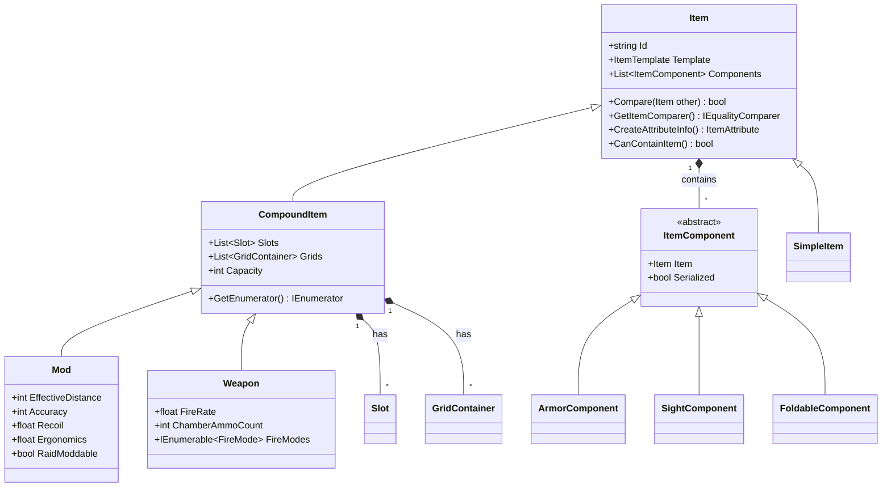
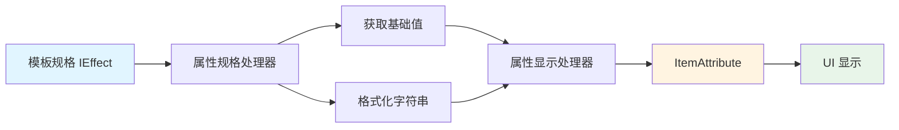

本文档深入解析 Unity Tarkov 项目的物品基类与组件系统架构，这是整个游戏物品系统的核心基础设施。通过理解这个系统，您将掌握物品创建、属性管理、组件化扩展等核心机制。

## 系统架构概览

物品系统采用**分层组件化架构**，通过基类提供核心功能，通过组件系统实现功能扩展。这种设计使得不同类型的物品（武器、装备、消耗品）能够共享基础功能，同时保持各自独特的特性。



## 物品基类 (Item)

物品基类是所有游戏物品的抽象基础，提供了物品标识、模板引用、组件管理、属性处理等核心功能。这个类的设计体现了**单一职责原则**和**开闭原则**——通过模板系统和组件系统，使物品功能既统一又可扩展。

### 核心功能模块

物品基类提供了四大核心功能模块：

**物品标识与模板管理**：每个物品实例通过 `Id` 属性获得唯一标识，通过 `Template` 属性访问其静态定义（如名称、图标、基础属性）。模板与实例的分离是系统的重要设计模式，允许多个物品实例共享相同的静态配置。

**比较与相等性**：实现了自定义的 `Compare()` 方法和 `ItemComparer` 内部类，用于物品之间的比较逻辑。比较器返回特殊的 `GetHashCode()` 实现（返回0），强制所有比较都通过 `Equals()` 方法进行，这是为了优化哈希表性能的特殊设计。

**属性显示处理**：通过 `ItemAttributeDisplayProcessor` 和 `ItemAttributeSpecProcessor` 两个内部类，实现了属性值的格式化显示。系统支持枚举类型的属性键、`IEffect` 接口的属性值，以及多种显示类型和标签变化。

**容器检查机制**：`ItemContainerChecker` 类提供了递归检查物品是否能够放入容器的功能，支持自定义的深度检查函数，用于处理复杂的嵌套容器场景。

### 关键代码实现

Sources: [Assembly-CSharp/EFT/InventoryLogic/Item.cs](Assembly-CSharp/EFT/InventoryLogic/Item.cs#L1-L200)

物品比较器的实现展示了系统的相等性判断逻辑：

```csharp
private sealed class ItemComparer : IEqualityComparer<Item>
{
    public bool Equals(Item x, Item y)
    {
        if (x == y) return true;
        if (x == null || y == null) return false;
        return x.Compare(y);
    }
    
    public int GetHashCode(Item obj) => 0;
}
```

这种设计意味着所有物品比较都通过 `Compare()` 方法进行，而不依赖哈希值，这在大量物品操作场景中可能需要重新评估性能影响。

## 组件系统 (ItemComponent)

组件系统实现了**组合优于继承**的设计原则，允许为物品动态添加各种功能模块。每个组件都是 `ItemComponent` 基类的子类，通过 `Item` 引用与父物品关联。

### 组件基础架构

`ItemComponent` 基类非常简洁，但提供了两个关键特性：

**物品引用**：`public readonly Item Item` 属性建立了组件与物品的强关联，确保所有组件操作都基于特定的物品实例。

**序列化控制**：`virtual bool Serialized` 属性默认返回 `true`，允许子类重写来控制是否需要序列化保存。这对于临时计算型组件或派生属性特别有用。

### 常见组件类型

系统通过不同的组件类实现各种物品功能：

| 组件类型 | 功能说明 | 应用场景 |
|---------|---------|---------|
| ArmorComponent | 护甲属性管理（护甲等级、材质、耐久度） | 防弹衣、头盔 |
| SightComponent | 瞄具属性（放大倍率、瞄准模式） | 各种光学瞄准具 |
| FoldableComponent | 可折叠状态管理 | 可折叠枪托、武器 |
| LightComponent | 光源控制（开关、颜色、强度） | 战术手电、激光指示器 |
| BuffComponent | 增益效果管理 | 食物、药物 |
| LockableComponent | 锁定状态控制 | 保险箱、特殊容器 |

Sources: [Assembly-CSharp/EFT/InventoryLogic/ItemComponent.cs](Assembly-CSharp/EFT/InventoryLogic/ItemComponent.cs#L1-L47)

组件基类的简洁实现体现了接口隔离原则：

```csharp
public class ItemComponent : IItemComponent
{
    public readonly Item Item;
    public virtual bool Serialized => true;
    
    protected ItemComponent(Item item)
    {
        Item = item ?? throw new ArgumentNullException(nameof(item));
    }
}
```

## 复合物品系统 (CompoundItem)

复合物品是具有**容器能力**的物品类型，能够包含其他物品或配件。这是实现装备系统、武器改装系统的核心基础。

### 容器架构

复合物品通过两种容器类型实现存储功能：

**槽位容器 (Slot)**：用于特定类型物品的固定位置，如武器的枪管槽、瞄具槽。每个槽位有严格的类型限制和数量限制（通常为1）。

**网格容器 (GridContainer)**：用于灵活存储的网格空间，如背包、仓库。网格容器支持二维坐标定位和形状检查。

### 容量计算系统

`CapacityCalculator` 内部类提供了容量计算和显示的统一接口：

```csharp
private new sealed class CapacityCalculator
{
    public int gridsCapacity;
    
    internal float GetCapacityValue() => gridsCapacity;
    internal string GetCapacityString() => gridsCapacity.ToString();
}
```

### 现代化枚举器

系统使用 `ContainerEnumerator` 类替代了传统的编译器生成状态机，实现了对槽位和网格的统一枚举。这种设计提高了代码可读性和维护性。

Sources: [Assembly-CSharp/EFT/InventoryLogic/CompoundItem.cs](Assembly-CSharp/EFT/InventoryLogic/CompoundItem.cs#L1-L150)

## 武器配件系统 (Mod)

武器配件是复合物品的一个重要子类，专门用于武器的改装和属性增强。配件系统展示了组件系统如何实现复杂的功能组合。

### 配件属性系统

配件类通过模板属性提供各种武器性能影响：

**性能修正属性**：包括 `EffectiveDistance`（有效射程）、`Accuracy`（精度）、`Recoil`（后坐力）、`Ergonomics`（人机工程学）等，这些属性直接修改武器的战斗性能。

**安装属性**：`RaidModdable`（突袭中可安装）、`ToolModdable`（需要工具）、`BlocksFolding`（阻止折叠）等控制配件的使用限制。

**特殊功能属性**：`HasLightComponent`（包含光源）、`IsAnimated`（特殊动画）等提供特殊能力。

### 交互按钮系统

配件类通过重写 `ItemInteractionButtons` 属性，提供安装和卸载的交互选项：

```csharp
public override IEnumerable<EItemInfoButton> ItemInteractionButtons
{
    get
    {
        foreach (var button in base.ItemInteractionButtons)
            yield return button;
        yield return EItemInfoButton.Install;
        yield return EItemInfoButton.Uninstall;
    }
}
```

这种使用 `yield return` 的延迟枚举方式，避免了不必要的集合创建，提高了性能。

Sources: [Assembly-CSharp/EFT/InventoryLogic/Mod.cs](Assembly-CSharp/EFT/InventoryLogic/Mod.cs#L1-L150)

## 物品模板系统

物品模板系统实现了**数据与逻辑分离**的设计模式，将物品的静态定义（名称、图标、基础属性）与运行时状态（当前耐久度、配件配置）分开管理。

### 模板类型层次

系统通过泛型的 `GetTemplate<T>()` 方法提供类型安全的模板访问：

```csharp
public ModTemplate Template => GetTemplate<ModTemplate>();
```

这种设计确保了每个物品类型都能访问其对应的模板类型，编译时类型检查避免了运行时错误。

## 属性显示系统

属性显示系统通过 `ItemAttribute` 类和相关的处理器类，实现了游戏数值到用户界面显示的转换。

### 显示处理器架构

`ItemAttributeDisplayProcessor<TEnum, TSpecification>` 类负责处理属性显示，支持：

**多种显示类型**：通过 `EItemAttributeDisplayType` 枚举控制显示格式（百分比、绝对值、范围等）。

**标签变化**：通过 `EItemAttributeLabelVariations` 枚举支持标签的不同变体。

**后缀定制**：支持为数值添加自定义后缀（如 "%", "m", "kg"）。

### 属性值处理流程

属性值从模板规格到用户界面的处理流程：



## 系统设计模式分析

物品基类与组件系统综合运用了多种设计模式：

### 组合模式

通过 `Item` 和 `ItemComponent` 的组合关系，实现了功能模块化。物品可以包含任意数量的组件，每个组件提供独立的功能领域。

### 模板方法模式

物品基类定义了算法骨架（如比较逻辑、属性处理），具体的实现细节由子类或内部类完成。

### 策略模式

不同的 `ItemComparer`、`ContainerEnumerator` 等内部类实现了不同的策略，可以在运行时选择使用。

### 工厂方法模式

`ItemFactory` 类（基于命名推断）负责创建物品实例，封装了复杂的初始化逻辑。

## 性能优化考虑

系统在多个层面考虑了性能优化：

**延迟枚举**：大量使用 `yield return` 语法，避免不必要的集合创建和内存分配。

**引用传递**：组件通过 `readonly Item Item` 引用父物品，避免了不必要的对象复制。

**模板缓存**：物品模板被缓存和重用，减少重复的数据加载和解析。

**哈希优化**：虽然 `GetHashCode()` 返回0看似反直觉，但在某些特定场景下（如频繁的物品移动操作）可能提供了性能优势。

## 扩展指南

### 创建新的物品类型

1. 继承 `Item` 或其子类（如 `CompoundItem`）
2. 实现必要的构造函数和属性
3. 创建对应的 `ItemTemplate` 子类
4. 注册到 `ItemTypeRegistry`（基于文件结构推断）

### 添加新的组件类型

1. 继承 `ItemComponent` 基类
2. 添加组件特定的属性和方法
3. 在物品构造函数中创建和添加组件
4. 如需序列化，确保 `Serialized` 属性返回 `true`

### 自定义属性显示

1. 创建实现 `IEffect` 接口的属性规格类
2. 实现必要的显示方法（`GetStringValue`, `GetFullStringValue`）
3. 使用 `Item.CreateAttributeInfo()` 创建属性信息
4. 在 UI 中通过 `ItemAttribute` 显示

## 系统限制与注意事项

**比较器性能**：`ItemComparer.GetHashCode()` 返回0的设计在大型哈希表场景中可能导致性能问题，需要评估使用场景。

**序列化开销**：所有组件默认参与序列化，对于临时组件需要显式重写 `Serialized` 属性。

**循环引用**：物品和组件之间的双向引用需要谨慎处理序列化和反序列化。

**线程安全**：系统未明确展示线程安全机制，多线程环境下需要额外的同步措施。

## 相关文档

要深入了解物品系统的其他方面，请参考以下文档：

- [背包容器与网格布局](12-bei-bao-rong-qi-yu-wang-ge-bu-ju) - 了解容器系统的具体实现
- [物品操作与交易逻辑](13-wu-pin-cao-zuo-yu-jiao-yi-luo-ji) - 探索物品的交互和交易机制
- [玩家核心类架构](8-wan-jia-he-xin-lei-jia-gou) - 了解物品如何与玩家系统集成