本页面详细阐述Unity Tarkov中背包与网格布局系统的架构设计、核心组件和实现机制。该系统负责管理游戏中物品在二维网格容器中的放置、移动和交互，是库存系统的核心基础。

## 系统架构概览

背包容器与网格布局系统采用分层架构设计，将逻辑层与表现层清晰分离，确保系统的可维护性和扩展性。

```mermaid
graph TB
    subgraph "UI表现层"
        A[GridView<br>网格视图] --> B[ItemView<br>物品视图]
        A --> C[SlotView<br>插槽视图]
        A --> D[DraggedItemView<br>拖拽视图]
        B --> E[FlexibleGridLayoutGroup<br>灵活网格布局]
    end
    
    subgraph "逻辑层"
        F[GridContainer<br>网格容器] --> G[GridItemAddress<br>网格物品地址]
        F --> H[LocationInGrid<br>网格位置]
        F --> I[CellSize<br>单元格大小]
        J[Slot<br>插槽容器] --> K[EquipmentSlot<br>装备插槽]
        J --> L[SpecialSlot<br>特殊插槽]
    end
    
    subgraph "接口层"
        M[IContainer<br>容器接口] --> N[IResizableGridContainer<br>可调整网格容器]
        M --> O[IItemContainer<br>物品容器]
        N --> P[FitGridForItem<br>适应物品网格]
    end
    
    A --> F
    C --> J
    F --> M
    J --> M
    
    style A fill:#e1f5ff
    style F fill:#fff4e1
    style M fill:#f3e5f5
```



**核心设计原则**：系统遵循单一职责原则，将网格布局逻辑（GridContainer）与UI渲染（GridView）分离，通过接口（IContainer）实现松耦合。网格坐标系统（LocationInGrid）提供精确的物品位置管理，支持旋转和碰撞检测等高级功能。

Sources: [GridContainer.cs](Assembly-CSharp/EFT/InventoryLogic/GridContainer.cs#L1-L50), [GridView.cs](Assembly-CSharp/EFT/UI/DragAndDrop/GridView.cs#L1-L100)

## 网格容器核心

GridContainer是网格布局系统的逻辑核心，负责管理二维网格空间中的物品放置和空间分配。

### 数据结构

网格容器使用布尔值数组来表示网格的占用状态，每个元素对应一个网格单元，true表示已被占用。

| 数据字段 | 类型 | 说明 |
|---------|------|------|
| layoutData | List<bool> | 网格布局数据，存储每个单元的占用状态 |
| horizontalStretchData | List<int> | 水平拉伸数据，记录可拉伸的行 |
| verticalStretchData | List<int> | 垂直拉伸数据，记录可拉伸的列 |
| GridWidth | int | 网格宽度（列数） |
| GridHeight | int | 网格高度（行数） |
| maxItemsCount | int? | 最大物品数量限制 |
| filters | ItemFilter[] | 物品过滤器数组 |

Sources: [GridContainer.cs](Assembly-CSharp/EFT/InventoryLogic/GridContainer.cs#L150-L220)

### 网格大小管理

网格容器支持动态调整大小，当物品需要更多空间时可以自动扩展。初始化时会创建指定大小的网格，并在运行时根据需要调整。

```csharp
private void ResizeGrid(int width, int height)
{
    GridWidth = width;
    GridHeight = height;
    
    // 重新初始化布局数据
    int totalCells = width * height;
    layoutData.Clear();
    for (int i = 0; i < totalCells; i++)
    {
        layoutData.Add(false);
    }
    
    // 触发网格大小变化事件
    onGridSizeChanged?.Invoke(width, height);
}
```

**拉伸机制**：通过canStretchHorizontally和canStretchVertically标志控制网格是否可以水平或垂直扩展，适用于背包、战术背心等可扩展容器。

Sources: [GridContainer.cs](Assembly-CSharp/EFT/InventoryLogic/GridContainer.cs#L300-L340)

### 错误处理系统

网格容器定义了多种专用错误类型，用于精确反馈操作失败原因：

- **LocationConflictError**：位置冲突错误，当物品放置位置与其他物品重叠时抛出
- **ItemMismatchError**：物品不匹配错误，当物品类型不符合容器要求时抛出
- **FilterRestrictionError**：过滤器限制错误，当物品不符合过滤器规则时抛出
- **CountLimitError**：数量限制错误，当超过最大物品数量时抛出

这些错误类型提供本地化的错误描述，帮助用户理解操作失败的具体原因。

Sources: [GridContainer.cs](Assembly-CSharp/EFT/InventoryLogic/GridContainer.cs#L20-L90)

## 网格坐标系统

LocationInGrid类提供了精确的网格坐标管理，支持物品的定位和旋转。

### 坐标表示

```csharp
public sealed class LocationInGrid
{
    public int x;              // X坐标（列索引）
    public int y;              // Y坐标（行索引）
    public ItemRotation r;     // 旋转方向
}
```

坐标系统采用从左上角开始的索引系统，x表示列索引（从0开始），y表示行索引（从0开始）。ItemRotation枚举支持水平和垂直两种方向，允许物品在网格中旋转以适应空间。

Sources: [LocationInGrid.cs](Assembly-CSharp/LocationInGrid.cs#L1-L40)

### 单元格大小

CellSize结构体表示物品在网格中占用的空间大小，支持旋转、比较和大小计算等操作。

| 属性/方法 | 说明 |
|----------|------|
| X, Y | 宽度和高度（单元格数） |
| TotalCells | 总单元格数量（X * Y） |
| Rotate() | 旋转大小（交换X和Y） |
| GetRotatedSize(rotation) | 根据旋转状态获取大小 |
| CanContain(other) | 检查是否能容纳指定大小 |

**旋转支持**：物品可以通过旋转改变其占用形状，例如一个2x3的物品旋转后变为3x2，从而适应不同的空间布局。

Sources: [CellSize.cs](Assembly-CSharp/EFT/InventoryLogic/CellSize.cs#L1-L100)

### 网格物品地址

GridItemAddress抽象类将网格位置信息与容器关联，提供完整的物品定位功能。每个地址包含GridContainer引用和LocationInGrid位置信息，支持哈希优化和快速比较。

```csharp
public abstract class GridItemAddress : ItemAddress
{
    public readonly LocationInGrid LocationInGrid;
    public readonly GridContainer Grid;
    
    // 预计算哈希码提高性能
    private readonly int cachedHashCode1;
    private readonly int cachedHashCode2;
}
```

**性能优化**：通过预计算哈希码，系统可以快速比较两个地址是否相同，避免重复计算，这对于频繁的碰撞检测和物品查找操作至关重要。

Sources: [GridItemAddress.cs](Assembly-CSharp/EFT/InventoryLogic/GridItemAddress.cs#L1-L80)

## 网格视图UI组件

GridView是网格容器的UI表现层，负责渲染网格、处理用户交互和提供视觉反馈。

### 初始化与生命周期

GridView通过Show方法初始化，该方法建立与逻辑层（GridContainer）的连接，并设置必要的事件订阅。

```csharp
public void Show(GridContainer grid, BaseItemContext parentContext, 
                 IItemController itemController, ItemUiContext itemUiContext, 
                 FilterPanel filterPanel = null, bool magnify = false)
{
    // 清理之前的UI资源
    UI.Dispose();
    
    // 初始化网格变换和上下文
    Grid = grid;
    _itemController = itemController;
    itemUiContext = itemUiContext;
    
    // 注册物品拥有者视图
    itemOwner = Grid.ParentItem.Parent.GetOwner();
    itemOwner.RegisterView(this);
    
    // 订阅网格尺寸变化事件
    Grid.OnResize += OnGridResize;
    
    // 初始化视图内容
    InitializeView();
}
```

**资源管理**：通过IDisposable模式管理UI资源，确保在视图销毁时正确取消事件订阅和释放对象引用。

Sources: [GridView.cs](Assembly-CSharp/EFT/UI/DragAndDrop/GridView.cs#L250-L350)

### 视觉反馈系统

网格视图提供丰富的视觉反馈机制，通过颜色和透明度变化传达操作状态。

| 操作类型 | 颜色 | RGB值 | 用途 |
|---------|------|-------|------|
| 无效操作 | InvalidOperationColor | (0.68, 0, 0, 0.57) | 物品无法放置 |
| 有效移动 | ValidMoveColor | (0.06, 0.38, 0.06, 0.57) | 物品可以放置 |
| 转移操作 | transferOperationColor | (0, 0.16, 0.48, 0.57) | 跨容器转移 |
| 检查操作 | examineOperationColor | (0.69, 0.66, 0, 0.57) | 物品检查 |

**高亮面板**：_highlightPanel组件在拖拽过程中显示，根据操作的有效性改变颜色，为用户提供直观的视觉反馈。

Sources: [GridView.cs](Assembly-CSharp/EFT/UI/DragAndDrop/GridView.cs#L100-L160)

### 物品视图管理

GridView维护ItemView字典，将逻辑物品（Item）映射到UI视图（ItemView）。

```csharp
protected readonly Dictionary<string, ItemView> ItemViews = 
    new Dictionary<string, ItemView>();

public IEnumerable<ItemView> GridItemViews => ItemViews.Values;
```

当物品添加到网格容器时，GridView创建对应的ItemView并注册事件处理器；当物品移除时，系统自动清理视图资源。这种集中管理确保UI与逻辑状态的一致性。

Sources: [GridView.cs](Assembly-CSharp/EFT/UI/DragAndDrop/GridView.cs#L180-L210)

## 容器接口设计

系统通过接口定义容器的行为契约，支持不同类型的容器实现。

### 基础容器接口

IContainer接口定义了所有容器必须实现的核心方法，主要用于拖拽系统。

| 方法 | 参数 | 返回值 | 说明 |
|------|------|--------|------|
| CanAccept | DragItemContext, BaseItemContext, out TransactionResult | bool | 检查是否可以接受拖拽的物品 |
| AcceptItem | DragItemContext, BaseItemContext | Task | 接受拖拽的物品 |
| CanDrag | BaseItemContext | bool | 检查是否可以拖拽物品 |
| OnPointerEnter | PointerEventData | void | 处理指针进入事件 |
| OnPointerExit | PointerEventData | void | 处理指针退出事件 |

**拖拽流程**：拖拽开始时调用CanDrag验证；拖拽过程中持续调用CanAccept验证目标容器；放置时调用AcceptItem执行实际操作。

Sources: [IContainer.cs](Assembly-CSharp/EFT/UI/Containers/IContainer.cs#L1-L56)

### 可调整网格容器接口

IResizableGridContainer接口为支持动态调整大小的网格容器提供扩展功能。

```csharp
public interface IResizableGridContainer
{
    void FitGridForItem(Item item);
}
```

该接口的FitGridForItem方法允许容器根据物品的尺寸自动调整网格大小，确保物品能够放置。主要用于背包、战术背心等可扩展容器，而不适用于保险箱等固定尺寸容器。

Sources: [IResizableGridContainer.cs](Assembly-CSharp/EFT/UI/Containers/IResizableGridContainer.cs#L1-L22)

## 插槽容器系统

Slot类提供单物品槽位容器，不同于网格容器的多物品管理，插槽用于特定物品的固定位置。

### 插槽类型

插槽系统支持多种类型的槽位，每种类型有不同的用途和限制：

| 插槽类型 | 用途 | 必需性 | 示例 |
|---------|------|--------|------|
| EquipmentSlot | 装备槽位 | 可选/必需 | 头盔、护甲、背包 |
| ModSlot | 配件槽位 | 可选 | 瞄具、枪口、弹匣 |
| SpecialSlot | 特殊槽位 | 可选 | 战术配件、手电筒 |
| BuildSlot | 构建槽位 | 必需 | 武器构建的核心部件 |

**冲突机制**：通过ConflictingSlots字典和BlockerSlots列表管理插槽间的互斥关系。例如，安装消音器可能阻塞某些枪口配件的安装。

Sources: [Slot.cs](Assembly-CSharp/EFT/InventoryLogic/Slot.cs#L1-L100)

### 响应式绑定

插槽使用响应式属性（ReactiveProperty）实现UI与逻辑的自动同步。

```csharp
private readonly ReactiveProperty<Item> reactiveContainedItem = 
    new ReactiveProperty<Item>();

public ReactiveProperty<Item> ReactiveContainedItem
{
    get
    {
        reactiveContainedItem.Value = ContainedItem;
        return reactiveContainedItem;
    }
}
```

这种设计允许UI订阅插槽内容变化，当物品安装或移除时自动更新界面，无需手动刷新。

Sources: [Slot.cs](Assembly-CSharp/EFT/InventoryLogic/Slot.cs#L40-L70)

## 物品视图系统

ItemView是物品的UI表现基类，提供拖拽、点击、悬停等交互功能。

### 事件处理

ItemView实现了多个Unity事件接口，处理用户交互。

| 事件接口 | 用途 | 处理方法 |
|---------|------|---------|
| IBeginDragHandler | 开始拖拽 | OnBeginDrag |
| IDragHandler | 拖拽过程中 | OnDrag |
| IEndDragHandler | 结束拖拽 | OnEndDrag |
| IPointerClickHandler | 点击事件 | OnPointerClick |
| IPointerEnterHandler | 鼠标进入 | OnPointerEnter |
| IPointerExitHandler | 鼠标离开 | OnPointerExit |

**拖拽逻辑**：OnBeginDrag创建拖拽视图并设置拖拽上下文；OnDrag更新拖拽视图位置；OnEndDrag处理放置逻辑或取消拖拽。

Sources: [ItemView.cs](Assembly-CSharp/EFT/UI/DragAndDrop/ItemView.cs#L1-L100)

### 透明度计算

AlphaCalculator类根据物品状态计算透明度，提供视觉反馈。

```csharp
internal float CalculateAlpha(bool filtered, bool dragDisabled, Error removeError)
{
    // 如果没有被过滤、没有禁用拖拽，且没有移除错误，则使用最大透明度
    if (!(filtered || dragDisabled) && (removeError == null || removeError is Slot._E008))
    {
        return maxAlpha;
    }
    return minAlpha;
}
```

**透明度规则**：被过滤的物品、禁用拖拽的物品或有移除错误的物品会降低透明度，提示用户这些物品不可交互。

Sources: [ItemView.cs](Assembly-CSharp/EFT/UI/DragAndDrop/ItemView.cs#L30-L70)

## 网格布局UI组件

FlexibleGridLayoutGroup继承自Unity的GridLayoutGroup，提供灵活的网格布局功能。

### 自适应列宽

```csharp
public override void SetLayoutHorizontal()
{
    if (m_Constraint == Constraint.FixedColumnCount)
    {
        float x = (base.rectTransform.rect.width - 
                   (float)(m_ConstraintCount - 1) * m_Spacing.x - 
                   (float)m_Padding.horizontal) / (float)m_ConstraintCount;
        base.cellSize = new Vector2(x, m_CellSize.y);
    }
    base.SetLayoutHorizontal();
}
```

该组件在FixedColumnCount约束模式下自动计算列宽，确保网格完全填充可用空间，无论容器尺寸如何变化。

Sources: [FlexibleGridLayoutGroup.cs](Assembly-CSharp/FlexibleGridLayoutGroup.cs#L1-L20)

## 网格窗口管理

GridWindow提供包含多个网格的窗口界面，用于显示复杂物品（如保险箱、安全箱）的内容。

### 网格创建

```csharp
this.m__E000 = ContainedGridsView.CreateGrids(this.m__E003, _containedGridsTemplate);
this.m__E000.transform.SetParent(base.transform, worldPositionStays: false);
```

ContainedGridsView动态创建网格视图，根据复合物品的容器配置生成对应的GridView实例。

### 优先级窗口

系统支持优先级窗口模式，允许用户在多个可用窗口中选择目标容器。

```csharp
public enum EPriorityWindowMode
{
    Manual,  // 手动选择模式
    Auto     // 自动选择模式
}
```

在自动模式下，系统自动选择最合适的容器；在手动模式下，用户通过切换按钮选择目标窗口。

Sources: [GridWindow.cs](Assembly-CSharp/EFT/UI/GridWindow.cs#L1-L100)

## 最佳实践

### 容器设计

- **明确容器类型**：根据使用场景选择GridContainer（多物品）或Slot（单物品）
- **合理设置过滤器**：使用ItemFilter限制容器可接受的物品类型，避免无效操作
- **考虑扩展性**：为可扩展容器实现IResizableGridContainer接口

### UI交互

- **提供即时反馈**：通过颜色和透明度变化传达操作状态
- **处理边界情况**：为拖拽到无效区域提供明确的错误提示
- **优化性能**：使用预计算哈希码和事件委托减少重复计算

### 内存管理

- **及时释放资源**：在视图销毁时取消所有事件订阅
- **使用对象池**：对频繁创建销毁的ItemView使用对象池
- **避免循环引用**：注意物品与容器间的引用关系，防止内存泄漏

## 相关文档

- [物品基类与组件系统](11-wu-pin-ji-lei-yu-zu-jian-xi-tong)：了解物品的数据结构和组件系统
- [拖放系统实现](15-tuo-fang-xi-tong-shi-xian)：深入了解拖放系统的完整实现
- [背包界面与物品视图](16-bei-bao-jie-mian-yu-wu-pin-shi-tu)：学习背包UI的构建和交互设计