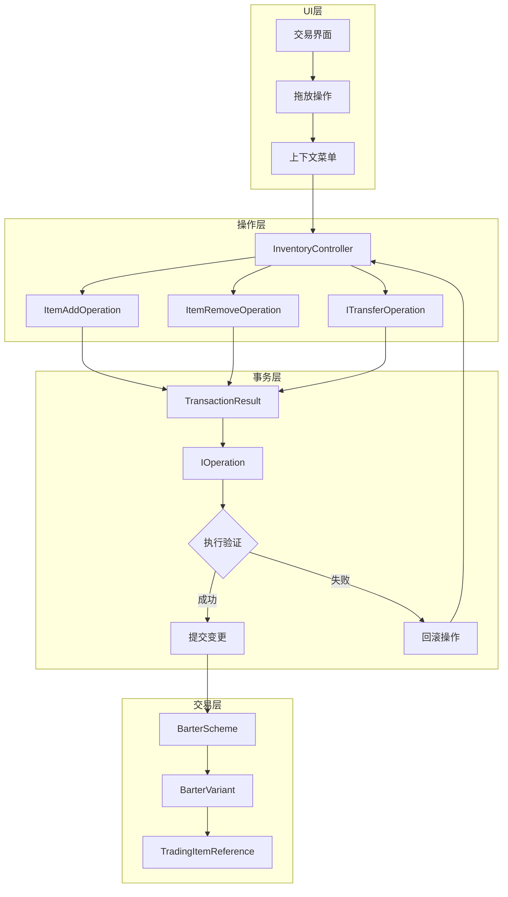
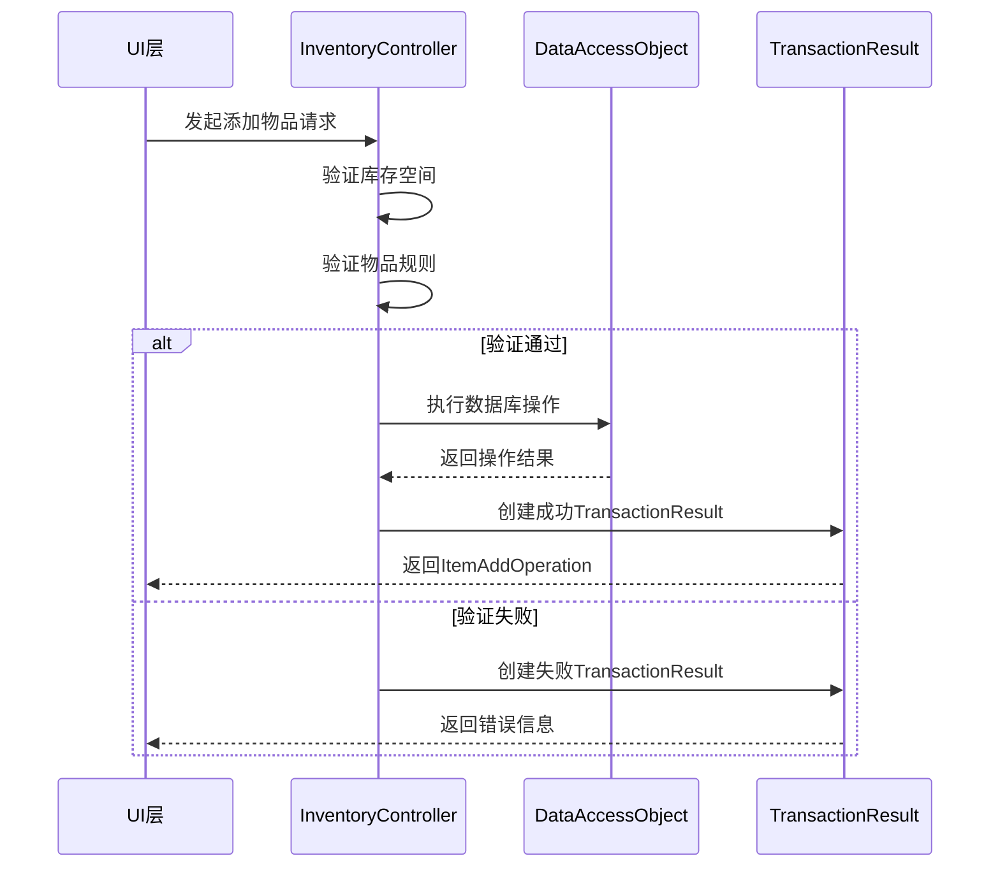
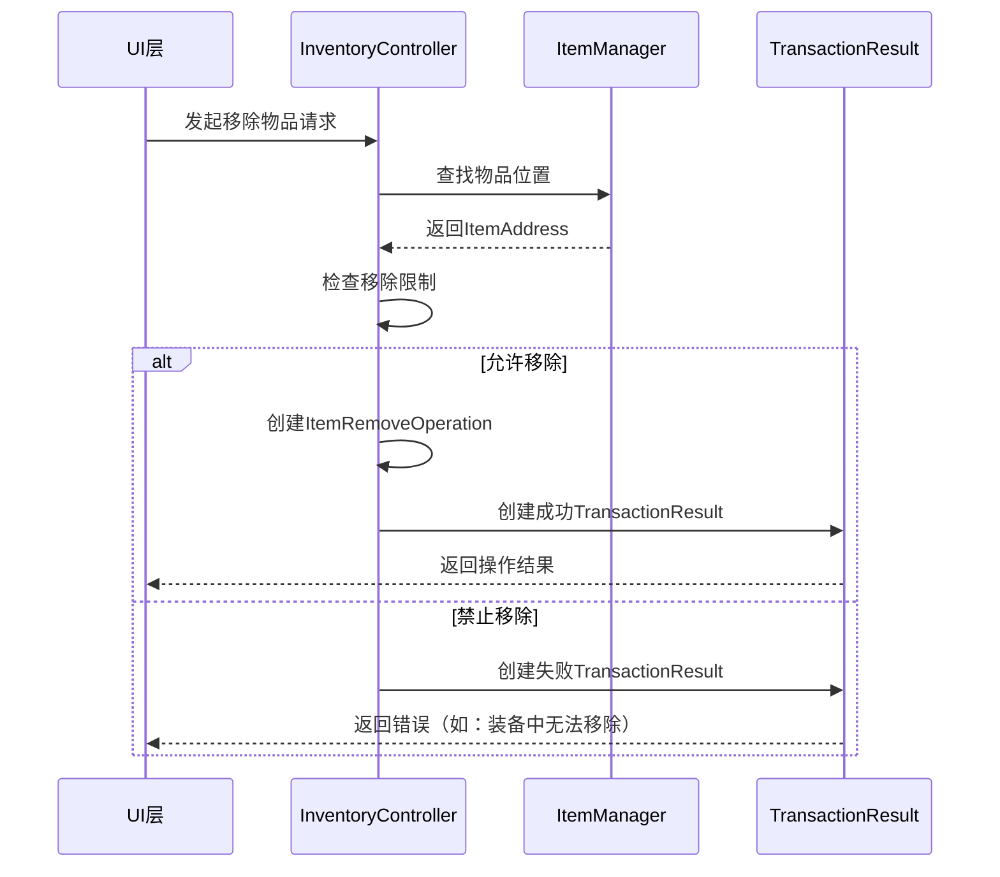

本页面深入探讨Escape from Tarkov中物品操作与交易逻辑的核心架构，涵盖物品增删、事务处理、易货系统以及交易机制的设计与实现。

## 系统架构概览

物品操作与交易系统采用**命令模式**和**事务模式**相结合的设计，确保所有物品操作的可追溯性、可回滚性和一致性。系统核心包含以下几个关键层次：



## 核心类与接口

### 库存控制器 (InventoryController)

**InventoryController** 是整个物品操作系统的核心协调者，负责管理玩家库存、装备和所有物品操作。它实现了**PlayerSideItemController**、**IContainer**和**IItemContainer**接口，提供了统一的物品管理接口。Sources: [InventoryController.cs](Assembly-CSharp/EFT/InventoryLogic/InventoryController.cs#L1-L150)

**核心职责**：
- 物品检查与验证
- 库存限制检查
- 弹药管理与弹夹操作
- 装备槽位绑定与管理
- 操作队列管理

**关键内部辅助类**：

| 辅助类 | 职责 | 用途 |
|--------|------|------|
| EquipmentSlotFinder | 查找和匹配装备槽位 | 根据槽位类型定位正确的装备位置 |
| ItemFinder | 在绑定物品中查找特定物品 | 支持快速物品检索和去重 |
| ExamineOperationHandler | 处理物品检查操作回调 | 管理检查操作的生命周期 |
| TemplateIdMatcher | 匹配相同模板ID的物品 | 支持物品合并和堆叠逻辑 |
| MagazineExamineHandler | 处理弹夹检查特殊逻辑 | 弹夹检查的额外验证 |

### 物品操作基类

系统定义了明确的操作结果类型，用于表示不同类型的物品操作结果。

**ItemAddOperation** 表示物品添加操作的结果，包含以下核心属性：Sources: [ItemAddOperation.cs](Assembly-CSharp/EFT/InventoryLogic/ItemAddOperation.cs#L1-L23)

```csharp
public class ItemAddOperation
{
    public Item Item { get; }      // 被添加的物品
    public ItemAddress Address { get; } // 目标位置
    public int Count { get; }      // 添加数量
    public bool Simulated { get; } // 是否为模拟操作
}
```

**ItemRemoveOperation** 表示物品移除操作的结果：Sources: [ItemRemoveOperation.cs](Assembly-CSharp/EFT/InventoryLogic/ItemRemoveOperation.cs#L1-L20)

```csharp
public class ItemRemoveOperation
{
    public Item Item { get; }         // 被移除的物品
    public ItemAddress FromAddress { get; } // 源位置
    public bool Simulated { get; }    // 是否为模拟操作
}
```

## 事务处理机制

### TransactionResult - 事务结果封装

**TransactionResult** 是系统事务处理的核心结构体，实现了**Result模式**，用于安全地封装操作结果和错误信息。Sources: [TransactionResult.cs](Assembly-CSharp/EFT/InventoryLogic/TransactionResult.cs#L1-L200)

**核心接口定义**：

```csharp
public interface ITransactionResult
{
    Error Error { get; }    // 错误信息（成功时为null）
    bool Succeeded { get; } // 是否成功
    bool Failed { get; }    // 是否失败
}
```

**TransactionResult 实现特点**：

1. **不可变性**：使用 `readonly struct` 确保线程安全
2. **隐式转换**：支持从 `Error` 和 `IOperation` 隐式转换
3. **工厂方法**：提供 `Success()` 和 `Failure()` 静态工厂方法
4. **完整的值相等性**：重写 `Equals()` 和 `GetHashCode()`

**使用示例**：

```csharp
// 创建成功结果
TransactionResult successResult = TransactionResult.Success(operation);

// 创建失败结果
TransactionResult failureResult = TransactionResult.Failure(new Error("库存空间不足"));

// 隐式转换
TransactionResult fromError = new Error("无效物品"); // 自动转换为失败结果
```

### OperationResult - 泛型操作结果

**OperationResult<T>** 提供了类型安全的操作结果封装，支持任意类型的结果值。Sources: [OperationResult.cs](Assembly-CSharp/EFT/InventoryLogic/OperationResult.cs#L1-L39)

```csharp
public class OperationResult<T>
{
    public bool Succeeded { get; }
    public bool Failed => !Succeeded;
    public T Value { get; }     // 成功时的结果值
    public Error Error { get; } // 失败时的错误信息
    
    // 隐式转换支持
    public static implicit operator OperationResult<T>(T value);
    public static implicit operator OperationResult<T>(Error error);
}
```

## 易货系统

### 易货方案架构

易货系统支持复杂的非货币交易，允许玩家用多种物品组合交换其他物品。系统采用**组合模式**设计。Sources: [BarterScheme.cs](Assembly-CSharp/EFT/BarterScheme.cs#L1-L11)

**BarterScheme** - 易货方案类：
```csharp
[Serializable]
public sealed class BarterScheme : List<BarterVariant>
{
}
```

**BarterVariant** - 易货变体类，表示一种可能的交换组合：Sources: [BarterVariant.cs](Assembly-CSharp/EFT/BarterVariant.cs#L1-L11)

```csharp
[Serializable]
public sealed class BarterVariant : List<_E979>
{
}
```

这种设计允许一个易货方案包含多种可能的交换变体，系统会根据玩家拥有的物品选择最优的交换方式。

### 交易枚举与类型

**Trading目录**定义了交易相关的枚举和引用类型：Sources: [Trading目录](Assembly-CSharp/EFT/Trading)

| 类型 | 枚举/类 | 用途 |
|------|---------|------|
| EDialogSide | 枚举 | 交易对话的发起方（玩家/商人） |
| EQuestActionType | 枚举 | 任务相关的交易操作类型 |
| EServiceActionType | 枚举 | 商人服务类型（治疗、维修等） |
| ETraderDialogType | 枚举 | 商人对话类型 |
| TradingItemReference | 类 | 交易物品引用，包含物品ID和数量 |

## 物品操作流程

### 物品添加流程



### 物品移除流程



## 操作接口体系

系统定义了多个核心接口来支持不同类型的物品操作：

| 接口 | 用途 | 实现类 |
|------|------|--------|
| IOperation | 所有操作的基接口 | 各种操作类 |
| ITransferOperation | 传输操作接口 | 装备转移、物品交换 |
| ISplitOperation | 分割操作接口 | 弹药堆叠分割 |
| IItemOwner | 物品所有者接口 | Inventory, Equipment |
| IItemContainer | 物品容器接口 | Stash, Container |

## 错误处理机制

系统采用统一的错误处理模式，通过**Error类**封装所有操作失败信息：

```csharp
public class Error
{
    public string Message { get; }    // 错误消息
    public ErrorCode Code { get; }    // 错误代码
    public object[] Args { get; }     // 错误参数
}
```

**常见错误类型**：
- `InventoryFull`: 库存已满
- `ItemNotFound`: 物品未找到
- `InvalidLocation`: 无效位置
- `OperationInProgress`: 操作正在进行中
- `InsufficientResources`: 资源不足

## 网络同步

物品操作需要支持客户端-服务器同步，系统通过以下机制实现：

1. **操作序列化**：所有操作实现 `ISerializer` 接口
2. **版本控制**：每个操作包含时间戳和版本号
3. **冲突解决**：使用乐观并发控制
4. **回滚机制**：冲突时自动回滚到之前状态

## 性能优化策略

系统实施了多项性能优化措施：

| 优化技术 | 应用场景 | 效果 |
|----------|----------|------|
| 对象池 | ItemAddOperation/ItemRemoveOperation | 减少GC压力 |
| 批量操作 | 多物品同时添加/移除 | 减少网络往返 |
| 延迟加载 | 大型容器物品 | 降低内存占用 |
| 缓存策略 | 频繁访问的物品数据 | 提升响应速度 |

## 与其他系统的集成

物品操作与交易逻辑与游戏其他核心系统紧密集成：

- **玩家系统**：通过 [Player.InventoryController](Assembly-CSharp/EFT/Player.InventoryController.cs) 与玩家状态同步
- **UI系统**：与 [TradingScreen](Assembly-CSharp/EFT/UI/TradingScreen.cs) 和 [InventoryScreen](Assembly-CSharp/EFT/UI/InventoryScreen.cs) 交互
- **网络系统**：通过 [NetworkPackets](Assembly-CSharp/EFT/NetworkPackets) 实现多人同步
- **任务系统**：支持 [Quests](Assembly-CSharp/EFT/Quests) 条件检查和物品奖励

## 下一步学习

理解了物品操作与交易逻辑的核心架构后，建议继续学习：

- [背包容器与网格布局](12-bei-bao-rong-qi-yu-wang-ge-bu-ju) - 了解容器系统的具体实现
- [交易系统UI](17-jiao-yi-xi-tong-ui) - 深入理解交易界面的交互逻辑
- [物品基类与组件系统](11-wu-pin-ji-lei-yu-zu-jian-xi-tong) - 掌握物品的属性和组件体系