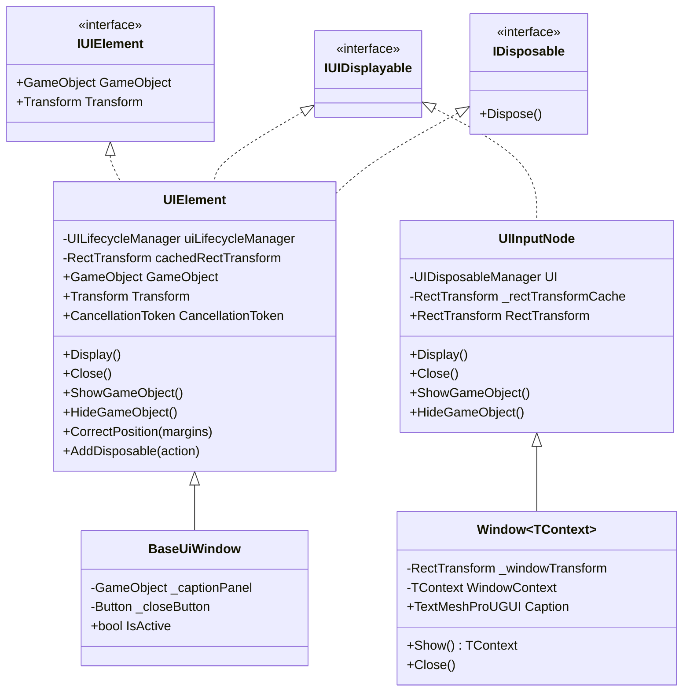
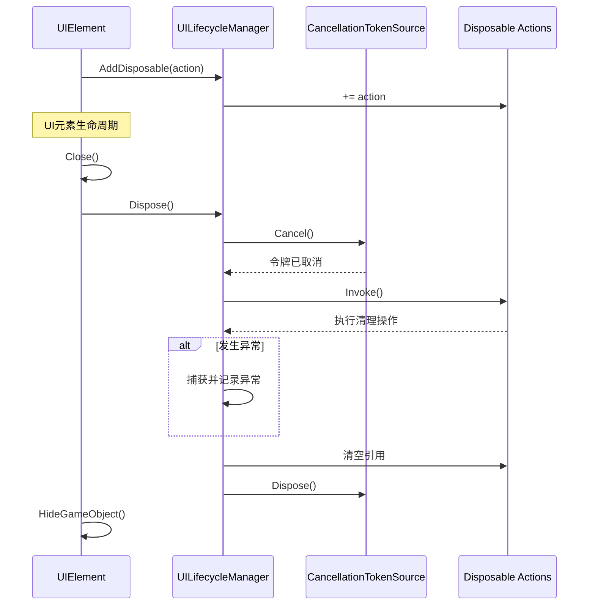
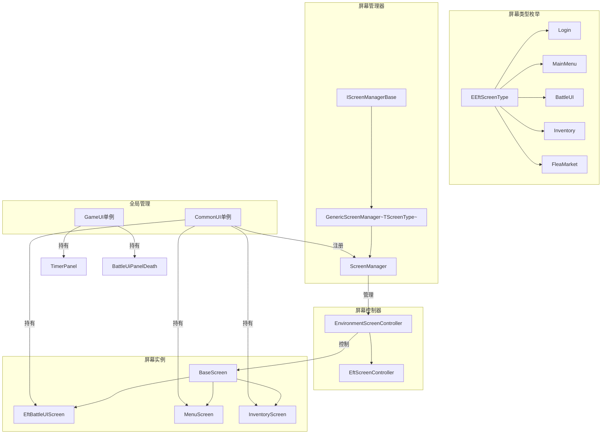
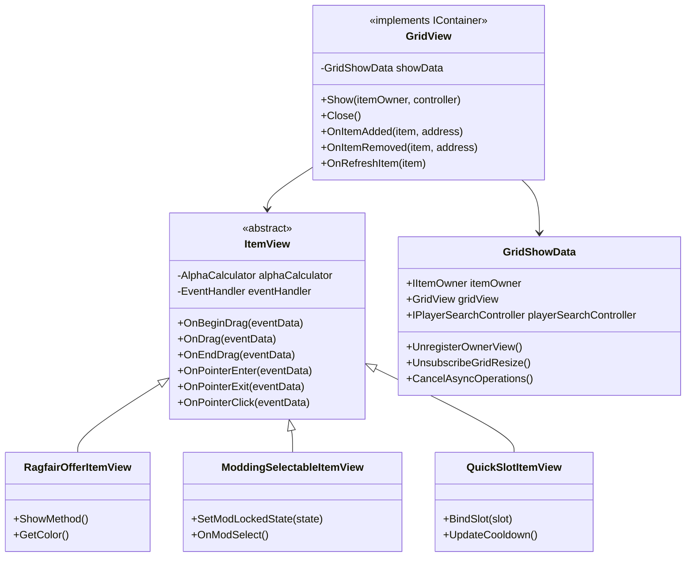
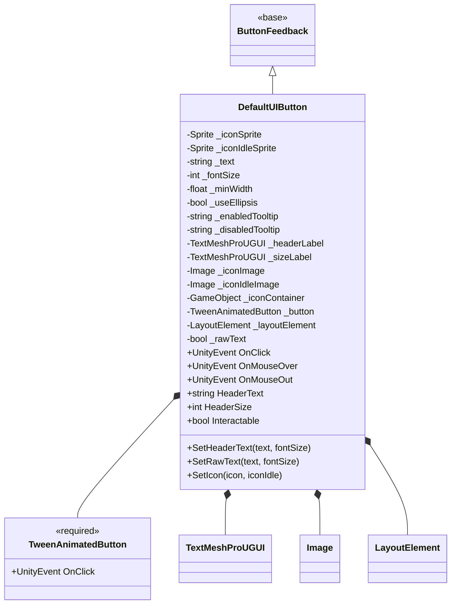
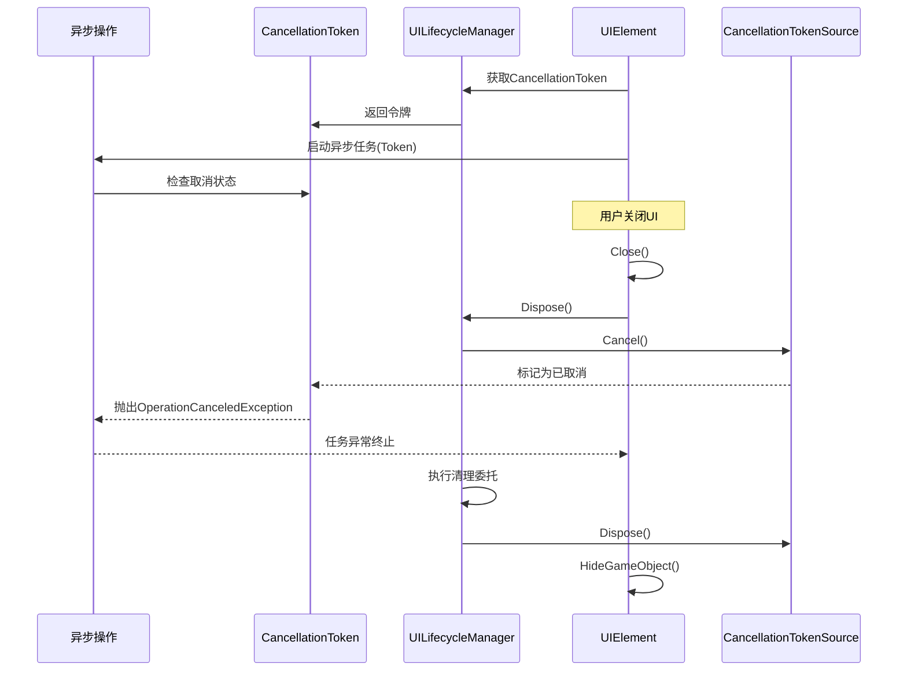

Unity Tarkov的UI框架是一个层次化、模块化的用户界面系统，为整个游戏提供统一的界面管理、生命周期控制和交互处理能力。该框架采用组件化设计，通过接口抽象、继承层次和依赖注入等模式，实现了高度可扩展和可维护的UI系统架构。本文档将深入剖析该框架的核心组件、设计模式和交互机制。

## 核心架构层次

UI框架采用清晰的分层架构，从底层的Unity组件到高级的业务逻辑界面，形成了完整的继承体系。这种分层设计确保了关注点分离，使每个层次专注于特定的职责。

**基础接口层**定义了UI元素的基本契约。`IUIElement`接口是最基础的抽象，要求所有UI元素必须提供GameObject和Transform的访问能力，同时继承IDisposable以支持资源释放[Sources: IUIElement.cs](Assembly-CSharp/EFT/UI/IUIElement.cs)。`IUIDisplayable`作为标记接口，虽然不定义方法，但通过类型约束统一管理所有可显示UI元素的行为[Sources: IUIDisplayable.cs](Assembly-CSharp/EFT/UI/IUIDisplayable.cs)。

**核心基类层**提供具体的功能实现。`UIElement`是整个UI框架的核心基类，实现了IUIDisplayable、IUIElement和IDisposable三个接口。它通过`UILifecycleManager`管理生命周期，提供CancellationToken支持异步操作取消，并缓存RectTransform以优化性能[Sources: UIElement.cs](Assembly-CSharp/EFT/UI/UIElement.cs)。`UIInputNode`继承自InputNode（来自输入系统），为需要响应输入的UI组件提供基础支持，通过`UIDisposableManager`管理可释放资源[Sources: UIInputNode.cs](Assembly-CSharp/EFT/UI/UIInputNode.cs)。

**窗口与屏幕层**提供更高级的UI容器。`BaseUiWindow`是一个轻量级的窗口基类，提供了标题面板、关闭按钮和拖拽功能的基本框架[Sources: BaseUiWindow.cs](Assembly-CSharp/EFT/UI/BaseUiWindow.cs)。`Window<TContext>`则是一个更强大的泛型窗口类，支持上下文传递、点击置顶、拖拽配置等高级功能，并包含异步关闭中断机制[Sources: Window.cs](Assembly-CSharp/EFT/UI/Window.cs)。

## 生命周期管理机制

UI框架的生命周期管理是其核心特性之一，通过统一的管理器模式确保资源的正确释放和异步操作的可控性。这种设计避免了内存泄漏和僵尸事件订阅等问题。

**UILifecycleManager**是UI元素生命周期的核心管理者。它维护一个`CancellationTokenSource`用于取消所有异步操作，以及一个Action委托链`disposableActions`用于注册清理操作。当调用Dispose方法时，会先取消所有令牌，然后执行所有注册的清理操作，即使在清理过程中发生异常也不会中断释放流程[Sources: UILifecycleManager.cs](Assembly-CSharp/EFT/UI/UILifecycleManager.cs)。这种设计确保了UI元素销毁时的原子性和安全性。

**UIDisposableManager**提供了更高级的资源管理功能，特别适用于视图列表的创建和管理。它支持同步和异步两种视图列表模式，通过模板化方法`AddViewList`和`AddViewListAsync`简化了重复UI元素的创建[Sources: UIDisposableManager.cs](Assembly-CSharp/EFT/UI/UIDisposableManager.cs)。内部使用`ViewTemplateContainer`和`AsyncViewTemplateContainer`封装模板和容器信息，使调用代码更加简洁。

**资源释放流程**遵循严格的顺序：首先取消所有异步操作以避免已完成或正在进行的操作访问已销毁的对象，然后执行所有清理回调释放资源，最后清空引用和取消令牌源。这种顺序确保了资源释放的安全性和完整性。

## 屏幕管理系统

屏幕管理系统是UI框架的导航中枢，负责管理游戏中的不同界面状态和切换流程。该系统采用泛型设计，支持类型安全的屏幕导航和状态管理。

**泛型架构**的核心是`GenericScreenManager<TScreenType>`，其中`TScreenType`必须是枚举类型。这种设计提供了编译时类型检查，避免了魔法字符串的使用[Sources: GenericScreenManager.cs](Assembly-CSharp/EFT/UI/Screens/GenericScreenManager.cs)。管理器实现了`IScreenManagerBase`接口，定义了屏幕关闭和类型获取的基本操作[Sources: IScreenManagerBase.cs](Assembly-CSharp/EFT/UI/Screens/IScreenManagerBase.cs)。

**屏幕类型枚举**`EEftScreenType`定义了游戏中所有可能的屏幕状态，包括登录、主菜单、战斗界面、背包、市场等47种不同的屏幕类型[Sources: EEftScreenType.cs](Assembly-CSharp/EFT/UI/Screens/EEftScreenType.cs)。每个屏幕类型对应一个特定的游戏场景或功能界面。

**环境屏幕控制器**`EnvironmentScreenController`是管理单个屏幕生命周期的核心组件。它提供了一组虚拟属性用于控制环境状态，包括是否旋转环境、是否显示环境摄像机、着色类型、任务栏可见性等[Sources: GenericScreenManager.cs](Assembly-CSharp/EFT/UI/Screens/GenericScreenManager.cs)。这些属性通过`ApplyStateSwitcher`方法应用到相应的系统组件上，实现了环境配置的统一管理。

**ScreenManager**是EFT专用的屏幕管理器实现，采用单例模式确保全局唯一实例。它扩展了泛型管理器，添加了聊天界面的初始化和管理功能[Sources: ScreenManager.cs](Assembly-CSharp/EFT/UI/Screens/ScreenManager.cs)。在`EftScreenController`子类中，重写了`PrepareEnvironment`方法来设置帧率、玩家输入状态、预加载器可见性等环境参数。

**屏幕注册机制**通过`CommonUI`单例实现。在Awake方法中，将所有屏幕实例注册到`ScreenManager`，建立屏幕类型与实际UI组件的映射关系；在OnDestroy方法中，则释放这些注册[Sources: CommonUI.cs](Assembly-CSharp/EFT/UI/CommonUI.cs)。这种集中管理确保了屏幕生命周期的正确控制。

## 拖放系统架构

拖放系统是UI框架中最复杂的子系统之一，负责处理物品的拖拽、放置、高亮等交互操作。该系统通过视图层和数据层的分离，实现了高度灵活的物品管理。

**ItemView**是所有物品视图的抽象基类，实现了多个Unity事件处理接口：`IDragHandler`、`IBeginDragHandler`、`IEndDragHandler`、`IPointerEnterHandler`、`IPointerExitHandler`、`IPointerClickHandler`、`IPointerDownHandler`等[Sources: ItemView.cs](Assembly-CSharp/EFT/UI/DragAndDrop/ItemView.cs)。这种设计使得物品视图能够响应完整的鼠标交互生命周期。

**内部组件设计**体现了单一职责原则。`AlphaCalculator`内部类根据物品的过滤状态、拖拽禁用状态和移除错误信息计算透明度，实现视觉反馈[Sources: ItemView.cs](Assembly-CSharp/EFT/UI/DragAndDrop/ItemView.cs)。`EventHandler`内部类管理事件订阅和取消订阅，确保事件处理的生命周期与视图同步。

**GridView**是网格视图的核心组件，实现了`IContainer`接口和多个物品事件处理接口：`IItemAddedHandle`、`IItemRemovedHandle`、`IRefreshItemHandler`等[Sources: GridView.cs](Assembly-CSharp/EFT/UI/DragAndDrop/GridView.cs)。这种设计使得网格视图能够自动响应物品的添加、移除和刷新操作，无需手动同步。

**GridShowData**内部类管理网格显示期间的所有资源和事件订阅，包括物品拥有者的视图绑定、网格大小变化事件、异步操作令牌和物品发现事件[Sources: GridView.cs](Assembly-CSharp/EFT/UI/DragAndDrop/GridView.cs)。这种封装确保了显示结束时所有资源能够正确释放。

**DragAndDrop目录**包含了60多个专门的物品视图类，覆盖了不同的使用场景。例如`RagfairOfferItemView`用于市场物品显示，`ModdingSelectableItemView`用于武器改装界面，`QuickSlotItemView`用于快捷栏物品[Sources: DragAndDrop目录结构](Assembly-CSharp/EFT/UI/DragAndDrop)。这种细粒度的分类使得每个视图都能针对特定场景进行优化。

## 布局与定位系统

UI框架提供了灵活的布局和定位系统，确保界面在不同分辨率和屏幕尺寸下都能正确显示。该系统基于Unity的RectTransform扩展，提供了适配游戏需求的定位能力。

**UIMargins**结构体定义了UI元素的四边边距（左、右、上、下），用于精确控制元素的位置和间距[Sources: UIMargins.cs](Assembly-CSharp/EFT/UI/UIMargins.cs)。它提供了`Scale`方法，根据Vector2缩放因子调整边距大小，支持不同分辨率下的自适应布局。`Zero`静态属性提供了常用的零边距默认值。

**CorrectPosition**方法是UI定位的核心功能，定义在`UIElement`基类中。该方法接受一个`UIMargins`参数，调用`RectTransform.CorrectPositionResolution`扩展方法进行实际的位置校正[Sources: UIElement.cs](Assembly-CSharp/EFT/UI/UIElement.cs)。在`Window<TContext>`的Show方法中，会自动调用`CorrectPosition()`来确保新打开的窗口位置正确。

**RectTransform缓存**是性能优化的重要手段。`UIElement`和`UIInputNode`都维护了`cachedRectTransform`私有字段，通过懒加载模式在首次访问时获取并缓存RectTransform组件，避免了重复的GetComponent调用[Sources: UIElement.cs](Assembly-CSharp/EFT/UI/UIElement.cs)[Sources: UIInputNode.cs](Assembly-CSharp/EFT/UI/UIInputNode.cs)。

**Position Resolution**扩展方法虽然未在查看的文件中完全展示，但从使用方式可以推断它将UIMargins转换为RectTransform的anchoredPosition，实现了边距到实际位置的转换。这种设计将像素边距概念与Unity的锚点系统结合起来，提供了更直观的布局控制。

## 通用UI组件

UI框架提供了一系列通用UI组件，这些组件封装了常见的UI交互模式，提高了开发效率并确保了界面的一致性。

**DefaultUIButton**是标准的按钮组件，继承自`ButtonFeedback`并要求附加`TweenAnimatedButton`组件[Sources: DefaultUIButton.cs](Assembly-CSharp/EFT/UI/DefaultUIButton.cs)。它提供了完整的按钮功能：图标支持（普通和空闲状态）、文本显示、字体大小控制、最小宽度限制、省略号截断、工具提示（启用和禁用状态）、布局元素等。

**事件系统**通过UnityEvent实现，提供了`OnClick`、`OnMouseOver`、`OnMouseOut`三个公共事件，允许外部代码订阅按钮的各种交互事件。在Awake方法中，会自动设置按钮的点击事件分发器，确保OnClick事件能够正确触发。

**本地化支持**通过`_E988._E010.AddLocaleUpdateListener`方法实现，在OnEnable时注册本地化更新监听器，在OnDisable时取消注册。这种设计确保了按钮文本能够随语言设置动态更新。

**运行时配置**提供了SetHeaderText、SetRawText、SetIcon等公共方法，允许在运行时动态修改按钮的外观和内容。这些方法内部更新字段并调用相应的私有方法刷新UI，保持了接口的简洁性。

## 单例管理模式

UI框架广泛使用单例模式来管理全局UI资源，确保关键组件的唯一性和全局可访问性。

**CommonUI**是UI组件的中心管理器，继承自`MonoBehaviourSingleton<CommonUI>`[Sources: CommonUI.cs](Assembly-CSharp/EFT/UI/CommonUI.cs)。它持有所有主要屏幕的引用，包括`EftBattleUIScreen`、`MenuScreen`、`InventoryScreen`、`WeaponModdingScreen`等14个屏幕实例。在Awake方法中，将这些屏幕注册到`ScreenManager`；在OnDestroy方法中，释放这些注册。这种集中管理确保了屏幕组件的生命周期与游戏场景同步。

**GameUI**是战斗界面的管理器，同样继承自`MonoBehaviourSingleton<GameUI>`[Sources: GameUI.cs](Assembly-CSharp/EFT/UI/GameUI.cs)。它持有战斗相关的UI组件，如`ExtractionTimersPanel`（撤离计时器）、`BattleUIPanelDeath`（死亡面板）、`BattleUIPanelExtraction`（撤离面板）、`BattleUIPmcCount`（PMC计数器）、`UsingPanel`（使用面板）等。在OnDestroy时，会显式关闭`BattleUiBtrSeatsCount`组件，确保资源释放。

**单例模式的实现**基于`MonoBehaviourSingleton<T>`基类，该基类未在查看的文件中展示，但从使用方式可以推断它提供了Instance静态属性和Awake时的单例检查逻辑。这种模式确保了全局只有一个CommonUI和GameUI实例存在。

**资源管理责任**通过单例集中化，避免了分散的资源创建和销毁逻辑。当场景卸载时，MonoBehaviour的OnDestroy会自动触发，单例对象会清理其管理的所有UI组件，形成完整的资源释放链。

## 数据流与事件系统

UI框架的数据流和事件系统基于观察者模式，实现了UI组件与数据模型的松耦合。

**ItemContext**是物品数据的核心抽象，虽然未在查看的文件中详细展示，但从`ItemView`的事件处理可以推断它提供了`OnUpdate`、`OnDragStateChange`、`OnCheckAccept`等事件[Sources: ItemView.cs](Assembly-CSharp/EFT/UI/DragAndDrop/ItemView.cs)。UI组件订阅这些事件来响应数据变化，而不是直接轮询数据状态。

**事件订阅与取消**在`EventHandler`内部类中管理。当ItemView创建时，会订阅ItemContext的各种事件；当ItemView关闭时，`UnsubscribeEvents`方法会取消所有订阅，防止访问已销毁的对象[Sources: ItemView.cs](Assembly-CSharp/EFT/UI/DragAndDrop/ItemView.cs)。这种配对的订阅/取消机制确保了事件处理的安全性。

**Grid事件**通过`GridShowData`管理。`UnsubscribeGridResize`方法取消网格大小变化事件，`UnsubscribeItemFound`方法取消物品发现事件，`CancelAsyncOperations`方法取消所有异步令牌[Sources: GridView.cs](Assembly-CSharp/EFT/UI/DragAndDrop/GridView.cs)。这些取消操作在网格关闭时统一执行，确保事件系统的清洁。

**Action委托链**是`UILifecycleManager`的核心机制。`disposableActions`字段是一个Action委托链，通过`+=`操作符添加清理操作，在Dispose时统一调用[Sources: UILifecycleManager.cs](Assembly-CSharp/EFT/UI/UILifecycleManager.cs)。这种设计允许UI组件注册任意数量的清理逻辑，而无需维护复杂的资源列表。

## 异步操作支持

UI框架通过CancellationToken全面支持异步操作，确保长时间运行的UI任务能够被正确取消。

**CancellationToken**由`UILifecycleManager`提供，通过只读属性`CancellationToken`暴露给子类[Sources: UIElement.cs](Assembly-CSharp/EFT/UI/UIElement.cs)。UI组件可以在启动异步操作时传入此令牌，使操作在UI关闭时能够被优雅地取消。

**Window关闭中断**是异步操作的典型应用。`Window<TContext>`类中的`_E0E8`字段存储了一个`Task<bool>`，表示关闭中断任务[Sources: Window.cs](Assembly-CSharp/EFT/UI/Window.cs)。`CloseInterruption`方法返回一个异步任务，通过`await window.UI.CancellationToken`等待取消令牌。如果任务返回true，则自动关闭窗口。

**异步状态机**在Window类中使用编译器生成的状态机实现异步逻辑。`_E001`结构体实现了`IAsyncStateMachine`接口，管理异步状态转换和等待操作[Sources: Window.cs](Assembly-CSharp/EFT/UI/Window.cs)。这种模式确保了异步操作的效率和正确性。

**资源清理顺序**在异步场景中尤为重要。当UI元素关闭时，首先取消CancellationTokenSource，这会触发所有使用该令牌的异步操作抛出`OperationCanceledException`。然后执行清理委托，最后销毁令牌源。这种顺序避免了已取消的异步操作在清理后继续执行的风险。

## 架构优势与设计模式

Unity Tarkov的UI框架展现了多个优秀的架构设计，这些设计模式的应用使得系统具有高度的可维护性和扩展性。

**单一职责原则**在框架中得到了充分体现。`UILifecycleManager`专注于生命周期管理，`UIDisposableManager`专注于资源释放，`UIMargins`专注于边距计算，每个类都有明确的职责边界。这种分离使得每个组件都可以独立测试和演进。

**开闭原则**通过继承和接口实现。`UIElement`提供了基础功能，`Window<TContext>`扩展了窗口功能，`DefaultUIButton`定制了按钮行为，而`ItemView`的各种子类则针对不同场景进行特化。这种设计允许添加新功能而无需修改现有代码。

**依赖倒置原则**通过接口抽象实现。`IUIElement`、`IUIDisplayable`、`IScreenManagerBase`等接口定义了组件之间的契约，具体实现可以自由替换而不会影响依赖方。这种设计提高了系统的灵活性和可测试性。

**模板方法模式**在多个类中使用。`BaseScreen<TController, TScreen, TType>`定义了Show抽象方法，要求子类提供具体的显示逻辑；`EnvironmentScreenController`定义了PrepareEnvironment虚方法，允许子类自定义环境准备过程[Sources: BaseScreen.cs](Assembly-CSharp/EFT/UI/Screens/BaseScreen.cs)[Sources: GenericScreenManager.cs](Assembly-CSharp/EFT/UI/Screens/GenericScreenManager.cs)。

**工厂模式**体现在`ItemViewFactory`中（虽然未详细查看，但从命名可以推断）。这个工厂类负责创建不同类型的ItemView实例，根据上下文和物品类型返回适当的视图组件。

**观察者模式**是事件系统的基础。ItemContext作为被观察者，ItemView作为观察者，通过事件订阅机制实现数据变化的自动通知。这种解耦使得数据模型和UI视图可以独立演化。

**策略模式**在`EStateSwitcher`和`EShadingStateSwitcher`枚举中体现。这些枚举定义了不同的状态切换策略，如`Enabled`、`Disabled`、`LastState`等，允许运行时动态选择不同的行为模式。

## 性能优化策略

UI框架在设计中考虑了多个性能优化点，确保在大量UI元素存在时仍能保持流畅的帧率。

**RectTransform缓存**避免了频繁的GetComponent调用。`UIElement`和`UIInputNode`都维护了缓存的RectTransform引用，通过懒加载模式在首次访问时获取[Sources: UIElement.cs](Assembly-CSharp/EFT/UI/UIElement.cs)。考虑到UI组件可能在Update等高频方法中访问RectTransform，这种缓存能显著减少GC分配和运行时开销。

**事件委托链**采用Action而非List<Action>实现，减少了对象分配。`UILifecycleManager`的`disposableActions`字段直接使用Action委托的+=操作符添加清理逻辑，避免了列表的创建和扩容[Sources: UILifecycleManager.cs](Assembly-CSharp/EFT/UI/UILifecycleManager.cs)。

**异步取消**防止了不必要的计算。通过CancellationToken，长时间运行的异步操作可以在UI关闭时立即停止，避免了无用计算和内存占用。

**对象池**在`AssetPoolObject`基类中实现（ItemView继承自该类）。虽然未详细查看，但从命名可以推断这是一个对象池系统，用于重用ItemView实例而不是频繁创建和销毁，减少了GC压力。

**条件检查**在关键路径上使用。`GameObject`属性的getter方法中，先检查`this != null`和`base.gameObject != null`，避免了在对象已销毁时访问导致的异常[Sources: UIElement.cs](Assembly-CSharp/EFT/UI/UIElement.cs)。这种检查虽然增加了少量开销，但确保了安全性。

**懒加载**在多个地方应用。RectTransform、各种组件引用都采用懒加载模式，只在首次使用时获取。这种策略减少了Awake和Start阶段的初始化时间，分散了性能开销。

## 扩展与定制

UI框架的设计充分考虑了扩展性，开发者可以通过多种方式定制和扩展框架功能。

**继承扩展**是最直接的方式。开发者可以继承`UIElement`创建自定义的UI组件，继承`Window<TContext>`创建自定义窗口，继承`ItemView`创建自定义物品视图。继承时可以重写Display、Close、CorrectPosition等虚拟方法来定制行为。

**接口实现**提供了另一种扩展路径。通过实现`IUIDisplayable`、`IUIElement`等接口，开发者可以创建完全自定义的UI组件而不必继承框架的基类。这种设计提供了最大的灵活性。

**事件订阅**允许在框架外部响应UI事件。DefaultUIButton的OnClick、OnMouseOver等事件可以订阅，开发者可以在不修改组件代码的情况下添加自定义逻辑。

**上下文传递**通过`Window<TContext>`的泛型参数实现。开发者可以定义自己的WindowContext子类，携带窗口特定的数据和行为，使窗口具有更强的上下文感知能力。

**环境控制**可以通过重写`EnvironmentScreenController`的虚拟属性实现。开发者可以控制环境旋转、摄像机显示、着色类型等参数，为特定屏幕定制环境效果。

**视图列表**可以通过`UIDisposableManager`的AddViewList方法快速创建。开发者只需提供数据集合、模板、容器和显示回调，框架会自动管理视图的创建和销毁。

## 下一步学习

理解UI框架基础架构后，建议继续深入学习以下相关内容，以构建完整的UI系统知识体系：

- **[拖放系统实现](15-tuo-fang-xi-tong-shi-xian)** - 详细了解ItemView、GridView等拖放组件的工作原理和交互机制
- **[背包界面与物品视图](16-bei-bao-jie-mian-yu-wu-pin-shi-tu)** - 学习具体背包界面的实现和物品视图的渲染逻辑
- **[交易系统UI](17-jiao-yi-xi-tong-ui)** - 探索交易界面、商人对话等复杂UI场景的设计和实现
- **[网络与同步架构](19-wang-luo-you-xi-hui-hua-guan-li)** - 了解UI系统如何与网络同步机制配合，实现多人游戏中的UI状态同步

UI框架的基础架构是整个游戏界面系统的基石，掌握它将为理解更复杂的UI子系统打下坚实基础。通过深入理解框架的设计原则和实现细节，开发者可以更高效地创建、维护和扩展游戏界面。