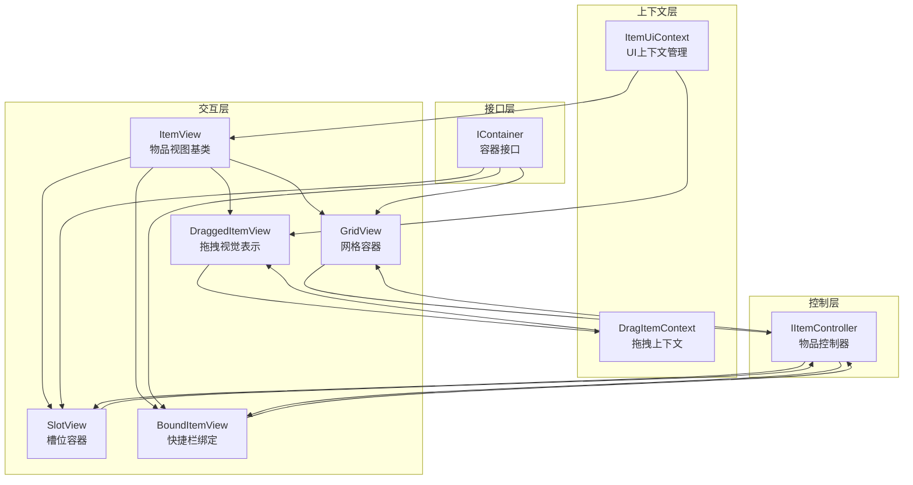
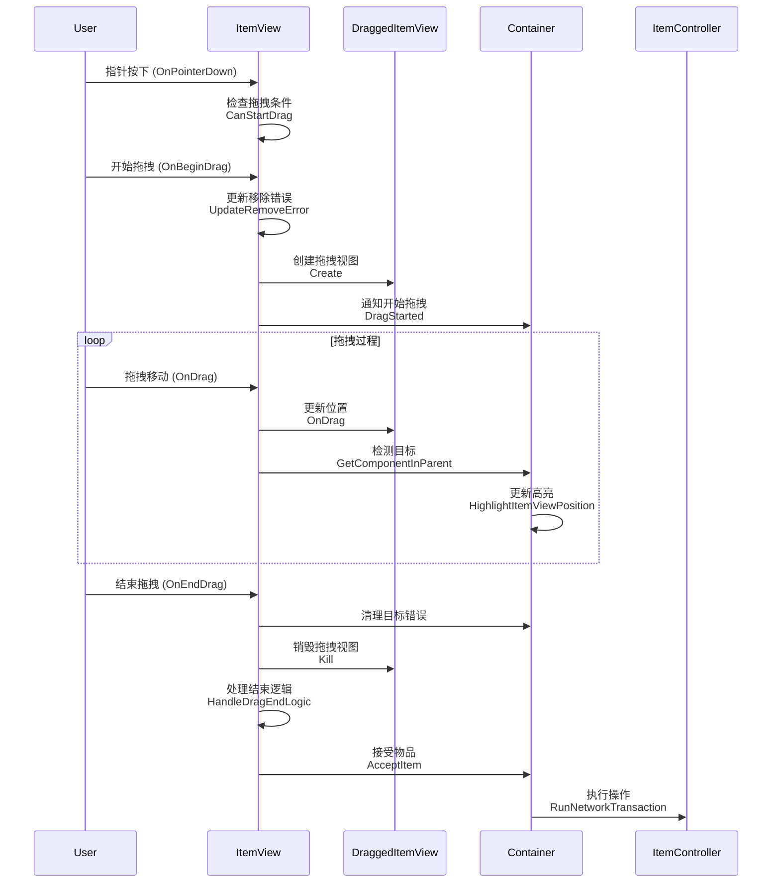

拖放系统是Unity Tarkov UI框架的核心交互机制，负责处理物品在库存系统中的移动、放置和交互操作。该系统通过事件驱动架构实现了流畅的拖拽体验，支持多种容器类型（网格、槽位、快捷栏）和复杂的交互逻辑（旋转、分割、合并、装填等）。

## 系统架构概览

拖放系统采用分层架构设计，将视觉表现、交互逻辑和业务操作解耦，形成清晰的责任边界。



### 核心组件职责

| 组件 | 主要职责 | 关键方法 |
|------|---------|---------|
| **ItemView** | 物品视图基类，实现拖拽事件处理接口 | `OnBeginDrag`, `OnDrag`, `OnEndDrag`, `HandleDragEndLogic` |
| **DraggedItemView** | 拖拽过程中的视觉呈现，跟随鼠标移动 | `UpdateTargetUnderCursor`, `HandleRotationInput` |
| **GridView** | 网格容器，支持网格布局物品放置 | `CalculateItemLocation`, `HighlightItemViewPosition`, `CanAccept` |
| **SlotView** | 单槽位容器，用于装备槽和武器槽 | `HandleDropOperationAsync`, `TryLoadAmmoToWeapon` |
| **BoundItemView** | 快捷栏绑定槽，管理物品到快捷键的绑定 | `OnBindItem`, `OnUnbindItem` |
| **IContainer** | 容器接口定义，统一容器行为契约 | `CanAccept`, `AcceptItem`, `CanDrag` |

Sources: [ItemView.cs](Assembly-CSharp/EFT/UI/DragAndDrop/ItemView.cs#L1200-L1300), [DraggedItemView.cs](Assembly-CSharp/EFT/UI/DragAndDrop/DraggedItemView.cs#L1-L200), [GridView.cs](Assembly-CSharp/EFT/UI/DragAndDrop/GridView.cs#L1000-L1200), [IContainer.cs](Assembly-CSharp/EFT/UI/Containers/IContainer.cs#L1-L56)

## 拖拽操作生命周期

拖拽操作遵循严格的流程控制，确保从开始到结束的每个阶段都有明确的处理逻辑和状态管理。



### 操作流程详解

#### 1. 拖拽启动阶段

拖拽启动前需要验证多个条件，确保操作的合法性和安全性。

```csharp
// 拖拽条件检查
private bool CanStartDrag(PointerEventData eventData)
{
    return eventData.button == PointerEventData.InputButton.Left && 
           Container != null && 
           Container.CanDrag(ItemContext) && 
           IsSearched && 
           !IsTeammateDogtag && 
           RemoveError.Value == null && 
           DraggedItemView == null;
}
```

**验证条件包括**：
- 必须为左键操作
- 容器存在且允许拖拽
- 物品已被搜索（未搜刮状态不可拖拽）
- 不是队友狗牌（特殊物品）
- 没有移除错误（如武器故障未解决）
- 当前没有正在拖拽的视图

#### 2. 拖拽过程阶段

拖拽过程中系统持续更新视觉反馈和目标检测。

**DraggedItemView 职责**：
- 位置跟随：`OnDrag` 方法将视图位置同步到鼠标位置
- 目标检测：`UpdateTargetUnderCursor` 方法检测鼠标下的容器和物品
- 旋转处理：`HandleRotationInput` 方法响应R键旋转输入

**目标检测逻辑**：
```csharp
public void UpdateTargetUnderCursor(IContainer containerUnderCursor, IItemContext itemUnderCursor)
{
    LocationInGrid newGridLocation = (containerUnderCursor is GridView gridView) 
        ? gridView.CalculateItemLocation(ItemContext) 
        : null;

    if (containerUnderCursor != targetContainer || 
        itemUnderCursor != targetItemContext || 
        !(newGridLocation == gridLocation))
    {
        targetContainer?.DisableHighlight();
        targetContainer = containerUnderCursor;
        targetItemContext = itemUnderCursor;
        gridLocation = newGridLocation;
        containerUnderCursor?.HighlightItemViewPosition(ItemContext, itemUnderCursor, preview: false);
    }
}
```

#### 3. 拖拽结束阶段

拖拽结束是最复杂的阶段，涉及多种操作类型的处理。

**结束处理流程**：
1. 获取目标容器和物品
2. 取消拖拽状态
3. 检查容器接受条件
4. 执行相应操作（移动、合并、装填、修理等）
5. 播放操作音效

**操作类型判断**：
- **普通移动**：`CanAccept` 返回成功，执行 `AcceptItem`
- **弹药装填**：目标为武器，执行装填逻辑
- **修理操作**：拖拽物品为修理包，执行修理交互
- **快速移动**：按下Ctrl键，执行部分转移

Sources: [ItemView.cs](Assembly-CSharp/EFT/UI/DragAndDrop/ItemView.cs#L1200-L1450), [DraggedItemView.cs](Assembly-CSharp/EFT/UI/DragAndDrop/DraggedItemView.cs#L201-L400)

## 网格容器实现

GridView 是最复杂的容器类型，支持网格布局、物品旋转、高亮预览等高级功能。

### 网格位置计算

网格位置计算将屏幕坐标转换为网格坐标，考虑了物品尺寸和旋转状态。


**核心计算逻辑**：
```csharp
public LocationInGrid CalculateItemLocation(DragItemContext itemContext)
{
    RectTransform rectTransform = base.transform.RectTransform();
    Vector2 size = rectTransform.rect.size;
    Vector2 pivot = rectTransform.pivot;
    Vector2 offset = size * pivot;
    
    // 转换为本地坐标
    Vector2 localPos = rectTransform.InverseTransformPoint(itemContext.ItemPosition);
    localPos += offset;
    
    // 获取旋转后尺寸
    CellSize itemSize = itemContext.Item.CalculateRotatedSize(itemContext.ItemRotation);
    
    // 转换为网格坐标
    const int CELL_SIZE = 63;
    localPos /= CELL_SIZE;
    
    // Y轴翻转（Unity UI坐标系与网格坐标系的差异）
    localPos.y = (float)Grid.GridHeight - localPos.y;
    localPos.y -= itemSize.Y;
    
    // 限制范围
    return new LocationInGrid(
        Mathf.Clamp(Mathf.RoundToInt(localPos.x), 0, Grid.GridWidth),
        Mathf.Clamp(Mathf.RoundToInt(localPos.y), 0, Grid.GridHeight),
        itemContext.ItemRotation
    );
}
```

### 高亮反馈系统

高亮系统通过颜色编码提供即时视觉反馈，指示操作的可行性。

**颜色含义**：
- **绿色** (`ValidMoveColor`): 有效移动操作
- **红色** (`InvalidOperationColor`): 无效操作
- **蓝色** (`transferOperationColor`): 转移操作
- **黄色** (`examineOperationColor`): 检查/分割操作

```csharp
protected virtual Color GetHighlightColor(DragItemContext itemContext, TransactionResult operation, BaseItemContext targetItemContext)
{
    if (operation.Failed)
        return InvalidOperationColor;
    
    if (operation.Value is _EF3B || operation.Value is _EF51)
        return ValidMoveColor;
    
    if (operation.Value is _EF43 || operation.Value is _EF4D || operation.Value is _EF4F)
        return examineOperationColor;
    
    if (operation.Value is _EF50)
        return transferOperationColor;
    
    return InvalidOperationColor;
}
```

**高亮区域计算**：
```csharp
// 计算高亮面板的位置和尺寸
CellSize itemSize = itemContext.Item.CalculateRotatedSize(itemContext.ItemRotation);
LocationInGrid location = CalculateItemLocation(itemContext);

int x = location.x;
int y = location.y;
int width = x + itemSize.X;
int height = y + itemSize.Y;

// 限制在网格范围内
x = Mathf.Clamp(x, 0, Grid.GridWidth);
y = Mathf.Clamp(y, 0, Grid.GridHeight);
width = Mathf.Clamp(width, 0, Grid.GridWidth);
height = Mathf.Clamp(height, 0, Grid.GridHeight);

// 设置高亮面板
rectTransform.anchoredPosition = new Vector2(x * 63, -y * 63);
rectTransform.sizeDelta = new Vector2((width - x) * 63, (height - y) * 63);
```

Sources: [GridView.cs](Assembly-CSharp/EFT/UI/DragAndDrop/GridView.cs#L800-L1100), [GridView.cs](Assembly-CSharp/EFT/UI/DragAndDrop/GridView.cs#L200-L400)

## 槽位容器实现

SlotView 用于装备槽、武器槽等单物品槽位，处理特定的放置逻辑和特殊交互。

### 弹药装填逻辑

槽位容器包含特殊的弹药装填处理，支持普通武器和多管武器。

```csharp
private bool TryLoadAmmoToWeapon(Item item, bool ctrlPressed)
{
    if (!(item is IStackableItem stackableItem) ||
        !(Slot.ContainedItem is Weapon { SupportsInternalReload: not false } weapon))
    {
        return false;
    }

    IMagazine currentMagazine = weapon.GetCurrentMagazine();
    int maxLoadCount = currentMagazine?.MaxCount - currentMagazine?.Count ?? 0;
    int loadCount = Math.Min(stackableItem.StackObjectsCount, maxLoadCount);

    if (loadCount <= 0)
        return false;

    ItemController.LoadWeaponWithAmmo(weapon, stackableItem, loadCount).HandleExceptions();
    return true;
}

private bool TryLoadAmmoToMultiBarrelWeapon(Item item)
{
    if (!(item is IStackableItem stackableItem) ||
        !(Slot.ContainedItem is Weapon { IsMultiBarrel: not false, FreeChamberSlotsCount: var freeSlots } weapon))
    {
        return false;
    }

    int loadCount = Math.Min(stackableItem.StackObjectsCount, freeSlots);

    if (loadCount <= 0)
        return false;

    ItemController.LoadMultiBarrelWeapon(weapon, stackableItem, loadCount).HandleExceptions();
    return true;
}
```

### 分割和转移操作

槽位容器支持物品的分割和部分转移，需要显示数量选择对话框。

```csharp
private void ProcessSplitOperation(ISplitOperation splitOperation, IItemContext itemContext, bool ctrlPressed)
{
    int maxCount = splitOperation.MaxCount;
    int defaultCount = ctrlPressed ? 1 : maxCount;

    ItemUiContext.SplitDialog.Show(
        splitOperation.Item,
        defaultCount,
        maxCount,
        (count) => {
            var handler = new SplitTransferHandler
            {
                SplitResult = splitOperation,
                SlotView = this
            };
            handler.ExecuteSplitOperation(count);
        }
    );
}
```

Sources: [SlotView.cs](Assembly-CSharp/EFT/UI/DragAndDrop/SlotView.cs#L1-L200)

## 快捷栏绑定实现

BoundItemView 管理物品到快捷键的绑定，处理物品状态同步和选中显示。

### 绑定/解绑事件处理

```csharp
public void OnBindItem(ItemBindEvent eventArgs)
{
    if (eventArgs.Index == base.BoundIndex && eventArgs.Status == CommandStatus.Succeed)
    {
        RemoveItemView();
        SetItem(eventArgs.Item, InventoryController, ItemUiContext);
        ShowInfoPanel(eventArgs.Item);
    }
}

public void OnUnbindItem(ItemUnbindEvent eventArgs)
{
    if (eventArgs.Index != base.BoundIndex || eventArgs.Status != CommandStatus.Succeed)
        return;

    if (ItemView != null)
    {
        if (ItemView.Item == eventArgs.Item)
            SwitchVisualSelection(selected: false);
        RemoveItemView();
    }
    else
    {
        Debug.LogError(StringDecryptor.Decrypt(267119));
    }

    ShowInfoPanel(null);
}
```

### 手部状态同步

```csharp
public void OnSetInHands(ItemSplitEvent args)
{
    if (ItemView != null && ItemView.Item == args.Item)
        SwitchVisualSelection(selected: true);
}

public void OnRemoveFromHands(ItemMergeEvent args)
{
    if (ItemView != null && ItemView.Item == args.Item)
        SwitchVisualSelection(selected: false);
    else if (args.Item == null)
        SwitchVisualSelection(selected: true);
}
```

Sources: [BoundItemView.cs](Assembly-CSharp/EFT/UI/DragAndDrop/BoundItemView.cs#L1-L222)

## 旋转系统

物品旋转是拖放系统的重要功能，通过R键切换物品方向以适应不同的放置需求。

### 旋转状态管理

```csharp
private void HandleRotationInput()
{
    // 检查网格是否有旋转锁定
    if (targetContainer is GridView gridView && gridView.SourceContext.RotationLock.HasValue)
    {
        ForceRotation(gridView.SourceContext.RotationLock.Value);
    }
    else
    {
        HandleManualRotation();
    }
}

private void HandleManualRotation()
{
    if (Input.GetKeyDown(KeyCode.R))
    {
        ItemRotation newRotation = (ItemContext.ItemRotation == ItemRotation.Horizontal) 
            ? ItemRotation.Vertical 
            : ItemRotation.Horizontal;
        
        ApplyRotation(newRotation);

        if (targetContainer != null)
        {
            targetContainer.HighlightItemViewPosition(ItemContext, targetItemContext, preview: false);
        }
    }
}
```

### 旋转变换应用

```csharp
private void ApplyRotation(ItemRotation rotation)
{
    ItemContext.ItemRotation = rotation;

    // 应用旋转变换
    Quaternion targetRotation = (rotation == ItemRotation.Horizontal) 
        ? ItemViewFactory.HorizontalRotation 
        : ItemViewFactory.VerticalRotation;
    _mainImage.transform.rotation = targetRotation;

    // 调整尺寸
    DragTransform.sizeDelta = ItemViewFactory.GetCellPixelSize(
        Item.CalculateRotatedSize(rotation)
    );

    UpdatePositionToMouse();
}
```

Sources: [DraggedItemView.cs](Assembly-CSharp/EFT/UI/DragAndDrop/DraggedItemView.cs#L201-L428)

## 错误处理与验证

拖放系统包含多层验证机制，确保操作的合法性和安全性。

### 移除错误检查

在拖拽开始前，系统检查物品是否可以被安全移除。

```csharp
public virtual void UpdateRemoveError(bool ignoreMalfunctions = true)
{
    if (Item.CurrentAddress == null)
    {
        RemoveError.Value = null;
        return;
    }

    if (ItemContext.Error != null)
    {
        RemoveError.Value = ItemContext.Error;
        return;
    }

    Error error = _EF24.Remove(Item, ItemController, simulate: true).Error;

    // 处理武器故障错误
    if (error is _EF24._E000 weaponMalfunctionError)
    {
        if (!ignoreMalfunctions && ItemController is _EEF0 malfunctionController && 
            !malfunctionController.HasKnownMalfunction(weaponMalfunctionError.Weapon))
        {
            malfunctionController.ExamineMalfunction(weaponMalfunctionError.Weapon);
        }
        else
        {
            error = null;
        }
    }

    RemoveError.Value = error;
}
```

### 容器接受验证

```csharp
public virtual bool CanAccept(DragItemContext itemContext, BaseItemContext targetItemContext, out TransactionResult operation)
{
    // 检查源上下文
    if (!SourceContext.IsDropAvailable(itemContext))
    {
        operation = new _EDF0(itemContext.Item);
        return false;
    }

    // 检查网格有效性
    if (Grid == null || _nonInteractable)
        return false;

    Item item = itemContext.Item;
    LocationInGrid location = CalculateItemLocation(itemContext);
    GridItemAddress gridAddress = Grid.CreateItemAddress(location);
    ItemAddress itemAddress = itemContext.ItemAddress;

    // 检查目标物品修改权限
    if (targetItemContext != null && !targetItemContext.ModificationAvailable)
    {
        operation = new GridContainer._E006(Grid);
        return false;
    }

    // 检查旋转锁定
    if (SourceContext.RotationLock.HasValue && itemContext.ItemRotation != SourceContext.RotationLock.Value)
        return false;

    // 执行操作检查
    bool partialTransfer = Input.GetKey(KeyCode.LeftControl) || Input.GetKey(KeyCode.RightControl);
    Item targetItem = GetTargetItemFromContext(targetItemContext);
    
    operation = (targetItem != null) 
        ? _itemController.ExecutePossibleAction(itemContext, targetItem, partialTransfer, simulate: true)
        : _itemController.ExecutePossibleAction(itemContext, SourceContext, gridAddress, partialTransfer, simulate: true);

    return operation.Succeeded;
}
```

Sources: [ItemView.cs](Assembly-CSharp/EFT/UI/DragAndDrop/ItemView.cs#L1000-L1100), [GridView.cs](Assembly-CSharp/EFT/UI/DragAndDrop/GridView.cs#L1000-L1200)

## 性能优化策略

拖放系统通过多种优化技术确保流畅的性能。

### 对象池管理

ItemView 继承自 AssetPoolObject，使用对象池减少实例化开销。

```csharp
public static DraggedItemView Create(IItemContext originalItemContext, ItemRotation itemRotation, Color imageColor, ItemUiContext itemUiContext)
{
    return ItemViewFactory.CreateFromPrefab<DraggedItemView>(StringDecryptor.Decrypt(268052))
        .Initialize(originalItemContext, itemRotation, imageColor, itemUiContext);
}

public void Kill()
{
    UpdateTargetUnderCursor(null, null);
    iconChangeCleanup();
    uiContext.UnregisterView(ItemContext);
    // 返回对象池
    ReturnToPool();
}
```

### 事件清理机制

使用 CompositeDisposable 统一管理资源清理。

```csharp
private readonly CompositeDisposable CompositeDisposable = new CompositeDisposable();

public void Show(GridContainer grid, BaseItemContext parentContext, ...)
{
    var showData = new GridShowData();
    showData.gridView = this;
    
    UI.Dispose();
    
    showData.itemOwner = Grid.ParentItem.Parent.GetOwner();
    showData.itemOwner.RegisterView(this);
    UI.AddDisposable(showData.UnregisterOwnerView);
    
    Grid.OnResize += OnGridResize;
    UI.AddDisposable(showData.UnsubscribeGridResize);
}
```

### 异步操作优化

使用 CancellationToken 管理长时间运行的操作。

```csharp
private CancellationTokenSource cancellationTokenSource;

public void Show(...)
{
    UI.AddDisposable(() => cancellationTokenSource?.Cancel());
    cancellationTokenSource = new CancellationTokenSource();
}
```

Sources: [DraggedItemView.cs](Assembly-CSharp/EFT/UI/DragAndDrop/DraggedItemView.cs#L1-L200), [GridView.cs](Assembly-CSharp/EFT/UI/DragAndDrop/GridView.cs#L200-L400)

## 与其他系统的集成

拖放系统与游戏的其他核心系统紧密协作，实现完整的物品管理功能。

### 与库存系统的集成

- **IItemController**: 执行物品操作的业务逻辑
- **IItemOwner**: 管理物品的拥有者关系
- **TransactionResult**: 返回操作结果和错误信息

### 与UI系统的集成

- **ItemUiContext**: 提供UI全局服务（工具提示、分割对话框）
- **IContainer**: 定义容器行为契约
- **Tooltip**: 显示操作反馈和错误信息

### 与输入系统的集成

- **PointerEventData**: 处理鼠标事件
- **Input系统**: 响应键盘输入（R键旋转、Ctrl键部分转移）
- **EventSystem**: 管理事件传播

Sources: [IContainer.cs](Assembly-CSharp/EFT/UI/Containers/IContainer.cs#L1-L56), [ItemView.cs](Assembly-CSharp/EFT/UI/DragAndDrop/ItemView.cs#L1-L200)

## 关键设计模式

拖放系统应用了多种设计模式以实现灵活和可维护的架构。

### 策略模式

不同容器类型实现相同的 `IContainer` 接口，但提供不同的接受策略。

```csharp
// GridView 的接受策略
public virtual bool CanAccept(DragItemContext itemContext, BaseItemContext targetItemContext, out TransactionResult operation)
{
    // 网格特定的验证逻辑
    LocationInGrid location = CalculateItemLocation(itemContext);
    GridItemAddress address = Grid.CreateItemAddress(location);
    // ...
}

// SlotView 的接受策略
public virtual bool CanAccept(DragItemContext itemContext, BaseItemContext targetItemContext, out TransactionResult operation)
{
    // 槽位特定的验证逻辑
    // ...
}
```

### 观察者模式

通过事件系统实现组件间的解耦通信。

```csharp
public class ItemView : IItemAddedHandle, IItemRemovedHandle, IRefreshItemHandler
{
    public void OnItemAdded(ItemAddedEvent eventArgs)
    {
        // 处理物品添加事件
    }

    public void OnItemRemoved(ItemRemovedEvent eventArgs)
    {
        // 处理物品移除事件
    }
}
```

### 工厂模式

ItemViewFactory 负责创建各种类型的物品视图。

```csharp
public static DraggedItemView Create(IItemContext originalItemContext, ItemRotation itemRotation, Color imageColor, ItemUiContext itemUiContext)
{
    return ItemViewFactory.CreateFromPrefab<DraggedItemView>(StringDecryptor.Decrypt(268052))
        .Initialize(originalItemContext, itemRotation, imageColor, itemUiContext);
}
```

Sources: [ItemView.cs](Assembly-CSharp/EFT/UI/DragAndDrop/ItemView.cs#L1200-L1400), [GridView.cs](Assembly-CSharp/EFT/UI/DragAndDrop/GridView.cs#L1000-L1200)

## 扩展与自定义

拖放系统设计了良好的扩展点，支持自定义容器和行为。

### 自定义容器实现

```csharp
public class CustomContainerView : UIElement, IContainer
{
    public bool CanAccept(DragItemContext itemContext, BaseItemContext targetItemContext, out TransactionResult operation)
    {
        // 自定义接受逻辑
        operation = default(TransactionResult);
        return true;
    }

    public Task AcceptItem(DragItemContext itemContext, BaseItemContext targetItemContext)
    {
        // 自定义接受逻辑
        return Task.CompletedTask;
    }

    public bool CanDrag(BaseItemContext itemContext)
    {
        // 自定义拖拽逻辑
        return true;
    }
}
```

### 自定义物品视图

```csharp
public class CustomItemView : ItemView
{
    protected override void OnClick(PointerEventData.InputButton button, Vector2 position, bool doubleClick)
    {
        // 自定义点击处理
        base.OnClick(button, position, doubleClick);
    }

    public override bool CanDrag(BaseItemContext itemContext)
    {
        // 自定义拖拽条件
        return base.CanDrag(itemContext) && CustomCondition;
    }
}
```

Sources: [IContainer.cs](Assembly-CSharp/EFT/UI/Containers/IContainer.cs#L1-L56)

## 总结

拖放系统是Unity Tarkov UI架构的基石之一，通过精心设计的分层架构和事件驱动机制，实现了复杂而流畅的物品交互体验。系统的核心优势在于：

1. **高度解耦**: 视觉表现、交互逻辑和业务操作分离
2. **类型安全**: 强类型的接口和契约确保编译时检查
3. **性能优化**: 对象池、异步操作和事件清理机制
4. **可扩展性**: 清晰的扩展点支持自定义容器和行为
5. **用户体验**: 丰富的视觉反馈和错误提示

要深入了解UI框架的其他方面，请参阅 [背包界面与物品视图](16-bei-bao-jie-mian-yu-wu-pin-shi-tu) 文档。