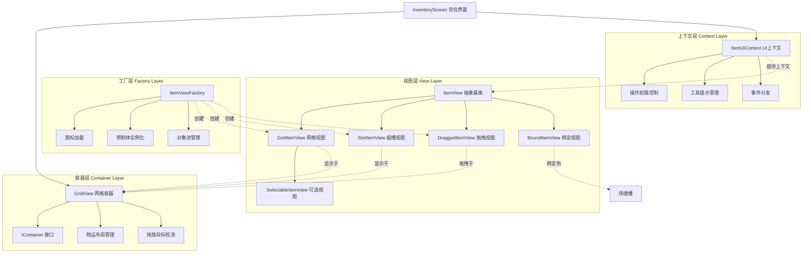
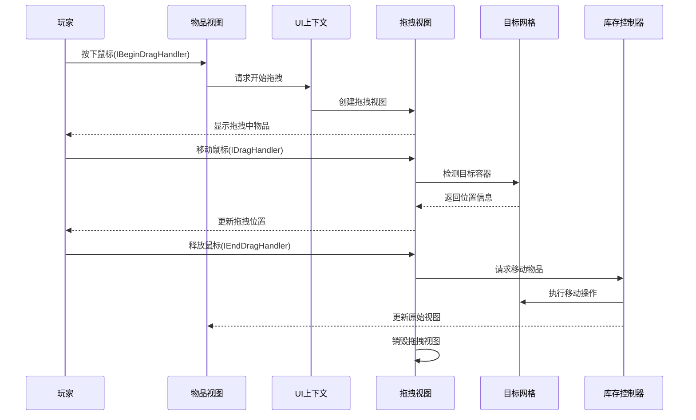

背包界面与物品视图系统是Unity Tarkov UI架构的核心组件,负责管理游戏内所有物品的视觉展示、交互操作和状态同步。该系统通过分层架构设计,实现了从基础物品视图到复杂背包界面的完整功能链,支持拖放、旋转、合并、分割等丰富的物品操作功能。

## 系统架构概览

背包界面系统采用多层分离架构,通过抽象基类、工厂模式和事件驱动机制实现高内聚低耦合的设计。核心架构包含四个主要层次:视图层、容器层、工厂层和上下文层,各层通过清晰的接口进行通信。



### 核心类继承关系

物品视图系统采用面向对象的继承体系,通过抽象基类定义通用行为,子类实现特定场景下的定制功能:

| 类名 | 继承关系 | 核心职责 | 主要使用场景 |
|------|---------|---------|-------------|
| `ItemView` | `AssetPoolObject` | 物品视图抽象基类,提供拖放、点击、悬停等通用交互 | 所有物品视图的基础 |
| `GridItemView` | `ItemView` | 网格物品视图,支持数值显示、耐久度、工具提示 | 背包、仓库等网格容器 |
| `SlotItemView` | `GridItemView` | 插槽物品视图,支持武器精通度、装备状态 | 装备槽、武器改装界面 |
| `DraggedItemView` | `MonoBehaviour` | 拖拽过程中的临时物品视图 | 拖拽操作期间 |
| `BoundItemView` | `QuickSlotView` | 快捷槽绑定物品视图,显示快捷键和选中状态 | 快捷槽1-4 |

## 物品视图基类(ItemView)

`ItemView` 是整个物品视图系统的抽象基类,定义了所有物品视图共有的核心属性、方法和事件处理机制。该类实现了Unity的多个事件处理接口,提供完整的交互支持。

### 核心组件结构

`ItemView` 内部采用组合模式,将不同功能职责分离到专门的辅助类中:

- **AlphaCalculator(透明度计算器)**: 根据物品状态(过滤、禁用、错误)动态计算视图透明度
- **EventHandler(事件处理器)**: 管理物品更新、拖拽状态变化、接受检查等事件订阅
- **RepairChecker(修理检查器)**: 验证修理工具是否可以修理指定组件
- **BindingChecker(绑定检查器)**: 检查快捷键绑定是否匹配当前物品或插槽

### 关键属性与状态管理

`ItemView` 通过多个响应式属性(ReactiveProperty)管理物品的操作权限和状态:

Sources: [Assembly-CSharp/EFT/UI/DragAndDrop/ItemView.cs](Assembly-CSharp/EFT/UI/DragAndDrop/ItemView.cs#L319-L449)

```csharp
// 拖拽禁用状态控制
private readonly ReactiveProperty<bool> _isDragDisabled = new ReactiveProperty<bool>();

// 旋转禁用状态控制
private readonly ReactiveProperty<bool> _isRotateDisabled = new ReactiveProperty<bool>();

// 合并禁用状态控制
private readonly ReactiveProperty<bool> _isMergeDisabled = new ReactiveProperty<bool>();

// 分割禁用状态控制
private readonly ReactiveProperty<bool> _isSplitDisabled = new ReactiveProperty<bool>();

// 操作错误信息存储
private readonly ReactiveErrorProperty _operationError = new ReactiveProperty<Error>();
```

这些响应式属性支持数据绑定,当状态改变时会自动更新UI显示,实现声明式UI更新机制。

### 视觉组件配置

`ItemView` 通过序列化字段配置UI组件,支持Unity Inspector可视化编辑:

Sources: [Assembly-CSharp/EFT/UI/DragAndDrop/ItemView.cs](Assembly-CSharp/EFT/UI/DragAndDrop/ItemView.cs#L272-L299)

```csharp
[SerializeField]
protected ItemViewAnimation Animator;  // 物品视图动画控制器

[SerializeField]
protected Image MainImage;            // 物品主图标

[SerializeField]
protected Image ColorPanel;           // 背景颜色面板

[SerializeField]
protected Image _border;              // 边框图像

[SerializeField]
protected CanvasGroup CanvasGroup;    // 画布组,控制透明度和交互性

[SerializeField]
protected ItemViewBottomPanel BottomPanel;  // 底部信息面板
```

### 交互事件处理

`ItemView` 实现了Unity EventSystem的多个接口,提供完整的鼠标和触摸交互支持:

Sources: [Assembly-CSharp/EFT/UI/DragAndDrop/ItemView.cs](Assembly-CSharp/EFT/UI/DragAndDrop/ItemView.cs#L31)

```csharp
public abstract class ItemView : AssetPoolObject, 
    IDragHandler,           // 拖拽处理
    IBeginDragHandler,      // 拖拽开始
    IEndDragHandler,        // 拖拽结束
    IPointerEnterHandler,   // 鼠标进入
    IPointerExitHandler,    // 鼠标离开
    IPointerClickHandler,   // 点击处理
    IPointerDownHandler,    // 鼠标按下
    IDisposable             // 资源释放
```

这种设计使得物品视图能够响应丰富的用户交互,同时通过接口隔离,每个处理方法职责单一。

## 网格物品视图(GridItemView)

`GridItemView` 继承自 `ItemView`,专门用于在网格容器中显示物品。它增加了数值显示、耐久度展示、工具提示等网格视图特有的功能。

### 特殊功能支持

`GridItemView` 实现了多个物品事件处理接口,以响应物品状态的实时变化:

Sources: [Assembly-CSharp/EFT/UI/DragAndDrop/GridItemView.cs](Assembly-CSharp/EFT/UI/DragAndDrop/GridItemView.cs#L41)

```csharp
public class GridItemView : ItemView,
    IItemAddedHandle,        // 物品添加处理
    IItemEventHandler,       // 物品通用事件
    IItemRemovedHandle,      // 物品移除处理
    IMagazineChangeHandler,  // 弹匣更换
    ILoadMagazineHandler,    // 装弹处理
    IUnloadMagazineHandler,  // 卸弹处理
    IMagazineCheckHandler,   // 弹匣检查
    IRefreshItemHandler,     // 物品刷新
    IDrainHandler,           // 排水(消耗品)
    IItemBindEventHandler,   // 物品绑定
    IItemUnbindEventHandler  // 物品解绑
```

通过实现这些接口,`GridItemView` 能够监听并响应物品的完整生命周期事件,确保UI与数据状态保持同步。

### 事件清理管理

`GridItemView` 使用专门的 `EventCleanupManager` 内部类管理事件订阅的生命周期,确保在对象销毁时正确清理所有事件订阅,防止内存泄漏:

Sources: [Assembly-CSharp/EFT/UI/DragAndDrop/GridItemView.cs](Assembly-CSharp/EFT/UI/DragAndDrop/GridItemView.cs#L59-L116)

```csharp
private sealed class EventCleanupManager
{
    public GridItemView gridItemView;
    public Weapon weapon;
    public SelectableItemContext selectableContext;
    public FilterPanel filterPanel;

    // 清理悬停事件订阅
    internal void CleanupHoverEvents()
    {
        gridItemView.HoverTrigger.OnHoverStart -= gridItemView.OnInsuredItemHoverStart;
        gridItemView.HoverTrigger.OnHoverEnd -= gridItemView.OnInsuredItemHoverEnd;
    }

    // 清理库存错误事件订阅
    internal void CleanupInventoryErrorEvents()
    {
        gridItemView.ItemContext.OnInventoryError -= gridItemView.OnInventoryError;
    }

    // 从物品拥有者注销视图
    internal void UnregisterFromOwner()
    {
        gridItemView.ItemOwner.UnregisterView(gridItemView);
    }

    // 从物品控制器注销视图
    internal void UnregisterFromController()
    {
        gridItemView.ItemController.UnregisterView(gridItemView);
    }
}
```

### 数值显示格式

`GridItemView` 支持多种数值显示格式,通过枚举定义不同的显示模式:

Sources: [Assembly-CSharp/EFT/UI/DragAndDrop/GridItemView.cs](Assembly-CSharp/EFT/UI/DragAndDrop/GridItemView.cs#L43-L48)

```csharp
protected enum EItemValueFormat
{
    OneValue = 0,    // 单个数值显示
    TwoValues = 1,   // 两个数值显示
    Other = 2        // 其他格式
}
```

这种设计允许同一视图类根据物品类型显示不同格式的数值信息,如弹匣显示"当前/最大",而其他物品可能只显示数量。

## 插槽物品视图(SlotItemView)

`SlotItemView` 专门用于在固定插槽中显示物品,如装备槽、武器改装槽等。它继承了 `GridItemView` 的功能,并增加了插槽特有的属性显示。

### 武器精通度显示

`SlotItemView` 集成了武器精通度系统,通过专门的计算器类处理精通度数据:

Sources: [Assembly-CSharp/EFT/UI/DragAndDrop/SlotItemView.cs](Assembly-CSharp/EFT/UI/DragAndDrop/SlotItemView.cs#L13-L32)

```csharp
private sealed class WeaponMasteryCalculator
{
    public _E916 mastered;  // 武器精通度对象

    // 计算精通度百分比
    internal float CalculateMasteryPercentage()
    {
        return (mastered != null) ? 
               ((int)(mastered.LevelProgress * 100f)) : 0;
    }
}
```

### 耐久度显示组件

`SlotItemView` 使用专门的 `DurabilitySlider` 组件显示物品耐久度,提供直观的视觉反馈:

Sources: [Assembly-CSharp/EFT/UI/DragAndDrop/SlotItemView.cs](Assembly-CSharp/EFT/UI/DragAndDrop/SlotItemView.cs#L65-L77)

```csharp
[SerializeField]
private Slider _masteringSlider;        // 精通度滑动条

[SerializeField]
private Image _masteringIcon;          // 精通度图标

[SerializeField]
private DurabilitySlider _durabilitySlider;  // 耐久度滑动条

[SerializeField]
private TextMeshProUGUI _masteringLabel;    // 精通度标签

[SerializeField]
private GameObject _masteringParent;   // 精通度父容器
```

### 特殊插槽识别

`SlotItemView` 通过 `isInSpecialSlot` 标志识别物品是否位于特殊插槽中,并据此调整显示格式:

Sources: [Assembly-CSharp/EFT/UI/DragAndDrop/SlotItemView.cs](Assembly-CSharp/EFT/UI/DragAndDrop/SlotItemView.cs#L116-L127)

```csharp
protected override string ValueFormat
{
    get
    {
        if (!isInSpecialSlot)
        {
            return StringDecryptor.Decrypt(264269);  // 普通格式
        }
        return StringDecryptor.Decrypt(264312);      // 特殊格式
    }
}
```

## 拖拽物品视图(DraggedItemView)

`DraggedItemView` 是在拖拽操作过程中显示的临时物品视图,负责处理物品拖拽时的视觉呈现、位置跟随和目标检测。

### 核心数据结构

`DraggedItemView` 维护拖拽操作的完整状态信息:

Sources: [Assembly-CSharp/EFT/UI/DragAndDrop/DraggedItemView.cs](Assembly-CSharp/EFT/UI/DragAndDrop/DraggedItemView.cs#L46-L100)

```csharp
private Item currentItem;              // 当前拖拽的物品
private ItemAddress itemAddress;       // 物品地址信息
private IconLoader iconLoader;         // 物品图标加载器
private Action iconChangeCleanup;      // 图标变化事件清理委托
private RectTransform cachedRectTransform;  // 缓存的RectTransform
private ItemUiContext uiContext;       // UI上下文管理器
private IContainer targetContainer;    // 拖拽目标容器
private IItemContext targetItemContext; // 目标物品上下文
private LocationInGrid gridLocation;   // 网格位置信息
private DragItemContext itemContext;   // 拖拽物品上下文
```

### 工厂方法创建

`DraggedItemView` 通过静态工厂方法创建,确保初始化的完整性:

Sources: [Assembly-CSharp/EFT/UI/DragAndDrop/DraggedItemView.cs](Assembly-CSharp/EFT/UI/DragAndDrop/DraggedItemView.cs#L102-L115)

```csharp
public static DraggedItemView Create(
    IItemContext originalItemContext, 
    ItemRotation itemRotation, 
    Color imageColor, 
    ItemUiContext itemUiContext)
{
    return ItemViewFactory.CreateFromPrefab<DraggedItemView>(
               StringDecryptor.Decrypt(268052))
           .Initialize(originalItemContext, itemRotation, 
                       imageColor, itemUiContext);
}
```

这种设计封装了复杂的创建逻辑,调用者只需提供必要参数,工厂负责完成初始化流程。

## 绑定物品视图(BoundItemView)

`BoundItemView` 用于显示绑定到快捷槽的物品,管理快捷键显示、选中状态和物品绑定/解绑事件。

### 事件监听机制

`BoundItemView` 实现了多个物品事件处理接口,响应物品在手部状态和绑定状态的变化:

Sources: [Assembly-CSharp/EFT/UI/DragAndDrop/BoundItemView.cs](Assembly-CSharp/EFT/UI/DragAndDrop/BoundItemView.cs#L31)

```csharp
public sealed class BoundItemView : QuickSlotView,
    IItemBindEventHandler,       // 物品绑定事件
    IItemEventHandler,           // 物品通用事件
    IItemUnbindEventHandler,     // 物品解绑事件
    IQuickSlotView,              // 快捷槽视图接口
    IHandsRemovalListener        // 手部移除监听
```

### 物品绑定处理

当物品成功绑定到快捷槽时,`BoundItemView` 更新显示:

Sources: [Assembly-CSharp/EFT/UI/DragAndDrop/BoundItemView.cs](Assembly-CSharp/EFT/UI/DragAndDrop/BoundItemView.cs#L108-L120)

```csharp
public void OnBindItem(ItemBindEvent eventArgs)
{
    // 检查是否为当前槽位的绑定事件且操作成功
    if (eventArgs.Index == base.BoundIndex && 
        eventArgs.Status == CommandStatus.Succeed)
    {
        RemoveItemView();  // 移除当前物品视图
        SetItem(eventArgs.Item, InventoryController, ItemUiContext);  // 设置新物品
        ShowInfoPanel(eventArgs.Item);  // 显示物品信息面板
    }
}
```

### 手部状态同步

`BoundItemView` 监听物品到手部的设置和移除事件,更新选中状态显示:

Sources: [Assembly-CSharp/EFT/UI/DragAndDrop/BoundItemView.cs](Assembly-CSharp/EFT/UI/DragAndDrop/BoundItemView.cs#L54-L73)

```csharp
// 物品设置到手中时
public void OnSetInHands(ItemSplitEvent args)
{
    if (ItemView != null && ItemView.Item == args.Item)
    {
        SwitchVisualSelection(selected: true);
    }
}

// 物品从手中移除时
public void OnRemoveFromHands(ItemMergeEvent args)
{
    if (ItemView != null && ItemView.Item == args.Item)
    {
        SwitchVisualSelection(selected: false);
    }
    else if (args.Item == null)
    {
        SwitchVisualSelection(selected: true);
    }
}
```

## 网格容器视图(GridView)

`GridView` 是物品容器的UI表示,负责管理网格布局、处理物品添加/移除、支持拖放操作和目标高亮显示。

### 容器接口实现

`GridView` 实现了 `IContainer` 接口,作为物品容器的UI抽象:

Sources: [Assembly-CSharp/EFT/UI/DragAndDrop/GridView.cs](Assembly-CSharp/EFT/UI/DragAndDrop/GridView.cs#L21)

```csharp
public class GridView : UIElement, 
    ContainerInterface,           // 容器接口
    IItemAddedHandle,             // 物品添加处理
    IItemEventHandler,            // 物品通用事件
    IItemRemovedHandle,           // 物品移除处理
    IRefreshItemHandler           // 物品刷新处理
```

### 初始化数据管理

`GridView` 使用 `GridShowData` 内部类管理视图显示过程中的资源和事件订阅:

Sources: [Assembly-CSharp/EFT/UI/DragAndDrop/GridView.cs](Assembly-CSharp/EFT/UI/DragAndDrop/GridView.cs#L24-L51)

```csharp
private sealed class GridShowData
{
    public IItemOwner itemOwner;              // 物品拥有者
    public GridView gridView;                 // 网格视图引用
    public IPlayerSearchController playerSearchController;  // 搜索控制器

    // 注销物品拥有者的视图绑定
    internal void UnregisterOwnerView()
    {
        itemOwner.UnregisterView(gridView);
    }

    // 取消网格大小变化事件订阅
    internal void UnsubscribeGridResize()
    {
        gridView.Grid.OnResize -= gridView.OnGridResize;
    }

    // 取消异步操作
    internal void CancelAsyncOperations()
    {
        gridView.cancellationTokenSource?.Cancel();
    }

    // 取消物品发现事件订阅
    internal void UnsubscribeItemFound()
    {
        playerSearchController.OnItemFound -= gridView.OnItemFound;
    }
}
```

这种设计将清理逻辑封装在专门的数据类中,遵循单一职责原则,提高了代码的可维护性。

### 物品事件数据处理

`GridView` 为物品添加和移除操作提供专门的事件数据类,用于位置检查和状态管理:

Sources: [Assembly-CSharp/EFT/UI/DragAndDrop/GridView.cs](Assembly-CSharp/EFT/UI/DragAndDrop/GridView.cs#L53-L88)

```csharp
private sealed class AddItemEventData
{
    public GridItemAddress gridItemAddress;
    public GridView gridView;

    // 检查物品视图是否位于指定的网格位置
    internal bool IsAtSameLocation(ItemView itemView)
    {
        return gridView.Grid.GetItemLocation(itemView.Item) 
               == gridItemAddress.LocationInGrid;
    }
}

private sealed class RemoveItemEventData
{
    public GridItemAddress gridItemAddress;
    public GridView gridView;

    // 检查物品视图是否位于指定的网格位置
    internal bool IsAtSameLocation(ItemView itemView)
    {
        return gridView.Grid.GetItemLocation(itemView.Item) 
               == gridItemAddress.LocationInGrid;
    }
}
```

## 物品视图工厂(ItemViewFactory)

`ItemViewFactory` 是物品视图系统的核心工厂类,负责创建和管理UI中的物品视图组件,提供物品图标加载、预制体实例化和对象池管理等功能。

### 常量定义

`ItemViewFactory` 定义了多个系统级常量,用于布局计算和资源路径管理:

Sources: [Assembly-CSharp/EFT/UI/DragAndDrop/ItemViewFactory.cs](Assembly-CSharp/EFT/UI/DragAndDrop/ItemViewFactory.cs#L15-L41)

```csharp
// 旋转角度常量
public static readonly Quaternion VerticalRotation = Quaternion.Euler(0f, 0f, 270f);
public static readonly Quaternion HorizontalRotation = Quaternion.identity;

// 尺寸常量
public const int CellSize = 62;        // 单元格像素大小
public const int BorderSize = 1;       // 边框像素宽度
public const string PrefabLayoutsPath = "Prefabs/UGUI/Layouts/";  // 预制体路径
```

### 对象池管理

`ItemViewFactory` 提供两种对象创建方式:对象池创建和预制体实例化:

Sources: [Assembly-CSharp/EFT/UI/DragAndDrop/ItemViewFactory.cs](Assembly-CSharp/EFT/UI/DragAndDrop/ItemViewFactory.cs#L46-L64)

```csharp
// 从对象池创建(性能优化)
public static T CreateFromPool<T>(string prefabName) where T : UnityEngine.Object
{
    return MonoBehaviourSingleton<UiPools>.Instance.GetGameObject<T>(
        StringDecryptor.Decrypt(267775) + prefabName);
}

// 从预制体创建(动态实例)
public static T CreateFromPrefab<T>(string prefabName) where T : UnityEngine.Object
{
    return UnityEngine.Object.Instantiate(
        ResourceCache.Pop<T>(StringDecryptor.Decrypt(267775) + prefabName));
}
```

对象池模式显著减少了频繁创建销毁UI对象带来的性能开销,特别适合背包中大量物品的场景。

### 像素尺寸计算

`ItemViewFactory` 提供格子尺寸到像素尺寸的转换方法,考虑边框大小:

Sources: [Assembly-CSharp/EFT/UI/DragAndDrop/ItemViewFactory.cs](Assembly-CSharp/EFT/UI/DragAndDrop/ItemViewFactory.cs#L69-L78)

```csharp
public static CellSize GetCellPixelSize(CellSize size)
{
    // 像素尺寸 = 格子数量 × (单元格大小 + 边框) + 额外边框
    return new CellSize(size.X * 63 + 1, size.Y * 63 + 1);
}
```

### 图标加载机制

`ItemViewFactory` 支持同步和异步两种图标加载方式:

Sources: [Assembly-CSharp/EFT/UI/DragAndDrop/ItemViewFactory.cs](Assembly-CSharp/EFT/UI/DragAndDrop/ItemViewFactory.cs#L83-L111)

```csharp
// 同步加载物品图标
public static IconLoader LoadItemIcon(Item item, int scaleFactor = 1, 
                                       bool forcedGeneration = false)
{
    ResourceKey prefab = item.Prefab;
    if (prefab == null || string.IsNullOrEmpty(prefab.path))
    {
        Sprite sprite = ResourceCache.Pop<Sprite>(
            StringDecryptor.Decrypt(267541));
        return new IconLoader(ItemHashCalculator.Default) { Sprite = sprite };
    }
    return Singleton<ItemIconManager>.Instance.GetItemIcon(
        item, scaleFactor * GetCellPixelSize(item.CalculateCellSize()), 
        forcedGeneration);
}

// 异步获取物品精灵图片
public static async Task<Sprite> GetItemSpriteAsync(Item item, 
                                                     int scaleFactor = 1)
{
    ResourceKey prefab = item.Prefab;
    if (prefab == null || string.IsNullOrEmpty(prefab.path))
    {
        return ResourceCache.Pop<Sprite>(StringDecryptor.Decrypt(267541));
    }

    CellSize size = scaleFactor * GetCellPixelSize(item.CalculateCellSize());
    return await Singleton<ItemIconManager>.Instance.GetItemSpriteAsync(item, size);
}
```

异步加载机制确保在加载大量物品图标时不会阻塞主线程,保持UI响应流畅。

## 背包界面(InventoryScreen)

`InventoryScreen` 是背包界面的主控制器,继承自 `EftScreen`,管理整个背包界面的生命周期和组件交互。

### 屏幕控制器架构

`InventoryScreen` 使用嵌套的控制器类管理屏幕状态:

Sources: [Assembly-CSharp/EFT/UI/InventoryScreen.cs](Assembly-CSharp/EFT/UI/InventoryScreen.cs#L14)

```csharp
public sealed class InventoryScreen : EftScreen<InventoryScreen._E000, InventoryScreen>
{
    public new abstract class _E000 : _F108._E000<_E000, InventoryScreen>
    {
        // 屏幕控制器逻辑
    }
}
```

### 依赖注入设计

`InventoryScreen` 通过构造函数注入核心依赖,实现松耦合设计:

Sources: [Assembly-CSharp/EFT/UI/InventoryScreen.cs](Assembly-CSharp/EFT/UI/InventoryScreen.cs#L209-L222)

```csharp
public readonly IGameSession Session;
public readonly IHealthController HealthController;
public readonly InventoryController InventoryController;
public readonly _F17D QuestController;
public readonly _F19C AchievementsController;
[CanBeNull]
public readonly _EB5C PrestigeController;
public readonly CompoundItem LootItem;
public readonly EInventoryTab InventoryTab;

protected _E000(IGameSession session, IHealthController healthController,
                InventoryController inventoryController, _F17D questController,
                _F19C achievementsController, _EB5C prestigeController,
                CompoundItem lootItem, EInventoryTab inventoryTab)
{
    Session = session;
    HealthController = healthController;
    InventoryController = inventoryController;
    QuestController = questController;
    AchievementsController = achievementsController;
    PrestigeController = prestigeController;
    LootItem = lootItem;
    InventoryTab = inventoryTab;
}
```

### 屏幕显示配置

`InventoryScreen` 在显示时配置ItemUiContext,设置操作权限和UI上下文:

Sources: [Assembly-CSharp/EFT/UI/InventoryScreen.cs](Assembly-CSharp/EFT/UI/InventoryScreen.cs#L224-L234)

```csharp
protected override void ShowAction(InventoryScreen screen)
{
    InventoryEquipment equipment = ((!IsInventoryBlocked) ? 
                                    InventoryController.Inventory.Equipment : null);
    CompoundItem[] rightPanelItems = ((ShowAsGridContent || LootItem == null) ? 
                                      null : new CompoundItem[1] { LootItem });
    
    ItemUiContext.Instance.Configure(
        InventoryController, Profile, Session, Session.InsuranceCompany, 
        null, HealthController, rightPanelItems, ContextType, 
        ECursorResult.ShowCursor, null, equipment);
}
```

### 屏幕关闭处理

`InventoryScreen` 实现了复杂的关闭中断逻辑,确保在关闭前处理未完成的操作:

Sources: [Assembly-CSharp/EFT/UI/InventoryScreen.cs](Assembly-CSharp/EFT/UI/InventoryScreen.cs#L236-L268)

```csharp
protected override async Task<bool> CloseScreenInterruption(bool moveForward)
{
    if (_E002 == null)
    {
        return await base.CloseScreenInterruption(moveForward);
    }
    
    // 处理服装组件
    if (_E002._E00C.Count > 0)
    {
        MongoID[] suites = _E002._E00C.Select(
            (KeyValuePair<EBodyModelPart, _F03C> equipped) => equipped.Value.Id)
            .ToArray();
        await _E002._E006(suites);
    }
    
    // 处理整理台
    bool flag = _E002._E00F;
    if (flag)
    {
        flag = !(await _E002._sortingTable.TryClose());
    }
    
    if (flag)
    {
        return false;
    }
    
    // 播放关闭音效
    if (_E002._playBackpackSounds)
    {
        Singleton<GUISounds>.Instance.PlayUISound(EUISoundType.BackpackClose);
    }
    
    return true;
}
```

## 拖放系统实现

背包系统的核心功能之一是拖放操作,该系统通过多个组件协同工作实现完整的拖放体验。

### 拖放流程



### 事件处理实现

`ItemView` 基类实现了完整的拖放事件处理:

Sources: [Assembly-CSharp/EFT/UI/DragAndDrop/ItemView.cs](Assembly-CSharp/EFT/UI/DragAndDrop/ItemView.cs#L31)

```csharp
public abstract class ItemView : AssetPoolObject,
    IDragHandler,           // 拖拽中
    IBeginDragHandler,      // 拖拽开始
    IEndDragHandler         // 拖拽结束
```

这种接口设计使得拖放逻辑与视图展示逻辑分离,便于维护和扩展。

## 性能优化策略

背包界面系统采用了多种性能优化技术,确保在大规模物品场景下的流畅运行:

### 对象池技术

`ItemViewFactory` 使用 `UiPools` 单例管理UI对象池,减少GC压力:

Sources: [Assembly-CSharp/EFT/UI/DragAndDrop/ItemViewFactory.cs](Assembly-CSharp/EFT/UI/DragAndDrop/ItemViewFactory.cs#L46-L54)

```csharp
public static T CreateFromPool<T>(string prefabName) where T : UnityEngine.Object
{
    return MonoBehaviourSingleton<UiPools>.Instance.GetGameObject<T>(
        StringDecryptor.Decrypt(267775) + prefabName);
}
```

### 异步资源加载

物品图标使用异步加载机制,避免阻塞主线程:

Sources: [Assembly-CSharp/EFT/UI/DragAndDrop/ItemViewFactory.cs](Assembly-CSharp/EFT/UI/DragAndDrop/ItemViewFactory.cs#L98-L111)

```csharp
public static async Task<Sprite> GetItemSpriteAsync(Item item, int scaleFactor = 1)
{
    CellSize size = scaleFactor * GetCellPixelSize(item.CalculateCellSize());
    return await Singleton<ItemIconManager>.Instance.GetItemSpriteAsync(item, size);
}
```

### 事件订阅管理

通过专门的清理类管理事件订阅生命周期,防止内存泄漏:

Sources: [Assembly-CSharp/EFT/UI/DragAndDrop/GridItemView.cs](Assembly-CSharp/EFT/UI/DragAndDrop/GridItemView.cs#L59-L116)

```csharp
private sealed class EventCleanupManager
{
    internal void CleanupHoverEvents() { /* ... */ }
    internal void CleanupInventoryErrorEvents() { /* ... */ }
    internal void UnregisterFromOwner() { /* ... */ }
    internal void UnregisterFromController() { /* ... */ }
}
```

## 下一步学习

通过本页面,你已经了解了背包界面与物品视图的核心架构和实现细节。接下来可以继续探索以下相关主题:

- **[拖放系统实现](15-tuo-fang-xi-tong-shi-xian)**: 深入了解拖放系统的完整实现机制
- **[物品基类与组件系统](11-wu-pin-ji-lei-yu-zu-jian-xi-tong)**: 学习物品数据模型和组件化设计
- **[背包容器与网格布局](12-bei-bao-rong-qi-yu-wang-ge-bu-ju)**: 了解容器系统的底层实现
- **[UI框架基础架构](14-uikuang-jia-ji-chu-jia-gou)**: 掌握整体UI框架的设计理念