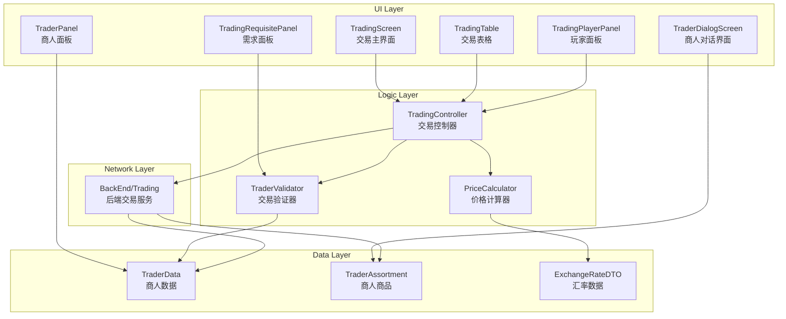
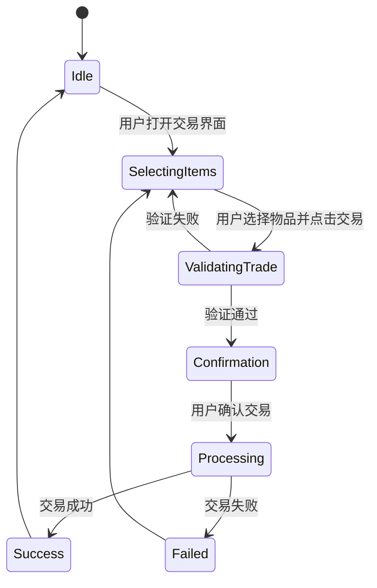

交易系统UI是《逃离塔科夫》中玩家与商人及玩家市场进行物品交换的核心界面系统。该系统涵盖了商人交易、服务购买、市场交易等多种交易场景，提供了复杂的物品操作、价格计算、过滤筛选和交易历史功能。本文档将深入分析交易系统UI的架构设计、核心组件、数据流和交互模式。

## 架构概览

交易系统UI采用了分层的模块化架构，将交易界面、数据管理、网络通信和用户交互分离。系统主要由以下几个层次组成：**数据层**负责交易数据和配置管理，**UI层**负责界面展示和用户交互，**逻辑层**负责交易规则验证和状态管理，**网络层**负责与后端服务器通信。

交易系统UI的核心特点是其**双向交互模式**：在商人交易场景中，系统需要在玩家库存和商人库存之间建立双向的物品交换机制；在市场交易场景中，系统需要支持多玩家间的异步交易和订单管理。这种双向性要求UI组件能够灵活地表示物品的所有权状态、可用性状态和价格信息。

Sources: [EDialogSide.cs](Assembly-CSharp/EFT/Trading/EDialogSide.cs#L1-L9), [TradingScreen.cs](Assembly-CSharp/EFT/UI/TradingScreen.cs), [TradingTable.cs](Assembly-CSharp/EFT/UI/TradingTable.cs)

## 核心组件分析

### 交易主界面

交易主界面是所有交易场景的顶层容器，负责管理交易屏幕的生命周期、布局和交互状态。该界面集成了玩家面板、商人面板、交易表格、需求面板等多个子组件，并提供统一的交易操作接口。

交易主界面使用**状态机模式**管理不同的交易状态，包括：浏览状态、选择状态、交易确认状态和交易执行状态。状态转换由用户交互触发，并受到交易规则验证器的约束。例如，当用户选择物品时，系统会验证物品是否满足交易条件（如货币充足、库存空间足够等），只有在验证通过后才允许进入交易确认状态。

Sources: [TradingScreen.cs](Assembly-CSharp/EFT/UI/TradingScreen.cs)

### 交易表格组件

交易表格组件是交易系统UI的核心可视化元素，负责显示交易物品列表、价格信息、数量选择和交易操作。该组件采用**网格布局**，每个网格单元格代表一个可交易的物品，包含物品图标、名称、价格、数量等信息。

交易表格支持多种**视图模式**，包括：
- **详细视图**：显示完整的物品信息和属性
- **紧凑视图**：仅显示核心信息，适合快速浏览
- **列表视图**：线性排列，适合大量物品的展示

该组件还集成了**拖放功能**，允许用户直接从库存拖动物品到交易表格中进行交易。拖放过程中，系统会实时更新物品的可视化状态，包括高亮显示目标位置、显示预览效果等。

Sources: [TradingTable.cs](Assembly-CSharp/EFT/UI/TradingTable.cs)

### 玩家面板与商人面板

玩家面板和商人面板是对称的UI组件，分别显示玩家和商人的可用物品、货币和交易信息。这两个面板共享相同的**基础UI架构**，但在数据源和交互逻辑上有所区别。

玩家面板的主要功能包括：
- 显示玩家库存中的可交易物品
- 显示玩家持有的货币数量
- 提供物品筛选和排序功能
- 支持物品的详细信息查看

商人面板的主要功能包括：
- 显示商人的商品列表
- 显示商人的货币需求和接受
- 提供商人信誉和折扣信息
- 支持商品分类和过滤

这两个面板通过**事件系统**进行通信，当一方选择物品时，另一方会收到通知并更新可用性状态。这种松耦合的设计使得系统可以灵活地支持不同的交易场景。

Sources: [TradingPlayerPanel.cs](Assembly-CSharp/EFT/UI/TradingPlayerPanel.cs), [TraderPanel.cs](Assembly-CSharp/EFT/UI/TraderPanel.cs)

## 交易流程与状态管理

交易系统UI采用**事务性设计**，确保交易操作的原子性和一致性。整个交易流程被划分为多个阶段，每个阶段都有明确的状态和可用的操作。

### 选择阶段

在选择阶段，用户可以在玩家面板和商人面板之间浏览和选择物品。系统会**实时计算**当前交易的总价值、货币平衡和交易限制。当用户选择物品时，系统会：

1. 检查物品是否可交易（如物品类型、绑定状态等）
2. 计算物品的价值（考虑商人折扣、玩家等级等因素）
3. 更新交易概要信息
4. 高亮显示相关的交互元素

### 验证阶段

验证阶段是交易流程中的关键环节，系统会对交易请求进行全面的**规则验证**，包括：
- 货币充足性检查
- 库存空间检查
- 交易次数限制检查
- 物品合法性检查
- 商人信誉要求检查

验证过程使用**链式验证模式**，每个验证器独立负责一个验证规则，只有所有验证器都通过时，交易请求才能进入下一阶段。这种设计使得验证逻辑易于扩展和维护。

### 执行阶段

执行阶段是交易的最后一步，系统会：
1. 锁定相关物品，防止并发冲突
2. 向后端服务器发送交易请求
3. 等待服务器响应
4. 更新本地库存和货币
5. 显示交易结果

如果交易失败，系统会提供详细的错误信息，并允许用户重试或修改交易请求。

Sources: [ETradeMode.cs](Assembly-CSharp/EFT/UI/ETradeMode.cs), [TradingRequisitePanel.cs](Assembly-CSharp/EFT/UI/TradingRequisitePanel.cs)

## 商人对话系统

商人对话系统是交易系统UI的特色功能，通过对话界面提供沉浸式的交易体验。该系统结合了**角色扮演**和**功能操作**两个维度，既展示了商人的个性和故事，又提供了必要的交易功能。

### 对话界面架构

对话界面由多个组件组成：
- **对话气泡**：显示商人的台词和玩家的选项
- **历史记录视图**：显示对话历史，方便用户回顾
- **操作面板**：提供交易、服务等功能的快捷入口
- **商人头像**：展示商人的视觉形象

对话系统使用**脚本驱动**的方式，商人的台词和玩家选项都由数据脚本定义，这使得系统可以灵活地支持不同的商人和剧情。

### 服务系统

商人除了提供物品交易外，还提供各种**服务功能**，如：
- 物品维修
- 物品鉴定
- 装备定制
- 特殊服务

每个服务都有独立的UI组件和交互流程，但都遵循相同的设计模式。服务系统使用**配置驱动**的方式，服务的类型、价格、要求等都由数据配置决定，这大大提高了系统的可扩展性。

Sources: [TraderDialogScreen.cs](Assembly-CSharp/EFT/UI/TraderDialogScreen.cs), [ServiceView.cs](Assembly-CSharp/EFT/UI/ServiceView.cs), [ServicesListView.cs](Assembly-CSharp/EFT/UI/ServicesListView.cs)

## 市场交易系统

市场交易系统（Ragfair）是玩家间交易物品的平台，其UI设计与商人交易系统有显著不同。市场系统需要处理更多的**并发操作**和**异步状态**，如订单管理、价格搜索、实时更新等。

### 市场界面组件

市场界面包含以下核心组件：
- **分类面板**：提供物品的分类浏览和筛选
- **信誉面板**：显示玩家的市场信誉和评级
- **搜索和过滤**：支持多条件的物品搜索和过滤
- **订单列表**：显示市场中的可用订单
- **我的订单**：管理玩家创建的订单

市场系统使用**分页加载**的方式处理大量订单数据，通过滚动触发自动加载更多内容。这种设计既保证了用户体验的流畅性，又控制了内存和网络资源的使用。

Sources: [RagfairCategoriesPanel.cs](Assembly-CSharp/EFT/UI/Ragfair/RagfairCategoriesPanel.cs), [RagfairReputationPanel.cs](Assembly-CSharp/EFT/UI/Ragfair/RagfairReputationPanel.cs)

## 数据流与网络通信

交易系统UI与后端服务器通过**异步网络通信**进行数据交换。所有的交易操作都需要经过服务器的验证和处理，客户端只负责UI展示和用户交互。

### 请求-响应模式

交易操作采用标准的**请求-响应模式**：
1. 用户在UI上发起交易请求
2. 客户端封装请求数据并发送到服务器
3. 服务器验证请求并执行交易
4. 服务器返回交易结果
5. 客户端根据结果更新UI

为了提高用户体验，系统在等待服务器响应时会显示**加载指示器**，并禁用相关的交互元素，防止用户重复提交请求。

### 数据同步机制

交易系统UI使用**实时同步**机制保持与服务器状态的一致性。当市场数据发生变化时（如新订单、价格变化），服务器会主动推送更新给客户端，客户端则更新UI显示。这种机制确保了用户看到的信息始终是最新的。

Sources: [ExchangeRateDTO.cs](Assembly-CSharp/EFT/ExchangeRateDTO.cs), [TradingItemReference.cs](Assembly-CSharp/EFT/Trading/TradingItemReference.cs)

## 性能优化策略

交易系统UI在实现复杂功能的同时，也采用了多种**性能优化**策略，确保在各种设备上都能提供流畅的用户体验。

### 对象池模式

对于频繁创建和销毁的UI元素（如物品图标、列表项），系统使用**对象池模式**进行管理。对象池预先创建一定数量的UI对象，当需要显示新元素时，从池中获取对象；当元素不再需要时，将其返回到池中而不是销毁。这种设计大大减少了垃圾回收的压力和内存分配的开销。

### 懒加载和虚拟化

对于包含大量物品的列表（如商人商品列表、市场订单列表），系统使用**虚拟化滚动**技术。只有当前可见区域的元素会被创建和渲染，当用户滚动时，系统会回收离开视野的元素并创建新的元素。这种技术使得系统可以处理几乎无限数量的数据，而不会影响性能。

### 缓存机制

系统实现了多层次的**缓存机制**：
- **数据缓存**：缓存从服务器获取的交易数据
- **UI缓存**：缓存常用的UI组件和资源
- **图像缓存**：缓存物品图标和纹理

缓存策略结合了**LRU（最近最少使用）算法**和**时间过期策略**，确保缓存既有效又不会占用过多内存。

Sources: [UIElement.cs](Assembly-CSharp/EFT/UI/UIElement.cs), [UiPools.cs](Assembly-CSharp/EFT/UI/UiPools.cs)

## 交互设计与用户体验

交易系统UI的交互设计遵循**用户中心设计**原则，力求提供直观、高效、愉悦的交易体验。

### 视觉反馈

系统提供了丰富的**视觉反馈**机制，帮助用户理解当前的状态和可用的操作：
- **高亮显示**：指示可交互的元素
- **禁用状态**：表示不可用的操作
- **加载动画**：表示正在进行的操作
- **错误提示**：显示操作失败的原因

这些反馈机制减少了用户的认知负担，提高了操作的成功率。

### 快捷操作

为了提高交易效率，系统提供了多种**快捷操作**：
- **双击交易**：双击物品直接进行交易
- **右键菜单**：提供快速访问的上下文菜单
- **键盘快捷键**：支持常用操作的快捷键
- **拖放操作**：直观的物品移动方式

这些快捷操作大大减少了用户的操作步骤，提高了交易效率。

### 无障碍设计

系统还考虑了**无障碍设计**，支持屏幕阅读器、高对比度模式、键盘导航等功能，确保所有用户都能使用交易系统。

Sources: [GUISounds.cs](Assembly-CSharp/EFT/UI/GUISounds.cs), [ButtonFeedback.cs](Assembly-CSharp/EFT/UI/ButtonFeedback.cs)

## 扩展性与维护性

交易系统UI采用了多种设计模式，确保系统的**扩展性**和**维护性**。

### 模块化设计

系统被划分为多个独立的模块，每个模块负责特定的功能。模块之间通过**接口**和**事件**进行通信，这种松耦合的设计使得模块可以独立开发和测试，也便于后续的功能扩展。

### 数据驱动

大量的UI配置（如布局、样式、文本）都存储在**数据文件**中，而不是硬编码在代码中。这种数据驱动的设计使得非技术人员也可以修改UI的外观和行为，大大提高了系统的灵活性。

### 配置管理

系统使用**配置管理器**统一管理所有的配置数据，支持运行时配置的加载和更新。这使得系统可以根据不同的环境（如开发、测试、生产）使用不同的配置，也便于进行A/B测试和功能开关。

Sources: [TraderData.cs](Assembly-CSharp/EFT/TraderData.cs), [TraderAssortment.cs](Assembly-CSharp/EFT/TraderAssortment.cs)

## 总结

交易系统UI是《逃离塔科夫》中一个复杂而重要的子系统，它不仅提供了完整的交易功能，还通过精心的交互设计和技术优化，为用户提供了优秀的交易体验。系统的架构设计充分考虑了性能、扩展性和维护性，为后续的功能迭代奠定了坚实的基础。

对于想要深入了解交易系统UI的开发者，建议从以下几个方面入手：
1. 研究[交易主界面](Assembly-CSharp/EFT/UI/TradingScreen.cs)的实现，了解整体架构
2. 分析[交易表格组件](Assembly-CSharp/EFT/UI/TradingTable.cs)的网格布局和拖放功能
3. 学习[商人对话系统](Assembly-CSharp/EFT/UI/TraderDialogScreen.cs)的脚本驱动机制
4. 探索[市场交易系统](Assembly-CSharp/EFT/UI/Ragfair/RagfairCategoriesPanel.cs)的异步处理和数据同步

通过系统地研究这些组件，开发者可以全面掌握交易系统UI的设计思想和实现技巧，为类似系统的开发提供有价值的参考。