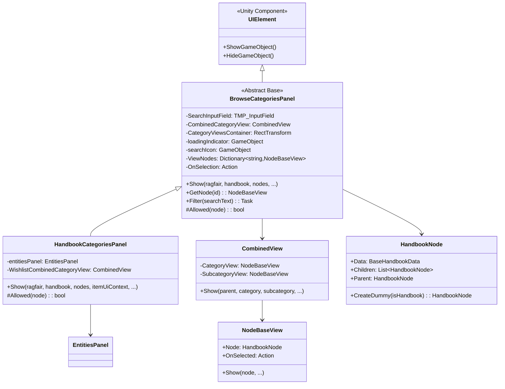
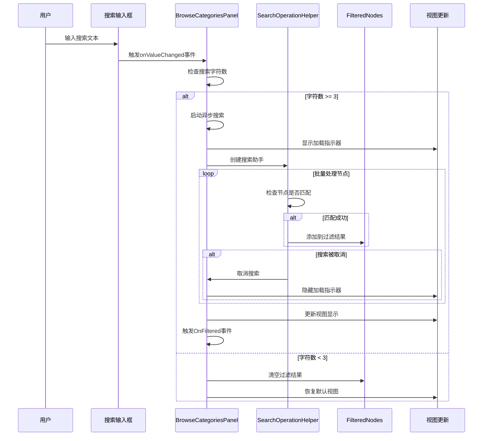
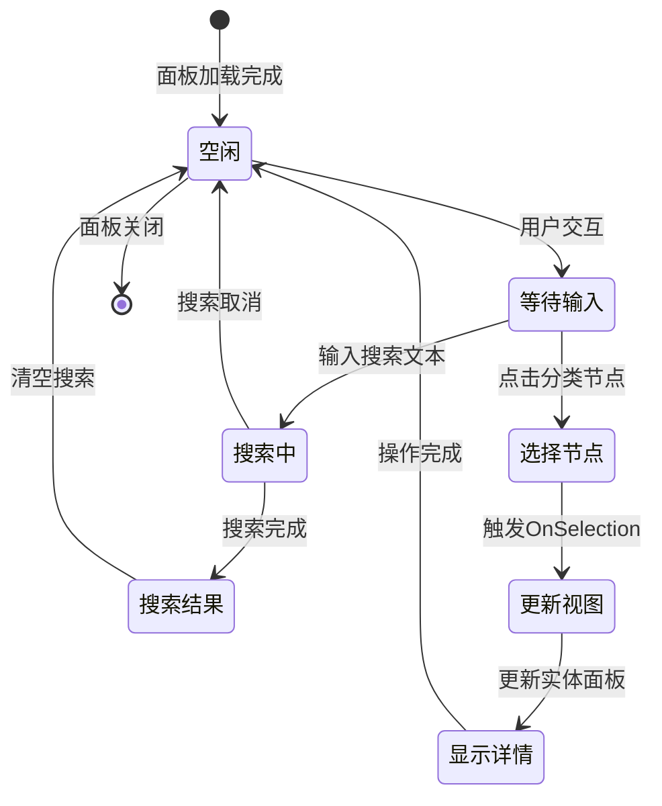

市场与分类浏览面板是UnityTarkov项目中的核心UI组件，负责提供物品分类浏览、搜索过滤和节点选择等功能。该系统采用分层架构设计，通过基类和子类的继承关系实现不同场景下的分类浏览需求，为玩家提供高效的物品查找和管理体验。

## 系统架构概览

分类浏览面板系统采用模块化设计，通过抽象基类 `BrowseCategoriesPanel` 提供核心功能，再通过 `HandbookCategoriesPanel` 等子类实现特定场景的定制化需求。这种设计确保了代码的复用性和可扩展性，同时保持了各模块间的职责清晰。



## 核心组件详解

### BrowseCategoriesPanel 基类

`BrowseCategoriesPanel` 是整个分类浏览系统的基础抽象类，提供了分类浏览的核心功能框架。该类封装了搜索、过滤、节点管理、视图生成等通用功能，为子类提供了扩展点。

#### 关键内部类

**NodeFinder** - 节点查找助手类，负责在分类树结构中高效查找指定ID的节点：

```csharp
private sealed class NodeFinder
{
    public string targetId;

    internal bool ContainsTargetNode(NodeBaseView nodeView)
    {
        // 展平子节点树并检查是否包含目标ID
        return nodeView.Node.Children.Flatten((HandbookNode y) => y.Children)
            .Any(HasMatchingId);
    }

    internal bool HasMatchingId(HandbookNode childNode)
    {
        return childNode.Data.Id == targetId;
    }
}
```

**SearchOperationHelper** - 搜索操作助手类，管理异步搜索过程中的状态和过滤逻辑：

```csharp
private sealed class SearchOperationHelper
{
    public BrowseCategoriesPanel parentPanel;
    public bool searchCanceled;
    public string searchValue;

    internal void CancelSearch()
    {
        parentPanel.OnSearchCanceled -= CancelSearch;
        searchCanceled = true;
        parentPanel.isSearchInProgress = false;
        parentPanel.SetLoadingStatus(status: false);
    }

    internal bool MatchesSearchCriteria(HandbookNode node)
    {
        if (parentPanel.Allowed(node))
        {
            return node.Data.Name.Localized()
                .IndexOf(searchValue, StringComparison.OrdinalIgnoreCase) >= 0;
        }
        return false;
    }
}
```

Sources: [Assembly-CSharp/EFT/UI/BrowseCategoriesPanel.cs](Assembly-CSharp/EFT/UI/BrowseCategoriesPanel.cs#L15-L75)

#### 核心字段与属性

| 字段名称 | 类型 | 访问级别 | 用途说明 |
|---------|------|---------|---------|
| SearchInputField | TMP_InputField | protected | 搜索输入框，用于接收用户输入的搜索关键词 |
| CombinedCategoryView | CombinedView | protected | 组合分类视图，用于显示分类和子分类的层级结构 |
| CategoryViewsContainer | RectTransform | protected | 分类视图容器，管理所有分类视图的布局 |
| loadingIndicator | GameObject | private | 加载指示器，显示异步操作的加载状态 |
| searchIcon | GameObject | private | 搜索图标，提供视觉反馈 |
| ViewNodes | Dictionary<string, NodeBaseView> | protected | 节点视图字典，维护ID到视图的映射关系 |
| FilteredNodes | _EFE2 | protected | 过滤后的节点集合，存储符合当前过滤条件的节点 |
| OnSelection | Action<NodeBaseView, string> | protected | 节点选择回调，处理用户选择节点时的响应逻辑 |

Sources: [Assembly-CSharp/EFT/UI/BrowseCategoriesPanel.cs](Assembly-CSharp/EFT/UI/BrowseCategoriesPanel.cs#L105-L215)

#### 核心方法实现

**Show方法** - 面板初始化与显示的核心方法：

```csharp
protected void Show(_F128 ragfair, HandbookManager handbook, _EFE2 nodes, 
                    _EFE2 filteredNodes, [CanBeNull] SimpleContextMenu contextMenu, 
                    EViewListType viewListType, EWindowType windowType, 
                    Action<NodeBaseView, string> onSelection)
{
    Ragfair = ragfair;
    Handbook = handbook;
    AllNodes = nodes;
    FilteredNodes = filteredNodes;
    ContextMenu = contextMenu;
    ViewListType = viewListType;
    WindowType = windowType;
    OnSelection = onSelection;
    
    if (loadingIndicator != null)
    {
        loadingIndicator.SetActive(false);
    }
    
    ShowGameObject();
}
```

**GetNode方法** - 获取指定ID的节点视图，支持递归查找：

```csharp
[CanBeNull]
protected NodeBaseView GetNode(string id)
{
    if (!ViewNodes.TryGetValue(id, out var nodeView) || !nodeView.gameObject.activeSelf)
    {
        return FindNodeRecursively(id, ViewNodes.Values);
    }
    return nodeView;
}
```

Sources: [Assembly-CSharp/EFT/UI/BrowseCategoriesPanel.cs](Assembly-CSharp/EFT/UI/BrowseCategoriesPanel.cs#L260-L320)

### HandbookCategoriesPanel 子类

`HandbookCategoriesPanel` 继承自 `BrowseCategoriesPanel`，专门为手册系统提供定制化的分类浏览功能。该类添加了任务物品处理、心愿单支持、实体面板集成等手册特有的功能。

#### 扩展组件

| 组件名称 | 类型 | 用途说明 |
|---------|------|---------|
| entitiesPanel | EntitiesPanel | 实体面板，用于显示物品的详细信息和预览 |
| WishlistCombinedCategoryView | CombinedView | 心愿单专用组合视图，特殊处理心愿单分类的显示 |

Sources: [Assembly-CSharp/EFT/HandBook/HandbookCategoriesPanel.cs](Assembly-CSharp/EFT/HandBook/HandbookCategoriesPanel.cs#L95-L115)

#### HandbookViewInitializer 内部类

手册视图初始化助手类，封装了手册特有的视图初始化逻辑：

```csharp
private sealed class HandbookViewInitializer
{
    public HandbookCategoriesPanel parentPanel;
    public List<MongoID> questItemIds;

    internal CombinedView GetAppropriateView(HandbookNode node)
    {
        // 特殊处理心愿单分类
        if (node.Id == StringDecryptor.Decrypt(300343) || 
            (node.Parent != null && node.Parent.Id == StringDecryptor.Decrypt(300343)))
        {
            return parentPanel.WishlistCombinedCategoryView;
        }
        return parentPanel.CombinedCategoryView;
    }

    internal void InitializeViewItem(HandbookNode item, CombinedView view)
    {
        if (item.Data.Type == ENodeType.Category)
        {
            // 为任务分类设置子项数量
            if (item.Data.Id == StringDecryptor.Decrypt(300286))
            {
                item.SetChildrenCount(item.Children.Count(IsQuestItem));
            }
            
            var combinedView = GetAppropriateView(item);
            view.Show(parentPanel.Ragfair, combinedView.CategoryView, 
                     combinedView.SubcategoryView, item, EViewListType.Handbook, 
                     EWindowType.Handbook, parentPanel.ViewNodes, 
                     string.Empty, HandleNodeSelection);
            parentPanel.ViewNodes.Add(item.Data.Id, view.SelectedView);
        }
        else
        {
            parentPanel.entitiesPanel.AddToFilteredList(item);
        }
    }

    internal bool IsQuestItem(HandbookNode node)
    {
        return questItemIds.Contains(node.Data.Item.TemplateId);
    }
}
```

Sources: [Assembly-CSharp/EFT/HandBook/HandbookCategoriesPanel.cs](Assembly-CSharp/EFT/HandBook/HandbookCategoriesPanel.cs#L15-L145)

## 数据流程与交互

### 搜索与过滤流程

分类浏览面板的搜索功能采用异步处理机制，确保用户界面在搜索过程中保持响应性。搜索流程包含多个阶段，每个阶段都有明确的责任分工。



### 节点选择流程

用户选择分类节点后，系统会触发一系列的响应操作，包括视图更新、回调执行和状态维护。



## 扩展点与自定义

### 虚方法扩展

`BrowseCategoriesPanel` 提供了多个虚方法供子类重写，实现特定场景的定制化需求：

| 方法名 | 默认行为 | 扩展用途 |
|--------|---------|---------|
| FilterString | 返回空字符串 | 提供自定义过滤条件逻辑 |
| DisplayLoadingStatus | 返回false | 控制加载状态的显示行为 |
| Allowed(node) | 返回true | 定义节点可见性判断规则 |

Sources: [Assembly-CSharp/EFT/UI/BrowseCategoriesPanel.cs](Assembly-CSharp/EFT/UI/BrowseCategoriesPanel.cs#L220-L250)

### 事件系统

分类浏览面板通过事件机制实现松耦合的组件间通信：

```csharp
// 搜索取消事件 - 当搜索操作被取消时触发
private event Action OnSearchCanceled;

// 过滤完成事件 - 当过滤操作完成时触发
public event Action OnFiltered;

// 节点选择回调 - 处理用户选择节点的响应
protected Action<NodeBaseView, string> OnSelection;
```

Sources: [Assembly-CSharp/EFT/UI/BrowseCategoriesPanel.cs](Assembly-CSharp/EFT/UI/BrowseCategoriesPanel.cs#L240-L255)

## 性能优化策略

分类浏览面板系统在设计时充分考虑了性能问题，采用了多种优化策略确保在大数据量下的流畅运行：

### 异步批处理

搜索操作采用异步批处理机制，避免阻塞主线程。系统将节点处理任务分解为多个小批次，每批处理固定数量的节点：

```csharp
private const int MAX_NODES_PER_BATCH = 10;
private const float SEARCH_DELAY_SECONDS = 1f;
private const int MIN_SEARCH_LENGTH = 3;
```

Sources: [Assembly-CSharp/EFT/UI/BrowseCategoriesPanel.cs](Assembly-CSharp/EFT/UI/BrowseCategoriesPanel.cs#L85-L95)

### 视图缓存

通过 `ViewNodes` 字典维护节点ID到视图的映射关系，避免重复创建和销毁视图对象，提升内存使用效率。

### 懒加载策略

节点视图采用懒加载策略，只有当节点需要显示时才创建对应的视图对象，减少初始化时的性能开销。

## 相关组件集成

分类浏览面板系统与项目中的其他核心组件紧密集成，共同构建完整的物品管理功能：

| 集成组件 | 集成方式 | 交互内容 |
|---------|---------|---------|
| Ragfair系统 | 依赖注入 | 获取市场数据、价格信息 |
| HandbookManager | 依赖注入 | 访问手册数据、分类结构 |
| ItemUiContext | 参数传递 | 提供物品UI上下文信息 |
| EntitiesPanel | 组合使用 | 显示物品详细信息和预览 |

Sources: [Assembly-CSharp/EFT/UI/BrowseCategoriesPanel.cs](Assembly-CSharp/EFT/UI/BrowseCategoriesPanel.cs#L260-L280)
Sources: [Assembly-CSharp/EFT/HandBook/HandbookCategoriesPanel.cs](Assembly-CSharp/EFT/HandBook/HandbookCategoriesPanel.cs#L150-L195)

## 实际应用场景

分类浏览面板系统在UnityTarkov项目中有多个实际应用场景，每个场景都通过继承基类并重写特定方法来实现定制化需求：

### 手册系统

使用 `HandbookCategoriesPanel` 提供完整的物品手册浏览功能，支持任务物品标记、心愿单管理、分类树导航等特性。

### 市场系统

通过 `BrowseCategoriesPanel` 的其他子类实现市场物品浏览，支持价格排序、条件筛选、交易历史等功能。

### 交易系统

集成到交易界面中，为玩家提供方便的物品选择和浏览体验，支持拖放操作和快速交易。

## 总结

市场与分类浏览面板系统是UnityTarkov项目中设计精良的核心UI组件，通过抽象基类和具体子类的分层架构，实现了高度的代码复用和灵活的功能扩展。系统采用异步处理、视图缓存、懒加载等多种性能优化策略，确保在大数据量下的流畅运行。通过与Ragfair系统、手册管理器等核心组件的紧密集成，为玩家提供了高效、便捷的物品浏览和管理体验。

## 下一步学习

为了更深入地理解UI系统架构，建议继续阅读以下相关文档：

- [背包界面与物品视图](16-bei-bao-jie-mian-yu-wu-pin-shi-tu) - 了解物品视图的详细实现
- [交易系统UI](17-jiao-yi-xi-tong-ui) - 探索交易相关的UI组件设计
- [拖放系统实现](15-tuo-fang-xi-tong-shi-xian) - 学习物品拖放交互的实现机制