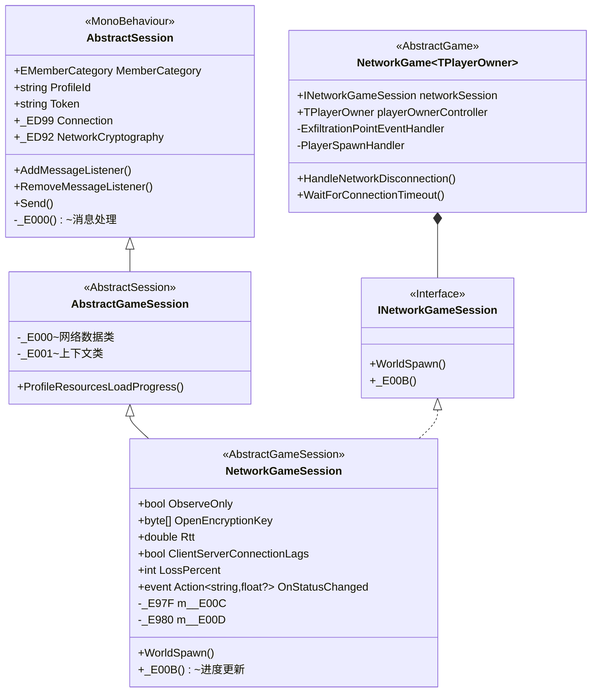
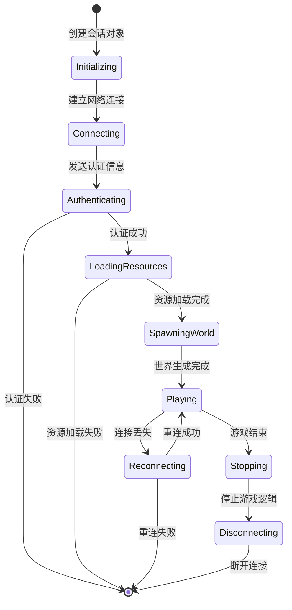

本页面深入解析Unity Tarkov项目的网络会话管理架构，涵盖从底层网络通信到高层游戏会话管理的完整技术栈。作为网络多人游戏的核心基础设施，会话管理系统负责协调客户端-服务器通信、玩家状态同步、资源加载、连接维护等关键功能。

## 架构概览

网络会话管理采用分层架构设计，从底层的网络传输抽象到高层的游戏会话逻辑，每一层都专注于特定职责。架构的核心思想是通过抽象基类定义统一接口，具体实现类处理特定场景下的网络交互需求。

**核心类层次结构**：`AbstractSession`作为所有会话的基类，提供基础的网络消息处理能力，包括消息监听器注册、加密通信、消息发送等功能。`AbstractGameSession`继承自`AbstractSession`，增加了游戏特定的功能，如资源加载进度跟踪、压缩数据传输等。`NetworkGameSession`是具体实现，负责客户端-服务器网络会话的完整生命周期管理，包括反作弊集成、BattlEye通信、资源预加载等。[Sources: Assembly-CSharp/EFT/AbstractSession.cs](Assembly-CSharp/EFT/AbstractSession.cs#L1-L239), [Assembly-CSharp/EFT/AbstractGameSession.cs](Assembly-CSharp/EFT/AbstractGameSession.cs#L1-L100), [Assembly-CSharp/EFT/NetworkGameSession.cs](Assembly-CSharp/EFT/NetworkGameSession.cs#L1-L100)

网络会话架构与游戏循环的交互通过自定义PlayerLoop系统实现，确保网络更新与Unity的渲染和物理循环协调运行。`NetworkGame<TPlayerOwner>`类作为网络游戏的主控制器，管理整个游戏世界和玩家集合，实现`INetworkGameSession`接口提供的会话管理功能。

**网络通道类型**：系统支持两种网络通道模式——可靠通道和不可靠通道。可靠通道确保消息按顺序到达且不丢失，适用于关键游戏状态更新；不可靠通道则允许消息丢失但优先保证低延迟，适用于实时性要求高的数据如位置同步。通道类型通过`NetworkChannel`枚举定义，在发送消息时可以指定使用哪种通道。[Sources: Assembly-CSharp/EFT/Network/NetworkChannel.cs](Assembly-CSharp/EFT/Network/NetworkChannel.cs#L1-L10)

**连接配置系统**：`HostTopology`和`ConnectionConfig`类提供了细粒度的网络连接参数配置，包括数据包大小、重传超时、断开连接超时、Ping超时等关键参数。这些配置直接影响网络通信的稳定性和性能，可以根据不同网络环境进行优化调整。系统支持默认连接配置和特殊连接配置两种模式，满足不同场景的需求。[Sources: Assembly-CSharp/EFT/ConnectionConfig.cs](Assembly-CSharp/EFT/ConnectionConfig.cs#L1-L50), [Assembly-CSharp/EFT/HostTopology.cs](Assembly-CSharp/EFT/HostTopology.cs#L1-L50)

## 核心组件分析

### 消息类型系统

网络通信的核心是消息类型系统，通过`NetworkMessageType`枚举定义了80多种不同的消息类型，覆盖从连接管理到游戏状态同步的各个方面。消息类型分为几个主要类别：RPC类消息用于远程过程调用，如游戏启动、停止、重启等；命令类消息用于客户端向服务器发送指令，如生成、重生、断开连接等；状态同步类消息用于传输游戏世界和玩家的状态快照；日志和调试类消息用于错误追踪和性能监控。[Sources: Assembly-CSharp/EFT/NetworkMessageType.cs](Assembly-CSharp/EFT/NetworkMessageType.cs#L1-L85)

| 消息类型分类 | 消息ID范围 | 用途 | 典型消息 |
|------------|-----------|------|----------|
| 连接管理 | 1-5 | 建立和断开连接 | Connect, Disconnect |
| RPC消息 | 32-61 | 服务器到客户端的远程调用 | MsgTypeRpcGameSpawned, MsgTypeRpcGameStarted |
| 命令消息 | 62-80 | 客户端到服务器的命令 | MsgTypeCmdSpawn, MsgTypeCmdStartGame |
| 资源消息 | 81-85 | 资源加载进度通知 | MsgTypeResources, MsgTypeProgress |
| 游戏世界消息 | 86-90 | 游戏对象生成和同步 | MsgWorldSpawn, MsgPlayerSpawn |
| 观察者消息 | 93-96 | 远程玩家状态同步 | MessageTypeSpawnObservedPlayers, MessageTypeSnapshotObservedPlayers |
| 调试消息 | 97-102 | 性能监控和错误追踪 | MessageTypeFramerate, MsgTypeTraceError |

消息监听器机制采用字典存储，以消息类型ID为键，以回调委托为值。当收到网络消息时，系统会根据消息类型查找对应的监听器并执行回调。监听器支持多种重载形式，可以接收原始字节数组、带计数的字节数组或完整的消息对象，满足不同场景下的处理需求。所有消息在发送前都会通过`NetworkCryptography`进行加密，接收后自动解密，保证通信安全。[Sources: Assembly-CSharp/EFT/AbstractSession.cs](Assembly-CSharp/EFT/AbstractSession.cs#L130-L239)

### 加密通信系统

网络安全是网络游戏会话管理的核心关注点，系统通过`NetworkCryptography`接口和`_ED93`实现类提供加密通信功能。加密机制在`NetworkGameSession`初始化时配置，使用服务器提供的密钥和向量进行AES加密。系统支持两种加密密钥：公开加密密钥用于常规通信，长度可配置；私有加密密钥用于敏感数据传输。[Sources: Assembly-CSharp/EFT/NetworkGameSession.cs](Assembly-CSharp/EFT/NetworkGameSession.cs#L400-L500)

消息加密流程采用对称加密算法，发送时通过`Encrypt`方法将原始数据转换为加密字节数组，接收时通过`Decrypt`方法还原。加密过程是透明的，上层应用无需关心加密细节，只需调用`Send`方法发送消息即可。这种设计既保证了安全性，又简化了使用复杂度。加密后的数据通过`_ED99 Connection`对象发送到网络层，连接对象负责底层的网络传输和可靠性保证。[Sources: Assembly-CSharp/EFT/AbstractSession.cs](Assembly-CSharp/EFT/AbstractSession.cs#L130-L239)

### 反作弊集成

网络会话管理系统集成了BattlEye反作弊系统，通过`IBattlEyeClientRequestHandler`接口处理反作弊相关请求。反作弊系统在会话初始化时启动，通过专用通道与反作弊服务器通信，定期发送客户端状态数据并接收服务器的验证指令。系统支持设置反作弊参数，如数据包大小、缓冲区大小等，可以根据游戏需求进行调整。[Sources: Assembly-CSharp/EFT/NetworkGameSession.cs](Assembly-CSharp/EFT/NetworkGameSession.cs#L1-L100)

反作弊集成还包括静态数据缓存功能，通过`SClientWrapper.CacheStaticData()`和`BEClient.CacheStaticData()`方法缓存反作弊系统的静态配置，减少运行时的性能开销。这种静态数据缓存机制在会话初始化完成后执行，确保反作弊系统在游戏运行期间的高效性。

## 会话生命周期

网络会话的生命周期从玩家发起连接请求开始，到游戏结束并断开连接为止，经历多个阶段。每个阶段都有明确的状态转换和相应的处理逻辑，确保会话状态的可靠性和一致性。

**初始化阶段**：会话通过`CreateSession`静态工厂方法创建，该方法会实例化GameObject并添加相应的会话组件。创建时需要提供父Transform、会话名称、玩家ProfileID和认证Token等关键参数。会话初始化后会设置基本的属性，如成员类别、连接对象、加密对象等，为后续的网络通信做好准备。[Sources: Assembly-CSharp/EFT/AbstractSession.cs](Assembly-CSharp/EFT/AbstractSession.cs#L130-L239)

**连接与认证阶段**：客户端通过网络连接对象连接到服务器，连接配置决定了连接超时、重传超时、Ping超时等关键参数。认证过程涉及Token验证、加密密钥交换等安全步骤，只有认证通过的客户端才能进入游戏阶段。系统支持配置最大连接尝试次数，在连接失败时会自动重试，超过次数后则报告连接错误。[Sources: Assembly-CSharp/EFT/ConnectionConfig.cs](Assembly-CSharp/EFT/ConnectionConfig.cs#L1-L50), [Assembly-CSharp/EFT/NetworkGameSession.cs](Assembly-CSharp/EFT/NetworkGameSession.cs#L300-L400)

**资源加载阶段**：认证成功后，客户端开始加载游戏资源，包括预制体、自定义物品、天气数据等。资源数据经过压缩传输，使用SimpleZlib进行解压缩。加载过程通过`LoadProfileResources`方法异步执行，在后台线程解析资源数据并创建对象池。系统会定期报告加载进度，通过`OnStatusChanged`事件通知UI层更新进度显示。[Sources: Assembly-CSharp/EFT/NetworkGameSession.cs](Assembly-CSharp/EFT/NetworkGameSession.cs#L200-L300)

**世界生成阶段**：资源加载完成后，调用`WorldSpawn`方法生成游戏世界。这是一个异步操作，会等待服务器确认世界生成完成。生成过程包括创建游戏对象、初始化物理系统、设置天气和时间等环境参数。世界生成完成后，会触发`_E01D`方法进行后续的初始化工作。[Sources: Assembly-CSharp/EFT/NetworkGameSession.cs](Assembly-CSharp/EFT/NetworkGameSession.cs#L100-L200)

**游戏运行阶段**：玩家进入游戏世界后，会话进入稳定运行状态。此时网络通信专注于游戏状态同步，包括玩家位置、动作、射击结果等实时数据。系统通过RTT（往返时间）和丢包率监控网络质量，当检测到连接延迟时会设置`ClientServerConnectionLags`标志，提示UI层显示连接警告。网络质量统计数据使用滑动窗口算法进行平滑处理，避免瞬时波动影响判断。[Sources: Assembly-CSharp/EFT/NetworkGameSession.cs](Assembly-CSharp/EFT/NetworkGameSession.cs#L400-L500)

**停止与断开阶段**：游戏结束时，系统会启动断开连接流程。`HandleNetworkDisconnection`协程会等待网络连接关闭，如果连接在一定时间内没有关闭，则主动关闭连接。断开连接时可以指定断开原因，区分正常断开和错误断开。系统还支持超时处理机制，防止断开流程无限期阻塞。[Sources: Assembly-CSharp/EFT/NetworkGame.cs](Assembly-CSharp/EFT/NetworkGame.cs#L100-L299)

## 网络通信机制

### 消息发送流程

消息发送采用统一的接口设计，支持多种数据格式的消息。`Send`方法提供多个重载版本，可以发送空消息、序列化消息、字节数组段或原始字节数组。所有发送操作都会经过相同的处理流程：加密、通道选择、底层传输。加密通过`NetworkCryptography.Encrypt`方法完成，返回加密后的`ArraySegment<byte>`，包含加密数据及其偏移量和长度。[Sources: Assembly-CSharp/EFT/AbstractSession.cs](Assembly-CSharp/EFT/AbstractSession.cs#L130-L239)

通道选择是发送流程的关键决策点。可靠通道使用TCP或UDP的可靠传输机制，确保消息按顺序到达且不丢失，适用于关键的游戏状态更新。不可靠通道使用UDP的不可靠传输，允许消息丢失但优先保证低延迟，适用于实时性要求高的数据如位置同步。通道类型在发送时作为参数指定，系统会根据通道类型选择相应的传输策略。[Sources: Assembly-CSharp/EFT/Network/NetworkChannel.cs](Assembly-CSharp/EFT/Network/NetworkChannel.cs#L1-L10)

### 消息接收流程

消息接收通过监听器模式实现。客户端在会话初始化时注册各种消息类型的监听器，监听器可以是简单的Action、带参数的Action或完整的消息处理器。当底层网络层收到消息时，会触发`_E000`私有方法，该方法根据消息类型查找对应的监听器并执行回调。消息在传递给监听器之前会自动解密，保证安全性。[Sources: Assembly-CSharp/EFT/AbstractSession.cs](Assembly-CSharp/EFT/AbstractSession.cs#L130-L239)

监听器注册使用字典存储，键是消息类型的short值，值是回调委托。系统防止重复注册同一消息类型的监听器，注册时会检查字典中是否已存在该键，如果存在则抛出异常。这种设计确保了消息处理的唯一性和可预测性。监听器移除操作同样需要指定消息类型，系统会验证监听器的存在性，防止误删不存在的监听器。[Sources: Assembly-CSharp/EFT/AbstractSession.cs](Assembly-CSharp/EFT/AbstractSession.cs#L130-L239)

### 网络质量监控

系统持续监控网络连接质量，通过RTT和丢包率两个核心指标评估网络状态。RTT通过测量消息往返时间计算，单位为毫秒。系统使用`_E3E2`和`_E3BC`两个统计类对RTT数据进行滑动窗口平滑处理，窗口大小分别为20和60个样本，避免瞬时波动影响判断。平滑后的RTT数据用于判断是否存在网络延迟，当延迟超过阈值时设置`ClientServerConnectionLags`标志。[Sources: Assembly-CSharp/EFT/NetworkGameSession.cs](Assembly-CSharp/EFT/NetworkGameSession.cs#L400-L500)

丢包率通过统计未确认的消息数量计算，以百分比形式表示。系统维护一个丢包计数器，定期更新并计算丢包率。网络质量数据不仅用于UI显示，还会影响游戏逻辑，如根据网络延迟调整预测算法的参数，根据丢包率调整消息重传策略等。这种自适应机制确保了不同网络条件下游戏的稳定性和响应性。[Sources: Assembly-CSharp/EFT/NetworkGameSession.cs](Assembly-CSharp/EFT/NetworkGameSession.cs#L400-L500)

## 数据同步与序列化

### 序列化机制

网络通信中的数据序列化通过`_ED96`接口和`_E5E0/_E5E5`读写器实现。所有需要通过网络传输的数据结构都实现`_ED96`接口，提供`Serialize`和`Deserialize`方法。序列化时使用`_E5E5`写入器，支持基本数据类型、字节数组、字符串等的写入；反序列化时使用`_E5E0`读取器，提供对应的读取方法。这种设计保证了序列化和反序列化的对称性和可靠性。[Sources: Assembly-CSharp/EFT/AbstractGameSession.cs](Assembly-CSharp/EFT/AbstractGameSession.cs#L1-L100)

复杂对象的序列化通常采用嵌套结构，将大对象分解为多个小对象分别序列化。例如，`_E000`类包含字符串、布尔值、字节数组等多个字段，序列化时依次写入每个字段，反序列化时按相同顺序读取。对于数组或集合类型，先写入元素数量，再逐个写入元素。这种标准化序列化模式确保了跨平台和跨语言的兼容性。[Sources: Assembly-CSharp/EFT/AbstractGameSession.cs](Assembly-CSharp/EFT/AbstractGameSession.cs#L1-L100)

### 压缩传输

为了减少网络带宽占用，大型数据在传输前会进行压缩。系统使用ComponentAce.Compression.Libs.zlib库进行压缩，提供`SimpleZlib.CompressToBytes`和`SimpleZlib.Decompress`方法。压缩级别可以配置，系统通常使用最高压缩级别（级别9）来最大化压缩率。压缩后的数据以字节数组形式传输，接收端解压缩后再进行反序列化。[Sources: Assembly-CSharp/EFT/NetworkGameSession.cs](Assembly-CSharp/EFT/NetworkGameSession.cs#L200-L300)

资源数据的压缩传输是典型应用场景。服务器发送的资源数据包括预制体列表和自定义物品列表，这些数据经过JSON序列化后使用Zlib压缩，压缩后的数据通过`MsgTypeResources`消息发送。客户端接收后先解压缩，再使用`ParseJsonTo`方法解析为对象数组。压缩传输可以显著减少网络带宽消耗，提高加载速度。[Sources: Assembly-CSharp/EFT/NetworkGameSession.cs](Assembly-CSharp/EFT/NetworkGameSession.cs#L300-L400)

### 状态同步策略

游戏状态同步采用多种策略相结合的方式，根据数据的重要性和实时性选择合适的同步机制。关键游戏状态如玩家生命值、物品状态等使用可靠通道同步，确保数据准确无误。实时性要求高的数据如玩家位置、朝向等使用不可靠通道同步，优先保证低延迟。系统还支持增量同步和全量同步两种模式，根据变化量自动选择最优策略。[Sources: Assembly-CSharp/EFT/NetworkMessageType.cs](Assembly-CSharp/EFT/NetworkMessageType.cs#L1-L85)

观察者玩家（远程玩家）的状态同步通过专门的观察者系统实现。系统定义了多种观察者消息类型，如`MessageTypeSpawnObservedPlayers`用于生成观察者，`MessageTypeSnapshotObservedPlayers`用于发送状态快照，`MessageTypeCommandsObservedPlayers`用于发送操作命令。这种设计将远程玩家与本地玩家的同步逻辑分离，提高了代码的可维护性和扩展性。[Sources: Assembly-CSharp/EFT/NetworkMessageType.cs](Assembly-CSharp/EFT/NetworkMessageType.cs#L1-L85)

## 错误处理与重连

### 连接错误处理

网络连接错误是不可避免的，系统提供了完善的错误处理机制。连接配置中定义了多种超时参数，如连接超时、断开超时、重传超时等，当操作超过指定时间未完成时视为失败。系统还定义了网络丢包阈值和溢出丢弃阈值，当丢包率或缓冲区溢出超过阈值时会触发断开连接操作。这些参数可以根据网络环境进行调整，平衡连接稳定性和响应速度。[Sources: Assembly-CSharp/EFT/ConnectionConfig.cs](Assembly-CSharp/EFT/ConnectionConfig.cs#L1-L50)

断开连接时可以指定断开原因，通过`SystemReasonDisconnection`枚举定义。系统区分正常断开和错误断开，正常断开如玩家主动退出游戏，错误断开如网络超时、认证失败等。断开原因会记录到日志中，便于问题诊断和统计分析。客户端在断开连接后会清理相关资源，如取消事件订阅、释放网络连接、销毁游戏对象等，确保系统状态的一致性。[Sources: Assembly-CSharp/EFT/NetworkGame.cs](Assembly-CSharp/EFT/NetworkGame.cs#L100-L299)

### 重连机制

当检测到连接丢失时，系统会尝试重新连接。重连过程由`HandleNetworkDisconnection`协程管理，首先等待现有连接完全关闭，然后尝试建立新的连接。重连的等待时间和尝试次数是可配置的，系统会根据网络状况动态调整重连策略。重连成功后，客户端需要重新进行认证和资源加载，恢复到断开前的游戏状态。[Sources: Assembly-CSharp/EFT/NetworkGame.cs](Assembly-CSharp/EFT/NetworkGame.cs#L100-L299)

重连机制与游戏状态恢复紧密相关。由于网络断开期间游戏世界仍在继续，客户端重连后需要同步丢失的状态变化。系统通过状态快照和增量更新相结合的方式恢复游戏状态。关键状态如玩家生命值、物品状态等通过服务器权威确认，确保恢复后的状态准确性。实时状态如玩家位置则通过插值算法平滑过渡，避免状态跳变。[Sources: Assembly-CSharp/EFT/NetworkMessageType.cs](Assembly-CSharp/EFT/NetworkMessageType.cs#L1-L85)

### 错误日志与追踪

系统提供了完善的错误日志和追踪功能，通过`MsgTypeTrace`、`MsgTypeTraceError`等消息类型记录运行时错误和异常。日志消息支持附加上下文信息，如时间戳、玩家ID、错误代码等，便于问题定位。日志级别通过`ENetLogsLevel`枚举控制，可以在运行时动态调整，平衡调试需求和性能开销。[Sources: Assembly-CSharp/EFT/NetworkMessageType.cs](Assembly-CSharp/EFT/NetworkMessageType.cs#L1-L85)

追踪系统还支持性能监控，通过`MessageTypeFramerate`消息定期上报客户端帧率，服务器可以据此判断客户端性能状况。性能数据与网络质量数据结合分析，可以识别性能瓶颈是客户端还是网络端导致的，为优化提供数据支持。追踪数据还可以用于反作弊分析，异常的帧率或网络行为可能暗示作弊行为。[Sources: Assembly-CSharp/EFT/NetworkMessageType.cs](Assembly-CSharp/EFT/NetworkMessageType.cs#L1-L85)

## 性能优化策略

网络会话管理系统在多个层面实现了性能优化，确保在大规模多人游戏场景下的稳定运行。

**对象池技术**：资源加载过程中使用对象池技术减少运行时分配开销。系统通过`AssetPoolManager`管理预制体和资源的对象池，根据资源类型和加载阶段创建不同的池。池的创建和填充是异步的，在后台线程执行，避免阻塞主线程。对象池的生命周期与会话绑定，会话结束时自动清理，防止内存泄漏。[Sources: Assembly-CSharp/EFT/NetworkGameSession.cs](Assembly-CSharp/EFT/NetworkGameSession.cs#L200-L300)

**异步操作**：网络会话管理大量使用异步操作，避免阻塞主线程。资源加载、网络通信、游戏对象生成等耗时操作都通过async/await模式实现，在后台线程执行。异步操作的进度通过`IProgress<T>`接口回调，定期更新UI显示。这种设计确保了游戏循环的流畅性，即使在高延迟或低性能网络环境下也能保持可接受的帧率。[Sources: Assembly-CSharp/EFT/NetworkGameSession.cs](Assembly-CSharp/EFT/NetworkGameSession.cs#L200-L300)

**消息批处理**：为了减少网络往返次数，系统支持消息批处理。多个小消息可以打包成一个大数据包发送，接收端再拆分处理。批处理特别适用于状态同步场景，如同时更新多个玩家的位置状态。批处理的大小和频率是可配置的，需要权衡延迟和带宽的权衡。批处理还可以结合压缩技术，进一步减少带宽占用。[Sources: Assembly-CSharp/EFT/AbstractSession.cs](Assembly-CSharp/EFT/AbstractSession.cs#L130-L239)

**增量更新**：状态同步采用增量更新策略，只传输发生变化的数据。系统维护上次同步的状态快照，与当前状态比较后只发送差异部分。增量更新显著减少了网络流量，特别是在状态变化不频繁的场景下。对于频繁变化的数据如位置，系统使用相对坐标或增量值，减少传输数据量。增量更新与全量更新结合使用，定期发送全量快照防止漂移累积。[Sources: Assembly-CSharp/EFT/NetworkMessageType.cs](Assembly-CSharp/EFT/NetworkMessageType.cs#L1-L85)

| 优化技术 | 应用场景 | 效果 | 实现方式 |
|---------|---------|------|----------|
| 对象池 | 资源加载、游戏对象创建 | 减少GC压力，提高性能 | AssetPoolManager，异步创建和填充 |
| 异步操作 | 资源加载、网络通信 | 避免阻塞主线程，保持流畅 | async/await，IProgress进度回调 |
| 消息批处理 | 状态同步、批量更新 | 减少网络往返，降低延迟 | 打包多个小消息，压缩传输 |
| 增量更新 | 玩家状态、游戏世界同步 | 减少网络流量，提高效率 | 状态比较，差异传输 |
| 压缩传输 | 大型数据传输 | 节省带宽，加快加载 | Zlib压缩，可配置压缩级别 |
| 滑动窗口统计 | 网络质量监控 | 平滑数据，避免波动 | _E3E2、_E3BC统计类 |

## 总结

网络会话管理是Unity Tarkov项目的核心基础设施，通过分层架构、异步操作、加密通信、状态同步等技术实现了稳定高效的网络多人游戏体验。系统的设计充分考虑到安全性、性能和可扩展性，为上层游戏逻辑提供了可靠的网络通信抽象。

通过理解网络会话管理的架构和实现，开发者可以更好地进行网络相关的开发和调试工作。下一页[客户端-服务器数据同步](20-ke-hu-duan-fu-wu-qi-shu-ju-tong-bu)将深入探讨数据同步的具体算法和实现细节，包括状态预测、插值、 reconciliation等高级技术。