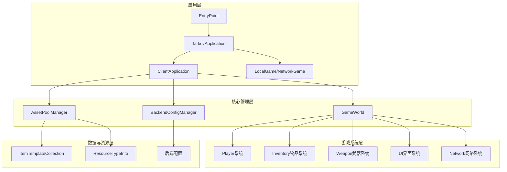
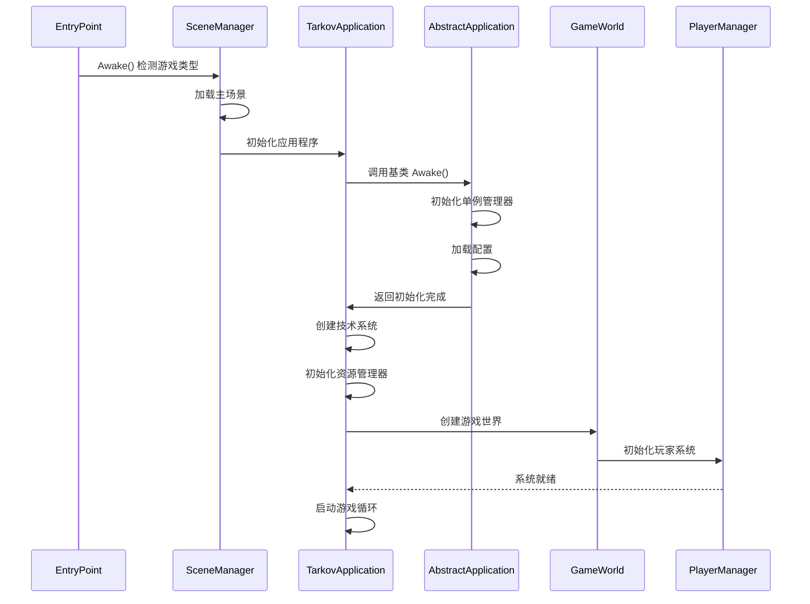

本文档将引导初学者开发者完成 Unity Tarkov 项目的环境搭建、配置和首次运行。通过本指南，您将了解项目的基本结构、核心系统架构以及如何开始进行开发工作。

## 项目概览

Unity Tarkov 是一个基于 Unity 引擎的战术射击游戏项目的反编译重构版本。该项目专注于将混淆的代码转换为可读、可维护的 C# 代码，同时保持原有功能的完整性。项目采用了模块化架构设计，包含完整的玩家系统、武器系统、UI 系统、网络同步等核心游戏功能。

## 技术架构概览



## 环境要求

### 必需软件

| 软件 | 版本要求 | 用途 |
|------|----------|------|
| Unity Editor | 2019.4.40f1 | 游戏开发引擎 |
| .NET Framework | 4.7.1 | 运行时环境 |
| Visual Studio | 2019 或更高版本 | C# 代码编辑和调试 |
| Git | 任意最新版本 | 版本控制 |

### 推荐配置

- **操作系统**: Windows 10/11 (64位)
- **内存**: 最少 16GB RAM，推荐 32GB
- **存储**: SSD 硬盘，至少 50GB 可用空间
- **GPU**: 支持 DirectX 11 的独立显卡

## 安装与配置步骤

### 1. 获取项目源码

项目源码位于 `C:\temp\TarkovUnity\UnityTarkov\UnityTarkov\ExportedProject\Assets\Scripts` 目录。确保您具有该目录的读写权限。

### 2. 打开 Unity 项目

- 启动 Unity Hub
- 点击 "Add" 按钮，选择项目路径
- 选择 Unity 版本 2019.4.40f1
- 等待项目索引完成（首次打开可能需要较长时间）

### 3. 配置开发环境

**安装 Visual Studio Tools for Unity**:

1. 打开 Visual Studio Installer
2. 修改 Visual Studio 安装
3. 勾选 "游戏开发 with Unity" 工作负载
4. 点击 "修改" 安装所需组件

**配置 Unity Editor 设置**:

- 打开 `Edit > Preferences > External Tools`
- 设置 External Script Editor 为 Visual Studio
- 确认 Unity 版本和 .NET Framework 版本匹配

### 4. 编译项目

在 Unity 编辑器中：
1. 打开 `File > Build Settings`
2. 确保平台设置为 "PC, Mac & Linux Standalone"
3. 点击 "Build" 或 "Build And Run"
4. 选择输出目录并开始构建

或在 Visual Studio 中：
1. 打开解决方案文件 `ExportedProject.sln`
2. 选择 Debug 或 Release 配置
3. 按 `Ctrl+Shift+B` 编译解决方案

## 项目结构说明

### 核心目录布局

```
Scripts/
├── Assembly-CSharp/          # 主要游戏代码程序集
│   ├── EFT/                  # EFT 核心命名空间
│   │   ├── Player.cs         # 玩家核心类
│   │   ├── GameWorld.cs      # 游戏世界管理器
│   │   ├── TarkovApplication.cs  # 应用程序主类
│   │   └── ...              # 其他核心系统
│   ├── Audio/                # 音频系统
│   ├── UI/                   # 用户界面系统
│   └── ...                   # 其他系统模块
├── AssetPoolManager.cs       # 资源池管理器
├── BackendConfigManager.cs   # 后端配置管理器
├── ItemTemplateCollection.cs # 物品模板集合
└── REFACTORING_MAPPING.md    # 代码重构映射文档
```

### 关键文件说明

| 文件/目录 | 功能描述 | 重要性 |
|-----------|----------|--------|
| `EntryPoint.cs` | 应用程序入口点，负责场景加载 | ⭐⭐⭐⭐⭐ |
| `TarkovApplication.cs` | 主应用程序类，管理生命周期 | ⭐⭐⭐⭐⭐ |
| `GameWorld.cs` | 游戏世界核心管理器 | ⭐⭐⭐⭐⭐ |
| `AssetPoolManager.cs` | 资源对象池管理器 | ⭐⭐⭐⭐ |
| `REFACTORING_MAPPING.md` | 代码重构映射文档 | ⭐⭐⭐⭐ |

Sources: [Assembly-CSharp/EFT/EntryPoint.cs](Assembly-CSharp/EFT/EntryPoint.cs#L1-L25)

## 应用启动流程

### 启动流程图



### 启动步骤详解

1. **入口点初始化** (`EntryPoint.cs`)
   - `Awake()` 方法检测游戏类型（EFT 或 Arena）
   - 根据类型加载对应的主场景

Sources: [Assembly-CSharp/EFT/EntryPoint.cs](Assembly-CSharp/EFT/EntryPoint.cs#L7-L22)

2. **应用程序初始化** (`TarkovApplication.cs` 继承自 `AbstractApplication.cs`)
   - 初始化日志系统
   - 加载应用程序配置
   - 创建作业调度器
   - 初始化异步工作器
   - 创建技术系统

Sources: [Assembly-CSharp/EFT/AbstractApplication.cs](Assembly-CSharp/EFT/AbstractApplication.cs#L18-L68)

3. **游戏世界创建** (`GameWorld.cs`)
   - 初始化玩家集合
   - 创建物品管理系统
   - 初始化物理和碰撞系统
   - 设置网络同步机制

Sources: [Assembly-CSharp/EFT/GameWorld.cs](Assembly-CSharp/EFT/GameWorld.cs#L24-L40)

## 核心系统介绍

### 1. 资源管理系统

**AssetPoolManager** 是单例模式实现的资源池管理器，负责：

- 武器、弹药、弹匣等游戏对象的池化管理
- 异步资源加载和释放
- 内存优化和性能提升

Sources: [AssetPoolManager.cs](AssetPoolManager.cs#L18-L30)

**ItemTemplateCollection** 管理所有物品模板：

- 物品模板的字典索引
- 资源路径到模板的映射
- 兼容性查找和父子关系管理

Sources: [ItemTemplateCollection.cs](ItemTemplateCollection.cs#L14-L35)

### 2. 配置管理系统

**BackendConfigManager** 提供后端配置管理：

- 后端 URL 配置
- 配置文件加载和解析
- 命令行参数合并
- Git 版本信息管理

Sources: [BackendConfigManager.cs](BackendConfigManager.cs#L22-L65)

### 3. 游戏世界管理

**GameWorld** 是游戏世界的核心管理器：

- 玩家生命周期管理
- 物品所有者和战利品系统
- 物理世界和碰撞检测
- 网络同步和状态管理

Sources: [Assembly-CSharp/EFT/GameWorld.cs](Assembly-CSharp/EFT/GameWorld.cs#L18-L40)

## 开发工作流程

### 代码重构规范

本项目采用系统化的代码重构方法，遵循以下原则：

#### 命名规范

| 元素类型 | 命名规则 | 示例 |
|----------|----------|------|
| 类名 | PascalCase | `PlayerController` |
| 方法名 | PascalCase | `GetPlayerState()` |
| 私有字段 | camelCase 或 `_camelCase` | `playerState`, `_playerId` |
| 常量 | UPPER_CASE | `MAX_PLAYERS` |
| 布尔属性 | Is/Has/Can 前缀 | `IsAlive`, `HasWeapon` |

#### 重构步骤

1. **分析阶段**: 理解原始代码的功能和逻辑
2. **映射阶段**: 创建混淆名称到清晰名称的映射表
3. **重构阶段**: 重组代码结构，提取方法，添加注释
4. **验证阶段**: 确保功能完全一致
5. **文档阶段**: 更新 `REFACTORING_MAPPING.md`

Sources: [REFACTORING_MAPPING.md](REFACTORING_MAPPING.md#L1-L30)

### 调试技巧

**Unity Editor 调试**:
- 使用 `Debug.Log()` 输出调试信息
- 利用 Unity Inspector 查看组件状态
- 使用 Unity Profiler 分析性能

**Visual Studio 调试**:
- 设置断点进行逐步调试
- 使用即时窗口查看变量值
- 利用调用堆栈追踪问题

## 常见问题解决

### 编译错误

**问题**: 找不到类型或命名空间
- **解决方案**: 检查 `using` 语句，确保引用了正确的程序集

**问题**: .NET Framework 版本不匹配
- **解决方案**: 在项目设置中将目标框架设置为 .NET Framework 4.7.1

### 运行时错误

**问题**: NullReferenceException
- **解决方案**: 检查对象是否正确初始化，添加 null 检查

**问题**: 资源加载失败
- **解决方案**: 确认资源路径正确，检查 Bundle 是否已正确加载

### 性能问题

**问题**: 帧率下降
- **解决方案**: 
  - 使用 Unity Profiler 识别性能瓶颈
  - 检查对象池使用是否合理
  - 优化绘制调用和批处理

## 下一步学习

完成环境搭建后，建议按照以下路径继续学习：

1. **[应用程序生命周期管理](6-ying-yong-cheng-xu-sheng-ming-zhou-qi-guan-li)** - 深入了解应用程序的启动、运行和关闭流程
2. **[游戏世界核心管理器](7-you-xi-shi-jie-he-xin-guan-li-qi)** - 学习 GameWorld 的内部机制
3. **[玩家核心类架构](8-wan-jia-he-xin-lei-jia-gou)** - 理解 Player 类的架构设计
4. **[反编译代码重构方法论](3-fan-bian-yi-dai-ma-zhong-gou-fang-fa-lun)** - 掌握代码重构的方法和技巧

通过系统学习这些核心模块，您将能够深入理解 Unity Tarkov 项目的架构设计，并具备进行二次开发的能力。