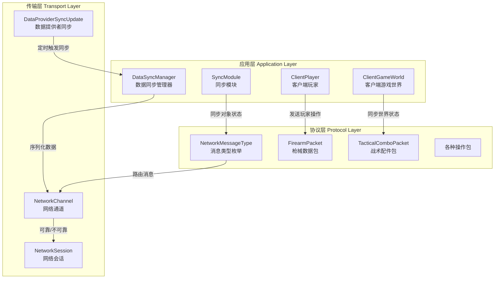
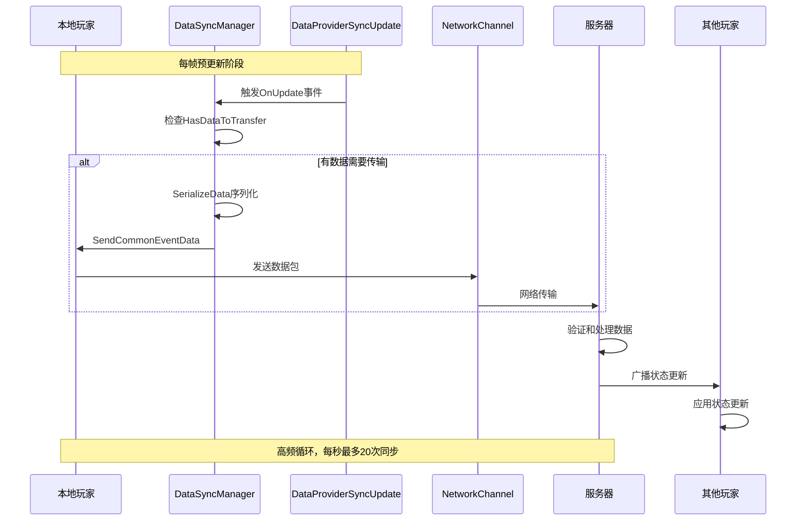

TarkovUnity的客户端-服务器数据同步系统构建在多层架构之上，通过精心设计的消息协议、同步模块和传输机制确保多人游戏环境下的数据一致性和实时性。该系统采用客户端预测与服务器验证相结合的混合模式，在保证游戏公平性的同时提供流畅的玩家体验。

## 架构概览

数据同步架构由三个核心层次组成：网络传输层、协议层和应用层。网络传输层负责底层的数据包传输，使用可靠和不可靠两种通道类型；协议层定义了各种消息类型和数据包结构；应用层通过同步模块和数据管理器协调各个游戏对象的同步状态。

系统采用事件驱动的同步机制，通过Unity的PlayerLoop系统在预更新阶段触发数据同步。`DataProviderSyncUpdate`系统作为同步调度的核心，定期触发所有订阅者的数据更新事件，确保数据传输的时序正确性。Sources: [DataProviderSyncUpdate.cs](Assembly-CSharp/CustomPlayerLoopSystem/DataProviderSyncUpdate.cs#L1-L44)

## 网络通道与消息类型

网络传输使用两种通道类型，根据数据的重要性和实时性要求选择合适的传输方式。可靠通道保证数据包的有序送达，适用于关键的游戏状态更新；不可靠通道提供更低的延迟，适合高频但容忍丢包的数据如位置更新。

| 通道类型 | 枚举值 | 使用场景 | 特点 |
|---------|--------|---------|------|
| Reliable | 1 | 库存操作、游戏状态切换、玩家出生 | 保证送达和顺序，可能有额外延迟 |
| Unreliable | 2 | 玩家位置、动画状态、快速移动 | 低延迟，容忍丢包，高频更新 |
| None | 0 | 未指定通道 | 保留值 |

消息类型通过`NetworkMessageType`枚举明确定义，涵盖了游戏的所有网络交互场景。从连接建立、游戏启动到玩家同步、世界状态更新，每种操作都有对应的标识码。Sources: [NetworkChannel.cs](Assembly-CSharp/EFT/Network/NetworkChannel.cs#L1-L10) [NetworkMessageType.cs](Assembly-CSharp/EFT/NetworkMessageType.cs#L1-L85)

核心消息类型包括：
- **游戏生命周期消息**：`Connect`、`Disconnect`、`MsgTypeRpcGameStarted`等，管理游戏的启动、停止和重启
- **玩家管理消息**：`MsgPlayerSpawn`、`MessageTypeSpawnObservedPlayers`、`MessageTypeSnapshotObservedPlayers`等，处理玩家的生成、快照和状态同步
- **世界同步消息**：`MsgWorldSpawn`、`MsgTypeWorldSynchronization`、`MsgTypePlayerSynchronization`等，同步游戏世界的整体状态
- **游戏数据消息**：`MsgTypeCreateCorpse`、`CommonEvent`、`MsgAnticheatPacket`等，传输游戏过程中的各种事件数据

## 数据同步管理器

`DataSyncManager`作为客户端数据同步的核心组件，负责管理数据序列化和网络传输的调度。它使用5000字节的缓冲区来序列化需要同步的数据，并通过关联的`ClientPlayer`实例将数据发送到服务器。Sources: [DataSyncManager.cs](Assembly-CSharp/EFT/DataSyncManager.cs#L1-L100)

同步管理器的初始化采用单例模式，确保全局只有一个活跃的数据同步实例。当初始化新的实例时，系统会先清理旧实例，防止资源泄漏和状态冲突。同步流程在`DataProviderSyncUpdate`系统的`OnUpdate`事件触发时执行，这是Unity PlayerLoop的预更新阶段，保证数据同步在其他游戏逻辑之前完成。

数据序列化过程通过`_F02C.Instance.HasDataToTransfer`检查是否有需要传输的数据。如果有数据，系统会调用`SerializeData`方法将状态序列化为字节数组，然后通过`clientPlayer.SendCommonEventData`方法发送到服务器。这种设计允许系统按需传输，只在数据发生变化时才进行网络通信，有效节省带宽。

## 玩家状态同步

玩家状态同步采用快照和增量更新相结合的策略。`NetworkPlayer`类作为所有网络玩家的基类，定义了射击结果、可见性等核心网络属性。`ClientPlayer`继承自`NetworkPlayer`，增加了客户端特有的网络功能，如库存同步、语音通信等。Sources: [NetworkPlayer.cs](Assembly-CSharp/EFT/NetworkPlayer.cs#L1-L100) [ClientPlayer.cs](Assembly-CSharp/EFT/ClientPlayer.cs#L1-L100)

玩家的核心操作通过专门的数据包进行同步。`FirearmPacket`结构体封装了枪械的所有网络操作，包括射击、换弹、瞄准模式切换、战术配件控制等。这个结构体是枪械系统网络同步的核心，包含了15个可能的瞄准镜索引、多种检查操作和配件状态。Sources: [FirearmPacket.cs](Assembly-CSharp/EFT/FirearmPacket.cs#L1-L100)

战术配件的同步使用`TacticalComboPacket`结构体，它支持最多7个战术配件的同时切换。每个配件的状态通过`TacticalComboStatusPacket`数组序列化，使用位级压缩技术减少数据传输量。Sources: [TacticalComboPacket.cs](Assembly-CSharp/EFT/TacticalComboPacket.cs#L1-L76)

位置同步是玩家状态中最频繁更新的部分。系统通过`SyncPositionReason`枚举定义了位置同步的触发原因，包括速度变化、卡顿检测、电梯移动、数据包队列溢出、数值异常等情况。这些原因帮助服务器判断位置更新的合理性，防止客户端作弊。Sources: [SyncPositionReason.cs](Assembly-CSharp/EFT/NetworkPackets/SyncPositionReason.cs#L1-L12)

## 游戏对象同步

游戏世界中需要同步的对象通过`SynchronizableObject`基类和`SyncModule`模块进行管理。`SyncModule`维护了一个可同步对象列表，支持优先级队列和同步统计功能。系统默认的同步频率为每秒20次，可以根据需要动态调整。Sources: [SyncModule.cs](Assembly-CSharp/EFT/Synchronization/SyncModule.cs#L1-L100)

`ISynchronizable`接口定义了同步对象必须实现的契约，包括同步ID、优先级、同步需求和执行同步的方法。这种设计允许不同类型的游戏对象（如空投、陷阱、载具等）以统一的方式参与同步系统。Sources: [SynchronizableObject.cs](Assembly-CSharp/EFT/SynchronizableObjects/SynchronizableObject.cs#L1-L100)

`ClientGameWorld`作为客户端游戏世界的管理器，重写了同步对象处理器的工厂方法，创建了客户端特有的`_EB4A`处理器。它还管理着总发送字节数和最后服务器世界时间等同步统计信息，用于网络质量监控和调试。Sources: [ClientGameWorld.cs](Assembly-CSharp/EFT/ClientGameWorld.cs#L200-L300)

同步对象分为静态和动态两种类型。静态对象在初始化后状态不常变化，如建筑、地形；动态对象状态频繁更新，如玩家、载具、陷阱。系统对不同类型的对象采用不同的同步策略，动态对象的同步频率更高，静态对象则主要在状态变化时同步。

## 同步流程与时序

数据同步的完整流程从客户端的本地状态更新开始，经过序列化、网络传输、服务器验证、最后广播到所有相关客户端。

这个流程在Unity的每一帧预更新阶段执行，确保数据同步与其他游戏逻辑的正确时序关系。`NetworkGame`类通过管理网络会话和玩家生命周期，协调整个同步过程的启动和停止。Sources: [NetworkGame.cs](Assembly-CSharp/EFT/NetworkGame.cs#L1-L100)

网络会话的生命周期由`NetworkGameSession`类管理，它处理连接建立、资源加载、游戏开始和断开连接等全流程。会话使用压缩技术减少资源数据的传输量，通过zlib压缩预置品和自定义物品数据。Sources: [NetworkGameSession.cs](Assembly-CSharp/EFT/NetworkGameSession.cs#L1-L100)

## 性能优化与可靠性

系统在性能优化方面采用了多项技术措施。位级压缩用于减少数据包大小，特别是在序列化枚举值和布尔标志时。增量更新策略只在数据变化时传输，避免不必要的网络通信。批量传输将多个小操作合并为一个数据包，减少网络往返次数。

可靠性保障包括心跳机制、重传策略和状态验证。可靠通道确保关键数据包的送达，超时未确认会触发重传。服务器验证所有客户端提交的操作，拒绝不合理的状态更新。客户端和服务器都维护状态快照，出现不一致时可以进行回滚和修正。

网络质量监控通过统计发送字节数、同步延迟和失败次数来实现。`SyncStatistics`类记录这些性能指标，帮助开发者和运维人员诊断网络问题。Sources: [SyncModule.cs](Assembly-CSharp/EFT/Synchronization/SyncModule.cs#L34-L55)

## 扩展性与维护性

数据同步系统设计具有良好的扩展性。新的同步对象只需实现`ISynchronizable`接口并注册到`SyncModule`即可参与同步。新的消息类型可以通过扩展`NetworkMessageType`枚举添加，不需要修改核心传输代码。

模块化设计将不同类型的同步逻辑分离到独立的数据包结构中，如`FirearmPacket`、`TacticalComboPacket`等。这种设计便于维护和扩展，添加新的同步功能时不会影响现有代码。

系统的配置参数（如同步频率、缓冲区大小、重传超时等）集中管理，可以根据网络环境和游戏需求动态调整。`NetworkGame`类通过协程和状态机管理复杂的网络流程，如断线重连、资源预加载等，确保在各种异常情况下系统的稳定性。Sources: [NetworkGame.cs](Assembly-CSharp/EFT/NetworkGame.cs#L200-L300)

---

数据同步系统是TarkovUnity多人游戏的基础设施，它的设计平衡了性能、可靠性和可维护性。通过分层架构、模块化设计和多项优化技术，系统能够在复杂的网络环境中提供流畅的游戏体验。理解这个系统有助于开发者进行网络功能开发、性能调优和问题诊断。

要深入了解网络架构的其他方面，可以参考[网络游戏会话管理](19-wang-luo-you-xi-hui-hua-guan-li)了解会话生命周期，或查看[状态预测与插值算法](21-zhuang-tai-yu-ce-yu-cha-zhi-suan-fa)学习如何进一步优化网络游戏的视觉体验。