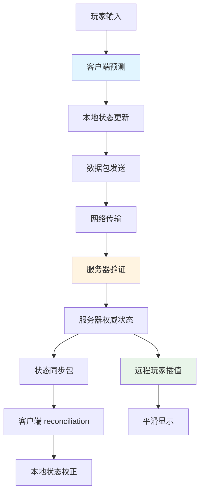

本页面深入解析 Tarkov Unity 项目中的网络状态预测与插值算法架构，这是实现流畅多人游戏体验的核心技术。该系统通过客户端预测、服务器验证和远程玩家插值的协同工作，在保证游戏公平性的同时，最大化玩家的操作响应速度和视觉流畅度。

## 系统架构概览

状态预测与插值系统采用分层架构设计，包含客户端预测、网络同步和远程插值三个核心层级。客户端预测层允许玩家立即看到输入反馈，网络同步层确保服务器权威性，远程插值层平滑显示其他玩家的移动。这种设计在网络延迟环境下既能提供低延迟操作体验，又能维护游戏状态的最终一致性。

### 核心组件关系

系统由多个关键组件协同工作，形成完整的网络同步链条。**NetworkPlayer** 类作为网络玩家基类，提供帧索引器用于时间同步；**ClientPlayer** 继承 NetworkPlayer 并扩展客户端特有功能；**DataSyncManager** 通过 DataProviderSyncUpdate 系统实现周期性数据同步；**NetworkDataSender** 管理数据包队列和发送频率；**ClientDataPacket** 作为承载所有同步数据的结构体；**ObservedPlayerController** 处理远程玩家的插值和显示。

Sources: [NetworkPlayer.cs](Assembly-CSharp/EFT/NetworkPlayer.cs#L1-L100), [ClientPlayer.cs](Assembly-CSharp/EFT/ClientPlayer.cs#L1-L200), [DataSyncManager.cs](Assembly-CSharp/EFT/DataSyncManager.cs#L1-L126)

## 客户端状态预测

客户端预测机制允许玩家在等待服务器响应之前立即看到操作结果，大幅降低输入延迟感知。该系统基于确定性物理引擎和可逆操作设计，确保预测状态能够被服务器后续的权威状态覆盖和校正。

### 预测实现机制

客户端预测通过 **PlayerMovementController** 和 **MovementContext** 协同工作实现。MovementContext 管理移动状态机和物理计算，包括重力、惯性、碰撞检测等核心物理模拟。PlayerMovementController 控制动画播放和参数同步，将物理状态转换为视觉表现。这种分离设计确保物理计算与动画渲染解耦，便于独立优化。

**MovementContext** 实现了高性能的物理计算系统，包括优化的地面检测算法、平滑插值系统和事件驱动架构。物理条件变化通过 PhysicalConditionData 结构体传递，封装了必要的上下文信息用于条件处理。坡度检测阈值（slopeThreshold = 0.65f）用于判断表面是否过于陡峭，防止在不平坦地形上的异常移动。

Sources: [MovementContext.cs](Assembly-CSharp/EFT/MovementContext.cs#L1-L150), [PlayerMovementController.cs](Assembly-CSharp/EFT/PlayerMovementController.cs#L1-L150)

### 状态管理与转换

移动状态通过 **BaseMovementState** 层次结构管理，每个状态代表一种特定的移动模式（站立、蹲下、趴下、冲刺等）。状态转换通过状态机实现，确保状态之间的平滑过渡。MovementController 维护当前状态和上一个状态的引用，通过 OnStateChanged 事件通知系统状态变化。

离散方向系统（SetDiscreteDirection）将连续的移动输入转换为离散的8方向枚举值，简化网络传输和动画状态管理。离散方向延迟（discreteDirectionDelay）防止输入抖动导致的频繁状态切换，提供更稳定的移动体验。

Sources: [PlayerMovementController.cs](Assembly-CSharp/EFT/PlayerMovementController.cs#L800-L999)

## 网络数据同步

网络数据同步层负责在客户端和服务器之间传输游戏状态，采用关键包和非关键包混合传输策略，平衡网络带宽使用和响应速度。

### 数据包结构

**ClientDataPacket** 是网络通信的核心数据结构，采用结构体设计以提高序列化效率。该结构体包含多个数据包字段：MovementInfoPacket（移动信息）、ViewPacket（视角）、HandsChangePacket（手部状态变化）、FirearmPacket（武器状态）、GrenadePacket（手榴弹状态）等，覆盖了玩家状态的各个方面。

数据包包含关键的同步字段：FrameId 用于帧同步、ClientTime 记录客户端时间、RTT 记录往返时间、IsExtraPrecisionMovement 标志是否使用额外精度移动、DeltaTimeFromLastCriticalPacket 记录距离上次关键包的时间间隔。这些字段为 reconciliation 和插值算法提供必要的时间信息。

Sources: [ClientDataPacket.cs](Assembly-CSharp/EFT/ClientDataPacket.cs#L1-L200)

### 发送频率控制

**NetworkDataSender** 实现了智能的数据包发送策略，通过 sendRateFramesLimit 参数控制发送频率（默认 120fps）。系统维护一个数据包队列（packetQueue），最大容量 127 个包，防止内存溢出。关键包（HasCriticalData）包含重要状态变化，需要立即发送；非关键包可以批量发送以节省带宽。

发送策略包含以下规则：连续非关键包最大数量为 5（MAX_NON_CRITICAL_PACKETS_IN_ROW），关键包间最大帧数为 6（MAX_FRAMES_BETWEEN_CRITICAL_PACKETS）。这些常量确保即使在非关键包累积的情况下，关键状态也能及时同步。PreventDispatch 标志可以在特殊情况下阻止数据分发，forceSend 标志可以强制发送紧急数据。

Sources: [ClientPlayer.cs](Assembly-CSharp/EFT/ClientPlayer.cs#L100-L200), [ClientDataPacket.cs](Assembly-CSharp/EFT/ClientDataPacket.cs#L200-L384)

### 数据同步管理器

**DataSyncManager** 协调客户端与服务器之间的数据同步更新。该类订阅 DataProviderSyncUpdate.OnUpdate 事件，在 Unity PlayerLoop 的 PreUpdate 阶段执行数据序列化和发送。序列化通过 _E64D 数据写入器完成，缓冲区大小为 5000 字节，足以处理常规数据同步需求。

DataProviderSyncUpdate 是自定义的 PlayerLoop 系统，在 PreUpdate 阶段触发 OnUpdate 事件。这种设计确保数据同步在每帧渲染前完成，维护数据一致性和时序正确性。当 _F02C.Instance.HasDataToTransfer 为 true 时，系统会序列化数据并通过 ClientPlayer.SendCommonEventData 发送到服务器。

Sources: [DataSyncManager.cs](Assembly-CSharp/EFT/DataSyncManager.cs#L1-L126), [DataProviderSyncUpdate.cs](Assembly-CSharp/CustomPlayerLoopSystem/DataProviderSyncUpdate.cs#L1-L44)

## 远程玩家插值

远程玩家插值系统处理服务器发送的其他玩家状态数据，通过插值算法平滑显示远程玩家的移动，消除网络抖动带来的视觉卡顿。

### 插值控制器

**ObservedPlayerController** 是远程玩家的核心控制器，管理观察者玩家的创建、加载和控制。该控制器包含 PlayerInterpolator（插值器）、PlayerMovementModel（移动模型）、PlayerCullingController（剔除控制器）等子组件，协同实现远程玩家的平滑显示。

插值器使用 **EBoundType** 枚举定义的边界类型进行插值计算，包括 Less（小于）、LessOrEqual（小于等于）、Equals（等于）、GreaterOrEqual（大于等于）、Greater（大于）等约束条件。这些边界类型确保插值结果在物理上合理，防止插值导致穿墙或异常移动。

Sources: [ObservedPlayerController.cs](Assembly-CSharp/Observed/ObservedPlayerController.cs#L1-L170), [EBoundType.cs](Assembly-CSharp/Interpolation/EBoundType.cs#L1-L16)

### 状态快照与 reconciliation

**PlayerStateSnapshotUtility** 提供创建玩家状态快照的功能，用于调试和 reconciliation 验证。快照包含玩家基本信息、武器信息、动画事件信息、移动上下文信息和动画器信息，全面反映玩家的当前状态。

 reconciliation 过程将服务器返回的权威状态与客户端预测状态进行比较。当两者差异超过阈值时，客户端会平滑地将预测状态校正到服务器状态。这个过程通过插值完成，避免突然的位置跳变，保持视觉连续性。

Sources: [PlayerStateSnapshotUtility.cs](Assembly-CSharp/EFT/PlayerStateSnapshotUtility.cs#L1-L200)

### 位置同步原因

系统定义了 **SyncPositionReason** 枚举，记录位置同步的各种原因：Speed（速度异常）、Stuck（卡住）、Lift（电梯/平台移动）、PacketsQueue（包队列累积）、NanInfinity（数值异常）。这些原因帮助开发者诊断网络同步问题，优化算法参数。

Sources: [SyncPositionReason.cs](Assembly-CSharp/EFT/NetworkPackets/SyncPositionReason.cs#L1-L12)

## 动画状态同步

动画状态同步确保所有客户端看到的玩家动画保持一致，这是实现多人游戏视觉真实性的关键。系统采用动画参数哈希和事件分发机制，高效同步复杂的动画状态。

### 动画参数管理

**PlayerAnimator** 封装所有动画参数的哈希与设置方法，提供动画层、武器、动作等的统一接口。每个动画参数通过 StringToHash 转换为整数哈希值，减少网络传输开销。参数缓存机制（cachedSidebackSpeed、cachedPoseLevel 等）避免重复设置相同值，提高性能。

动画层索引常量定义了各个动画层的用途：BASE_LAYER_INDEX（基础层）、TP_WEAPON_LAYER_INDEX（第三人称武器层）、UTILITY_LAYER_INDEX（实用工具层）、ADDITIVE_AIMING_LAYER_INDEX（叠加瞄准层）等。多层动画系统允许不同动画状态混合播放，如移动和瞄准可以同时进行。

Sources: [PlayerAnimator.cs](Assembly-CSharp/EFT/PlayerAnimator.cs#L1-L150)

### 事件分发系统

**PlayerAnimatorEventsDispatcher** 处理动画事件分发，将 Unity 动画事件转换为游戏逻辑事件。跳跃事件（OnJumpEvent）、落地事件（OnLandEvent）等通过该系统分发到相应的处理逻辑，确保动画事件与游戏状态同步。

动画事件序列通过 AnimationEventsSequenceData 管理，包含事件名称、状态名称哈希、条件通过标志等信息。事件队列支持调试，方便开发者追踪动画事件触发顺序。

Sources: [PlayerAnimator.cs](Assembly-CSharp/EFT/PlayerAnimator.cs#L50-L100), [PlayerStateSnapshotUtility.cs](Assembly-CSharp/EFT/PlayerStateSnapshotUtility.cs#L150-L200)

## 性能优化策略

状态预测与插值系统采用多种性能优化策略，确保在低端设备上也能流畅运行。

### 帧索引与时间同步

**NetworkPlayer** 中的 **FrameIndexer**（_E7A1 类型）用于网络同步的帧索引管理。帧索引器提供统一的时间基准，允许客户端和服务器对齐不同步的时钟。时间戳机制（ClientTime、RTT）帮助估计网络延迟，动态调整插值缓冲区大小。

Sources: [NetworkPlayer.cs](Assembly-CSharp/EFT/NetworkPlayer.cs#L60-L100)

### 资源加载优化

**ObservedPlayerControllerFactory** 采用异步资源加载策略，通过 ResourceLoader 和 ResourceKeyResolver 异步加载远程玩家所需的预制体和自定义数据。这种设计避免阻塞主线程，保持游戏流畅运行。

压缩资源数据通过 SimpleZlib.Decompress 解压，减少网络传输量。资源加载过程中使用 Progress<LoadingProgress> 提供加载进度反馈，改善用户体验。

Sources: [ObservedPlayerControllerFactory.cs](Assembly-CSharp/Observed/ObservedPlayerControllerFactory.cs#L1-L20), [ObservedPlayerController.cs](Assembly-CSharp/Observed/ObservedPlayerController.cs#L40-L100)

## 故障处理与调试

系统提供了完善的故障处理机制和调试工具，帮助开发者快速定位和解决网络同步问题。

### 异常状态检测

系统检测多种异常情况并采取相应措施：位置出现 NaN 或 Infinity 值时触发位置同步（SyncPositionReason.NanInfinity）；移动速度异常时同步位置（SyncPositionReason.Speed）；玩家卡住时强制同步（SyncPositionReason.Stuck）；包队列累积时主动发送（SyncPositionReason.PacketsQueue）。

ClientDataPacket 提供 HasImportantData 属性，检查数据包是否包含需要立即处理的重要信息。这个属性综合判断移动信息、手部变化、库存命令、语音状态等多个方面，确保关键操作不会被延迟。

Sources: [ClientDataPacket.cs](Assembly-CSharp/EFT/ClientDataPacket.cs#L200-L250), [SyncPositionReason.cs](Assembly-CSharp/EFT/NetworkPackets/SyncPositionReason.cs#L1-L12)

### 调试工具

**PlayerStateSnapshotUtility** 提供详细的状态快照，包含玩家基本信息、武器状态、移动速度、动画参数等。快照格式化为可读字符串，便于日志记录和问题诊断。

网络游戏类 **NetworkGame** 提供了多种调试功能，包括开发包（DevelopHealPacket、DevelopTeleportPacket、DevelopKillMePacket 等），允许开发者在开发环境中快速测试各种场景。

Sources: [PlayerStateSnapshotUtility.cs](Assembly-CSharp/EFT/PlayerStateSnapshotUtility.cs#L1-L200), [ClientDataPacket.cs](Assembly-CSharp/EFT/ClientDataPacket.cs#L250-L384)

## 与其他系统的集成

状态预测与插值算法与游戏中的多个系统深度集成，形成完整的网络游戏体验。

### 物理系统集成

移动系统与 **ICharacterController** 和 **BifacialTransform** 紧密集成。CharacterController 处理物理移动和碰撞检测，BifacialTransform 管理位置和旋转的双面变换（第一人称和第三人称）。这种设计确保物理计算在不同视角下保持一致。

**ObstacleCollision** 系统提供障碍物碰撞模型，防止玩家穿过墙壁和障碍物。碰撞检测结果影响移动状态转换和插值约束，确保网络同步的物理合理性。

Sources: [MovementContext.cs](Assembly-CSharp/EFT/MovementContext.cs#L100-L150), [Player.Motion.cs](Assembly-CSharp/EFT/Player.Motion.cs#L1-L150)

### 武器系统集成

武器状态通过 **FirearmPacket** 同步，包含开火状态、瞄准状态、换弹操作等信息。武器动画与移动动画在 PlayerAnimator 中混合播放，实现复杂的动作组合，如移动射击、冲刺换弹等。

**FirearmController** 管理武器的逻辑状态，通过事件系统通知动画和网络同步模块状态变化。武器故障、过热等特殊状态也需要同步到所有客户端。

Sources: [ClientDataPacket.cs](Assembly-CSharp/EFT/ClientDataPacket.cs#L50-L100), [Player.FirearmController.cs](Assembly-CSharp/EFT/Player.FirearmController.cs#L1-L50)

### 库存系统集成

库存操作通过 **InventoryCommandPackets** 列表同步，支持批量操作减少网络往返。每个命令包含操作类型、物品ID、目标位置等信息，服务器验证后执行并广播结果。

**LootRayInfo** 记录拾取物品时的射线信息（Origin 和 Direction），用于服务器精确验证玩家是否真的看到了要拾取的物品，防止作弊。

Sources: [ClientDataPacket.cs](Assembly-CSharp/EFT/ClientDataPacket.cs#L100-L150), [ClientDataPacket.cs](Assembly-CSharp/EFT/ClientDataPacket.cs#L300-L350)

## 最佳实践与建议

基于对 Tarkov Unity 项目状态预测与插值系统的分析，以下是实现类似系统时的重要建议。

### 常量调优

系统中的关键常量需要根据游戏特性进行调优：
- **MAX_NON_CRITICAL_PACKETS_IN_ROW**（5）：控制非关键包的累积数量，影响网络带宽使用和响应延迟的平衡
- **MAX_FRAMES_BETWEEN_CRITICAL_PACKETS**（6）：确保关键状态及时同步，防止状态过时
- **sendRateFramesLimit**（120）：根据游戏节奏和网络条件调整发送频率
- **slopeThreshold**（0.65f）：根据游戏地形复杂度调整坡度检测灵敏度

Sources: [ClientDataPacket.cs](Assembly-CSharp/EFT/ClientDataPacket.cs#L10-L20), [MovementContext.cs](Assembly-CSharp/EFT/MovementContext.cs#L130-L140)

### 事件驱动架构

采用事件驱动架构解耦各个模块，便于扩展和维护：
- **OnStateChanged**：状态变化事件，通知监听者状态转换
- **OnGrounded**：着地事件，触发落地动画和声音
- **OnJumpEvent** / **OnLandEvent**：跳跃和落地事件，同步动画状态
- **DataSentEvent**：数据发送事件，监控网络流量

Sources: [PlayerMovementController.cs](Assembly-CSharp/EFT/PlayerMovementController.cs#L60-L100), [PlayerAnimator.cs](Assembly-CSharp/EFT/PlayerAnimator.cs#L80-L100)

### 数据序列化优化

使用高效的数据序列化策略：
- 结构体而非类：ClientDataPacket 使用 struct 减少内存分配
- 位打包：使用 BitPacking 系统压缩布尔标志和小数值
- 增量更新：只发送变化的数据，而非完整状态
- 延迟发送：非关键数据累积后批量发送

Sources: [ClientDataPacket.cs](Assembly-CSharp/EFT/ClientDataPacket.cs#L1-L50), [DataSyncManager.cs](Assembly-CSharp/EFT/DataSyncManager.cs#L100-L126)

## 进阶主题

### 自定义 PlayerLoop 集成

项目通过自定义 PlayerLoop 系统集成数据同步，**DataProviderSyncUpdate** 在 PreUpdate 阶段触发。这种设计确保数据同步在帧渲染前完成，维护数据一致性。其他自定义系统如 StartOfUpdate、UNetUpdate、PostUNetUpdate 等协同工作，形成完整的帧循环架构。

Sources: [DataProviderSyncUpdate.cs](Assembly-CSharp/CustomPlayerLoopSystem/DataProviderSyncUpdate.cs#L1-L44)

### 多线程数据处理

异步资源加载使用 AsyncWorker.RunOnBackgroundThread 在后台线程执行，避免阻塞主线程。数据包序列化在主线程完成，确保线程安全。这种多线程策略平衡了性能和正确性。

Sources: [ObservedPlayerController.cs](Assembly-CSharp/Observed/ObservedPlayerController.cs#L70-L100)

## 总结

Tarkov Unity 项目的状态预测与插值算法展示了高质量多人游戏网络同步的实现方案。系统通过客户端预测降低输入延迟，通过服务器验证保证公平性，通过远程插值提供流畅的视觉体验。分层架构设计、事件驱动机制、智能的数据包管理和完善的调试工具共同构成了这个复杂而高效的网络同步系统。

理解这个系统需要掌握网络编程、物理模拟、动画系统和性能优化等多个领域的知识。建议在实现类似系统时，先从简单的预测和 reconciliation 开始，逐步添加插值、延迟补偿和故障处理等高级功能。

## 延伸阅读

想要深入了解相关系统，建议阅读以下页面：

- [客户端-服务器数据同步](20-ke-hu-duan-fu-wu-qi-shu-ju-tong-bu) - 了解数据同步的详细实现
- [移动系统与物理计算](9-yi-dong-xi-tong-yu-wu-li-ji-suan) - 深入学习物理和移动系统
- [玩家核心类架构](8-wan-jia-he-xin-lei-jia-gou) - 理解 Player 类的整体架构
- [网络游戏会话管理](19-wang-luo-you-xi-hui-hua-guan-li) - 了解网络会话的管理机制