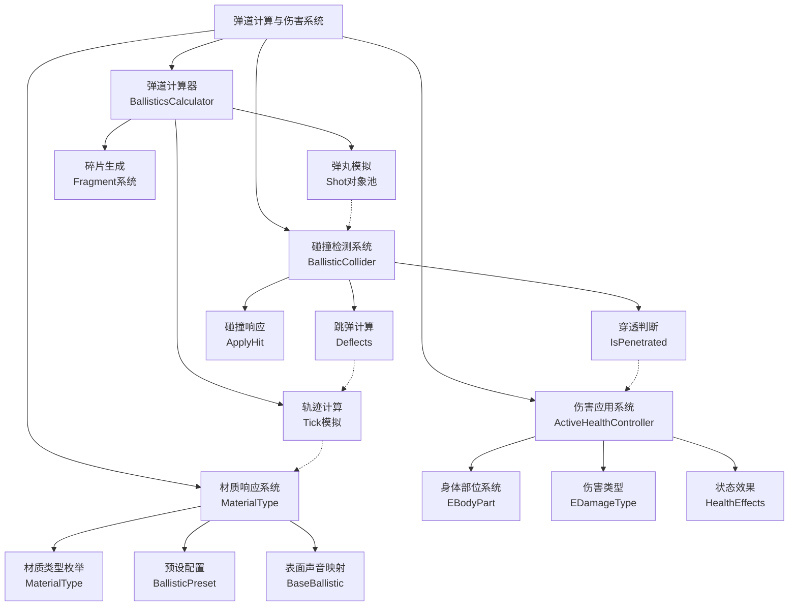
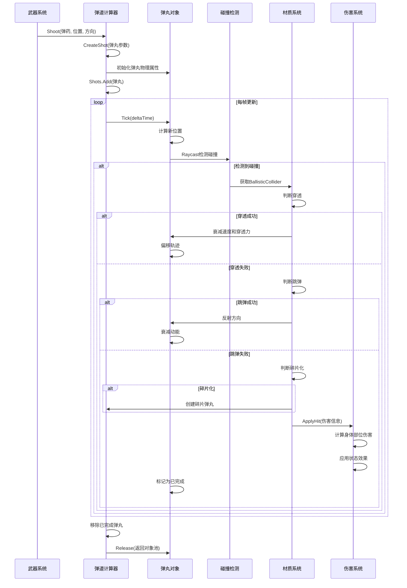

弹道计算与伤害系统是游戏中最核心的战斗系统之一，负责精确模拟弹丸飞行轨迹、物理碰撞检测、材料穿透计算以及伤害分配。该系统采用了多层架构设计，将弹道计算、碰撞检测、材质响应和伤害应用逻辑分离，确保了高性能和可扩展性。

## 系统架构概览

弹道计算与伤害系统由四个核心子系统组成：**弹道计算器**负责弹丸的物理模拟和轨迹计算；**碰撞检测系统**处理弹丸与游戏世界的交互；**材质响应系统**定义不同材料对弹丸的物理响应特性；**伤害应用系统**将弹丸撞击转化为具体的生命值损失和状态效果。各子系统通过清晰定义的接口进行通信，形成了模块化的架构。

Sources: [BallisticsCalculator.cs](Assembly-CSharp/EFT/Ballistics/BallisticsCalculator.cs#L1-L50), [BallisticCollider.cs](Assembly-CSharp/EFT/Ballistics/BallisticCollider.cs#L1-L50)

## 弹道计算器核心组件

弹道计算器（BallisticsCalculator）是整个系统的大脑，负责管理所有活跃弹丸的生命周期、物理模拟和轨迹更新。该组件使用对象池技术管理弹丸实例，通过预分配随机数种子确保客户端和服务器的计算一致性，支持单发和多发弹丸的创建与模拟。计算器每帧更新所有活跃弹丸的位置，处理穿透、跳弹和碎片化等复杂物理现象。

弹道计算器维护两个核心列表：活跃弹丸列表（Shots）和已完成弹丸列表，通过队列机制处理每帧的模拟更新。每个弹丸（Shot对象）包含完整的物理属性：弹道信息、弹丸质量、直径、初速度、当前速度、穿透力、伤害值、穿透概率、跳弹概率、碎片化概率等参数。计算器采用固定时间步长的模拟方式，确保在不同帧率下的计算结果一致性。

Sources: [BallisticsCalculator.cs](Assembly-CSharp/EFT/Ballistics/BallisticsCalculator.cs#L50-L120), [BallisticsCalculator.cs](Assembly-CSharp/EFT/Ballistics/BallisticsCalculator.cs#L200-L295)

### 弹丸创建与初始化

弹丸创建过程从武器系统调用开始，接收弹药模板、射击位置、射击方向、玩家ID和物品引用等参数。计算器使用正态分布算法计算初始穿透力，穿透力 = 基础穿透力 + 随机偏差 × 穿透力标准差，确保每发弹丸的穿透能力存在微小差异，增加了战斗的不可预测性。对于散弹枪等多发武器，系统会根据弹药配置创建多个弹丸，每个弹丸在基础方向上添加随机偏移，形成真实的散布效果。

弹丸对象的创建采用对象池模式，通过CreateShot静态方法从池中获取或创建新实例，减少了频繁的内存分配和垃圾回收开销。创建过程中，系统还会记录射击序号和碎片索引，用于追踪弹丸的父子关系和碎片化行为。多发弹丸共享相同的射击序号，但具有不同的碎片索引，便于系统识别哪些弹丸来自同一发射击。

Sources: [BallisticsCalculator.cs](Assembly-CSharp/EFT/Ballistics/BallisticsCalculator.cs#L90-L130), [BallisticsCalculator.cs](Assembly-CSharp/EFT/Ballistics/BallisticsCalculator.cs#L270-L280)

### 弹道模拟与轨迹更新

弹道模拟采用离散时间步长的数值积分方法，每帧调用ManualUpdate方法传入deltaTime，计算器将时间分配给所有活跃弹丸。每个弹丸执行Tick方法，根据当前速度和时间步长计算位移，进行碰撞检测，处理穿透或跳弹逻辑。模拟过程支持调试模式，可以可视化弹丸轨迹和碰撞点，便于开发人员调试和优化弹道参数。

轨迹计算考虑了重力影响、空气阻力等物理因素，虽然没有明确显示重力系数，但通过速度衰减机制模拟了阻力效果。弹丸每次移动后，系统会检测与场景中所有BallisticCollider的碰撞，使用射线检测（Raycast）确定最近的碰撞点。碰撞检测返回碰撞点位置、碰撞法线方向和碰撞的BallisticCollider引用，为后续的穿透和跳弹计算提供必要信息。

Sources: [BallisticsCalculator.cs](Assembly-CSharp/EFT/Ballistics/BallisticsCalculator.cs#L140-L180)

## 碰撞检测与材质响应系统

碰撞检测系统基于Unity的物理引擎构建，通过BallisticCollider组件标记游戏世界中的可碰撞物体。BallisticCollider继承自BaseBallistic，定义了物体的弹道特性：穿透等级（PenetrationLevel）、穿透概率（PenetrationChance）、跳弹概率（RicochetChance）、碎片化概率（FragmentationChance）、轨迹偏移概率（TrajectoryDeviationChance）和轨迹偏移量（TrajectoryDeviation）。这些参数决定了弹丸击中物体时的行为。

系统支持碰撞体组合（BallisticColliderComposer），允许一个物体包含多个具有不同弹道特性的子碰撞体。例如，防弹衣可以由多个护甲板组成，每个护甲板具有独立的材质和防护特性。Composer负责将命中事件分发给所有子碰撞体，并统一管理网络ID和命中类型，确保多人游戏中的一致性。

Sources: [BallisticCollider.cs](Assembly-CSharp/EFT/Ballistics/BallisticCollider.cs#L50-L100), [BallisticColliderComposer.cs](Assembly-CSharp/EFT/Ballistics/BallisticColliderComposer.cs#L1-L46)

### 穿透判断机制

穿透判断是弹道系统的核心算法之一，当弹丸击中物体时，系统调用BallisticCollider的IsPenetrated方法。穿透需要满足两个条件：弹丸的穿透力（PenetrationPower）大于物体的穿透等级（PenetrationLevel），且随机概率测试通过。概率计算公式为：(弹丸穿透概率 + 物体穿透概率) > 随机数（0-1），这种加法设计意味着高穿透弹药和高穿透材料都会增加穿透成功的可能性。

穿透成功后，弹丸会保留部分动能继续飞行，但速度和穿透力会根据物体的穿透等级进行衰减。穿透力衰减通常与物体的穿透等级成正比，速度衰减则考虑了弹丸直径和材料密度等因素。弹丸在穿透过程中可能产生轨迹偏移，偏移量由TrajectoryDeviation参数控制，模拟了弹丸在穿透厚材料时发生的弹道偏转。

Sources: [BallisticCollider.cs](Assembly-CSharp/EFT/Ballistics/BallisticCollider.cs#L120-L140)

### 跳弹计算逻辑

跳弹是弹道系统的另一个重要特性，当弹丸以一定角度击中硬质表面时可能发生反射。跳弹判断考虑入射角度（弹丸方向与碰撞法线的夹角）、弹丸跳弹概率和物体跳弹概率。系统限制跳弹角度范围在42.5度到80度之间，太接近垂直或太接近水平都不会发生跳弹，这符合物理规律。

跳弹概率计算公式为：(弹丸跳弹概率 + 物体跳弹概率) × (1 - |入射角余弦值|) > 随机数。其中(1 - |入射角余弦值|)项表示入射角度越大，跳弹概率越高，这模拟了掠射时更容易发生跳弹的现象。跳弹发生后，弹丸方向根据反射定律更新，并保留部分动能继续飞行，速度和穿透力也会相应衰减。

Sources: [BallisticCollider.cs](Assembly-CSharp/EFT/Ballistics/BallisticCollider.cs#L100-L120)

## 材质类型与预设系统

材质类型系统通过MaterialType枚举定义了游戏中所有可能的材料类型，共39种，涵盖了自然环境（草地、泥土、水体）、人造结构（混凝土、金属、木材）、人体组织、防护装备等。每种材质关联到一组弹道特性预设，通过BallisticPreset配置，包含六个关键参数的数值：穿透等级、穿透概率、跳弹概率、碎片化概率、轨迹偏移概率、轨迹偏移量。

BaseBallistic类实现了材质类型到表面声音类型的映射，为每种MaterialType分配对应的ESurfaceSound枚举值。表面声音类型用于触发击中时的音效，如击中金属、木材、混凝土等产生不同的声音效果。这种映射确保了视觉、物理和听觉反馈的一致性，增强了游戏的沉浸感。

Sources: [MaterialType.cs](Assembly-CSharp/EFT/Ballistics/MaterialType.cs#L1-L46), [BaseBallistic.cs](Assembly-CSharp/BaseBallistic.cs#L1-L128)

### 材质预设配置表

BallisticPreset类提供了灵活的材质配置机制，支持两种配置模式：固定值模式和缩放相关模式。固定值模式直接使用预设的六个参数值，适用于大多数标准材质。缩放相关模式允许根据物体缩放动态调整穿透等级，通过AnimationCurve定义缩放倍数与穿透等级乘数的关系，这对于厚度可变的物体（如可破坏的墙壁）特别有用。

| 材质类别 | 代表性材质 | 穿透等级范围 | 跳弹概率 | 碎片化概率 | 特殊行为 |
|---------|-----------|------------|---------|-----------|---------|
| 自然环境 | Soil, GrassLow, Snow | 0-5 | 0-0.1 | 0-0.05 | 低阻力，易穿透 |
| 人造结构 | Concrete, Stone, Asphalt | 10-30 | 0.1-0.3 | 0.1-0.2 | 中等阻力，可能跳弹 |
| 金属材料 | MetalThin, MetalThick | 20-50 | 0.2-0.5 | 0.05-0.15 | 高阻力，高跳弹概率 |
| 木质材料 | WoodThin, WoodThick | 5-15 | 0.05-0.15 | 0.05-0.1 | 易穿透，可能碎片化 |
| 人体组织 | Body, Fabric | 1-3 | 0 | 0.3-0.5 | 低穿透，高碎片化 |
| 防护装备 | BodyArmor, Helmet | 30-60 | 0.3-0.6 | 0.1-0.2 | 高防护，高跳弹 |

Sources: [BallisticPreset.cs](Assembly-CSharp/BallisticPreset.cs#L1-L61)

## 伤害应用系统

伤害应用系统负责将弹道系统的碰撞结果转化为对角色身体部位的实际伤害。系统基于EBodyPart枚举定义了七个身体部位：头部、胸部、腹部、左臂、右臂、左腿、右腿，以及Common类型表示全身性效果。ActiveHealthController管理每个身体部位的健康值，支持复杂的伤害计算、状态效果和恢复机制。

伤害计算考虑多个因素：弹丸基础伤害值、命中部位的身体部位倍数、装甲减伤、距离衰减、材质穿透剩余动能等。系统使用EDamageType枚举区分不同来源的伤害，包括子弹（Bullet）、爆炸（Explosion）、坠落（Fall）、近战（Melee）等20余种类型。某些伤害类型会附加持续效果，如流血（LightBleeding、HeavyBleeding）、中毒（Poison）、辐射（RadExposure）等。

Sources: [EBodyPart.cs](Assembly-CSharp/EBodyPart.cs#L1-L12), [EDamageType.cs](Assembly-CSharp/EFT/EDamageType.cs#L1-L35), [ActiveHealthController.cs](Assembly-CSharp/EFT/HealthSystem/ActiveHealthController.cs#L1-L150)

### 身体部位伤害计算

身体部位伤害采用部位特异性倍数系统，不同部位对伤害的敏感程度不同。头部通常具有最高的伤害倍数（可能是基础伤害的数倍），胸部和腹部为标准倍数（1.0），四肢较低（0.7-0.8）。这种设计模拟了真实世界中不同部位受创的严重程度差异，增加了战术选择的深度。

装甲减伤计算是伤害系统的关键组成部分，当弹丸穿透防护装备后，剩余动能根据装甲等级计算减伤比例。减伤公式通常为：实际伤害 = 基础伤害 × (1 - 装甲减伤百分比)，其中装甲减伤百分比与穿透等级和弹丸剩余动能相关。未穿透装甲的弹丸可能产生钝击伤害（Blunt），虽然不会造成穿透伤害，但会通过冲击力传递造成一定程度的伤害。

### 状态效果与健康影响

伤害不仅直接减少健康值，还可能触发各种状态效果。健康效果系统（HealthEffects）定义了多种持续性和即时性效果：流血效果会持续造成伤害并降低体力；疲劳效果影响体力和耐力恢复；脱水效果会随时间增加口渴和耐力消耗；辐射暴露会逐渐造成伤害并降低最大健康值。这些效果可以叠加，形成复杂的健康状态组合。

ActiveHealthController维护每个身体部位的健康状态，包括当前健康值、最大健康值、活跃效果列表等。控制器支持网络同步，确保多人游戏中所有客户端看到一致的健康状态。系统还提供了伤害缓冲和延迟应用机制，允许网络传输延迟和客户端预测，同时保持最终状态的一致性。

## 弹道系统工作流程

弹道系统的完整工作流程从玩家扣动扳机开始，经过弹丸创建、轨迹模拟、碰撞检测、穿透/跳弹判断、碎片化处理，最终到伤害应用。整个过程高度优化，使用对象池、批量更新和早期剔除等技术，确保在数百发弹丸同时飞行时仍能保持高性能。

Sources: [BallisticsCalculator.cs](Assembly-CSharp/EFT/Ballistics/BallisticsCalculator.cs#L140-L200)

### 碎片化处理机制

碎片化是弹道系统的高级特性，某些弹丸（特别是手枪弹和步枪弹）在穿透身体组织或特定材料时会发生破碎，产生多个碎片。每个碎片继承父弹丸的部分动能，具有独立的轨迹和穿透能力，显著增加了伤害潜力。系统支持配置最小碎片数量（MinFragmentsCount），并根据弹丸的碎片化概率（FragmentationChance）随机决定是否发生碎片化。

碎片弹丸通过递归方式处理，每个碎片作为新的弹丸加入活跃列表，继承父弹丸的射击序号但具有唯一的碎片索引。这种设计允许系统追踪碎片与原始弹丸的关系，便于统计和调试。碎片弹丸通常具有较低的穿透力和较小的伤害值，但由于数量众多，总伤害可能超过原始弹丸。

Sources: [BallisticsCalculator.cs](Assembly-CSharp/EFT/Ballistics/BallisticsCalculator.cs#L170-L200)

## 性能优化与网络同步

弹道计算系统针对性能进行了多项优化。对象池技术（Shot对象池）避免了频繁的内存分配，使用预分配的列表和队列减少了垃圾回收压力。批量更新机制在单个更新周期内处理多个弹丸，提高了缓存命中率。空间分区和早期剔除确保只对附近的碰撞体进行检测，减少了不必要的射线投射计算。

网络同步采用确定性随机数生成器，客户端和服务器使用相同的种子初始化随机数序列，确保相同输入产生相同的弹道结果。系统传输的是射击指令（弹药、位置、方向）而非每帧的弹丸位置，客户端可以自行模拟弹道，大大减少了网络带宽需求。关键事件（命中、穿透、跳弹）由服务器权威确认，确保多人游戏中的公平性。

Sources: [BallisticsCalculator.cs](Assembly-CSharp/EFT/Ballistics/BallisticsCalculator.cs#L20-L50)

## 调试与可视化工具

系统提供了丰富的调试工具支持开发。BulletSimulator组件允许在编辑器中测试弹道参数，可视化弹丸轨迹、碰撞点和穿透深度。TrajectoryDebug组件可以绘制弹丸飞行路径，使用不同颜色表示不同状态（飞行中、穿透、跳弹、碎片化）。BallisticRayscastTest提供了射线检测的测试环境，便于验证碰撞层的配置。

调试模式下，弹道计算器会创建可视化标记（如红色球体）标记弹丸位置和碰撞点，帮助开发人员直观理解弹道行为。系统还支持记录详细的弹道事件日志，包括弹丸创建时间、碰撞时间、穿透结果、碎片生成等关键信息，便于性能分析和问题排查。

Sources: [BulletSimulator.cs](Assembly-CSharp/BulletSimulator.cs#L1-L200), [BallisticRayscastTest.cs](Assembly-CSharp/BallisticRayscastTest.cs)

## 下一步学习建议

理解弹道计算与伤害系统后，建议继续学习以下相关系统以获得更全面的技术认知：

- **健康系统与状态效果** [健康系统与状态效果](23-jian-kang-xi-tong-yu-zhuang-tai-xiao-guo) - 深入了解身体部位管理、状态效果机制和治疗逻辑
- **玩家核心类架构** [玩家核心类架构](8-wan-jia-he-xin-lei-jia-gou) - 理解玩家类如何集成弹道系统和伤害应用
- **AI机器人行为系统** [AI机器人行为系统](24-aiji-qi-ren-xing-wei-xi-tong) - 学习AI如何处理被击中和伤害响应
- **手部控制器与武器系统集成** [手部控制器与武器系统集成](10-shou-bu-kong-zhi-qi-yu-wu-qi-xi-tong-ji-cheng) - 探索武器系统如何触发弹道计算