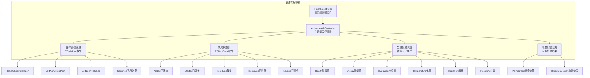
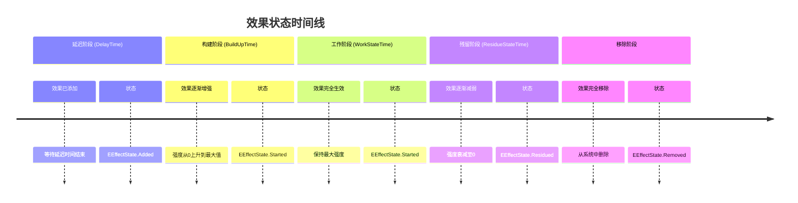
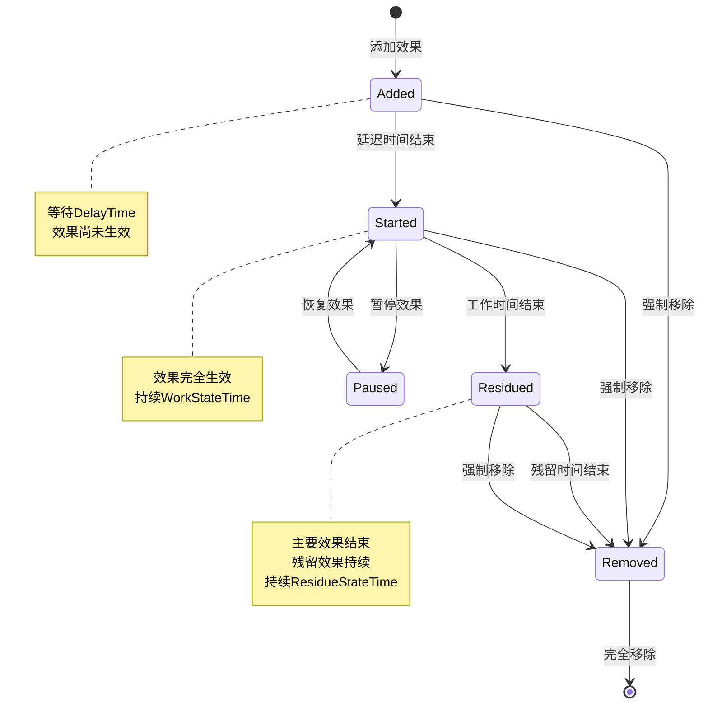

健康系统是Unity Tarkov的核心子系统之一，负责管理玩家的生命值、身体部位状态、生理指标（能量、水分、体温）以及各种状态效果。该系统采用**分层架构设计**，将身体部位管理、效果状态机和生理代谢系统有机结合，形成了真实且复杂的健康模拟机制。

## 系统架构概览

健康系统的核心架构由四个主要层次组成：身体部位管理层、效果状态机层、生理代谢层和视觉反馈层。这种分层设计使得系统能够处理复杂的健康交互，同时保持代码的可维护性和扩展性。



Sources: [IHealthController.cs](Assembly-CSharp/EFT/HealthSystem/IHealthController.cs#L1-L123), [ActiveHealthController.cs](Assembly-CSharp/EFT/HealthSystem/ActiveHealthController.cs#L1-L200)

## 身体部位管理系统

身体部位管理系统是健康系统的基础，允许游戏对玩家的不同身体部位进行独立伤害计算和状态追踪。系统定义了8个身体部位类型，每个部位都有独立的健康值、最大值和最小值属性。

### 身体部位枚举

**EBodyPart** 枚举定义了玩家身体的所有可受伤害部位：

| 部位代码 | 部位名称 | 说明 |
|---------|---------|------|
| 0 | Head | 头部 - 受伤会影响瞄准和视觉 |
| 1 | Chest | 胸部 - 主要生命值部位 |
| 2 | Stomach | 腹部 - 影响消化和代谢 |
| 3 | LeftArm | 左臂 - 受伤影响持枪稳定性 |
| 4 | RightArm | 右臂 - 受伤影响持枪稳定性 |
| 5 | LeftLeg | 左腿 - 受伤影响移动速度 |
| 6 | RightLeg | 右腿 - 受伤影响移动速度 |
| 7 | Common | 通用 - 全身性效果 |

Sources: [EBodyPart.cs](Assembly-CSharp/EBodyPart.cs#L1-L12)

### 健康值管理

**HealthValue** 类提供了健康值的封装，包含当前值、最大值、最小值以及衰减倍率等属性。系统支持双向伤害机制：伤害可以通过 **DownMult** 系数进行调整，模拟护甲减免或抗性效果。

```csharp
public class HealthValue
{
    protected ValueStruct Value;
    
    public virtual float Current
    {
        get { return Value.Current; }
        set
        {
            float num = value;
            float current = Value.Current;
            float num2 = num - current;
            if (num2 < 0f)  // 受伤时应用衰减系数
            {
                num = current + num2 * DownMult;
            }
            Value.Current = Mathf.Clamp(num, Value.Minimum, Value.Maximum);
            LastDiff = Value.Current - current;
        }
    }
    
    public float DownMult { get; set; }  // 伤害衰减系数
    public bool AtMinimum => Value.AtMinimum;  // 是否达到最小值
    public bool AtMaximum => Value.AtMaximum;  // 是否达到最大值
}
```

Sources: [HealthValue.cs](Assembly-CSharp/EFT/HealthSystem/HealthValue.cs#L1-L64), [ValueStruct.cs](Assembly-CSharp/EFT/HealthSystem/ValueStruct.cs#L1-L22)

## 效果状态机系统

效果状态机是健康系统的核心机制，负责管理各种状态效果（如流血、骨折、中毒等）的生命周期。每个效果都经历**五个状态**的转换过程：已添加→已开始→残留→已移除，支持暂停状态。

### 效果状态定义

**EEffectState** 枚举定义了效果的完整生命周期：

- **None**：未激活状态
- **Added**：已添加但尚未生效（延迟时间阶段）
- **Started**：已开始生效（工作状态）
- **Residued**：残留状态（主要效果结束，残留效果持续）
- **Removed**：已完全移除
- **Paused**：已暂停（用于临时禁用效果）

Sources: [EEffectState.cs](Assembly-CSharp/EFT/HealthSystem/EEffectState.cs#L1-L13)

### 效果时间线

每个效果都有四个时间参数，构成了完整的效果时间线：



Sources: [ActiveHealthController.cs](Assembly-CSharp/EFT/HealthSystem/ActiveHealthController.cs#L200-L399)

### 具体效果实现

系统内置了多种具体效果类，每个效果都继承自基础效果类并实现特定的逻辑：

#### 脱水效果（Dehydration）

脱水效果模拟严重脱水对身体的影响，会触发头痛并加速所有流血效果。当水分值降至0时，脱水效果会对所有身体部位造成持续伤害。

```csharp
protected class Dehydration : _E000
{
    protected override float DefaultDelayTime => 
        ActiveHealthController._E000._E019.Dehydration.DefaultDelay;
    
    protected override float DefaultResidueTime => 
        ActiveHealthController._E000._E019.Dehydration.DefaultResidueTime;
    
    protected override void Added()
    {
        // 添加头痛效果
        _E001<Pain>(EBodyPart.Head, 10f, null, null, null);
    }
    
    protected override void Started()
    {
        // 加速所有流血效果
        foreach (Bleeding item in base.HealthController.FindActiveEffects<Bleeding>())
        {
            item.ResetParameters(hasDehydration: true);
        }
        // 设置健康衰减率
        SetHealthRatesPerSecond(
            (0f - _E000) * (float)_ED8B.RealBodyParts.Count / strongDehydrationLoopTime, 
            0f, 0f, 0f);
    }
}
```

Sources: [ActiveHealthController.cs](Assembly-CSharp/EFT/HealthSystem/ActiveHealthController.cs#L1000-L1200)

#### 震荡效果（Contusion）

震荡效果模拟脑震荡，在进入残留状态时会自动设置2秒的残留时间。

```csharp
protected sealed class Contusion : _E000
{
    private const float _E024 = 2f;  // 默认残留时间
    
    public override void ForceResidue()
    {
        SetResidueTime(2f);  // 强制设置2秒残留时间
        base.ForceResidue();
    }
}
```

Sources: [ActiveHealthController.cs](Assembly-CSharp/EFT/HealthSystem/ActiveHealthController.cs#L1000-L1200)

#### 伤害修正效果（DamageModifier）

伤害修正效果根据强度值调整玩家受到的伤害倍率，强度为1.0时伤害倍率为2.0（双倍伤害）。

```csharp
protected sealed class DamageModifier : _E000
{
    private float _E000 => 1f + base.Strength;  // 伤害倍率 = 1 + 强度
    
    protected override void Started()
    {
        base.HealthController._E006(_E000);  // 应用伤害倍率
        base.Started();
    }
    
    protected override void Residue()
    {
        base.Residue();
        base.HealthController._E006(1f / _E000);  // 移除伤害倍率
    }
}
```

Sources: [ActiveHealthController.cs](Assembly-CSharp/EFT/HealthSystem/ActiveHealthController.cs#L1000-L1200)

## 生理代谢系统

生理代谢系统管理玩家的四个核心生理指标：健康值、能量值、水分值和体温。这些指标会随时间自然变化，也会受到各种效果的影响。

### 健康因子类型

**EHealthFactorType** 枚举定义了所有可管理的生理因子：

| 因子代码 | 因子名称 | 说明 |
|---------|---------|------|
| 0 | None | 无效因子 |
| 1 | Health | 健康值 - 身体部位的生命值 |
| 2 | Hydration | 水分值 - 身体水分含量 |
| 3 | Energy | 能量值 - 身体能量储备 |
| 4 | Radiation | 辐射值 - 辐射暴露程度 |
| 5 | Temperature | 体温 - 身体温度 |
| 6 | Poisoning | 中毒值 - 毒素积累程度 |
| 100 | Effect | 效果因子 - 特殊效果计数 |

Sources: [EHealthFactorType.cs](Assembly-CSharp/EFT/HealthSystem/EHealthFactorType.cs#L1-L23)

### 生理指标影响

不同的生理指标会影响玩家的行为能力和状态效果：

- **水分值（Hydration）**：低于阈值时触发脱水效果，加速流血并造成持续伤害
- **能量值（Energy）**：低能量会导致疲劳，影响体力恢复速度
- **体温（Temperature）**：极端体温会导致冻伤或中暑效果
- **辐射值（Radiation）**：高辐射会持续降低所有身体部位的健康值

Sources: [IHealthController.cs](Assembly-CSharp/EFT/HealthSystem/IHealthController.cs#L1-L123)

## 刺激剂增益系统

刺激剂增益系统管理药物和兴奋剂产生的临时增益效果，可以增强玩家能力或移除负面效果。

### 刺激剂增益类型

**EStimulatorBuffType** 枚举定义了所有可用的刺激剂增益：

| 增益代码 | 增益名称 | 效果说明 |
|---------|---------|---------|
| 0 | HealthRate | 健康恢复速率 |
| 1 | EnergyRate | 能量恢复速率 |
| 2 | HydrationRate | 水分恢复速率 |
| 3 | SkillRate | 技能学习速率 |
| 4 | MaxStamina | 最大体力值 |
| 5 | StaminaRate | 体力恢复速率 |
| 9 | Pain | 疼痛抑制（止痛） |
| 10 | HandsTremor | 手部震颤（负面） |
| 12 | RemoveNegativeEffects | 移除所有负面效果 |
| 13 | RemoveAllBuffs | 移除所有增益效果 |
| 14 | RemoveAllBloodLosses | 移除所有流血效果 |
| 15 | DamageModifier | 伤害修正倍率 |
| 16 | WeightLimit | 负重限制提升 |
| 21 | LightBleeding | 轻度流血（负面） |
| 22 | HeavyBleeding | 重度流血（负面） |
| 23 | Fracture | 骨折（负面） |
| 24 | Contusion | 震荡（负面） |
| 27 | ZombieInfection | 僵尸感染（万圣节） |
| 28 | FrostbiteBuff | 冻伤增益 |

Sources: [EStimulatorBuffType.cs](Assembly-CSharp/EFT/HealthSystem/EStimulatorBuffType.cs#L1-L65)

## 伤害类型系统

伤害类型系统定义了游戏中所有可能的伤害来源，不同的伤害类型可以触发不同的效果和反应。

### 伤害类型枚举

**EDamageType** 枚举使用 [Flags] 特性，支持多个伤害类型组合：

| 伤害代码 | 伤害名称 | 说明 |
|---------|---------|------|
| 1 | Undefined | 未定义伤害 |
| 2 | Fall | 坠落伤害 |
| 4 | Explosion | 爆炸伤害 |
| 8 | Barbed | 倒刺伤害 |
| 16 | Flame | 火焰伤害 |
| 32 | GrenadeFragment | 手榴弹破片 |
| 64 | Impact | 冲击伤害 |
| 128 | Existence | 存在伤害 |
| 256 | Medicine | 医疗物品（治疗） |
| 512 | Bullet | 子弹伤害 |
| 1024 | Melee | 近战伤害 |
| 2048 | Landmine | 地雷伤害 |
| 4096 | Sniper | 狙击伤害 |
| 8192 | Blunt | 钝器伤害 |
| 16384 | LightBleeding | 轻度流血 |
| 32768 | HeavyBleeding | 重度流血 |
| 65536 | Dehydration | 脱水伤害 |
| 131072 | Exhaustion | 疲劳伤害 |
| 262144 | RadExposure | 辐射暴露 |
| 524288 | Stimulator | 刺激剂效果 |
| 1048576 | Poison | 中毒伤害 |
| 2097152 | LethalToxin | 致命毒素 |
| 4194304 | Btr | BTR车辆伤害 |
| 8388608 | Artillery | 炮击伤害 |
| 16777216 | Environment | 环境伤害 |

Sources: [EDamageType.cs](Assembly-CSharp/EFT/EDamageType.cs#L1-L35)

## 物理条件系统

物理条件系统追踪玩家的当前身体状态，这些状态会影响玩家的移动能力和行为。

### 物理条件枚举

**EPhysicalCondition** 枚举使用 [Flags] 特性，支持多个条件同时存在：

| 条件代码 | 条件名称 | 说明 |
|---------|---------|------|
| 0 | None | 无特殊条件 |
| 1 | OnPainkillers | 服用止痛药中 |
| 2 | LeftLegDamaged | 左腿受伤 |
| 4 | RightLegDamaged | 右腿受伤 |
| 8 | ProneDisabled | 禁止卧倒 |
| 16 | LeftArmDamaged | 左臂受伤 |
| 32 | RightArmDamaged | 右臂受伤 |
| 64 | Tremor | 震颤（手抖） |
| 128 | UsingMeds | 正在使用医疗物品 |
| 256 | HealingLegs | 正在治疗腿部 |
| 512 | JumpDisabled | 禁止跳跃 |
| 1024 | SprintDisabled | 禁止冲刺 |
| 2048 | ProneMovementDisabled | 禁止卧倒移动 |
| 4096 | Panic | 恐慌状态 |

Sources: [EPhysicalCondition.cs](Assembly-CSharp/EFT/EPhysicalCondition.cs#L1-L24)

## 视觉反馈系统

视觉反馈系统通过后期处理效果将健康状态变化直观地呈现给玩家，增强游戏的沉浸感和紧张感。

### 疼痛屏幕效果（PainScreen）

疼痛屏幕效果在玩家受到伤害时触发，通过全屏后期处理效果模拟疼痛感。

```csharp
public class PainScreen : MonoBehaviour
{
    [Range(0f, 1f)]
    [SerializeField]
    private float _value;  // 疼痛强度（0-1）
    
    [SerializeField]
    private Material _mat;  // 效果材质
    
    private static readonly int _E000 = Shader.PropertyToID("_Value");
    
    private void OnRenderImage(RenderTexture source, RenderTexture destination)
    {
        _mat.SetFloat(_E000, _value);  // 设置强度值
        Graphics.Blit(source, destination, _mat);  // 应用效果
    }
}
```

Sources: [PainScreen.cs](Assembly-CSharp/PainScreen.cs#L1-L24)

### 血迹屏幕效果（BloodOnScreen）

血迹屏幕效果在玩家受伤时在屏幕上生成动态血迹，血迹会随时间淡出。该系统支持多种配置参数来调整血迹的外观和行为。

**关键配置参数：**

| 参数名称 | 类型 | 说明 |
|---------|------|------|
| BloodColorValue | float | 血迹颜色值 |
| Refraction | float | 折射强度 |
| DownsamplingCount | int | 降采样次数 |
| MaxBloodTime | float | 最大血迹持续时间 |
| InitialBloodDrops | int | 初始血滴数量 |
| BloodColor | Color | 血迹颜色 |
| GenerateUniqueMaterials | bool | 是否生成唯一材质 |
| StartScaleDimension | Vector2 | 血滴初始尺寸范围 |
| EndScaleDimension | Vector2 | 血滴结束尺寸范围 |
| DropCountRange | Vector2 | 血滴数量范围 |
| MaxRayLength | Vector2 | 最大射线长度范围 |
| DropLifetimeDistribution | Vector2 | 血滴寿命分布 |

Sources: [BloodOnScreen.cs](Assembly-CSharp/BloodOnScreen.cs#L1-L200)

## 健康控制器接口

**IHealthController** 接口定义了健康系统的核心功能，包括健康值管理、效果操作、事件系统和医疗物品应用。

### 核心属性

```csharp
public interface IHealthController
{
    float FallSafeHeight { set; }  // 安全坠落高度
    bool IsAlive { get; }  // 是否存活
    float HealthRate { get; }  // 健康变化速率（每秒）
    float EnergyRate { get; }  // 能量变化速率（每秒）
    float HydrationRate { get; }  // 水分变化速率（每秒）
    float TemperatureRate { get; }  // 体温变化速率（每秒）
    float DamageCoeff { get; }  // 伤害系数
    float StaminaCoeff { get; }  // 体力系数
    int UpdateTime { get; }  // 更新时间
    HealthEffects BodyPartEffects { get; }  // 身体部位效果
    float CarryingWeightAbsoluteModifier { get; }  // 负重绝对修正
    float CarryingWeightRelativeModifier { get; }  // 负重相对修正
}
```

Sources: [IHealthController.cs](Assembly-CSharp/EFT/HealthSystem/IHealthController.cs#L1-L50)

### 事件系统

健康控制器提供了丰富的事件系统，允许其他系统监听健康状态变化：

```csharp
// 效果事件
event Action<_ED53> EffectAddedEvent;      // 效果已添加
event Action<_ED53> EffectStartedEvent;    // 效果已开始
event Action<_ED53> EffectUpdatedEvent;    // 效果已更新
event Action<_ED53> EffectResidualEvent;   // 效果已残留
event Action<_ED53> EffectRemovedEvent;    // 效果已移除

// 健康变化事件
event Action<EBodyPart, float, _F083> ApplyDamageEvent;      // 伤害已应用
event Action<EBodyPart, float, _F083> HealthChangedEvent;    // 健康已变化
event Action<EBodyPart, EDamageType> BodyPartDestroyedEvent; // 身体部位已摧毁
event Action<EBodyPart, ValueStruct> BodyPartRestoredEvent;  // 身体部位已恢复
event Action<EDamageType> DiedEvent;                          // 玩家已死亡

// 生理指标事件
event Action<float> EnergyChangedEvent;       // 能量已变化
event Action<float> HydrationChangedEvent;    // 水分已变化
event Action<float> TemperatureChangedEvent;  // 体温已变化

// 其他事件
event Action<_ED53> HealerDoneEvent;                    // 治疗已完成
event Action<Vector3, float, float> BurnEyesEvent;      // 眼睛被烧伤
event Action<_ED47> StimulatorBuffEvent;                // 刺激剂增益
event Action<_ED47> StimulatorBuffActivationEvent;      // 刺激剂激活
```

Sources: [IHealthController.cs](Assembly-CSharp/EFT/HealthSystem/IHealthController.cs#L50-L80)

### 核心方法

```csharp
// 身体部位状态查询
bool IsBodyPartBroken(EBodyPart bodyPart);      // 是否骨折
bool IsBodyPartDestroyed(EBodyPart bodyPart);   // 是否被摧毁
void GetBodyPartsInCriticalCondition(float threshold, out int all, out int vital);  // 获取危急状态部位

// 负重管理
void SetEncumbered(bool encumbered);         // 设置超重状态
void SetOverEncumbered(bool encumbered);     // 设置严重超重状态
void AddFatigue();                           // 添加疲劳

// 效果查找
TEffect FindExistingEffect<TEffect>(EBodyPart bodyPart = EBodyPart.Common);
TEffect FindActiveEffect<TEffect>(EBodyPart bodyPart = EBodyPart.Common);
IEnumerable<TEffect> FindActiveEffects<TEffect>(EBodyPart bodyPart = EBodyPart.Common);
IEnumerable<_ED53> GetAllActiveEffects(EBodyPart bodyPart = EBodyPart.Common);
IEnumerable<_ED53> GetAllEffects(EBodyPart bodyPart = EBodyPart.Common);
IEnumerable<_ED53> GetAllResidualEffects(EBodyPart bodyPart = EBodyPart.Common);

// 医疗物品应用
bool IsItemForHealing(Item item);                    // 是否为治疗物品
IResult HasPartsToApply(Item item);                  // 是否有可应用部位
bool CanApplyItem(Item item, EBodyPart bodyPart);     // 是否可应用物品
bool ApplyItem(Item item, _ED1F<EBodyPart> bodyPart, float? amount = null);  // 应用物品
void CancelApplyingItem();                            // 取消应用物品

// 系统更新
void ManualUpdate(float deltaTime);    // 手动更新
void PropagateAllEffects();            // 传播所有效果
string[] ActiveBuffsNames();          // 获取活动增益名称
void DisableMetabolism();             // 禁用代谢
```

Sources: [IHealthController.cs](Assembly-CSharp/EFT/HealthSystem/IHealthController.cs#L80-L123)

## 系统交互流程

健康系统与游戏的其他系统紧密协作，形成完整的生存体验。

### 伤害处理流程

```mermaid
flowchart LR
    A[伤害源触发] --> B[确定伤害类型<br/>EDamageType]
    B --> C[确定目标身体部位<br/>EBodyPart]
    C --> D[计算伤害数值]
    D --> E[应用伤害修正<br/>DamageModifier效果]
    E --> F{是否有护甲?}
    F -->|是| G[计算护甲减免<br/>DownMult系数]
    F -->|否| H[直接应用伤害]
    G --> H
    H --> I[更新HealthValue.Current]
    I --> J[触发ApplyDamageEvent]
    J --> K{身体部位健康值<=0?}
    K -->|是| L[触发BodyPartDestroyedEvent]
    K -->|否| M[触发HealthChangedEvent]
    L --> N[添加相应负面效果]
    M --> O[更新视觉反馈<br/>PainScreen/BloodOnScreen]
    N --> O
    O --> P{所有关键部位被摧毁?}
    P -->|是| Q[触发DiedEvent]
    P -->|否| R[继续游戏]
```



Sources: [ActiveHealthController.cs](Assembly-CSharp/EFT/HealthSystem/ActiveHealthController.cs#L500-L699), [HealthValue.cs](Assembly-CSharp/EFT/HealthSystem/HealthValue.cs#L1-L64)

### 效果生命周期流程



Sources: [ActiveHealthController.cs](Assembly-CSharp/EFT/HealthSystem/ActiveHealthController.cs#L200-L399)

## 数据流与同步

健康系统的数据在客户端和服务器之间需要保持同步，确保所有玩家看到一致的健康状态。

### 健康效果数据结构

```csharp
public sealed class HealthEffects
{
    // 每个身体部位的效果字典
    // Key: 身体部位
    // Value: 效果名称到强度的映射
    public Dictionary<EBodyPart, Dictionary<string, float>> Effects;
    
    // 全局生理指标
    public float Hydration;   // 水分值
    public float Energy;      // 能量值
}
```

Sources: [HealthEffects.cs](Assembly-CSharp/EFT/HealthSystem/HealthEffects.cs#L1-L14)

### 网络同步

效果系统支持网络同步，通过 `NetworkSync` 方法将效果状态序列化并传输到其他客户端：

```csharp
protected abstract class Effect<TStore> : _E000 where TStore : struct
{
    protected TStore _store;
    
    public void NetworkSync(out TStore data)
    {
        data = _store;  // 将效果状态序列化
    }
}
```

Sources: [ActiveHealthController.cs](Assembly-CSharp/EFT/HealthSystem/ActiveHealthController.cs#L1-L50)

## 扩展与自定义

健康系统的架构设计支持开发者添加新的效果类型和伤害机制。

### 添加新效果

要添加新的效果类型，需要继承 `ActiveHealthController._E000` 基类并实现必要的虚方法：

```csharp
protected class CustomEffect : _E000
{
    // 配置默认时间参数
    protected override float DefaultDelayTime => 5f;
    protected override float DefaultBuildUpTime => 2f;
    protected override float DefaultWorkTime => 30f;
    protected override float DefaultResidueTime => 10f;
    
    // 重写状态生命周期方法
    protected override void Added()
    {
        // 效果添加时的逻辑
    }
    
    protected override void Started()
    {
        // 效果开始时的逻辑
        SetHealthRatesPerSecond(-0.5f, 0f, 0f, 0f);  // 每秒减少0.5健康值
    }
    
    protected override void RegularUpdate(float deltaTime)
    {
        // 工作状态每帧更新逻辑
    }
    
    protected override void Residue()
    {
        // 进入残留状态的逻辑
    }
    
    protected override void ResidualUpdate(float deltaTime)
    {
        // 残留状态每帧更新逻辑
    }
    
    protected override void Removed()
    {
        // 效果移除时的清理逻辑
    }
}
```

Sources: [ActiveHealthController.cs](Assembly-CSharp/EFT/HealthSystem/ActiveHealthController.cs#L500-L700)

## 性能优化考虑

健康系统在设计时考虑了性能优化，主要包括以下几个方面：

1. **事件驱动更新**：仅在状态变化时触发事件，避免不必要的轮询
2. **效果列表缓存**：使用字典和列表缓存活跃效果，快速查找和管理
3. **批量更新**：生理指标的更新在固定时间间隔内批量处理
4. **视觉效果按需加载**：血迹和疼痛效果仅在需要时激活
5. **网络同步优化**：只同步变化的状态，减少网络流量

## 相关系统连接

健康系统与以下核心系统紧密协作：

- **[弹道计算与伤害系统](22-dan-dao-ji-suan-yu-shang-hai-xi-tong)**：提供伤害来源和伤害数值
- **[物品与背包系统](11-wu-pin-ji-lei-yu-zu-jian-xi-tong)**：管理医疗物品和刺激剂
- **[移动系统与物理计算](9-yi-dong-xi-tong-yu-wu-li-ji-suan)**：根据健康状态调整移动能力
- **[用户界面系统](14-uikuang-jia-ji-chu-jia-gou)**：显示健康状态和效果信息