AI机器人行为系统是Tarkov Unity项目中负责控制非玩家角色（NPC）智能行为的核心架构。该系统采用分层决策模型，集成了感知、移动、战斗、组队等多个子系统，实现了复杂且逼真的AI行为模拟。本系统支持多种角色类型（普通敌人、Boss、追随者等），每种角色都有专属的行为逻辑和战术策略。

## 系统架构概述

AI机器人行为系统采用模块化设计，核心类`BotOwner`作为容器聚合了所有子系统。系统基于状态机模式，通过`BotLogicDecision`枚举定义90余种行为决策类型，覆盖从基础移动到复杂战术的各种场景。决策系统采用分层架构，支持多优先级事件处理，能够根据环境变化动态调整行为策略。

```mermaid
graph TB
    A[BotOwner 核心类] --> B[决策层]
    A --> C[感知系统]
    A --> D[移动系统]
    A --> E[武器系统]
    A --> F[战斗系统]
    A --> G[组队系统]
    A --> H[特殊行为]
    
    B --> B1[BaseBrain 抽象基类]
    B --> B2[StandartBotBrain 标准实现]
    B --> B3[BotLogicDecision 决策枚举]
    B --> B4[DecisionQueue 决策队列]
    
    C --> C1[LookSensor 视觉感知]
    C --> C2[BotHearingSensor 听觉感知]
    C --> C3[BotEnemiesController 敌人管理]
    
    D --> D1[BotMover 移动控制器]
    D --> D2[BotSteering 转向行为]
    D --> D3[BotRun 跑步行为]
    
    E --> E1[BotWeaponManager 武器管理]
    E --> E2[BotGrenadeController 手雷控制]
    E --> E3[BotReload 重装弹]
    E --> E4[BotShootFromPlace 射击位置]
    
    F --> F1[BotAttackManager 攻击管理]
    F --> F2[BotTacticData 战术数据]
    F --> F3[BotCoverSearchInfo 掩体搜索]
    F --> F4[BotSuppressShoot 压制射击]
    
    G --> G1[BotsGroup 机器人组]
    G --> G2[BotRequestController 请求控制器]
    G --> G3[BotFollower 跟随者]
    
    H --> H1[BotBoss Boss行为]
    H --> H2[BotLay 匍匐]
    H --> H3[BotDoorOpener 开门操作]
    H --> H4[BotMedecine 医疗]
```



**核心设计原则**：
- **单一职责**：每个子系统专注于特定功能领域
- **依赖注入**：通过BotOwner实例传递依赖关系
- **优先级调度**：支持多层级决策优先级，高优先级事件可抢占低优先级行为
- **数据驱动**：行为参数通过配置文件定义，便于调整和扩展

Sources: [EFT/BotOwner.cs](Assembly-CSharp/EFT/BotOwner.cs#L15-L300)

## 决策系统

决策系统是AI行为的大脑，负责分析当前局势并选择合适的行为。系统采用分层状态机架构，通过`BaseBrain`抽象类定义基础行为逻辑，不同角色类型实现其特定子类。

### 决策枚举与状态机

`BotLogicDecision`枚举定义了95种基础决策类型，涵盖战斗、移动、交互、特殊事件等全方位行为。主要决策类别包括：

| 决策类别 | 代表枚举值 | 行为描述 |
|---------|-----------|---------|
| 战斗决策 | `attackMoving`、`shootFromCover`、`dogFight` | 攻击性战斗行为，包括移动攻击、掩体射击、近战格斗 |
| 战术移动 | `runToCover`、`goToEnemy`、`zigZag` | 战术性移动，包括寻找掩体、接近敌人、Z字规避 |
| 生存行为 | `heal`、`runAwayGrenade`、`deactivateMine` | 生存优先行为，包括治疗、躲避威胁、排除危险 |
| 警戒防御 | `holdPosition`、`suppressFire`、`peaceLook` | 防御性行为，包括坚守位置、火力压制、和平警戒 |
| 特殊行为 | `khorovodChristmasEvent`、`axeTarget`、`gift` | 特殊事件行为，包括节日活动、近战目标、赠送物品 |
| 调试决策 | `debugMove`、`debugShoot`、`debugDrop` | 开发调试专用决策 |

Sources: [BotLogicDecision.cs](Assembly-CSharp/BotLogicDecision.cs#L1-L96)

### 大脑实现类

`BaseBrain`是决策系统的抽象基类，负责决策层的管理和事件优先级调度。系统支持角色特定的Brain实现，不同Boss和特殊角色都有专属的子类：

```csharp
public abstract class BaseBrain : _E081<BotLogicDecision>
{
    protected BotOwner _owner;
    public _E07E<BotLogicDecision> CurLayerInfo => base._E005;
    
    protected abstract _E340 EventsPriority();
    public abstract string ShortName();
}
```

`StandartBotBrain`作为标准实现，根据角色类型选择相应的BaseBrain子类。系统为多种Boss角色（如Killa、Bully、Zryachiy等）提供了专用Brain实现，每个实现都有独特的行为模式和战术策略。

Sources: [BaseBrain.cs](Assembly-CSharp/BaseBrain.cs#L5-L26)、[StandartBotBrain.cs](Assembly-CSharp/StandartBotBrain.cs#L5-L100)

### 决策队列与优先级

`DecisionQueue`管理待执行的决策，支持多优先级事件处理。系统定义了四个主要事件优先级层：

1. **Khorovod (503)** - 特殊事件（如圣诞节活动）
2. **ForceAttack (501)** - 强制攻击事件
3. **ForcePersuit (502)** - 强制追击事件
4. **Debug (1000)** - 调试层，最高优先级

高优先级事件可以抢占低优先级行为，确保关键威胁能够得到立即响应。系统通过`ActivateLayers`方法动态激活和停用事件层，实现灵活的行为切换。

Sources: [BaseBrain.cs](Assembly-CSharp/BaseBrain.cs#L58-L100)

## 感知系统

感知系统是AI与游戏世界交互的基础，负责收集环境信息并为决策系统提供输入。系统包含视觉、听觉、敌人识别等多个感知模块。

### 视觉感知系统

`LookSensor`实现机器人的视觉感知能力，能够检测视野内的目标并计算可见性。核心特性包括：

- **视野角度控制**：正常视野角度为-0.34弧度，夜间和开启夜视仪时扩展到0.5弧度
- **视距计算**：基于环境光照、天气条件动态计算可见距离
- **射击视线**：独立计算射击起点的视线，支持从眼睛或枪口发射
- **草丛穿透**：支持临时穿透草丛视线的特殊模式

视觉系统使用缓存机制优化性能，定期更新检测到的敌人信息列表。`ShootFromEyes`属性决定射击起点是眼睛还是枪口位置，影响射击精度和暴露风险。

Sources: [LookSensor.cs](Assembly-CSharp/LookSensor.cs#L8-L100)

### 听觉感知系统

`BotHearingSensor`负责监听游戏世界中的声音事件，并根据声音类型、强度、距离判断是否需要响应。核心处理流程：

1. **声音订阅**：通过全局声音系统`Singleton<_E359>`订阅声音播放事件
2. **延迟处理**：根据机器人状态（和平/战斗）应用不同的听觉延迟
3. **中立检测**：识别中立单位的枪声，可能触发敌对关系变化
4. **距离验证**：计算声源距离，判断是否在听觉范围内

系统特别处理了静音武器和被静音玩家的声音，确保只有有效声音才能触发行为响应。

Sources: [BotHearingSensor.cs](Assembly-CSharp/BotHearingSensor.cs#L6-L72)

### 敌人管理系统

`BotEnemiesController`管理所有已知敌人的信息，维护敌人优先级排序和追击决策。核心功能包括：

- **敌人集合维护**：使用字典存储所有敌人的详细信息
- **优先级排序**：维护排序数组，快速获取最佳目标
- **追击判断**：基于敌人类型和距离判断是否值得追击
- **Boss专用实现**：为Zryachiy和Boar等Boss提供定制化敌人管理逻辑

系统定义了距离分级：CLOSE（6米）、MID（8米），用于不同距离下的行为决策。`BestObservedEnemy`属性存储当前最佳的观察目标，供决策系统参考。

Sources: [BotEnemiesController.cs](Assembly-CSharp/BotEnemiesController.cs#L7-L100)

## 移动系统

移动系统负责控制机器人的导航和运动，结合Unity NavMesh和自定义寻路算法实现智能移动。

### 移动控制器

`BotMover`是移动系统的核心，继承自抽象基类`_E17B`，提供完整的移动功能：

- **路径规划**：集成`NavGraphVoxel`体素导航系统，支持复杂地形
- **速度控制**：支持步行、跑步、冲刺等多种速度模式
- **姿态管理**：根据移动速度和战术需求动态调整姿态
- **本地避障**：实现本地避障算法，避免与其他物体碰撞
- **停滞检测**：检测移动停滞情况，触发重寻路或异常处理

系统定义了最大冲刺速度（2m/s）、减速距离（0.5m）等移动参数，确保移动行为自然流畅。

Sources: [BotMover.cs](Assembly-CSharp/BotMover.cs#L8-L100)

### 转向与特殊移动

`BotSteering`实现转向行为，使机器人能够平滑地转向目标方向。系统支持多种特殊移动模式：

- **ZigZag移动**：规避性移动模式，减少被击中的概率
- **匍匐移动**：`BotLay`控制匍匐姿态，用于隐蔽接近
- **冲刺控制**：`BotRun`管理冲刺状态和体力消耗
- **战术移动**：结合掩体和火力的战术性移动

转向系统使用`BotGlobalMoveSettings`配置参数，包括转向速度、角度限制等，实现不同难度的移动表现。

Sources: [EFT/BotOwner.cs](Assembly-CSharp/EFT/BotOwner.cs#L107-L112)

## 武器与战斗系统

武器系统管理机器人的装备使用和战斗行为，支持多种武器类型和战斗策略。

### 武器管理系统

`BotWeaponManager`集中管理所有武器相关功能，包括：

- **武器切换**：在主武器、副武器、手枪之间智能切换
- **装备槽管理**：维护FirstPrimaryWeapon、SecondPrimaryWeapon、Holster、Scabbard等槽位
- **AI预设**：应用`WeaponAIPreset`定义的AI武器使用参数
- **自动火力控制**：根据距离动态切换全自动/半自动射击模式

系统维护每个装备槽的`BotWeaponInfo`，包含重装弹、故障处理、备弹管理等战斗相关信息。

Sources: [BotWeaponManager.cs](Assembly-CSharp/BotWeaponManager.cs#L10-L100)

### 攻击管理

`BotAttackManager`负责战斗战术决策，特别是寻找攻击位置和掩体：

- **掩体搜索**：使用`BotCoverSearchInfo`搜索合适的战斗位置
- **射击点评估**：评估不同位置的射击优势，包括射击角度、掩体保护度
- **战术切换**：根据当前战术（攻击/伏击/保护）调整位置选择策略
- **失败处理**：记录搜索失败时间，避免频繁重复搜索

系统使用`CoverSearchData`封装搜索参数，包括中心点、射击类型、搜索范围、防御等级等关键信息。

Sources: [BotAttackManager.cs](Assembly-CSharp/BotAttackManager.cs#L6-L100)

### 战术数据系统

`BotTacticData`管理当前战术状态，支持三种主要战术模式：

| 战术类型 | 枚举值 | 行为特征 | 适用场景 |
|---------|--------|---------|---------|
| Attack | 0 | 主动攻击，寻找射击位置 | 敌人已知且优势明显 |
| Ambush | 1 | 伏击防御，减少暴露 | 防守关键区域 |
| Protect | 2 | 保护目标，警戒防御 | 守护重要目标或队友 |

系统支持自动战术切换，可在设定时间后自动返回攻击战术。`AggressionCoef`（攻击系数）控制AI的激进程度，可根据战斗动态调整。

Sources: [BotTacticData.cs](Assembly-CSharp/BotTacticData.cs#L4-L98)

## 组队协作系统

组队系统使机器人能够协同作战，实现团队战术和资源分配。

### 机器人组管理

`BotsGroup`管理同一阵营的机器人集合，核心功能包括：

- **成员管理**：维护机器人成员列表，处理加入/离开事件
- **敌我识别**：维护敌人（Enemies）和中立单位字典
- **威胁共享**：共享敌人位置信息，实现团队感知
- **协同请求**：通过`BotGroupRequestController`协调团队行动

系统支持基于组的敌对关系配置，可以设置特定玩家组为敌人，实现阵营间的复杂关系。

Sources: [BotsGroup.cs](Assembly-CSharp/BotsGroup.cs#L13-L100)

### 请求控制器

`BotRequestController`实现团队协作请求系统，支持多种协作模式：

- **火力压制请求**：请求队友提供火力压制
- **投掷手雷请求**：协调多人同时投掷手雷
- **移动到点请求**：请求队友移动到指定位置
- **追击请求**：协调团队追击逃跑的敌人

每个请求类型都有冷却时间（如10秒），防止频繁请求。请求系统基于距离判断（5米内），确保协作的有效性。

Sources: [BotRequestController.cs](Assembly-CSharp/BotRequestController.cs#L9-L100)

### Boss与跟随者系统

`BotBoss`和`BotFollower`实现Boss及其追随者的特殊行为：

- **Boss领导**：Boss可以发布命令，追随者执行指令
- **跟随行为**：追随者保持与Boss的相对位置，提供掩护
- **特殊事件**：Boss死亡或离场时触发特殊行为
- **技能共享**：Boss可能影响追随者的战斗能力

系统为不同Boss（如Gluhar、Killa、Zryachiy等）实现了专属的行为逻辑和战术特征。

Sources: [EFT/BotOwner.cs](Assembly-CSharp/EFT/BotOwner.cs#L87-L92)

## 特殊行为系统

特殊行为系统处理各种非标准的交互和情境响应。

### 医疗与生存

`BotMedecine`和`BotHealingBySomebody`管理机器人的医疗行为：

- **自我治疗**：使用药品和止痛剂治疗伤势
- **治疗队友**：在安全情况下治疗受伤的队友
- **状态评估**：根据受伤程度决定是否需要治疗
- **物品管理**：管理医疗物品的使用和获取

`BotEatDrinkData`处理食物和饮料的消耗，影响机器人的耐力和恢复能力。

Sources: [EFT/BotOwner.cs](Assembly-CSharp/EFT/BotOwner.cs#L157-L197)

### 掩体与危险区域

`BotCoversData`和`BotDangerArea`管理环境信息：

- **掩体数据库**：存储和索引所有可用的掩体点
- **危险区域标记**：记录已知的危险区域（如手雷、炮击区域）
- **避障导航**：在路径规划时避开危险区域
- **掩体评估**：根据当前威胁评估掩体的有效性

`BotAvoidDangerPlaces`和`BotBewareGrenade`实现危险区域回避行为，提高机器人的生存率。

Sources: [EFT/BotOwner.cs](Assembly-CSharp/EFT/BotOwner.cs#L211-L222)

### 交互与物品

多个子系统处理物品和环境的交互：

- **物品拾取**：`BotItemTaker`和`BotItemDropper`管理物品获取和丢弃
- **容器搜索**：`BotLootOpener`打开可搜索容器
- **门操作**：`BotDoorOpener`处理开关门行为
- **手雷使用**：`BotGrenadeController`和`BotSmokeGrenade`管理手雷使用

系统支持基于价值的物品选择，优先拾取高价值物品。

Sources: [EFT/BotOwner.cs](Assembly-CSharp/EFT/BotOwner.cs#L209-L234)

## 配置与调试

AI行为系统提供丰富的配置选项和调试工具，支持开发过程中的行为调优。

### 全局设置系统

系统使用多个`BotGlobal*Settings`类定义全局参数：

- **BotGlobalMindSettings** - 思维参数（攻击性、追击倾向等）
- **BotGlobalMoveSettings** - 移动参数（速度、转向等）
- **BotGlobalShootData** - 射击参数（精度、反应时间等）
- **BotGlobalCoverSettings** - 掩体使用参数
- **BotGlobalLayData** - 匍匐行为参数

这些设置由`BotSettingsComponents`统一管理，支持基于难度、角色类型的差异化配置。

Sources: [EFT/BotOwner.cs](Assembly-CSharp/EFT/BotOwner.cs#L51-L52)

### 调试与可视化

系统提供了多个调试工具：

- **DebugBotData** - 全局调试开关和数据收集
- **BotMainUI** - 实时显示机器人状态和决策信息
- **Gizmos绘制** - 在场景中绘制路径、目标、视野等可视化信息
- **性能分析** - 记录决策耗时、移动停滞等性能指标

调试层（优先级1000）可以覆盖所有正常行为，用于测试特定决策。

Sources: [BaseBrain.cs](Assembly-CSharp/BaseBrain.cs#L28-L48)

## 系统集成与生命周期

AI行为系统与游戏其他系统深度集成，遵循标准的生命周期管理。

### 初始化流程

机器人初始化遵循以下步骤：

1. **BotOwner创建** - 实例化核心类，初始化所有子系统
2. **Brain激活** - 根据角色类型选择并激活相应的Brain实现
3. **感知系统初始化** - 订阅全局事件，启动感知循环
4. **武器系统加载** - 解析装备配置，初始化武器管理器
5. **组队注册** - 加入对应的BotsGroup，建立团队关系

系统使用`PreActivateTime`和`ActivateTime`控制激活时序，确保所有依赖准备就绪后再开始行为循环。

Sources: [EFT/BotOwner.cs](Assembly-CSharp/EFT/BotOwner.cs#L31-L42)

### 更新循环

AI行为在Unity Update循环中执行，通过`AITaskManager`管理任务调度：

- **感知更新** - 每帧更新视觉和听觉信息
- **决策评估** - 定期评估当前决策的适用性
- **行为执行** - 执行当前决策对应的行为逻辑
- **状态更新** - 更新机器人状态和记忆系统

系统使用时间戳和计时器控制更新频率，平衡性能和响应速度。

Sources: [EFT/BotOwner.cs](Assembly-CSharp/EFT/BotOwner.cs#L269-L271)

### 死亡与清理

机器人死亡时的清理流程：

1. **状态标记** - 设置`BotState`为Dead，停止行为更新
2. **资源释放** - 释放所有系统资源和订阅事件
3. **团队移除** - 从BotsGroup中移除，更新敌人列表
4. **尸体管理** - 通过`DeadBodyData`管理尸体行为

`BotDiedCallback`允许注册自定义的死亡处理逻辑。

Sources: [EFT/BotOwner.cs](Assembly-CSharp/EFT/BotOwner.cs#L29-L30)

## 扩展与定制

AI行为系统设计为高度可扩展，支持通过多种方式定制行为。

### 自定义Brain实现

开发者可以创建自定义的Brain类继承自`BaseBrain`，实现特定角色的行为逻辑：

```csharp
public class CustomBossBrain : BaseBrain
{
    protected override _E340 EventsPriority()
    {
        // 定义事件优先级
        return new _E340
        {
            ForceAttack = 500,
            ForcePersuit = 400
        };
    }
    
    public override string ShortName()
    {
        return "CustomBoss";
    }
}
```

在`StandartBotBrain.Activate()`中注册新的角色类型映射。

Sources: [StandartBotBrain.cs](Assembly-CSharp/StandartBotBrain.cs#L37-L100)

### 自定义决策行为

通过扩展`BotLogicDecision`枚举并实现对应的行为类，可以添加新的行为类型。系统使用策略模式，每个决策对应一个具体的行为实现。

### 配置驱动修改

无需修改代码即可通过配置文件调整AI行为：
- 修改难度设置影响反应时间、精度等参数
- 调整全局设置改变攻击性、追击倾向等行为特征
- 自定义武器AI预设改变武器使用策略

Sources: [BotLogicDecision.cs](Assembly-CSharp/BotLogicDecision.cs#L1-L96)

## 性能优化

AI行为系统包含多项性能优化措施，确保在大量机器人同时运行时保持良好性能。

### 缓存与批处理

- **感知缓存** - 缓存敌人信息，减少重复计算
- **路径复用** - 多个机器人共享路径数据
- **LOD系统** - 远距离机器人使用简化行为
- **时间片分配** - 分散更新时间，避免帧峰值

### 感知优化

- **距离剔除** - 只处理范围内的感知事件
- **事件过滤** - 过滤无关紧要的声音和视觉事件
- **异步处理** - 非关键感知任务延迟处理
- **空间分区** - 使用空间数据结构加速查询

Sources: [BotHearingSensor.cs](Assembly-CSharp/BotHearingSensor.cs#L46-L72)

## 总结

AI机器人行为系统是Tarkov Unity项目中最复杂和最完善的系统之一，展现了现代游戏AI设计的最佳实践。系统通过清晰的分层架构、丰富的配置选项和强大的扩展能力，实现了高度智能且多样化的机器人行为。从基础的感知决策到复杂的团队战术，系统提供了完整的AI行为框架，为游戏提供了富有挑战性和真实感的敌人体验。

对于想要深入了解AI系统的开发者，建议阅读以下相关文档：
- [玩家核心类架构](8-wan-jia-he-xin-lei-jia-gou) - 了解玩家与AI共享的基础架构
- [弹道计算与伤害系统](22-dan-dao-ji-suan-yu-shang-hai-xi-tong) - 理解战斗系统的实现细节
- [游戏世界核心管理器](7-you-xi-shi-jie-he-xin-guan-li-qi) - 了解AI系统与游戏世界的集成方式