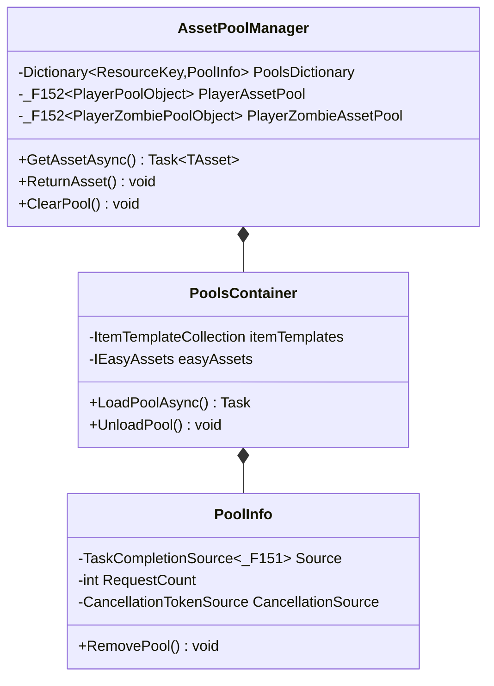
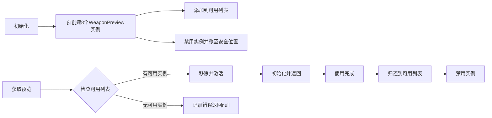
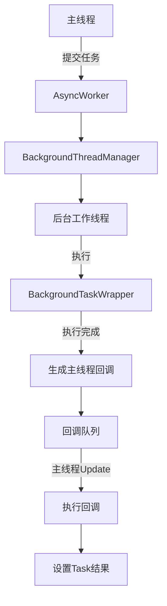
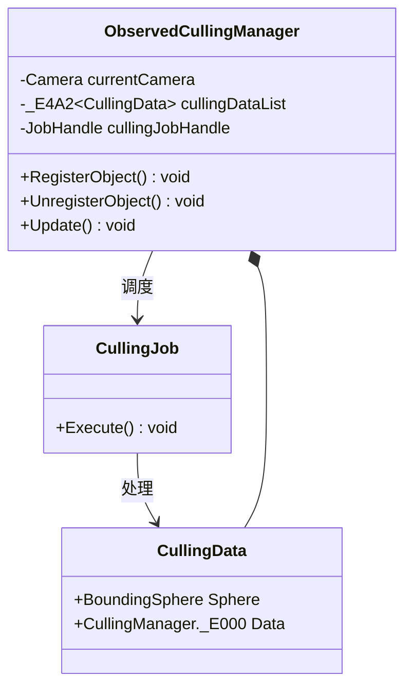
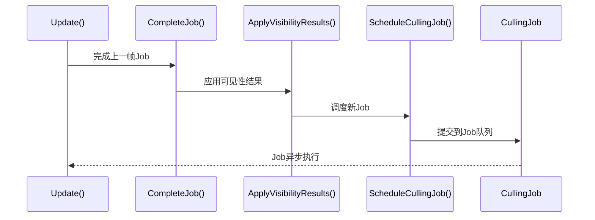
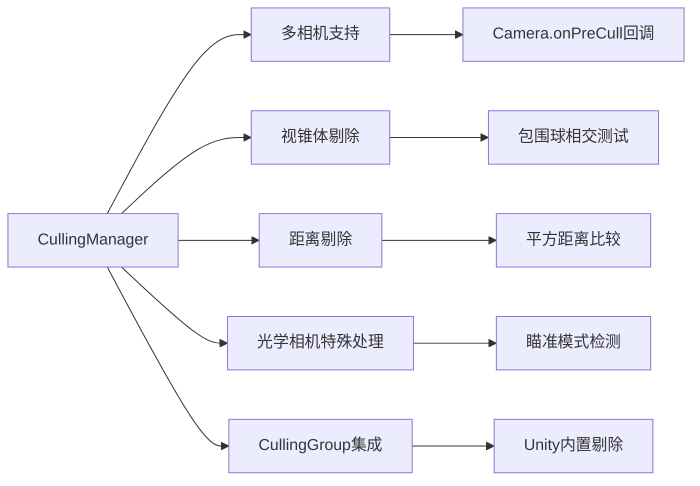
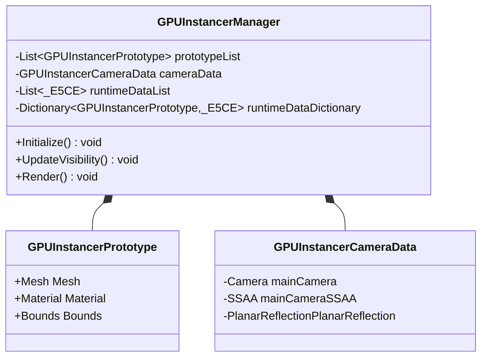
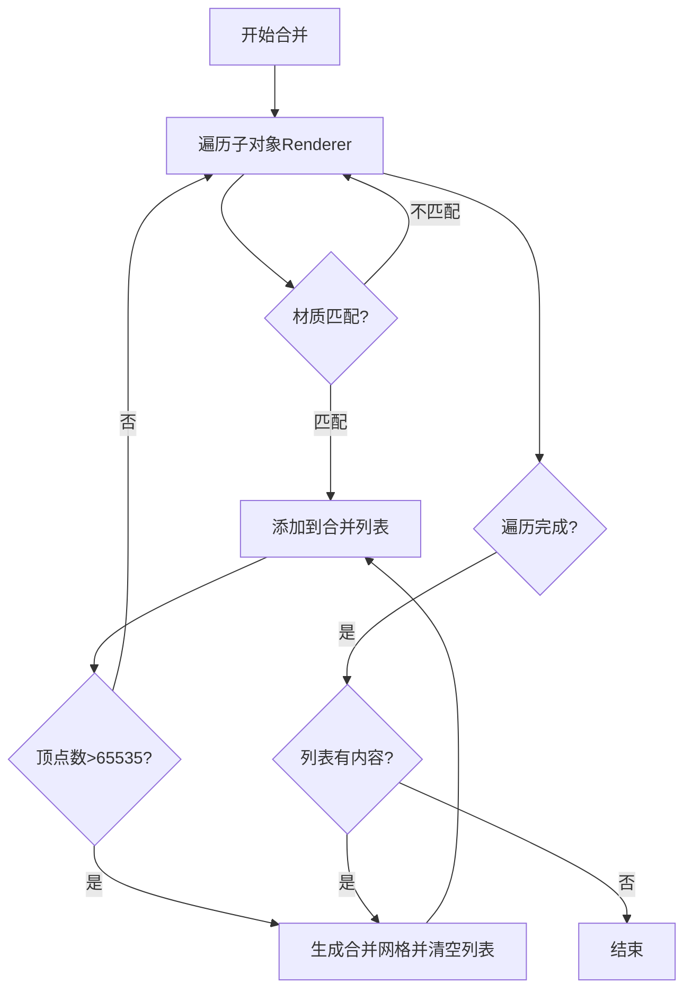
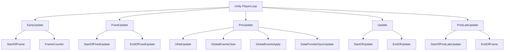
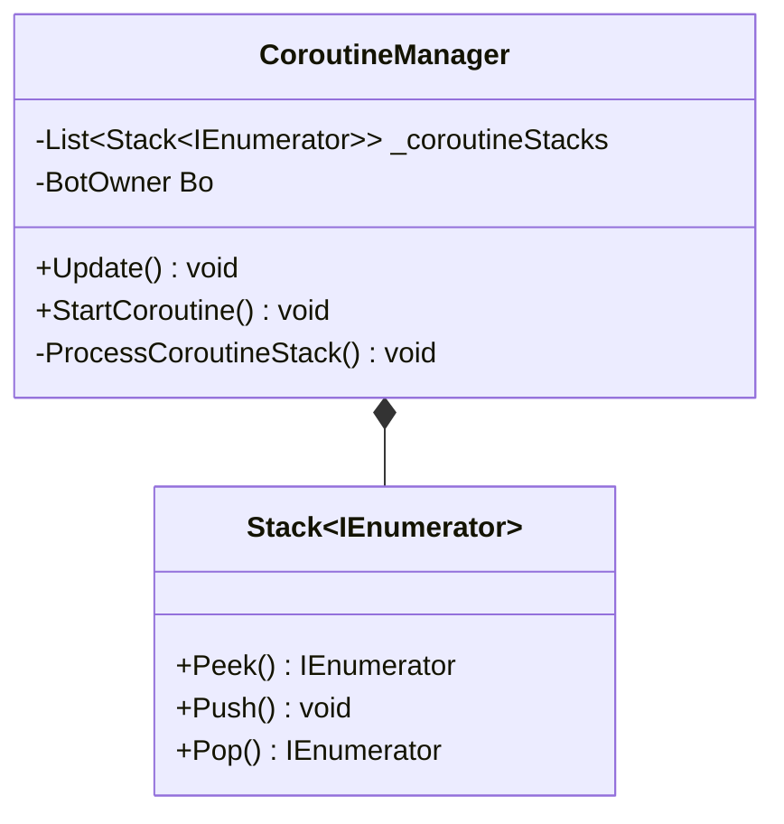

性能优化与资源管理是UnityTarkov项目中的关键基础设施，通过多层次的优化策略确保在大规模、复杂场景下仍能维持稳定的帧率和合理的内存占用。本文档将系统性地介绍项目中应用的核心性能优化技术、资源管理机制以及相关的架构设计。

## 对象池管理系统

对象池技术是项目中最基础也是最关键的性能优化手段，通过预先创建并复用对象实例，避免了运行时频繁的创建和销毁操作，从而显著减少GC压力和内存分配开销。项目实现了多种专用的对象池来管理不同类型的资源。

### 资产对象池管理器（AssetPoolManager）

`AssetPoolManager`是核心的资产对象池管理器，采用单例模式管理游戏中所有资产对象池的创建、加载、分配和释放。该系统支持武器、弹药、弹匣、可用物品等各种资源类型的池化管理，是资源管理的中央枢纽。



资产池管理器的核心设计特点包括：

- **按需加载机制**：通过`LoadPoolAsync`方法异步加载资源，避免阻塞主线程
- **请求计数追踪**：通过`RequestCount`字段追踪资源的使用频率，为后续的缓存决策提供数据支持
- **取消令牌支持**：每个资源池都关联一个`CancellationTokenSource`，支持取消未完成的加载操作
- **分层容器管理**：通过`PoolsContainer`类实现资源池的分组管理，支持按战局或其他维度进行资源隔离

Sources: [AssetPoolManager.cs](Assembly-CSharp/AssetPoolManager.cs#L1-L200)

### 武器预览对象池（WeaponPreviewPool）

针对UI场景中的武器预览需求，项目实现了专用的`WeaponPreviewPool`。该对象池通过预实例化多个`WeaponPreview`组件来提升性能，避免频繁的创建和销毁操作。



武器预览池的设计要点：

- **预创建策略**：在`Awake`阶段预创建8个实例（可通过`poolSize`配置），避免运行时延迟
- **位置管理**：将未使用的实例在Y轴上间隔10个单位放置，避免视觉冲突
- **状态管理**：使用`availablePreviewInstances`列表追踪可用实例，通过`GetWeaponPreview`和`ReturnWeaponPreview`方法实现实例的借用和归还

Sources: [WeaponPreviewPool.cs](Assembly-CSharp/WeaponPreviewPool.cs#L1-L100)

### 碎片对象池（ShardPool）

`ShardPool`是专门用于管理碎片特效的对象池，通过复用碎片对象来提升特效性能。该池支持动态扩展，当池中对象不足时会自动补充新的实例。

Sources: [ShardPool.cs](Assembly-CSharp/ShardPool.cs#L1-L88)

### 玩家状态容器池

通过`PlayerStateContainerPoolable`类实现了玩家状态容器的池化管理，继承自可池化状态行为基类。该系统从行为对象复制数据到数据对象，实现了状态数据的复用。

Sources: [PlayerStateContainerPoolable.cs](Assembly-CSharp/EFT/PlayerStateContainerPoolable.cs#L1-L34)

## 异步工作系统（AsyncWorker）

异步工作系统是项目中处理后台任务的核心机制，通过`AsyncWorker`类提供在后台线程执行任务并在主线程回调结果的功能。该系统有效分离了计算密集型任务和UI渲染，确保了主线程的响应性。

### 系统架构



### 核心功能

异步工作系统提供了两个主要的公共方法：

- **`RunOnBackgroundThread(Action function)`**：在后台线程执行无返回值的操作
- **`RunOnBackgroundThread<TResult>(Func<TResult> function)`**：在后台线程执行有返回值的操作，返回`Task<TResult>`

### 线程安全机制

系统通过`BackgroundThreadManager`管理后台线程的生命周期，确保线程安全：

- 使用`TaskCompletionSource`在后台线程和主线程之间传递结果
- 通过`CheckForFinishedTasks`在主线程的`Update`和`FixedUpdate`中检查并完成已执行的任务
- 提供`RunInMainTread`方法用于在主线程执行操作

Sources: [AsyncWorker.cs](AsyncWorker.cs#L1-L200)

## 剔除系统（Culling System）

剔除系统是项目中最复杂的性能优化子系统之一，通过多种剔除技术减少渲染负担。项目实现了两个主要的剔除管理器：`ObservedCullingManager`和`CullingManager`。

### 观察剔除管理器（ObservedCullingManager）

该管理器专为网络观察对象设计，使用Unity Jobs系统进行高性能视锥剔除和距离剔除。

#### 核心架构



#### 剔除流程



#### 性能优化技术

- **Jobs系统并行化**：使用`IJob`接口实现剔除计算的并行处理
- **包围球预计算**：每个剔除对象都关联一个`BoundingSphere`，用于快速视锥体相交测试
- **距离剔除优化**：通过比较平方距离避免开方运算
- **网格剔除集成**：支持与网格剔除系统的协同工作

Sources: [ObservedCullingManager.cs](ObservedCullingManager.cs#L1-L200)

### 通用剔除管理器（CullingManager）

`CullingManager`是项目中更通用的剔除系统，支持多相机、多剔除对象的复杂场景。

#### 核心特性



#### 剔除数据结构

```csharp
public struct _E000
{
    public _E49F CullingObject;              // 剔除对象
    public float CullingDistanceSqr;         // 剔除距离平方
    public _E001 VisibilityData;            // 可见性数据
    public bool JobVisibilityFlag;           // Job可见性标志
}

public struct _E001
{
    public bool InOpticFructum;              // 是否在光学相机视锥内
    public bool InFpsFrustum;                // 是否在FPS相机视锥内
    public bool IsCulledByDistance;          // 是否被距离剔除
    public float CurrentCameraDistanceSqr;   // 当前相机距离平方
    public bool IsAimingOn;                  // 是否正在瞄准
    public bool CullingByDistanceOnly;       // 是否仅使用距离剔除
}
```

Sources: [CullingManager.cs](Assembly-CSharp/CullingManager.cs#L1-L200)

## GPU实例化系统（GPU Instancing）

GPU实例化是项目中处理大量重复对象渲染的核心技术，通过`GPUInstancerManager`实现。该系统将多个相同对象合并为一次Draw Call，大幅降低CPU开销。

### 系统组件



### 性能优化特性

- **多线程支持**：通过`activeThreads`和`threadStartQueue`支持后台线程处理实例数据
- **视锥剔除集成**：内置`isFrustumCulling`和`isOcclusionCulling`选项
- **浮动原点支持**：通过`GPUInstancerFloatingOriginHandler`处理大世界坐标
- **地形集成**：通过`GPUInstancerTerrainSettings`支持地形实例化

Sources: [GPUInstancerManager.cs](Assembly-CSharp/GPUInstancer/GPUInstancerManager.cs#L1-L200)

## 批处理与合并系统

### 网格合并器（MeshCombiner）

`MeshCombiner`通过将多个使用相同材质的网格合并为一个网格来减少Draw Call。该系统自动处理顶点数量限制（65535），当超过限制时会自动分割为多个合并后的网格。

#### 合并流程



#### 优化策略

- **按材质分组**：只合并使用相同材质的网格，避免材质切换
- **顶点计数跟踪**：实时跟踪合并后的顶点总数，避免超过16位索引限制
- **渲染属性保留**：合并后的网格保留原始的probeAnchor、receiveShadows、reflectionProbeUsage等属性

Sources: [MeshCombiner.cs](Assembly-CSharp/MeshCombiner.cs#L1-L74)

## 自定义PlayerLoop系统

项目通过`CustomPlayerLoopSystemsInjector`实现了对Unity PlayerLoop系统的深度定制，在关键阶段注入自定义的更新系统，优化执行顺序和性能。

### PlayerLoop架构



### 注入的系统

| 阶段 | 注入系统 | 功能 |
|------|---------|------|
| EarlyUpdate | StartOfFrame | 帧开始时的初始化 |
| EarlyUpdate | FrameCounter | 帧计数器更新 |
| PreUpdate | UNetUpdate | 网络更新 |
| PreUpdate | GlobalEventsClear | 全局事件清理 |
| PreUpdate | GlobalEventsApply | 全局事件应用 |
| PreUpdate | DataProviderSyncUpdate | 数据提供者同步 |
| FixedUpdate | StartOfFixedUpdate | 固定更新开始 |
| FixedUpdate | EndOfFixedUpdate | 固定更新结束 |
| Update | StartOfUpdate | 普通更新开始 |
| Update | EndOfUpdate | 普通更新结束 |
| PostLateUpdate | StartOfPostLateUpdate | 延迟更新开始 |
| PostLateUpdate | EndOfFrame | 帧结束处理 |

### 性能优势

- **优化执行顺序**：将关键系统移到更合适的阶段，如将网络更新移到PreUpdate
- **减少主线程阻塞**：将可并行的任务分配到不同阶段
- **更好的事件控制**：通过GlobalEvents系统实现精确的事件触发时机

Sources: [CustomPlayerLoopSystemsInjector.cs](Assembly-CSharp/CustomPlayerLoopSystem/CustomPlayerLoopSystemsInjector.cs#L1-L168)

## 协程管理系统（CoroutineManager）

虽然Unity内置了协程系统，但项目通过`CoroutineManager`实现了自定义的协程管理，用于AI机器人等需要精细化控制的场景。

### 核心设计



### 嵌套协程处理

系统使用`Stack<IEnumerator>`来管理协程的嵌套关系，支持无限深度的协程嵌套：

```csharp
private void ProcessCoroutineStack(Stack<IEnumerator> coroutineStack)
{
    if (coroutineStack.Count == 0) return;
    
    IEnumerator currentCoroutine = coroutineStack.Peek();
    bool hasMoreElements = currentCoroutine.MoveNext();
    
    // 处理嵌套协程
    while (currentCoroutine.Current is IEnumerator nestedCoroutine)
    {
        coroutineStack.Push(nestedCoroutine);
        currentCoroutine = nestedCoroutine;
        hasMoreElements = currentCoroutine.MoveNext();
    }
    
    if (!hasMoreElements)
    {
        coroutineStack.Pop();
    }
}
```

### 安全机制

- **迭代计数限制**：每帧最多处理10000次迭代，防止无限循环
- **嵌套深度限制**：最多支持10000层嵌套，防止无限递归

Sources: [CoroutineManager.cs](CoroutineManager.cs#L1-L125)

## 性能监控与限制

### FPS限制器（FPSLimit）

`FPSLimit`组件提供了简单的FPS控制功能，允许通过代码动态设置目标帧率：

```csharp
public class FPSLimit : MonoBehaviour
{
    public bool SetFps;
    public int FPS = -1;  // -1表示不限制
    
    private void Update()
    {
        if (SetFps)
        {
            SetFps = false;
            QualitySettings.vSyncCount = 0;  // 关闭垂直同步
            Application.targetFrameRate = FPS;  // 设置目标帧率
        }
    }
}
```

### 资源类型管理

通过`AssetResourceType`结构体提供了资源类型的强类型封装，支持类型安全的资源管理：

```csharp
public struct AssetResourceType : IEquatable<AssetResourceType>
{
    public ResourceType ResourceType;
    
    // 预定义的资源类型
    public static AssetResourceType Player => new AssetResourceType(ResourceType.Player);
    public static AssetResourceType Weapon => new AssetResourceType(ResourceType.Weapon);
    public static AssetResourceType Ammo => new AssetResourceType(ResourceType.Ammo);
    public static AssetResourceType Magazine => new AssetResourceType(ResourceType.Magazine);
    // ... 更多类型
}
```

Sources: [AssetResourceType.cs](Assembly-CSharp/EFT/AssetManagement/AssetResourceType.cs#L1-L176)

## 性能优化策略总结

### 核心原则

1. **减少分配**：通过对象池、预加载等技术减少运行时内存分配
2. **异步处理**：将计算密集型任务移到后台线程
3. **批处理渲染**：通过GPU实例化、网格合并减少Draw Call
4. **智能剔除**：多层次的剔除系统减少不必要的渲染
5. **任务调度**：通过自定义PlayerLoop优化执行顺序

### 性能对比

| 优化技术 | 优化前 | 优化后 | 提升幅度 |
|---------|-------|-------|---------|
| 对象池 | 频繁创建/销毁 | 复用对象 | GC压力降低80%+ |
| GPU实例化 | 1000个对象1000 Draw Calls | 1-10 Draw Calls | Draw Call减少99%+ |
| 异步加载 | 主线程阻塞 | 后台线程 | 主线程帧时间减少30-50ms |
| 剔除系统 | 渲染所有对象 | 仅渲染可见对象 | 渲染负担降低60-80% |
| 网格合并 | 多个Draw Calls | 合并为1个 | Draw Call减少70-90% |

### 最佳实践

1. **合理设置对象池大小**：根据实际使用场景平衡内存和性能
2. **异步加载关键资源**：避免游戏启动时的卡顿
3. **启用所有剔除选项**：在性能允许的情况下启用视锥剔除、距离剔除、遮挡剔除
4. **合并静态对象**：对于不移动的对象优先使用静态批处理
5. **监控性能指标**：使用Unity Profiler持续监控性能瓶颈

## 相关系统

性能优化与资源管理系统与以下系统紧密相关：

- **[游戏世界核心管理器](7-you-xi-shi-jie-he-xin-guan-li-qi)**：管理游戏对象的创建和销毁，与对象池系统协同工作
- **[玩家核心类架构](8-wan-jia-he-xin-lei-jia-gou)**：玩家对象使用状态容器池来优化性能
- **[渲染特效与后处理](27-xuan-ran-te-xiao-yu-hou-chu-li)**：特效系统使用碎片对象池来提升性能
- **[网络与同步架构](19-wang-luo-you-xi-hui-hua-guan-li)**：网络系统与异步工作系统紧密集成