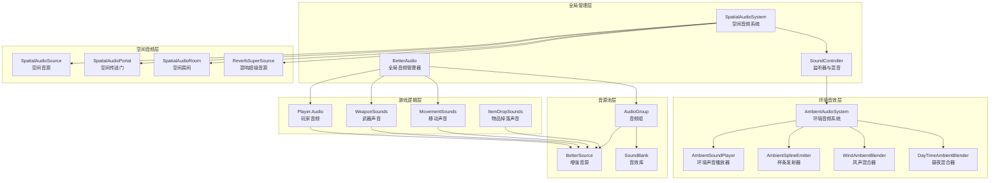

Escape from Tarkov Unity 项目的音频系统是一个高度模块化、性能优化的空间音频架构，旨在提供沉浸式的游戏听觉体验。该系统集成了先进的空间化技术、环境声音混合、动态遮蔽处理和智能音源管理，能够根据玩家位置、环境条件和游戏状态实时调整音频表现。

## 系统架构概览

音频系统采用分层架构设计，从底层的空间音频处理到上层的游戏逻辑集成，形成了完整的声音生态系统。核心管理器 `BetterAudio` 作为单例负责全局音频协调，`SpatialAudioSystem` 处理三维空间音频计算，`AmbientAudioSystem` 管理环境声音氛围，而 `SoundController` 则提供监听器管理和音频混音路由。

Sources: [BetterAudio.cs](Assembly-CSharp/BetterAudio.cs#L1-L200), [SpatialAudioSystem.cs](Assembly-CSharp/Audio/SpatialSystem/SpatialAudioSystem.cs#L1-L200), [SoundController.cs](Assembly-CSharp/EFT/SoundController.cs#L1-L143)

## 核心音频组件

### BetterAudio 全局管理器

`BetterAudio` 是音频系统的核心单例管理器，负责协调整个游戏的音频子系统。它实现了音频分组管理、音源池化和性能优化三大核心功能。系统定义了 19 种音频分组类型，每种类型对应不同的音频混音器和空间化设置，包括枪声、武器操作、撞击、角色动作、环境音效、语音通信等专用通道。

Sources: [BetterAudio.cs](Assembly-CSharp/BetterAudio.cs#L20-L40)

### BetterSource 增强音源

`BetterSource` 是 Unity `AudioSource` 的增强封装，提供了遮蔽检测、空间化处理和智能音量管理功能。每个增强音源都配备 `SpatialLowPassFilter` 低通滤波器和 `BaseSpatialAudioSource` 空间化组件，能够根据音源与监听器的物理关系实时调整音频表现。音源采用对象池模式管理，支持高效的音源复用和资源回收。

Sources: [BetterSource.cs](Assembly-CSharp/BetterSource.cs#L1-L150)

### SoundBank 音效库

`SoundBank` 是音频数据的容器，使用 `ScriptableObject` 实现，存储了音频片段及其播放参数。每个音效库包含基础音量、音调、衰减距离、环境变体等配置，支持距离混合（`DistanceBlendOptions`）和随机化播放。系统通过环境类型（`EnvironmentType`）索引不同的音频变体，实现同一音效在不同环境条件下的差异化表现。

Sources: [SoundBank.cs](Assembly-CSharp/EFT/SoundBank.cs#L1-L150)

## 空间音频系统

### 空间化架构

空间音频系统基于房间-传送门模型（Room-Portal Model）实现，将游戏场景划分为多个声学房间，通过传送门连接。`ISpatialAudioRoom` 接口定义了房间的基本属性，包括类型、名称、边界、隔离状态和房间尺寸。`SpatialAudioPortal` 作为连接房间的通道，能够根据门、窗等交互对象的状态动态调整声音传播特性。

Sources: [ISpatialAudioRoom.cs](Assembly-CSharp/Audio/SpatialSystem/ISpatialAudioRoom.cs#L1-L33), [SpatialAudioPortal.cs](Assembly-CSharp/Audio/SpatialSystem/SpatialAudioPortal.cs#L1-L150)

### 遮蔽与阻隔处理

系统通过射线检测和空间拓扑分析计算音频的遮蔽程度，将音源分为三种混音状态：直射（`DirectGroup`）、阻隔（`ObstructedGroup`）和完全遮挡（`OccludedGroup`）。每种状态对应不同的音频混音器组，应用低通滤波、音量衰减和混响调整，模拟真实的声音传播物理特性。`BaseSpatialAudioSource` 抽象类定义了空间化参数接口，包括 HRTF 强度、方向性强度、混响发送量和体积半径。

Sources: [SoundController.cs](Assembly-CSharp/EFT/SoundController.cs#L30-L45), [BaseSpatialAudioSource.cs](Assembly-CSharp/Audio/SpatialSystem/BaseSpatialAudioSource.cs#L1-L57)

### 混响系统

混响子系统通过 `ReverbSuperSource` 实现双通道混响播放，支持早期反射（`EarlyReflectionsSendDB`）和后期混响（`ReverbSendDB`）的独立控制。系统为每个音源配置专用的混响音源，通过空间化参数调整混响的空间感知，避免混响声音的定位模糊问题。`ReverbSimpleSource` 提供简化版的混响实现，用于不需要复杂空间化的场景。

Sources: [ReverbSuperSource.cs](Assembly-CSharp/Audio/ReverbSubsystem/ReverbSuperSource.cs#L1-L148)

## 环境音频子系统

### 环境声音混合

`AmbientAudioSystem` 管理整个游戏的环境声音生态系统，整合了多种混合器实现动态环境音效生成。`DayTimeAmbientBlender` 根据时间混合昼夜环境音效，`WindAmbientBlender` 根据风速调整风声强度，`PrecipitationAmbientBlender` 控制雨雪音效的层次。系统支持季节性音频数据（`SeasonAmbientSoundDataSO`），能够根据当前季节状态切换不同的环境音效配置。

Sources: [AmbientAudioSystem.cs](Assembly-CSharp/Audio/AmbientSubsystem/AmbientAudioSystem.cs#L1-L150)

### 样条发射器

`AmbientSplineEmitter` 系列组件实现了沿路径移动的环境音效发射器。`AbstractSplineMappedEmitter` 提供基础抽象，`AmbientPlayerSplineMappedEmitter` 实现玩家跟随样条音效，`SplineEmitterPathMover` 负责沿样条路径的移动逻辑。这种技术常用于模拟连续的环境声音，如风在建筑物间的流动、河流沿路径的声音传播等。

Sources: [AmbientSubsystem 目录结构](Assembly-CSharp/Audio/AmbientSubsystem/AmbientSplineEmitter/)

### 房间环境音效

`RoomAmbientSoundPlayer` 专门处理房间内部的环境音效，支持房间隔离检测和房间音调播放。`SoundPointsManager` 管理场景中的声音触发点，`SoundPoint` 作为单个声音触发单元，支持基于距离的激活和随机播放。系统能够根据玩家所在房间自动切换环境音效，增强空间沉浸感。

Sources: [AmbientSoundPlayer.cs](Assembly-CSharp/Audio/AmbientSubsystem/AmbientSoundPlayer.cs#L1-L24)

## 武器与交互声音

### 武器声音系统

`WeaponSounds` 脚本对象集中管理所有武器相关的音效库，包括手雷掉落、弹壳碰撞（支持多种口径和表面类型）、物品撞击声和瞄准镜声音等。系统为不同口径的弹壳（9mm、12号、5.56mm、重型）在不同表面（混凝土、金属、土壤、木头、塑料）上的碰撞声提供了专门的音效库，确保物理反馈的准确性。

Sources: [WeaponSounds.cs](Assembly-CSharp/EFT/WeaponSounds.cs#L1-L89)

### 移动声音系统

`MovementSounds` 定义了玩家各种移动状态对应的声音效果，包括奔跑、冲刺、停止、落地、转向、蹲下、趴下、跳跃等动作的音效库。系统根据玩家移动速度和表面类型动态选择合适的音效，支持装备重量对脚步声音的影响。`Player.Audio` 部分集成了移动声音的播放逻辑，与玩家的运动状态机紧密配合。

Sources: [MovementSounds.cs](Assembly-CSharp/EFT/MovementSounds.cs#L1-L30), [Player.Audio.cs](Assembly-CSharp/EFT/Player.Audio.cs#L1-L150)

### 物品交互声音

`ItemDropSounds` 管理物品掉落和碰撞的声音效果，通过 `ItemDropSurfaceSet` 将表面类型与音效库关联。系统使用能量曲线（`EnergyToVolumeCurve`）根据掉落能量计算音量，模拟真实的物理碰撞反馈。支持的表面类型包括混凝土、金属、玻璃、塑料等多种材质，每种材质都有独特的声音特性。

Sources: [ItemDropSounds.cs](Assembly-CSharp/EFT/ItemGameSounds/ItemDropSounds.cs#L1-L43)

## 音频分组与混音

### 音频分组类型

系统定义了 19 种音频分组类型，每种类型都有专门的混音器和空间化设置。下表列出了主要的分组类型及其用途：

| 分组类型 | 用途 | 空间化 | 优先级 |
|---------|------|--------|--------|
| Gunshots | 枪声 | 是 | 高 |
| Weaponry | 武器操作 | 是 | 中 |
| Impacts | 撞击声 | 是 | 高 |
| Character | 角色动作 | 是 | 中 |
| Environment | 环境音效 | 可选 | 低 |
| Speech | 语音对话 | 是 | 高 |
| Distant | 远距离音效 | 否 | 低 |
| Voip | 玩家语音 | 是 | 最高 |
| Grenades | 手雷爆炸 | 是 | 高 |
| Windows | 窗户破碎 | 是 | 中 |
| InteractiveObjects | 交互对象 | 是 | 中 |

Sources: [BetterAudio.cs](Assembly-CSharp/BetterAudio.cs#L20-L40)

### 混音器路由

`SoundController` 提供三种混音器组路由：`OccludedGroup`（遮挡）、`DirectGroup`（直射）和 `ObstructedGroup`（阻隔）。系统根据音源与监听器之间的物理关系动态切换路由，应用不同的音频处理效果。监听器变换（`AudioListenerTransform`）的位置实时更新，确保空间音频计算的准确性。

Sources: [SoundController.cs](Assembly-CSharp/EFT/SoundController.cs#L30-L45)

## 性能优化策略

### 音频剔除

`AudioSourceCulling` 组件实现了基于距离和可见性的音源剔除，只播放玩家可感知范围内的音效。`SyncLoopSoundPlayer` 支持循环音效的同步播放，避免多音源同时播放造成的性能开销。系统使用帧计数间隔（`_frameCountUpdateInterval`）控制环境音效的更新频率，平衡音效质量和性能。

Sources: [AudioCulling/SyncLoopSoundPlayer.cs](Assembly-CSharp/Audio/AudioCulling/SyncLoopSoundPlayer.cs#L1-L50)

### 音源池化

`BetterAudio` 实现了两种音源池策略：单例池（`_E001`）和堆栈池（`_E002`）。单例池用于高频播放的音效，如枪声和脚步声，减少对象创建和销毁开销。堆栈池用于低频播放的音效，支持动态扩展和收缩，内存占用更灵活。系统通过 `BorrowSource` 和 `Release` 方法管理音源的生命周期。

Sources: [BetterAudio.cs](Assembly-CSharp/BetterAudio.cs#L50-L150)

### 异步加载

`SpatialAudioSystem` 使用异步任务（`Task`）加载空间音频数据，避免阻塞主线程。系统支持进度报告（`IProgress<float>`），能够向 UI 反馈加载进度。异步加载器（`_E000`）实现了协程式的异步等待，确保空间音频系统在数据加载完成后才初始化。

Sources: [SpatialAudioSystem.cs](Assembly-CSharp/Audio/SpatialSystem/SpatialAudioSystem.cs#L50-L100)

## 扩展功能

### 主动降噪耳机支持

`ActiveHeadphones` 模块支持多种降噪耳机类型的音效补偿，包括编辑器模板（`EditorHeadphonesTemplate`）和模板存储（`HeadphonesTemplateStorage`）。系统能够根据耳机型号自动调整音频参数，提供最佳的听觉体验。

Sources: [ActiveHeadphones 目录结构](Assembly-CSharp/Audio/ActiveHeadphones/)

### 车辆音效

`Vehicles` 模块实现了车辆专用音效系统，包括 BTR 装甲车音效控制器（`BtrSoundController`）、车门声音处理器（`BtrDoorSoundHandler`）、悬挂音效控制器（`SoundSuspensionController`）和塔台音效播放器（`BtrTurretSoundPlayerController`）。系统支持车辆移动状态（`EVehicleMovementStatus`）音效切换，模拟真实的机械运转声音。

Sources: [Vehicles 目录结构](Assembly-CSharp/Audio/Vehicles/)

### 无线电系统

`RadioSystem` 实现了空间化的广播播放，`ClientSpatialBroadcastPlayer` 支持空间化广播音效，集成 MetaXR 空间音频源和实验性功能。系统支持人声方向性模式（`HumanVoice`）、HRTF 强度调整和体积半径设置，实现逼真的无线电通信效果。

Sources: [ClientSpatialBroadcastPlayer.cs](Assembly-CSharp/Audio/RadioSystem/ClientSpatialBroadcastPlayer.cs#L1-L81)

## 系统集成与最佳实践

### 玩家音频集成

`Player.Audio` 部分展示了音频系统与游戏逻辑的深度集成。玩家音频控制器在初始化时加载所有必要的音效资源，包括装备声音（`GearSoundBank`）、护目镜切换音效（`FaceShieldOn/Off`）、夜视仪音效（`NightVisionOn/Off`）等。系统通过 `SurfaceSet` 管理不同表面的脚步声音，支持季节性音效数据切换。

Sources: [Player.Audio.cs](Assembly-CSharp/EFT/Player.Audio.cs#L1-L150)

### 事件驱动播放

系统通过 `GenericEventTranslator` 和事件订阅机制实现声音的事件驱动播放。`OnSoundBankPlay` 事件允许游戏逻辑触发预定义的音效库播放，`AudioGameEventsController` 管理游戏事件与音频播放的映射。这种解耦设计使音频播放逻辑与游戏业务逻辑分离，提高了代码可维护性。

Sources: [AmbientAudioSystem.cs](Assembly-CSharp/Audio/AmbientSubsystem/AmbientAudioSystem.cs#L1-L150)

### 调试与配置

系统提供丰富的调试工具和配置选项。`AudioTester` 组件用于测试音频系统的各个模块，`DebugSoundOcclusion` 可视化显示遮蔽计算结果。`AudioSpatialSettings` 和 `AudioGroupPreset` 提供了详细的音频参数配置，包括衰减曲线、扩散设置、优先级和声学参数。

Sources: [SpatialAudioSettings.cs](Assembly-CSharp/Audio/SpatialSystem/SpatialAudioSettings.cs)

## 下一步学习

音频系统与游戏的其他核心系统紧密集成。建议按以下顺序继续学习：

- [渲染特效与后处理](27-xuan-ran-te-xiao-yu-hou-chu-li) - 了解视觉与音频的协同效果
- [玩家核心类架构](8-wan-jia-he-xin-lei-jia-gou) - 深入理解音频与玩家状态的交互
- [网络与同步架构](19-wang-luo-you-xi-hui-hua-guan-li) - 学习音频的网络同步机制
- [物品与背包系统](11-wu-pin-ji-lei-yu-zu-jian-xi-tong) - 了解物品交互声音的实现细节