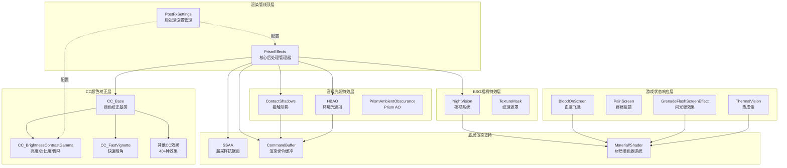

本文档深入剖析Tarkov Unity项目的渲染特效与后处理系统架构，涵盖从核心框架到具体实现的完整技术链条。该系统采用模块化设计，集成多种视觉特效，实现了高质量的画面表现力与性能优化的平衡。

## 系统架构概览

渲染特效与后处理系统采用分层架构设计，从底层的CommandBuffer渲染管线到上层的游戏状态反馈，形成完整的视觉特效栈。核心架构由PrismEffects统一管理器、CC颜色校正模块、BSG相机特效库以及游戏状态响应系统组成。

Sources: [PrismEffects.cs](Assembly-CSharp/PrismEffects.cs#L1-L220), [CC_Base.cs](Assembly-CSharp/CC/CC_Base.cs#L1-L56), [PostFxSettings.cs](Assembly-CSharp/BSG/GameSettings/PostFxSettings.cs#L1-L85)

## PrismEffects核心后处理管理器

PrismEffects是整个后处理系统的中央协调器，采用统一渲染管线管理多种视觉特效。该组件通过[RequireComponent(typeof(Camera))]确保与相机绑定，使用[ExecuteInEditMode]支持编辑器预览。其架构设计支持主从关系，通过isParentPrism和isChildPrism标志实现多相机渲染同步。

**核心配置参数**涵盖了从基础渲染到高级特效的完整参数集。Bloom系统支持HDR和LDR两种类型，通过bloomDownsample（1-12级）和bloomBlurPasses（可配置次数）实现灵活的性能控制。Vignette效果提供从vignetteStart（0.9）到vignetteEnd（0.4）的径向渐变控制。深度场系统包含近焦距离（dofNearFocusDistance: 15f）、焦点距离（dofFocusDistance: 15f）和散景因子（dofBokehFactor: 60f）等核心参数。

Sources: [PrismEffects.cs](Assembly-CSharp/PrismEffects.cs#L8-L220)

### Bloom特效实现

Bloom特效采用多级下采样与高斯模糊相结合的算法。系统首先将源纹理下采样bloomDownsample次，然后执行bloomBlurPasses次模糊处理，最后以bloomIntensity（默认0.15）强度与原图混合。bloomThreshold参数（-2到2范围）控制亮度截断，低于该阈值的像素不会产生光晕。bloomUseScreenBlend标志决定使用屏幕混合模式还是加法混合模式。

Sources: [PrismEffects.cs](Assembly-CSharp/PrismEffects.cs#L55-L78)

### 深度场与景深

深度场系统支持近场模糊（useNearDofBlur）和全屏模糊（useFullScreenBlur）两种模式。采样量由DoFSamples枚举控制，提供不同精度的性能选项。dofBlurSkybox标志控制天空盒是否应用模糊，增强场景深度感。系统通过计算像素深度与焦平面的距离，应用不同强度的模糊效果。

Sources: [PrismEffects.cs](Assembly-CSharp/PrismEffects.cs#L179-L200)

## CC颜色校正系统

CC（Color Correction）系统采用面向对象设计，所有颜色校正效果继承自CC_Base基类。该基类提供统一的材质管理、SSAA支持和线性颜色空间检测功能。系统包含40余种独立的颜色校正效果，每个效果都是独立的MonoBehaviour组件，可灵活组合使用。

**基类核心功能**：material属性延迟创建材质实例，确保资源高效利用；IsLinear()静态方法检测当前颜色空间；OnStart()方法验证shader支持性，不支持的自动禁用组件；OnDisable()方法清理资源，防止内存泄漏。

Sources: [CC_Base.cs](Assembly-CSharp/CC/CC_Base.cs#L4-L56)

### 亮度、对比度与伽马校正

CC_BrightnessContrastGamma是使用最频繁的颜色校正效果之一。brightness参数（-100到100）控制图像亮度，contrast参数（-100到100）调整对比度，gamma参数（0.1到9.9）应用伽马曲线。系统还提供红、绿、蓝三通道的独立系数控制（redCoeff、greenCoeff、blueCoeff，范围0-1），实现精细的色彩平衡。

Shader参数通过Vector4传递，第一个Vector4包含归一化的亮度、对比度和伽马值，第二个Vector4包含RGB通道系数。当所有参数为默认值时，系统跳过处理直接blit，优化性能。

Sources: [CC_BrightnessContrastGamma.cs](Assembly-CSharp/CC/CC_BrightnessContrastGamma.cs#L5-L54)

### 快速暗角效果

CC_FastVignette通过径向距离计算实现高效的暗角效果。center参数（Vector2，默认0.5, 0.5）定义暗角中心，sharpness参数（-100到100）控制过渡边缘的锐度，darkness参数（0到100）调整暗角强度。desaturate标志启用时，暗角区域还会应用去饱和效果。

Shader接收一个Vector4参数，前两个分量是中心坐标，第三个分量是锐度（乘以0.01归一化），第四个分量是暗度（乘以0.02归一化）。系统使用DebugGraphics.Blit进行渲染，支持调试模式下的可视化。

Sources: [CC_FastVignette.cs](Assembly-CSharp/CC/CC_FastVignette.cs#L6-L34)

## BSG相机特效系统

BSG.CameraEffects命名空间包含游戏特定的相机特效实现，与EFT游戏逻辑深度集成。这些特效通常与玩家状态、装备和游戏事件直接关联。

### 夜视系统

NightVision是高度集成的夜视系统，支持多种护目镜类型和动态开关效果。系统通过TextureMask组件应用不同的遮罩纹理，包括ThermalMaskTexture（热成像遮罩）、AnvisMaskTexture（AN/PVS-14遮罩）、BinocularMaskTexture（双筒望远镜遮罩）、GasMaskTexture（防毒面具遮罩）和OldMonocularMaskTexture（旧式单筒遮罩）。

**动态开关系统**：BlackFlashGoingToOn和BlackFlashGoingToOff动画曲线控制开关时的黑屏闪烁效果，模拟真实夜视仪的启动过程。SwitchOn和SwitchOff音频提供开关声效反馈。系统通过_E49A状态机管理开关状态，InProcessSwitching属性反映当前是否在切换过程中。

**渲染参数**：Intensity参数控制整体强度，Noise和NoiseScale/NoiseIntensity参数控制噪点效果，Color参数定义夜视色调（通常为绿色）。ambientFactor（默认1.2f）调整环境光贡献，模拟夜视仪对微光的增强能力。

Sources: [NightVision.cs](Assembly-CSharp/BSG/CameraEffects/NightVision.cs#L12-L200)

## 游戏状态响应特效

游戏状态响应特效系统将玩家健康、伤害和环境交互等游戏状态转化为视觉反馈，增强沉浸感和信息传达。

### 血液飞溅效果

BloodOnScreen系统模拟玩家受到伤害时护目镜上的血液飞溅。系统采用粒子系统生成血滴，每个血滴具有独立的生命周期、缩放和运动轨迹。血液颜色通过BloodColor参数配置，Refraction参数（默认0.022f）控制折射效果，模拟液体光学特性。

**血滴生成参数**：InitialBloodDrops（初始血滴数，默认3）、MaxBloodTime（最大存在时间，默认5秒）、StartScaleDimension（初始尺寸范围1.5-2.2）、EndScaleDimension（结束尺寸范围0.3-0.7）控制血滴的生命周期和形变。DropCountRange（5-10）和DropLifetimeDistribution（0.05-1）控制每帧生成的血滴数量和寿命分布。

**颜色分级系统**：提供RGB三通道独立的输入/输出曲线，通过InputMin/Max/Gamma和OutputMin/Max参数实现精确的色彩调整，模拟血液在护目镜上的色彩变化。

Sources: [BloodOnScreen.cs](Assembly-CSharp/BloodOnScreen.cs#L6-L200)

### 疼痛反馈

PainScreen是最简洁的状态反馈特效，通过单一参数_value（0-1范围）控制疼痛强度。系统使用专用材质应用红色或暗色叠加效果，强度与_value线性相关。虽然简单，但提供了清晰的伤害状态视觉提示。

Sources: [PainScreen.cs](Assembly-CSharp/PainScreen.cs#L3-L24)

### 闪光弹效果

GrenadeFlashScreenEffect模拟闪光弹致盲效果。EffectStrength属性控制当前致盲强度，WhiteBlack动画曲线定义从白屏到黑屏的衰减过程。系统通过修改PrismEffects.toneValues（色调值）实现曝光调整，模拟视觉适应过程。

Explode方法触发闪光效果，记录当前时间（_E003）和闪光强度（_E004）。OnRenderImage方法中，系统计算经过时间占总时长的比例，应用WhiteBlack曲线计算当前不透明度，通过FlashMaterial渲染到屏幕。Shader全局参数_BlindnessCoef（ID: 117025）供其他系统查询致盲状态。

Sources: [GrenadeFlashScreenEffect.cs](Assembly-CSharp/GrenadeFlashScreenEffect.cs#L5-L96)

### 热成像系统

ThermalVision是复杂的热成像渲染系统，集成多种视觉畸变效果。系统支持噪声、运动模糊、故障和像素化四种视觉干扰，分别通过ThermalVisionUtilities、MotionBlurUtilities、GlitchUtilities和PixelationUtilities类实现。

**Unsharp Mask增强**：UnsharpRadiusBlur（默认5f）和UnsharpBias（默认2f）参数控制锐化增强，提升热成像图像的边缘对比度。ChromaticAberrationThermalShift（默认0.013f）参数应用热成像特有的色差偏移。

**CommandBuffer渲染**：系统使用两个CommandBuffer分别注册到BeforeForwardAlpha和AfterForwardAlpha事件，实现多pass渲染。热成像状态通过全局Shader参数（_E019: 116562）传播到整个渲染管线。

Sources: [ThermalVision.cs](Assembly-CSharp/ThermalVision.cs#L10-L200)

## 高级光照特效

### 接触阴影

ContactShadows使用光线步进算法生成高质量接触阴影。系统在屏幕空间从每个像素向光源投射光线，检测遮挡情况。_rejectionDepth参数（0-5）控制深度剔除阈值，_sampleCount（0-32）定义光线采样次数，_temporalFilter（0-1）应用时域滤波减少闪烁。

**噪声优化**：系统使用NoiseTextureSet提供蓝噪声纹理，通过采样模式化噪声分布，提升视觉质量。_downsample标志启用2倍下采样，大幅降低性能开销。_contrast参数（0-1）调整阴影对比度。

**渲染流程**：OnPreCull方法初始化CommandBuffer，将渲染命令注册到LightEvent.AfterScreenspaceMask事件。OnPreRender方法移除命令缓冲并清理资源，确保下一帧正确执行。系统自动检测_E05F.Instance.LightObject获取主光源。

Sources: [ContactShadows.cs](Assembly-CSharp/PostEffects/ContactShadows.cs#L8-L200)

### HBAO环境光遮挡

HBAO（Horizon-Based Ambient Occlusion）提供高质量的环境光遮挡效果。系统支持2x和4x去交错采样，通过多pass渲染实现性能优化。RenderTexture数组（m__E000[16]、m__E001[16]、m__E002[16]）管理中间渲染结果，RenderBuffer数组支持MRT（多重渲染目标）。

**渲染策略**：Deinterleaving枚举选择采样策略（无去交错、2x或4x）。系统根据选择调用_E002（单pass）、_E003（2x）或_E004（4x）方法。CheckParameters方法验证渲染目标尺寸，UpdateShaderProperties和UpdateShaderKeywords更新shader参数和关键字。

**CommandBuffer集成**：_E007 CommandBuffer注册到"AO Pass"事件，实现与主渲染管线的无缝集成。useTriangleBlit标志控制使用三角形blit还是四边形blit，影响性能和质量平衡。

Sources: [HBAO.cs](Assembly-CSharp/HBAO.cs#L9-L100)

## 后处理设置管理

PostFxSettings类提供完整的后处理设置UI和持久化系统。该类继承SettingsBase<PostFxSettings>，支持设置序列化、加载和保存。所有设置项通过GameSetting<T>包装，提供自动验证和范围限制功能。

**核心设置项**：EnablePostFx（启用后处理）、Brightness（亮度，0-100）、Saturation（饱和度，0-100）、Clarity（清晰度，0-100）、Colorfulness（色彩度，0-100）控制基础图像调整。LumaSharpen（亮度锐化）和AdaptiveSharpen（自适应锐化）提供两种锐化算法。

**高级设置**：ColorFilterType（CC_Vintage.Filter枚举）和Intensity参数应用复古滤镜效果。ColorBlindnessType（GradingPostFX.ColorBlindMode枚举）和ColorBlindnessIntensity支持色盲辅助，包含Deuteranopia（绿色盲）、Tritanopia（蓝色盲）和Protanopia（红色盲）三种模式。

Sources: [PostFxSettings.cs](Assembly-CSharp/BSG/GameSettings/PostFxSettings.cs#L12-L68)

## 渲染管线集成

渲染特效系统通过多种方式与Unity渲染管线集成，实现灵活的渲染顺序控制。

**CommandBuffer集成**：NightVision、ThermalVision和ContactShadows使用CommandBuffer在特定渲染事件注入自定义渲染逻辑。常见的事件包括BeforeImageEffects、AfterForwardAlpha和LightEvent.AfterScreenspaceMask。CommandBuffer支持多pass渲染，减少绘制调用。

**OnRenderImage回调**：CC系统、BloodOnScreen、PainScreen和GrenadeFlash使用OnRenderImage方法，这是Unity标准的图像效果接口。系统通过SSAAPropagator与超采样系统协作，获取正确的源和目标渲染纹理。

**Shader全局参数**：系统通过Shader.SetGlobalFloat/SetGlobalTexture传播状态，如GrenadeFlash的_BlindnessCoef和ThermalVision的热成像状态。这允许其他shader查询这些状态，实现跨特效的协同。

Sources: [NightVision.cs](Assembly-CSharp/BSG/CameraEffects/NightVision.cs#L177-L184), [ContactShadows.cs](Assembly-CSharp/PostEffects/ContactShadows.cs#L152-L172)

## 性能优化策略

渲染特效系统实现了多层性能优化策略，确保在保持视觉质量的同时维持稳定帧率。

**早期退出**：CC_BrightnessContrastGamma在参数为默认值时跳过处理，直接blit源纹理到目标。BloodOnScreen和NightVision在效果强度为0时禁用渲染，减少无效计算。

**下采样优化**：ContactShadows的_downsample标志启用2倍下采样，将像素数量减少75%。Bloom的bloomDownsample参数控制下采样级别，更高级别带来更好性能但降低光晕精度。

**时域滤波**：ContactShadows的_temporalFilter参数应用指数移动平均，减少帧间闪烁。计算公式为weight = pow(1 - temporalFilter, 2)，确保平滑过渡。

**资源共享**：CC_Base的material属性延迟创建，避免未启用特效的资源开销。NightVision复用Material实例，通过OnDisable清理时使用DestroyImmediate或Destroy（根据Application.isPlaying判断）。

Sources: [CC_BrightnessContrastGamma.cs](Assembly-CSharp/CC/CC_BrightnessContrastGamma.cs#L44-L48), [ContactShadows.cs](Assembly-CSharp/PostEffects/ContactShadows.cs#L116-L118)

## 特效组合与交互

多种特效可以同时激活，形成复杂的视觉组合。系统通过精心设计的交互逻辑避免冲突和视觉混乱。

**PrismEffects中心化**：作为主管理器，PrismEffects控制Bloom、Vignette、NightVision、Noise、ChromaticAberration等核心特效的渲染顺序和参数传递。GrenadeFlash通过修改PrismEffects.toneValues间接影响色调映射，实现自然的曝光过渡。

**状态同步**：NightVision和ThermalVision共享开关状态管理逻辑，通过_E49A状态机实现平滑过渡。两个系统都支持FastForwardSwitch方法，立即完成过渡用于快速切换。

**SSAA协作**：所有特效通过SSAAPropagator或SSAA组件与超采样系统协作。SSAAPropagator.GetSourceDestination获取正确的源和目标渲染纹理，确保渲染分辨率匹配当前采样设置。