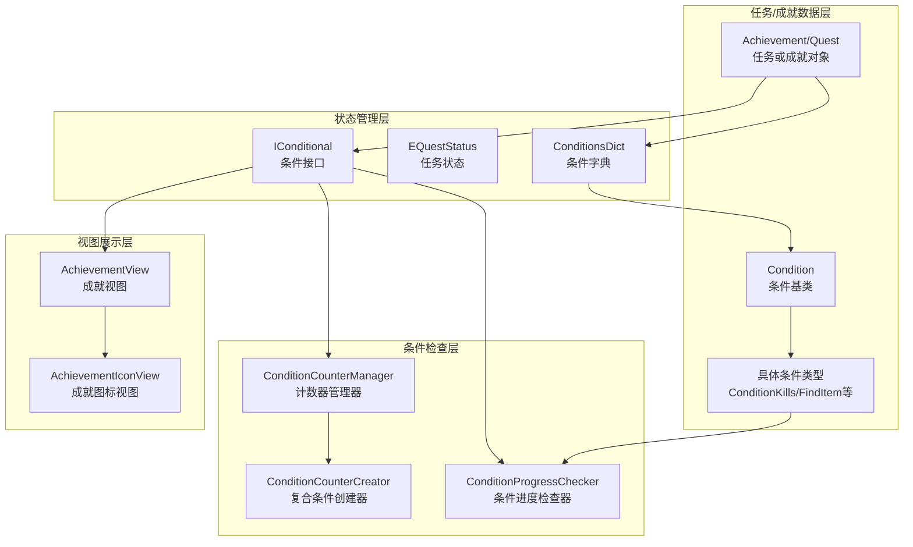
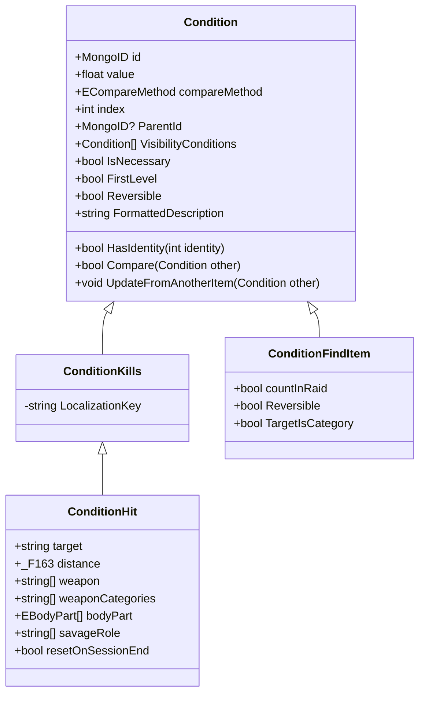
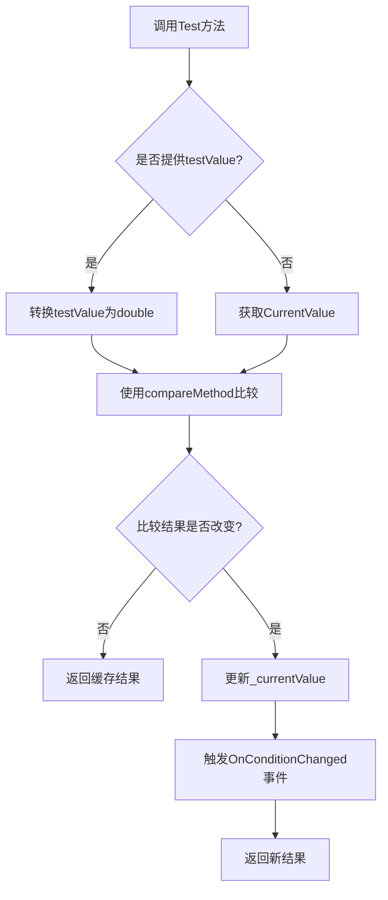
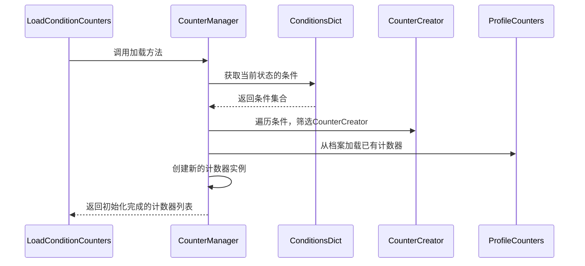
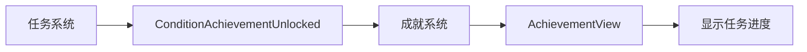
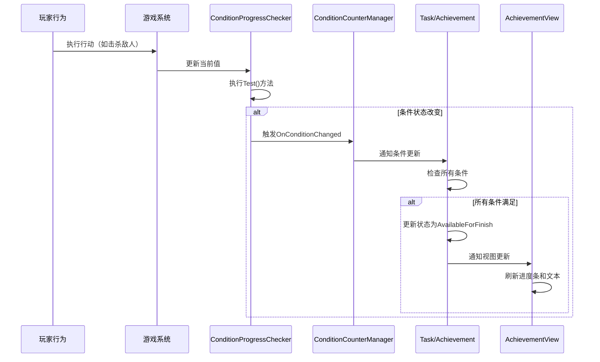

本页面深入分析UnityTarkov中的任务系统与成就系统的架构设计、实现机制和数据流。这两个系统共同构成了游戏的核心进度跟踪和奖励分发框架，通过高度可扩展的条件系统实现了复杂的游戏目标设计。

## 系统架构概览

任务系统与成就系统共享统一的基础架构，采用条件驱动的设计模式。系统通过组合各种条件类型来定义复杂的任务目标，并通过状态机管理任务和成就的生命周期。



## 任务状态管理

任务系统通过精确的状态机来管理任务的生命周期，确保任务在不同阶段的行为可控且可预测。状态转换遵循严格的规则，防止非法状态跳转。

### 任务状态枚举

`EQuestStatus`枚举定义了11种任务状态，覆盖了从未解锁到完成的全过程：

| 状态 | 值 | 说明 |
|------|---|------|
| Locked | 0 | 已锁定，不满足前置条件 |
| AvailableForStart | 1 | 可接受，满足前置条件 |
| Started | 2 | 进行中，玩家已开始任务 |
| AvailableForFinish | 3 | 可完成，所有条件已满足 |
| Success | 4 | 成功完成 |
| Fail | 5 | 失败 |
| FailRestartable | 6 | 失败但可重试 |
| MarkedAsFailed | 7 | 标记为失败 |
| Expired | 8 | 已过期 |
| AvailableAfter | 9 | 在指定时间后可用 |

Sources: [EQuestStatus.cs](Assembly-CSharp/EFT/Quests/EQuestStatus.cs#L1-L17)

### 条件字典结构

`ConditionsDict`继承自`Dictionary<EQuestStatus, _F162>`，将任务状态映射到对应的条件集合。这种设计允许不同状态有不同的完成条件，例如开始任务可能只需要达到特定等级，而完成任务可能需要执行更复杂的行动。

Sources: [ConditionsDict.cs](Assembly-CSharp/EFT/Quests/ConditionsDict.cs#L1-L9)

## 条件系统核心架构

条件系统是任务和成就的基础构建块，采用继承和组合模式实现高度可扩展性。

### Condition基类设计

`Condition`抽象类定义了所有条件类型的公共接口和核心属性：

- **比较机制**：通过`ECompareMethod`枚举支持6种比较操作（≥, ==, ≠, >, <, ≤）
- **值管理**：`value`字段存储目标值，支持隐藏大值（≥1E+09）
- **层级结构**：通过`ParentId`和`ChildConditions`支持条件树的构建
- **身份标识**：使用`MongoID`和动态计算的`identity`实现条件唯一性
- **本地化**：支持`DynamicLocale`和`FormattedDescription`实现动态文本生成



Sources: [Condition.cs](Assembly-CSharp/EFT/Quests/Condition.cs#L1-L115)

### 比较方法枚举

`ECompareMethod`提供了灵活的值比较机制，支持6种比较操作：

| 方法 | 符号 | 用途 |
|------|------|------|
| MoreOrEqual | ≥ | 大于等于，常用于击杀数、经验值等 |
| Equal | == | 等于，用于精确匹配 |
| NotEqual | ≠ | 不等于，用于排除特定条件 |
| More | > | 大于，用于超过阈值 |
| Less | < | 小于，用于低于阈值 |
| LessOrEqual | ≤ | 小于等于，用于限制上限 |

Sources: [ECompareMethod.cs](Assembly-CSharp/EFT/Quests/ECompareMethod.cs#L1-L19)

## 条件进度检查机制

`ConditionProgressChecker`是条件系统的执行引擎，负责实时检查条件是否满足，并触发相应的事件通知。

### 进度检查器核心功能

- **值获取**：通过`_currentValueGetter`委托动态获取当前值
- **条件测试**：`Test(object testValue)`方法将实际值与目标值比较
- **事件系统**：提供`OnConditionChanged`、`OnDisconnect`、`OnReset`三个事件
- **状态缓存**：通过`_currentValue`字段缓存条件状态，避免重复计算

### 测试流程



Sources: [ConditionProgressChecker.cs](Assembly-CSharp/EFT/Quests/ConditionProgressChecker.cs#L1-L97)

## 条件类型分类

系统提供了50+种具体条件类型，覆盖了游戏中的各种游戏行为。这些条件类型可以组合使用，实现复杂的任务设计。

### 战斗相关条件

**ConditionHit**是所有战斗相关条件的基础类，支持精细化的战斗场景配置：

| 属性 | 类型 | 说明 |
|------|------|------|
| target | string | 目标类型（玩家/敌人） |
| distance | _F163 | 距离限制（包含值和比较方法） |
| weapon | string[] | 指定武器列表 |
| weaponCategories | string[] | 武器类别 |
| bodyPart | EBodyPart[] | 目标身体部位 |
| savageRole | string[] | 机器人角色 |
| enemyEquipmentInclusive | string[][] | 敌人必须装备的物品 |
| enemyEquipmentExclusive | string[][] | 敌人不能装备的物品 |

**ConditionKills**继承自`ConditionHit`，专门用于击杀条件，使用"QuestCondition/Elimination/Kill"作为本地化键。

Sources: [ConditionHit.cs](Assembly-CSharp/EFT/Quests/ConditionHit.cs#L1-L138), [ConditionKills.cs](Assembly-CSharp/EFT/Quests/ConditionKills.cs#L1-L8)

### 物品相关条件

**ConditionFindItem**用于查找物品的条件检查，支持类别检查和战时计数：

- **countInRaid**：是否只在战斗中计数
- **TargetIsCategory**：动态判断目标是否为物品类别
- **Reversible**：支持条件逆转（失去物品时重置）

**ConditionHasItem**继承自`ConditionFindItem`，用于检查玩家是否拥有特定物品。

Sources: [ConditionFindItem.cs](Assembly-CSharp/EFT/Quests/ConditionFindItem.cs#L1-L44), [ConditionHasItem.cs](Assembly-CSharp/EFT/Quests/ConditionHasItem.cs#L1-L7)

### Arena专用条件

系统为Arena模式提供了18种专用条件，涵盖排位、战斗行为、队伍表现等多个维度：

- **ConditionArenaMatchPlace**：比赛排名
- **ConditionArenaRoundPlace**：回合排名
- **ConditionArenaRoundCount**：回合数
- **ConditionArenaPlayerPreset**：玩家预设
- **ConditionArenaEnemyPreset**：敌人预设
- **ConditionArenaDeathCount**：死亡次数
- **ConditionArenaBattlePassProgressionLevel**：战斗通行证进度等级

这些条件通过`ConditionCounterCreator`的`type`字段与具体的Arena任务类型绑定，实现自动化的条件匹配和计数。

## 复合条件与计数器系统

### ConditionCounterCreator（计数器创建器）

`ConditionCounterCreator`实现了复合条件的创建和管理，支持多种任务类型的统一处理：

- **type**：任务类型枚举
  - Completion：生存类任务
  - Elimination：消灭类任务
  - PickUp：拾取类任务
  - ArenaWinMatch：Arena比赛胜利
  - ArenaWinRound：Arena回合胜利
- **doNotResetIfCounterCompleted**：计数完成后不重置
- **isResetOnConditionFailed**：条件失败时重置计数器
- **Conditions**：包含的子条件集合

### 动态本地化生成

`LocalizeDescription()`方法实现了条件描述的动态生成，通过字符串模板替换机制：

1. 加载基础描述模板
2. 替换`{resetOnConditionFailed{0}}`和`{resetOnSessionEnd}`标记
3. 遍历所有子条件，替换对应的占位符
4. 清理未使用的占位符

系统维护了18种条件类型到本地化键的映射字典，确保每种条件都能正确生成描述文本。

Sources: [ConditionCounterCreator.cs](Assembly-CSharp/EFT/Quests/ConditionCounterCreator.cs#L1-L165)

### ConditionCounterManager（计数器管理器）

`ConditionCounterManager`负责管理所有任务和成就的条件计数器，实现了计数器的生命周期管理：



管理器支持：
- 从玩家档案加载持久化的计数器状态
- 基于条件模板创建新的计数器
- 按条件ID进行快速查找和更新
- 过滤已完成的计数器

Sources: [ConditionCounterManager.cs](Assembly-CSharp/EFT/Quests/ConditionCounterManager.cs#L1-L200)

## 奖励系统

任务和成就通过统一的奖励系统分发奖励，`ERewardType`枚举定义了22种奖励类型：

| 类别 | 奖励类型 | 说明 |
|------|----------|------|
| **进度类** | Experience | 经验值 |
| | Skill | 技能点 |
| | BattlePassExperience | 战斗通行证经验 |
| | BattlePassCurrency | 战斗通行证货币 |
| **物品类** | Item | 物品 |
| | StashRows | 仓库行数 |
| | Pockets | 口袋槽位 |
| | Customization | 自定义物品 |
| **交易类** | TraderStanding | 商人声望 |
| | TraderStandingReset | 重置商人声望 |
| | TraderStandingRestore | 恢复商人声望 |
| | TraderUnlock | 解锁商人 |
| | AssortmentUnlock | 解锁商人商品 |
| **解锁类** | Achievement | 成就 |
| | Quest | 任务 |
| | Location | 地点 |
| | ProductionScheme | 制作配方 |
| | ArenaArmoryItem | Arena军械库物品 |

Sources: [ERewardType.cs](Assembly-CSharp/EFT/Quests/ERewardType.cs#L1-L31)

## 成就系统

成就系统构建在任务系统之上，通过特殊的条件类型和视图组件实现了成就的展示和追踪。

### 成就稀有度系统

`EAchievementRarity`枚举定义了三种成就稀有度，对应不同的视觉表现：

| 稀有度 | 值 | 视觉特征 |
|--------|---|----------|
| Common | 0 | 普通边框和背景 |
| Rare | 1 | 稀有边框和背景 |
| Legendary | 2 | 传说边框和背景，金色解锁日期文本 |

Sources: [EAchievementRarity.cs](Assembly-CSharp/EAchievementRarity.cs#L1-L7)

### 成就视图组件

**AchievementView**是成就的主要展示组件，包含以下UI元素：

- **模板背景**：根据稀有度切换不同的背景精灵
- **标题和描述**：显示成就的名称和详细说明
- **进度条**：可视化显示完成进度
- **进度文本**：显示具体进度值（如"3/10"）
- **全局进度**：显示全球玩家完成率
- **解锁日期**：显示成就解锁时间，传说成就使用特殊颜色
- **图标视图**：显示成就图标，支持异步加载

### 进度计算逻辑

成就进度通过`_E001()`方法计算，支持两种模式：

1. **单条件模式**：当只有一个条件时，显示当前值/目标值
2. **多条件模式**：当有多个条件时，显示已完成条件数/总条件数

全局进度文本根据完成率动态生成：
- 0%：显示"非常稀有"
- 0.1%-10%：显示"稀有"
- >10%：显示具体百分比（如"15.3%"）

Sources: [AchievementView.cs](Assembly-CSharp/EFT/Achievements/AchievementView.cs#L1-L200)

### 成就图标视图

**AchievementIconView**负责成就图标的展示和异步加载：

- **边框和背景**：根据稀有度使用不同的精灵资源
- **透明度控制**：未解锁的成就显示25%不透明度
- **异步加载**：通过`LoadIconSprite()`异步加载图标资源，避免阻塞主线程

图标的视觉层次结构：
```
IconBackground（背景）→ IconBorder（边框）→ IconImage（图标）
```

Sources: [AchievementIconView.cs](Assembly-CSharp/AchievementsSystem/AchievementIconView.cs#L1-L176)

## 条件接口与集成

`IConditional`接口定义了条件系统与外部系统的集成点：

### 核心接口方法

| 方法 | 说明 |
|------|------|
| `string Id` | 获取任务/成就唯一标识 |
| `ConditionsDict Conditions` | 获取所有状态的条件字典 |
| `ConditionCounterManager ConditionCountersManager` | 获取计数器管理器 |
| `Dictionary<Condition, ConditionProgressChecker> ProgressCheckers` | 获取进度检查器字典 |
| `HashSet<MongoID> CompletedConditions` | 获取已完成条件的ID集合 |
| `EQuestStatus QuestStatus` | 获取当前状态 |
| `EQuestStatus[] CurrentStatusTransitions` | 获取可转换的状态列表 |
| `ETaskPlayerSide PlayerSide` | 获取玩家阵营 |
| `void SetStatus(EQuestStatus, bool, bool)` | 设置任务状态 |
| `void CheckForStatusChange(bool, bool)` | 检查状态是否需要变更 |
| `bool CheckVisibilityStatus(Condition)` | 检查条件可见性 |
| `void DisconnectConditions()` | 断开所有条件连接 |

这个接口被任务（Quest）和成就（Achievement）类实现，提供了统一的状态管理和条件检查能力。

Sources: [IConditional.cs](Assembly-CSharp/EFT/Quests/IConditional.cs#L1-L32)

## 成就与任务的关联

任务和成就系统通过`ConditionAchievementUnlocked`条件类型实现关联：



当需要将成就作为任务条件时，使用`ConditionAchievementUnlocked`来检查特定成就是否已解锁。这允许设计递进式的任务链：完成某些成就可以解锁新的任务或成就。

Sources: [ConditionAchievementUnlocked.cs](Assembly-CSharp/EFT/Quests/ConditionAchievementUnlocked.cs#L1-L7)

## 数据流与事件系统

任务和成就系统通过事件驱动的方式实现实时更新：

### 事件传播路径



### 关键事件节点

1. **玩家行动**：击杀敌人、拾取物品、到达地点等
2. **条件更新**：`ConditionProgressChecker`接收新值并测试
3. **状态改变**：条件满足时触发`OnConditionChanged`
4. **任务检查**：`IConditional.CheckForStatusChange()`验证是否需要状态转换
5. **UI更新**：`AchievementView`刷新显示内容

## 性能优化策略

系统采用多种策略确保高性能运行：

### 1. 惰性加载

- 图标资源通过异步任务加载，不阻塞主线程
- 成就描述按需生成，避免预计算

### 2. 状态缓存

- `ConditionProgressChecker`缓存条件测试结果
- `Condition.TargetIsCategory`使用`bool?`惰性初始化

### 3. 快速查找

- 使用`Dictionary<MongoID, _F165>`快速定位计数器
- `HashSet<MongoID>`用于快速判断条件是否已完成

### 4. 事件驱动

- 只有状态改变时才触发事件，避免频繁通知
- 使用委托而非反射调用值获取函数

## 扩展性设计

系统的高度扩展性体现在多个方面：

### 条件类型扩展

开发者可以通过以下步骤添加新的条件类型：

1. 继承`Condition`或现有的条件子类
2. 覆盖`FormattedDescription`属性实现自定义描述
3. 覆盖`IdentityFields()`方法实现身份计算
4. 注册到`ConditionCounterCreator`的本地化字典（如需要）

### 奖励类型扩展

在`ERewardType`枚举中添加新类型，并在奖励分发逻辑中实现对应的处理代码。

### 视图自定义

继承`AchievementView`或`AchievementIconView`可以创建自定义的成就展示组件。

## 相关系统

任务系统与成就系统深度集成了多个游戏子系统：

- **[物品系统](11-wu-pin-ji-lei-yu-zu-jian-xi-tong)**：物品条件通过`ConditionFindItem`、`ConditionHasItem`等与物品系统交互
- **[玩家系统](8-wan-jia-he-xin-lei-jia-gou)**：玩家状态（等级、声望、技能）直接影响任务可用性
- **[战斗系统](22-dan-dao-ji-suan-yu-shang-hai-xi-tong)**：击杀和伤害条件与战斗系统紧密耦合
- **[UI系统](14-uikuang-jia-ji-chu-jia-gou)**：任务和成就通过UI组件展示给玩家
- **[网络系统](19-wang-luo-you-xi-hui-hua-guan-li)**：任务状态需要与服务器同步，支持多人游戏