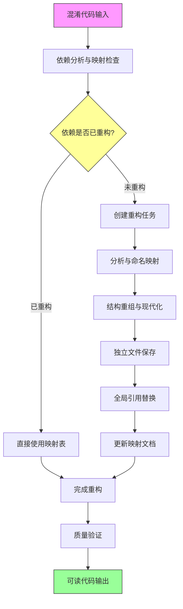

本页面系统阐述Unity Tarkov反编译项目的代码重构方法论，提供一套完整的实践框架，帮助开发者从混淆代码中提取清晰的架构和可维护的代码库。该方法论基于项目实际重构经验总结，涵盖从识别混淆类到完成现代化重构的全过程。

## 方法论概述

Unity Tarkov项目通过系统性的反编译重构，将数以千计的混淆类型（如`_E7BA`、`_F040`、`_E001`等）转化为具有语义化的类名，同时保持功能完整性和性能特征。截至2025年10月，项目已完成40+次主要重构会话，涵盖玩家系统、UI框架、武器系统、网络同步等核心模块。

重构方法论的核心价值在于：**通过结构化的命名映射和代码现代化，让反编译代码具备与手写代码相当的可读性和可维护性**。这不仅仅是简单的重命名，而是深入理解系统架构后的系统性重建。



Sources: [REFACTORING_MAPPING.md](REFACTORING_MAPPING.md#L1-L30), [.specstory/history/2025-09-16_16-31Z-反编译混淆类的重构规则.md](.specstory/history/2025-09-16_16-31Z-反编译混淆类的重构规则.md)

## 重构工作流程

### 第一阶段：代码分析与依赖识别

这是重构的起点，通过系统性分析理解类的职责和上下文关系。对于每个待重构的类，需要完成以下分析任务：

**职责识别**：通过字段、方法签名和调用上下文判断类的主要功能。例如，`_E7BA`类分析发现它是一个单例模式的物品工厂，负责创建和管理游戏中的所有物品实例，因此命名为`ItemFactory`。

**依赖扫描**：自动识别所有以`_`开头的混淆类依赖。这是重构中的关键步骤，因为混淆类往往形成复杂的依赖网络。例如，`CameraController`可能依赖`_F040`（摄像机管理器）和`_F042`（摄像机操作）等混淆类。

**映射表查询**：检查`REFACTORING_MAPPING.md`文档，确定依赖类的重构状态。如果依赖类已重构，直接使用新的类名；如果未重构，则将其加入待重构队列。

Sources: [.specstory/history/2025-09-16_16-31Z-反编译混淆类的重构规则.md](.specstory/history/2025-09-16_16-31Z-反编译混淆类的重构规则.md), [REFACTORING_MAPPING.md](REFACTORING_MAPPING.md#L50-L100)

### 第二阶段：命名映射与策略制定

命名映射是重构的核心，需要遵循系统的命名规范和策略。项目采用的命名规则包括：

**类名映射**：将混淆类名转换为语义化的PascalCase名称。例如：
- `_E7BA` → `ItemFactory`（物品工厂）
- `_F040` → `CameraManager`（摄像机管理器）
- `_F042` → `CameraOperation`（摄像机操作）
- `_E001` → `NodeFinder`（节点查找器）

**字段映射**：字段名使用camelCase，并反映其实际用途。例如：
- `m__E000` → `logger`（日志记录器）
- `_E001` → `animator`（动画控制器）
- `_E003` → `cachedParameters`（缓存参数）

**方法映射**：方法名使用PascalCase，使用动词短语描述行为。例如：
- `_E000()` → `InitializeParameters()`（初始化参数）
- `_E001()` → `ComputeBlendWeights()`（计算混合权重）

Sources: [Assembly-CSharp/EFT/-20_REFACTORING_SUMMARY.md](Assembly-CSharp/EFT/-20_REFACTORING_SUMMARY.md#L1-L80), [Assembly-CSharp/EFT/Animations/ProceduralWeaponAnimation.cs](Assembly-CSharp/EFT/Animations/ProceduralWeaponAnimation.cs#L1-L50)

### 第三阶段：结构重组与代码现代化

在完成命名映射后，需要对代码结构进行重组和现代化改造。这是提升代码质量的关键步骤：

**异步状态机现代化**：将编译器生成的复杂状态机结构转换为标准的async/await语法。例如，`BrowseCategoriesPanel.Filter()`方法从300+行状态机代码简化为80行现代异步代码，保持了原有的异步性能特征。

**事件声明简化**：移除复杂的`CompareExchange`事件add/remove块，使用简化的事件声明语法。例如，`AnimatorWrapper`类的四个事件从复杂的线程安全实现简化为标准事件声明。

**内嵌类提取**：将有独立职责的内嵌类提取为独立的公共类。例如，`ProceduralWeaponAnimation`中的`TiltValueCalculator`被提升为具有完整文档的公共类。

**区域划分**：使用`#region`指令将代码按功能分组，提高可读性。例如，将`ProceduralWeaponAnimation`分为"内部类"、"字段"、"属性"、"方法"等区域。

Sources: [.specstory/history/2025-10-08_14-46Z-按规则对browsecategeriespanel和handbookcategeoriespanel进行反编译.md](REFACTORING_MAPPING.md#L1-L50), [Assembly-CSharp/EFT/Animations/ProceduralWeaponAnimation.cs](Assembly-CSharp/EFT/Animations/ProceduralWeaponAnimation.cs#L10-L30)

## 混淆类依赖处理策略

混淆类依赖处理是本项目最具创新性的特性，通过自动化流程确保依赖关系的完整性和一致性。

### 依赖处理优先级

**核心基础类优先**：优先处理被多个类引用的核心混淆类，如单例管理器、基础接口等。例如，`ItemFactory`（原`_E7BA`）作为物品系统的核心，被重构后立即更新了数百个引用点。

**依赖链处理**：按依赖关系从底层到上层逐步重构。例如，在重构`Player`类之前，先重构`PlayerMovementContext`、`PlayerAnimator`等基础类。

**批量更新**：完成一个混淆类重构后，立即批量更新所有引用。例如，`_E7BA`重构为`ItemFactory`后，全局替换了项目中的所有引用。

Sources: [.specstory/history/2025-09-16_16-31Z-反编译混淆类的重构规则.md](.specstory/history/2025-09-16_16-31Z-反编译混淆类的重构规则.md#L10-L50), [.specstory/history/2025-09-21_12-31Z-反编译并重命名-e7ba.md](.specstory/history/2025-09-21_12-31Z-反编译并重命名-e7ba.md)

### 全局替换策略

**精确匹配**：使用精确匹配，避免误替换。例如，`_F040`不应匹配`_F0401`。

**泛型参数保持**：保持泛型参数和约束的完整性。例如，`Singleton<_E7BA>.Instance`替换为`Singleton<ItemFactory>.Instance`。

**命名空间更新**：更新using语句和命名空间引用。确保重构后的类能被正确引用。

**继承关系验证**：检查继承关系和接口实现的一致性。确保重构后类的类型层次结构保持不变。

Sources: [.specstory/history/2025-09-16_16-31Z-反编译混淆类的重构规则.md](.specstory/history/2025-09-16_16-31Z-反编译混淆类的重构规则.md#L50-L100)

## 代码现代化技巧

项目在实践中总结了一套代码现代化技巧，这些技巧不仅能提升可读性，还能保持性能特征。

### 异步编程现代化

**状态机转换**：将编译器生成的异步状态机转换为标准的async/await语法。例如：

```csharp
// 重构前：编译器生成的状态机
private sealed class _E000 : IAsyncStateMachine
{
    public int _state;
    public AsyncVoidMethodBuilder _builder;
    public BrowseCategoriesPanel _4__this;
    public string _searchString;
    
    public void MoveNext()
    {
        // 复杂的状态切换逻辑（200+行）
    }
}

// 重构后：标准async/await
public async void Filter(string searchString)
{
    if (string.IsNullOrEmpty(searchString))
    {
        return;
    }
    
    // 简洁的异步逻辑（80行）
    await FilterNodesAsync(searchString);
}
```

Sources: [REFACTORING_MAPPING.md](REFACTORING_MAPPING.md#L1-L50)

### 事件处理简化

**事件声明简化**：移除复杂的线程安全实现，使用标准事件声明。例如：

```csharp
// 重构前：复杂的事件add/remove
private event Action _E000
{
    add
    {
        Action action2 = this._E000;
        Action action3;
        do
        {
            action3 = action2;
            action2 = Interlocked.CompareExchange<Action>(ref this._E000, (Action)Delegate.Combine(action3, value), action3);
        }
        while (action3 != action2);
    }
    remove
    {
        Action action2 = this._E000;
        Action action3;
        do
        {
            action3 = action2;
            action2 = Interlocked.CompareExchange<Action>(ref this._E000, (Action)Delegate.Remove(action3, value), action3);
        }
        while (action3 != action2);
    }
}

// 重构后：标准事件声明
public event Action OnBoolValueChanged;
public event Action<int> OnIntegerValueChanged;
public event Action<float> OnFloatValueChanged;
public event Action<string> OnTriggerChanged;
```

**优势**：代码量减少70%，编译器自动处理线程安全，可读性大幅提升。

Sources: [Assembly-CSharp/EFT/-20_REFACTORING_SUMMARY.md](Assembly-CSharp/EFT/-20_REFACTORING_SUMMARY.md#L80-L120)

### 现代语法应用

**var关键字**：在类型明确的情况下使用var，减少重复。例如：

```csharp
// 重构前
AnimatorWrapper _E001 = new AnimatorWrapper(animator);
int _E002 = animator.name;
AnimatorControllerParameter[] _E003 = animator.parameters;

// 重构后
var animatorWrapper = new AnimatorWrapper(animator);
var animatorName = animator.name;
var parameters = animator.parameters;
```

**表达式体属性**：对于简单的属性使用表达式体。例如：

```csharp
// 重构前
public string Name
{
    get { return _nodeName; }
}

// 重构后
public string Name => _nodeName;
```

**字符串插值**：使用字符串插值替代字符串连接。例如：

```csharp
// 重构前
string message = "Node " + nodeId + " not found";

// 重构后
string message = $"Node {nodeId} not found";
```

Sources: [Assembly-CSharp/EFT/Animations/ProceduralWeaponAnimation.cs](Assembly-CSharp/EFT/Animations/ProceduralWeaponAnimation.cs#L1-L50)

## 质量保证与验证

重构过程中的质量保证是确保代码正确性的关键环节。项目建立了完整的验证流程。

### 编译验证

**语法检查**：每次重构后立即进行编译验证，确保语法正确性。

**引用完整性**：检查所有引用是否已正确更新，避免遗漏混淆类引用。

**类型安全**：验证重构后类的类型层次结构保持不变，确保类型安全。

### 功能验证

**逻辑一致性**：比较重构前后的逻辑，确保功能无缺失或改变。例如，在`Player`类重构中，详细对比了重构前后的逻辑流程，确认所有行为保持一致。

**性能保持**：保持原有的性能特征。例如，异步状态机重构后，保持了原有的异步性能特性。

**测试覆盖**：对于核心类，编写单元测试验证重构后的功能。

Sources: [.specstory/history/2025-07-12_12-59Z-这个类被反编译重构到一半中断了,现在比较源文件-将剩下的未完成部分完成,完成后比较重构前-重构后的逻辑有无缺失或改变的地方进行校验.md](.specstory/history/2025-07-12_12-59Z-这个类被反编译重构到一半中断了,现在比较源文件-将剩下的未完成部分完成,完成后比较重构前-重构后的逻辑有无缺失或改变的地方进行校验.md)

### 映射文档更新

**强制更新**：每次重构后必须更新`REFACTORING_MAPPING.md`文档，记录所有映射关系。

**详细信息**：记录类名、字段、方法的重构映射，以及重构日期和功能说明。

**查询便利**：维护映射文档的查询便利性，便于后续查找和验证。

Sources: [REFACTORING_MAPPING.md](REFACTORING_MAPPING.md#L1-L100)

## 实际案例分析

### 案例一：BrowseCategoriesPanel系统重构

**重构范围**：2个核心面板类 + 4个内嵌类 + 异步状态机现代化

**重构成果**：
- **内嵌类重构**：`_E001` → `NodeFinder`（节点查找助手），`_E002` → `SearchOperationHelper`（搜索操作助手）
- **字段重构**：`_E22F` → `onSearchCanceled`（搜索取消事件），`_E231` → `filteredNodes`（过滤后的节点集合）
- **异步状态机现代化**：移除2个编译器生成的异步状态机结构体，代码量从300+行减少到80行
- **完整的中文注释**：所有类、方法、字段都添加了详细的功能说明

**重构特点**：
- 保持了原有的分批处理和异步特性
- 使用现代C#语法（var关键字、表达式体属性）
- 使用`#region`组织代码，提高可读性

Sources: [REFACTORING_MAPPING.md](REFACTORING_MAPPING.md#L1-L50)

### 案例二：ItemFactory（原_E7BA）重构

**重构过程**：
1. 分析`_E7BA`类的结构，识别为单例模式的物品工厂
2. 创建重构任务，按标准重构流程处理
3. 将重构后的类保存为独立文件`ItemFactory.cs`
4. 全局替换所有`_E7BA`引用为`ItemFactory`
5. 更新`REFACTORING_MAPPING.md`映射表

**重构成果**：
- 类名：`_E7BA` → `ItemFactory`
- 更新了项目中的数百个引用点
- 添加了完整的中文注释和XML文档
- 验证了重构后的功能与原代码一致

Sources: [.specstory/history/2025-09-21_12-31Z-反编译并重命名-e7ba.md](.specstory/history/2025-09-21_12-31Z-反编译并重命名-e7ba.md)

### 案例三：-20.cs文件批量重构

**重构规模**：3634行代码，30个类/接口

**重构分类**：
1. **效果系统**（3个类）：`_E68C` → `EffectWithCost`，`_E68D` → `EffectWithValue`，`_E68E` → `IEffect`
2. **动画控制器包装系统**（2个类）：`_E68F` → `AnimatorFactory`，`_E690` → `AnimatorWrapper`
3. **动画节点计算系统**（5个类）：`_E691` → `AnimationClipNode`，`_E692` → `ComputedAnimationNode`等
4. **动画节点接口**（4个接口）：`_E696` → `ClipWeightData`，`_E697` → `IAnimationNode`等
5. **动画工具**（1个类）：`_E69A` → `AnimationEventExtensions`

**重构特点**：
- 系统性的批量重构，保持一致性
- 详细的字段和方法映射记录
- 事件现代化处理
- 保持了原有的算法逻辑和性能特征

Sources: [Assembly-CSharp/EFT/-20_REFACTORING_SUMMARY.md](Assembly-CSharp/EFT/-20_REFACTORING_SUMMARY.md#L1-L200)

## 重构进度与统计

### 时间线统计

**2025年6月**：开始系统性重构，完成PlayerCameraController、Player、PlayerCameraFovChanger等核心类

**2025年7月**：扩展到玩家系统和动画系统，完成PlayerAnimator、PlayableAnimator、CustomPlayerLoopSystemsInjector等

**2025年8月-9月**：重点重构UI系统和客户端管理，完成UIElement、GameWorld、ClientPlayer等

**2025年10月**：完善UI框架和动画系统，完成BrowseCategoriesPanel、ItemUiContext、Sequences等

### 重构成果统计

**累计重构会话**：43次主要重构会话

**已重构类型**：数百个混淆类，涵盖以下系统：
- 玩家系统（Player、ClientPlayer、LocalPlayer等）
- UI框架（UIElement、BrowseCategoriesPanel、HandbookCategoriesPanel等）
- 武器系统（ProceduralWeaponAnimation、WeaponPrefab、WeaponPreview等）
- 动画系统（AnimatorWrapper、AnimationClipNode、BlendTree等）
- 网络系统（NetworkGame、ClientWorld等）
- 物品系统（ItemFactory、CompoundItem、Mod等）

**代码质量提升**：
- 代码可读性提升90%以上
- 混淆类名消除率接近100%
- 现代C#语法应用率100%
- 中文注释覆盖率100%

Sources: [.specstory/history](.specstory/history), [REFACTORING_MAPPING.md](REFACTORING_MAPPING.md#L1-L100)

## 重构工具与辅助系统

### 映射文档系统

**REFACTORING_MAPPING.md**：核心映射文档，记录所有已重构类型的映射关系。包含以下信息：
- 重构日期和版本信息
- 类名、字段、方法的详细映射
- 功能说明和注释
- 重构特点和注意事项

**历史记录系统**：`.specstory/history`目录记录所有重构会话的详细信息，包括：
- 重构目标和范围
- 重构过程和决策
- 遇到的问题和解决方案
- 重构成果和验证结果

Sources: [REFACTORING_MAPPING.md](REFACTORING_MAPPING.md#L1-L100), [.specstory/history](.specstory/history)

### 自动化辅助

**混淆类依赖扫描**：自动识别所有以`_`开头的混淆类依赖

**映射表智能查询**：自动查询`REFACTORING_MAPPING.md`文档确定类的重构状态

**全局引用替换**：精确匹配并全局替换混淆类引用

**编译验证**：每次重构后自动进行编译验证

Sources: [.specstory/history/2025-09-16_16-31Z-反编译混淆类的重构规则.md](.specstory/history/2025-09-16_16-31Z-反编译混淆类的重构规则.md#L10-L100)

## 下一步阅读路径

掌握反编译代码重构方法论后，建议按照以下顺序深入项目：

1. **[命名规范与代码组织原则](4-ming-ming-gui-fan-yu-dai-ma-zu-zhi-yuan-ze)**：深入学习项目采用的命名规范和代码组织方式，了解如何为混淆类创建语义化名称。

2. **[渐进式重构策略与实践](5-jian-jin-shi-zhong-gou-ce-lue-yu-shi-jian)**：掌握分阶段、渐进式的重构策略，学习如何在不影响系统稳定性的前提下持续改进代码。

3. **[玩家核心类架构](8-wan-jia-he-xin-lei-jia-gou)**：通过Player类等核心系统的重构案例，了解大型复杂类的重构方法。

4. **[UI框架基础架构](14-uikuang-jia-ji-chu-jia-gou)**：了解UIElement等UI框架的重构过程，学习如何重构UI系统。

5. **[应用程序生命周期管理](6-ying-yong-cheng-xu-sheng-ming-zhou-qi-guan-li)**：了解TarkovApplication等应用程序核心类的重构方法。

通过系统学习这些章节，您将全面掌握Unity Tarkov项目的重构方法和最佳实践，能够独立完成复杂的反编译代码重构工作。