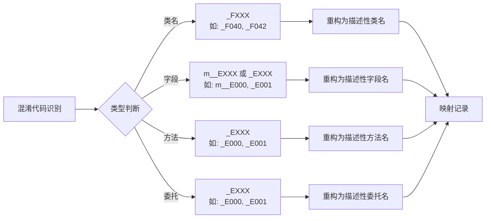
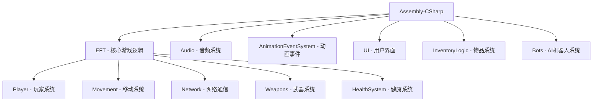
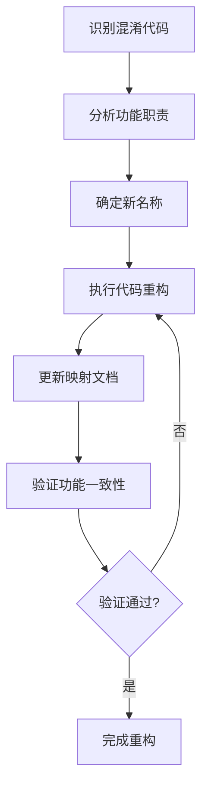

本文档详细说明了Unity Tarkov反编译重构项目的命名规范与代码组织原则，这些规范旨在将混淆的反编译代码转换为可读性强、易于维护的高质量代码。

## 项目命名规范概览

项目采用系统化的命名规范来统一处理反编译代码的重构工作，确保代码的一致性和可读性。以下是核心的命名约定。

### 命名约定体系表

| 代码元素 | 命名约定 | 示例 | 说明 |
|---------|---------|------|------|
| 普通类 | PascalCase | `CameraManager`, `MovementContext` | 描述性英文名称 |
| 接口 | I + PascalCase | `IPlayer`, `IUsableItemController` | I前缀表示接口 |
| 枚举 | E + PascalCase | `EPlayerState`, `EInteractionType` | E前缀表示枚举 |
| 委托 | PascalCase + Delegate | `StateChangedDelegate`, `ItemObjectCreator` | 描述性名称加Delegate后缀 |
| 公共属性 | PascalCase | `CurrentCameraOperation`, `PlayerState` | 描述性属性名 |
| 私有字段 | camelCase 或 _camelCase | `cameraOperationCache`, `_E001` | 下划线开头可选 |
| 常量 | UPPER_CASE | `TIME_SCALE_FACTOR`, `MAX_SPEED` | 全大写下划线分隔 |
| 方法 | PascalCase | `HandleHandsControllerChanged` | 动词或动名词短语 |
| 事件 | PascalCase | `OnPlayerCameraControllerCreated` | 事件名通常用On开头 |

### 混淆代码识别模式

项目中的混淆代码遵循特定的命名模式，识别这些模式是重构的第一步。



## 类命名规范

### 基础类命名规则

类的命名应清晰反映其功能和职责，使用描述性的英文单词或短语。重构过程中需要特别关注以下几种类别。

**控制器类（Controller）**: 以 `Controller` 结尾，表示负责控制和管理某个系统或组件的类。例如：`PlayerCameraController`、`MovementContext`、`BotWeaponManager`。Sources: [Assembly-CSharp/EFT/Player.cs](Assembly-CSharp/EFT/Player.cs#L1-L50)

**数据类（Data）**: 以 `Data` 结尾，表示主要职责是数据封装和传输的类。例如：`ClipWeightData`、`ShellExtractionData`、`ExchangeRateDTO`。Sources: [Assembly-CSharp/EFT/ClipWeightData.cs](Assembly-CSharp/EFT/ClipWeightData.cs#L1-L1)

**管理器类（Manager）**: 以 `Manager` 结尾，表示负责管理资源的类。例如：`CameraManager`、`SpeakerManager`、`LightManager`。Sources: [Assembly-CSharp/REFACTORING_MAPPING.md](Assembly-CSharp/REFACTORING_MAPPING.md#L20-L30)

**视图类（View）**: 以 `View` 结尾，表示UI或可视化组件。例如：`ArenaEftItemTransferGridView`、`ServiceView`、`SightView`。Sources: [Assembly-CSharp/REFACTORING_MAPPING.md](Assembly-CSharp/REFACTORING_MAPPING.md#L1-L150)

**系统类（System）**: 以 `System` 结尾，表示提供系统级功能的类。例如：`MovementSounds`、`ResourceLoadingSystem`、`SmallPhysicsSystem`。Sources: [Assembly-CSharp/REFACTORING_MAPPING.md](Assembly-CSharp/REFACTORING_MAPPING.md#L1-L150)

### 接口命名规则

接口命名使用 `I` 前缀加上描述性名称，清晰表达契约和抽象。

```csharp
// 基础接口示例
public interface IPlayer { }
public interface IUsableItemController { }
public interface IAnimationEventReceiver { }
public interface ICompassController { }
```

Sources: [Assembly-CSharp/EFT/IPlayer.cs](Assembly-CSharp/EFT/IPlayer.cs#L1-L1)

### 枚举命名规则

枚举类型使用 `E` 前缀，枚举值使用 PascalCase。

```csharp
// 枚举命名示例
public enum EPlayerState
{
    Idle,
    Run,
    Sprint,
    Prone
}

public enum EInteractionType
{
    Pickup,
    Examine,
    Use
}

public enum EHandsControllerType
{
    EmptyHands,
    Firearm,
    Grenade,
    Knife
}
```

Sources: [Assembly-CSharp/EFT/EPlayerState.cs](Assembly-CSharp/EFT/EPlayerState.cs#L1-L1)

## 代码组织原则

### Partial类模式

对于大型类，项目采用 Partial 类模式将功能按模块分离到不同的文件中，提高代码的可维护性和可读性。

```mermaid
graph TD
    A[Player主类] --> B[Player.HandsControllers.cs]
    A --> C[Player.LifeCycle.cs]
    A --> D[Player.Motion.cs]
    A --> E[Player.Audio.cs]
    A --> F[Player.InventoryController.cs]
    A --> G[Player.FirearmController.cs]
    A --> H[Player.EmptyHandsController.cs]
    A --> I[Player.Helpers.cs]
    A --> J[Player.IContainerView.cs]
    A --> K[Player.IItemAddedListener.cs]
    A --> L[Player.IItemRemovedListener.cs]
    A --> M[Player.IQuickSlotView.cs]
    A --> N[Player.ErrorClasses.cs]
```



**优势分析**:

| 优势 | 说明 | 示例 |
|-----|------|------|
| 模块化 | 每个文件专注单一功能领域 | `Player.HandsControllers.cs` 专注手部控制逻辑 |
| 可读性 | 文件名直接反映内容 | `Player.LifeCycle.cs` 包含玩家生命周期管理 |
| 协作友好 | 多人可同时修改不同部分 | 一人修改音频系统，一人修改移动系统 |
| 减少冲突 | 降低合并冲突的概率 | 文件级别隔离降低了代码冲突风险 |

Sources: [Assembly-CSharp/EFT/Player.HandsControllers.cs](Assembly-CSharp/EFT/Player.HandsControllers.cs#L1-L80)

### Region组织规范

使用 `#region` 指令将相关代码逻辑分组，提高代码结构的清晰度。

```csharp
/// <summary>
/// 玩家移动上下文类 - 游戏中最核心的移动系统控制器
/// 原版 MovementContext - 负责处理玩家的所有移动相关逻辑
/// </summary>
public class MovementContext : IMovementContext
{
    #region Delegates - 委托定义
    
    /// <summary>
    /// 玩家状态改变委托 - 当玩家从一个状态切换到另一个状态时触发
    /// </summary>
    public delegate void StateChangedDelegate(EPlayerState previousState, EPlayerState nextState);
    
    #endregion

    #region Internal Structures - 内部结构体
    
    /// <summary>
    /// 物理条件处理数据结构 - 封装了物理条件相关的数据
    /// </summary>
    private struct PhysicalConditionData { }
    
    #endregion

    #region Fields - 字段
    
    private Player _player;
    private Transform _transform;
    
    #endregion

    #region Properties - 属性
    
    public EPlayerState CurrentState { get; private set; }
    
    #endregion

    #region Methods - 方法
    
    public void UpdateMovement() { }
    
    #endregion
}
```

**推荐的Region命名**:
- `Delegates - 委托定义`
- `Internal Structures - 内部结构体`
- `Fields - 字段`
- `Properties - 属性`
- `Methods - 方法`
- `Events - 事件`
- `Private Methods - 私有方法`
- `Public Methods - 公共方法`

Sources: [Assembly-CSharp/EFT/MovementContext.cs](Assembly-CSharp/EFT/MovementContext.cs#L1-L100)

## 注释和文档规范

### 类注释规范

每个类都必须包含详细的中文注释，说明其功能、职责和重要特性。

```csharp
/// <summary>
/// 玩家移动上下文类 - 游戏中最核心的移动系统控制器
/// 原版 MovementContext - 负责处理玩家的所有移动相关逻辑
/// 
/// 主要功能模块：
/// - 移动状态管理：控制玩家的各种移动状态（站立、蹲下、趴下、冲刺等）
/// - 物理计算：处理重力、惯性、碰撞检测、地面检测
/// - 动画控制：与Unity动画系统集成，控制角色动画播放
/// - 速度限制：根据装备重量、身体状态等因素限制移动速度
/// - 交互系统：处理与环境物体的交互（开门、拾取物品等）
/// - 武器系统集成：处理武器瞄准、架设等对移动的影响
/// - 身体角度限制：实现真实的人体运动学限制，防止视角与身体过度分离
/// 
/// 技术特性：
/// - 高性能物理计算：优化的地面检测和碰撞处理算法
/// - 平滑插值系统：提供丝滑的动画过渡和状态变化
/// - 事件驱动架构：通过事件系统解耦各模块，便于扩展和维护
/// - 惯性系统：模拟真实的启动、停止、转向惯性效果
/// - 自适应性能：根据设备性能自动调整计算精度
/// </summary>
public class MovementContext : IMovementContext
{
    // 类实现...
}
```

Sources: [Assembly-CSharp/EFT/MovementContext.cs](Assembly-CSharp/EFT/MovementContext.cs#L1-L50)

### 方法注释规范

关键方法使用XML文档注释，包含参数说明、返回值说明和功能描述。

```csharp
/// <summary>
/// 处理手部控制器变化事件
/// 当玩家切换武器或装备固定武器时调用
/// 原版：HandleHandsControllerChanged
/// </summary>
/// <param name="controller">旧的手部控制器</param>
/// <param name="handsController">新的手部控制器</param>
internal void HandleHandsControllerChanged(Player.AbstractHandsController controller, Player.AbstractHandsController handsController)
{
    // 方法实现...
}
```

### 原始引用标注

对于重构的代码，必须在注释中标注原始混淆名称，便于追溯和验证。

```csharp
/// <summary>
/// 物品对象创建委托
/// 原版 _E000 委托
/// </summary>
internal delegate GameObject ItemObjectCreator(Item item, Player player);
```

Sources: [Assembly-CSharp/EFT/Player.HandsControllers.cs](Assembly-CSharp/EFT/Player.HandsControllers.cs#L1-L80)

## 目录组织结构

### 核心代码库结构

项目采用功能模块化的目录结构，将相关功能的类组织在同一目录下。



### 功能模块划分原则

**按领域划分**: 将属于同一业务领域的类放在同一目录。例如，所有AI相关类放在 `Bots` 目录下，所有UI相关类放在 `UI` 目录下。Sources: [Assembly-CSharp/EFT](Assembly-CSharp/EFT)

**按层次划分**: 区分核心逻辑、网络层、表现层。例如，`InventoryLogic` 目录包含物品系统核心逻辑，`UI` 目录包含物品系统的UI表现。Sources: [Assembly-CSharp/EFT/InventoryLogic](Assembly-CSharp/EFT/InventoryLogic)

**按重用性划分**: 可复用的工具类放在更通用的位置。例如，`Utils` 目录包含工具类，`AnimationEventSystem` 是独立的动画事件系统。Sources: [Utils](Utils)

## 重构映射管理

### 映射文档结构

项目维护一个详细的映射文档 `REFACTORING_MAPPING.md`，记录所有重构的类、字段、方法的原始名称和新名称。

| 原始混淆名称 | 重构后名称 | 功能说明 | 重构日期 |
|-------------|-----------|----------|----------|
| `_F040` | `CameraManager` | 摄像机管理器单例 | 2025-06-22 |
| `_F042` | `CameraOperation` | 摄像机操作抽象基类 | 2025-06-22 |
| `_E6A1` | `GenericStateMachine` | 通用状态机 | 2025-10-02 |
| `_E6A2` | `AnimationSwitchController` | 动画切换控制器 | 2025-10-02 |

Sources: [Assembly-CSharp/REFACTORING_MAPPING.md](Assembly-CSharp/REFACTORING_MAPPING.md#L1-L150)

### 映射更新流程



## 现代化重构原则

### 代码现代化

在保持功能完全一致的前提下，使用现代C#特性改进代码质量。

**空条件运算符**: 使用 `?.` 简化空值检查。

**简化事件声明**: 移除编译器生成的复杂事件代码。

**移除编译器特性**: 删除 `[CompilerGenerated]` 等不必要的特性。

**常量替换**: 将魔法数字替换为有意义的常量。

```csharp
// 重构前
private class FovChangeCoroutine
{
    private int m__E000;
    private object _E001;
    private int _E002;
}

// 重构后
private class FovChangeCoroutine
{
    private int state;
    private object current;
    private int initialState;
}
```

### 协程状态机现代化

识别编译器生成的状态机，将复杂的 `MoveNext()` 方法重构为可读的协程代码。

**状态机特征识别**:
- 实现 `IEnumerator`、`IEnumerator<object>` 或 `IDisposable`
- 包含状态字段 `m__E000`
- 包含当前值字段 `_E001`
- 复杂的 `MoveNext()` 方法实现

Sources: [Assembly-CSharp/REFACTORING_MAPPING.md](Assembly-CSharp/REFACTORING_MAPPING.md#L1-L150)

## 重构工作流程

### 标准重构步骤

项目定义了标准的重构工作流程，确保重构的质量和一致性。

1. **分析理解**: 仔细阅读原始代码，理解其功能和逻辑流程
2. **依赖处理**: 优先处理未重构的混淆类依赖，按依赖链顺序重构
3. **命名映射**: 为每个混淆的元素创建命名映射表
4. **结构重组**: 使用 region 和 partial 类优化代码结构
5. **注释完善**: 添加详细的中文注释和XML文档注释
6. **验证测试**: 确保代码能够正常编译，功能与原代码一致
7. **文档更新**: 立即更新 REFACTORING_MAPPING.md 文档

Sources: [cursorrules.md](cursorrules.md#L1-L100)

### 逻辑保持原则

重构过程中必须严格遵守以下核心原则：

- **绝对不改变业务逻辑**: 重构后的代码行为必须与原代码完全一致
- **保持接口兼容**: 公共接口必须保持向后兼容
- **无性能开销**: 不引入额外的性能开销
- **功能一致性**: 确保所有功能点都被正确实现

Sources: [.cursor/rules/.cursorrules](.cursor/rules/.cursorrules#L1-L100)

## 命名规范检查清单

在重构过程中，使用以下检查清单确保命名规范的正确执行。

### 类名检查清单
- [ ] 类名使用 PascalCase 格式
- [ ] 类名清晰表达其职责和功能
- [ ] 控制器类以 Controller 结尾
- [ ] 管理器类以 Manager 结尾
- [ ] 数据类以 Data 结尾
- [ ] 视图类以 View 结尾
- [ ] 在类注释中标注原始混淆名称
- [ ] 添加详细的中文功能说明

### 字段命名检查清单
- [ ] 私有字段使用 camelCase 或 _camelCase
- [ ] 公共字段使用 PascalCase（推荐使用属性替代）
- [ ] 常量使用 UPPER_CASE
- [ ] 布尔字段以 Is/Has/Can 开头
- [ ] 集合字段使用复数形式
- [ ] 添加字段功能注释

### 方法命名检查清单
- [ ] 方法名使用 PascalCase
- [ ] 方法名以动词或动名词开头
- [ ] 异步方法以 Async 结尾
- [ ] 返回布尔值的方法以 Is/Has/Can/Try 开头
- [ ] 添加XML文档注释
- [ ] 在注释中标注原始方法名

### 文件组织检查清单
- [ ] 大型类使用 partial 分离
- [ ] 文件名与类名匹配（对于 partial 类，使用 `类名.功能.cs` 格式）
- [ ] 使用 region 组织代码结构
- [ ] 相关类放在同一功能目录
- [ ] 更新 REFACTORING_MAPPING.md 文档

## 下一步学习

理解命名规范和代码组织原则后，建议继续学习以下主题：

- **[渐进式重构策略与实践](5-jian-jin-shi-zhong-gou-ce-lue-yu-shi-jian)**: 学习如何安全地逐步重构大型代码库
- **[玩家核心类架构](8-wan-jia-he-xin-lei-jia-gou)**: 深入了解Player类的组织结构和设计模式
- **[反编译代码重构方法论](3-fan-bian-yi-dai-ma-zhong-gou-fang-fa-lun)**: 掌握系统化的反编译重构方法论