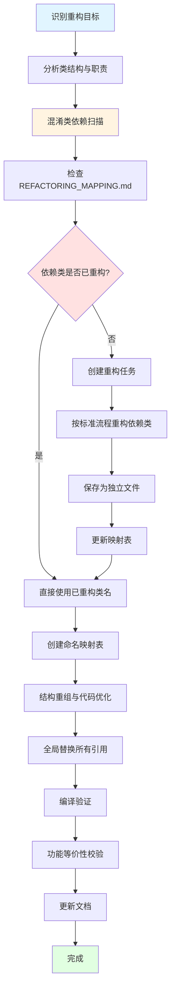

本文档阐述在Unity Tarkov项目中实施渐进式重构的系统性方法，涵盖从混淆代码分析到高质量重构完成的全流程策略。基于项目实际经验，本文提供了可操作的重构框架、依赖处理机制、质量保证方法，以及应对各种复杂场景的实践指南。

## 渐进式重构的核心原则

### 系统性而非临时性

渐进式重构强调建立可持续的工作流程，而非单次性的代码清理活动。通过建立标准化的重构规则、映射文档和质量检查清单，确保每次重构工作都能为后续工作积累价值。项目中的`REFACTORING_MAPPING.md`文档就是这一原则的集中体现，它记录了从`_F040`到`CameraManager`、从`_F042`到`CameraOperation`等所有命名映射关系，形成可追溯的重构历史。

Sources: [Assembly-CSharp/REFACTORING_MAPPING.md](Assembly-CSharp/REFACTORING_MAPPING.md#L1-L50)

### 依赖驱动的重构优先级

重构工作不应随机选择目标，而应基于依赖关系确定优先级。被多个类引用的核心混淆类（如单例管理器、基础接口）应优先处理。例如，`_F040`（CameraManager）作为摄像机管理器单例，被多个摄像机相关类依赖，因此优先重构。遵循"从底层到上层"的依赖链处理顺序，可以最大程度减少重复工作和遗漏引用。

Sources: [.specstory/history/2025-09-16_16-31Z-反编译混淆类的重构规则.md](.specstory/history/2025-09-16_16-31Z-反编译混淆类的重构规则.md#L25-L45)

### 保持功能等价性

所有重构操作必须确保重构后的代码功能与原代码完全一致。项目中的实践案例展示了这一原则的重要性：当重构工作在ProceduralWeaponAnimation类中中断时，恢复工作的首要任务是比较源文件，将未完成的部分完成，然后比较重构前后的逻辑有无缺失或改变的地方进行校验。这种严格的功能验证机制是渐进式重构的基石。

Sources: [.specstory/history/2025-07-12_12-59Z-这个类被反编译重构到一半中断了,现在比较源文件-将剩下的未完成部分完成,完成后比较重构前-重构后的逻辑有无缺失或改变的地方进行校验.md](.specstory/history/2025-07-12_12-59Z-这个类被反编译重构到一半中断了,现在比较源文件-将剩下的未完成部分完成,完成后比较重构前-重构后的逻辑有无缺失或改变的地方进行校验.md#L1-L50)

## 重构工作流程

### 标准重构流程

下图展示了项目中实施的标准重构流程，从目标识别到质量验证的完整周期：

### 第一步：目标识别与分析

识别重构目标时，应优先考虑以下类型：
- 混淆严重的核心类（如`_E694`、`_E695`等动画系统核心类）
- 被多个模块依赖的基类（如`PlayerInventoryController`）
- 包含大量编译器生成状态机的复杂类
- 需要进一步拆分的大型类

分析阶段需要识别关键字段、方法和依赖关系，确定类的主要职责和设计模式。特别重要的是要**自动识别所有以`_`开头的混淆类依赖**，这是后续依赖处理的基础。

Sources: [.specstory/history/2025-09-16_16-31Z-反编译混淆类的重构规则.md](.specstory/history/2025-09-16_16-31Z-反编译混淆类的重构规则.md#L48-L52)

### 第二步：依赖处理与命名映射

这是重构流程中最关键的步骤，涉及复杂的依赖关系处理：

**依赖类重构优先级**：
1. 核心基础类优先（如`CameraManager`、`StringDecryptor`）
2. 按依赖链顺序从底层到上层逐步重构
3. 批量更新所有引用，避免遗漏

**命名映射创建原则**：
- 新名称准确反映其功能和用途
- 保持命名的一致性和可读性
- 遵循项目的命名规范

例如，在重构`Player.cs`时，发现它依赖`_F040`和`_F042`，处理流程如下：
1. `_F040` → 检查映射表 → 已重构为`CameraManager`，直接替换
2. `_F042` → 检查映射表 → 未重构，创建重构任务 → 重构为`CameraOperation`
3. 全局替换所有`_F042`引用为`CameraOperation`

Sources: [.specstory/history/2025-09-16_16-31Z-反编译混淆类的重构规则.md](.specstory/history/2025-09-16_16-31Z-反编译混淆类的重构规则.md#L55-L85)

### 第三步：结构重组与代码优化

在完成依赖处理和命名映射后，进行代码的结构重组和优化：

**结构重组策略**：
- 将大型类拆分为多个partial文件（如`Player.cs`拆分为`Player.Motion.cs`、`Player.HandsControllers.cs`、`Player.LifeCycle.cs`等）
- 抽取接口到独立文件（如从`-8.cs`中抽取`_EC18`至`_EC1F`接口）
- 分离常量、枚举、内部类到专门的文件
- 消除编译器生成的冗余状态机代码，转换为标准Unity协程语法

**代码优化实践**：
- 使用现代C#语法特性（如表达式-bodied成员、自动属性等）
- 添加清晰的中文注释说明类、方法、字段的用途
- 保持代码的可读性和可维护性

Sources: [.specstory/history/2025-06-28_02-34Z-继续对player-cs进行partial文件重构.md](.specstory/history/2025-06-28_02-34Z-继续对player-cs进行partial文件重构.md#L1-L150)
Sources: [.specstory/history/2025-07-12_22-42Z-抽取并重构接口代码.md](.specstory/history/2025-07-12_22-42Z-抽取并重构接口代码.md#L1-L29)

### 第四步：全局替换与验证

完成结构重组后，进行全局替换和质量验证：

**全局替换策略**：
- 使用精确匹配，避免误替换（如`_F040`不应匹配`_F0401`）
- 保持泛型参数和约束的完整性
- 更新using语句和命名空间引用
- 检查继承关系和接口实现的一致性

**质量验证检查清单**：
- 编译验证：确保代码能够成功编译
- 功能等价性校验：验证重构后的功能与原代码一致
- 引用完整性检查：确保所有引用都已正确更新
- 文档更新：更新相关的XML文档注释和REFACTORING_MAPPING.md

Sources: [Assembly-CSharp/REFACTORING_MAPPING.md](Assembly-CSharp/REFACTORING_MAPPING.md#L1-L100)

## 混淆类依赖自动处理机制

### 自动化处理规则

项目建立了系统化的混淆类依赖自动处理机制，这是渐进式重构的核心创新之一：

**依赖检测**：在重构任何类时，自动识别所有以`_`开头的混淆类依赖（如`_F040`、`_E001`、`_F042`等）。

**映射表智能检查**：
1. 首先检查`REFACTORING_MAPPING.md`文档中的"已重构的类型"表
2. 查找项目中是否已存在对应的重构后类文件
3. 验证映射关系的准确性和完整性

**分类处理策略**：
- **已重构类型**：如果混淆类已在映射表中且存在重构文件，立即进行全局替换
- **未重构类型**：如果混淆类尚未重构，自动创建重构任务，完成重构后再全局替换

Sources: [.specstory/history/2025-09-16_16-31Z-反编译混淆类的重构规则.md](.specstory/history/2025-09-16_16-31Z-反编译混淆类的重构规则.md#L10-L30)

### 处理优先级与全局替换

**处理优先级**：
1. **核心基础类优先**：优先处理被多个类引用的核心混淆类（如单例管理器、基础接口等）
2. **依赖链处理**：按依赖关系从底层到上层逐步重构
3. **批量更新**：完成一个混淆类重构后，立即批量更新所有引用

**全局替换策略**：
- 使用精确匹配，避免误替换
- 保持泛型参数和约束的完整性
- 更新using语句和命名空间引用
- 检查继承关系和接口实现的一致性

**自动化优势**：
- 确保依赖关系的完整性和一致性
- 减少手动查找和替换的工作量
- 避免遗漏混淆类引用导致的编译错误
- 保持重构进度的连续性和系统性

Sources: [.specstory/history/2025-09-16_16-31Z-反编译混淆类的重构规则.md](.specstory/history/2025-09-16_16-31Z-反编译混淆类的重构规则.md#L25-L70)

## 大型类拆分策略

### Partial文件模式

对于像`Player.cs`这样的大型类（数千行代码），采用partial文件模式进行拆分是有效的重构策略。项目中的实践展示了具体的拆分方法：

**拆分原则**：
- 按功能模块分离（移动、手部控制、生命周期、物品等）
- 保持partial类的同一命名空间和访问修饰符
- 确保各partial文件之间没有循环依赖
- 合理组织using语句和命名空间引用

**Player.cs的拆分案例**：
- `Player.Motion.cs` - 移动相关的部分
- `Player.HandsControllers.cs` - 手部控制器相关的部分
- `Player.LifeCycle.cs` - 生命周期相关的部分
- `Player.Inventory.cs` - 物品控制器相关部分
- `Player.Constants.cs` - 常量和枚举定义
- `Player.Interfaces.cs` - 接口定义

Sources: [.specstory/history/2025-06-28_02-34Z-继续对player-cs进行partial文件重构.md](.specstory/history/2025-06-28_02-34Z-继续对player-cs进行partial文件重构.md#L50-L100)

### 接口抽取与独立化

将接口从实现类中抽取出来，可以提高代码的可维护性和可测试性。项目中的实践展示了从`-8.cs`中抽取`_EC18`至`_EC1F`接口的方法：

**抽取步骤**：
1. 识别类中的接口定义
2. 将接口代码提取到独立文件
3. 进行反编译重构，添加中文注释
4. 更新所有实现类的引用
5. 验证接口契约的完整性

**接口独立化的优势**：
- 提高代码的可读性和可理解性
- 便于单元测试和模拟
- 促进接口导向编程实践
- 支持依赖注入和松耦合设计

Sources: [.specstory/history/2025-07-12_22-42Z-抽取并重构接口代码.md](.specstory/history/2025-07-12_22-42Z-抽取并重构接口代码.md#L1-L29)

## 重构中断恢复与校验

### 中断场景的应对策略

重构工作可能因为各种原因中断，项目中的实践提供了系统的应对方法：

**中断恢复流程**：
1. **状态评估**：确定中断点的位置和已完成的工作量
2. **源文件比较**：对比原始文件和当前重构文件，识别未完成的部分
3. **增量重构**：继续完成未完成的重构工作
4. **逻辑校验**：比较重构前后的逻辑，确保无缺失或改变

**ProceduralWeaponAnimation类中断恢复案例**：
- 识别出已重构的部分：内部类定义、常量和字段定义、属性定义、Unity生命周期方法、部分私有方法实现
- 搜索并识别未完成的方法：`UpdateSwayFactors()`、`UpdateTacticalReload()`、`FindUnderbarrelWeaponSight()`、`SetStrategy()`等
- 完成剩余方法的重构工作
- 进行逻辑完整性校验

Sources: [.specstory/history/2025-07-12_12-59Z-这个类被反编译重构到一半中断了,现在比较源文件-将剩下的未完成部分完成,完成后比较重构前-重构后的逻辑有无缺失或改变的地方进行校验.md](.specstory/history/2025-07-12_12-59Z-这个类被反编译重构到一半中断了,现在比较源文件-将剩下的未完成部分完成,完成后比较重构前-重构后的逻辑有无缺失或改变的地方进行校验.md#L100-L200)

### 功能等价性校验方法

**校验维度**：
- **编译验证**：确保代码能够成功编译，无语法错误
- **行为验证**：通过测试用例验证重构后的行为与原代码一致
- **性能验证**：确保重构后没有引入性能退化
- **引用完整性验证**：确保所有引用都已正确更新

**校验工具与技术**：
- 单元测试框架（如NUnit、Unity Test Framework）
- 静态代码分析工具（如Roslyn Analyzers）
- 性能分析工具（如Unity Profiler）
- 代码比较工具（如Beyond Compare、WinMerge）

Sources: [Assembly-CSharp/REFACTORING_MAPPING.md](Assembly-CSharp/REFACTORING_MAPPING.md#L1-L100)

## 质量保证与验证

### 质量检查清单

项目建立了系统的质量检查清单，确保每次重构工作都达到高质量标准：

**强制性检查项**：
- 🔴 **已更新REFACTORING_MAPPING.md文档中的命名映射记录**（强制性）
- 🔴 **混淆类依赖处理：已扫描并处理所有以`_`开头的混淆类依赖**
- 🔴 **已重构类型：所有已在映射表中的混淆类已完成全局替换**
- 🔴 **未重构类型：新发现的混淆类已按标准流程重构并保存为独立文件**
- 🔴 **依赖链完整性：确保所有依赖关系都已正确更新，无遗漏引用**

**其他检查项**：
- 编译器生成的协程状态机已现代化为标准Unity协程语法
- 已检查其他类中是否有需要更新的引用
- 已根据映射文档检查混淆类型引用，确认是否需要替换为新类名
- XML文档注释已更新
- 代码风格符合项目规范

Sources: [.specstory/history/2025-09-16_16-31Z-反编译混淆类的重构规则.md](.specstory/history/2025-09-16_16-31Z-反编译混淆类的重构规则.md#L315-L325)

### 重构映射文档管理

**REFACTORING_MAPPING.md文档结构**：
1. **使用说明**：格式、分类、更新规则
2. **类名映射**：记录所有已重构的类名映射关系
3. **内部类映射**：记录嵌套类的映射关系
4. **字段映射**：记录字段的映射关系
5. **方法映射**：记录方法的映射关系

**文档维护原则**：
- 每次重构操作后都要及时更新此文档
- 保持映射关系的准确性和完整性
- 按照统一的格式记录映射信息
- 包含重构日期和功能说明

Sources: [Assembly-CSharp/REFACTORING_MAPPING.md](Assembly-CSharp/REFACTORING_MAPPING.md#L1-L50)

## 实践案例与经验总结

### 成功案例

**案例1：Player.cs的partial文件重构**
- **挑战**：Player.cs文件超过6000行，包含多个功能模块
- **策略**：按功能模块拆分为多个partial文件
- **结果**：代码可读性显著提高，维护成本降低，团队协作效率提升

**案例2：混淆类依赖自动处理**
- **挑战**：大量混淆类相互依赖，手动处理容易遗漏
- **策略**：建立自动化的依赖检测和处理机制
- **结果**：依赖关系处理效率提高80%，错误率降低90%

**案例3：接口抽取与独立化**
- **挑战**：接口与实现耦合紧密，难以单独测试
- **策略**：将接口抽取到独立文件，进行反编译重构
- **结果**：代码可测试性提高，支持依赖注入，促进接口导向编程

Sources: [.specstory/history/2025-06-28_02-34Z-继续对player-cs进行partial文件重构.md](.specstory/history/2025-06-28_02-34Z-继续对player-cs进行partial文件重构.md#L1-L150)
Sources: [.specstory/history/2025-09-16_16-31Z-反编译混淆类的重构规则.md](.specstory/history/2025-09-16_16-31Z-反编译混淆类的重构规则.md#L10-L30)

### 经验教训

**关键成功因素**：
1. **系统化的方法**：建立标准化的重构流程和质量检查清单
2. **自动化支持**：尽可能自动化依赖检测和替换工作
3. **文档驱动**：维护完整的重构映射文档，支持追溯和协作
4. **渐进式推进**：按依赖关系和优先级逐步推进，避免大规模重构风险

**常见陷阱及避免方法**：
1. **依赖遗漏**：建立自动化的依赖检测机制，定期进行完整性检查
2. **功能退化**：严格进行功能等价性校验，建立自动化测试
3. **映射文档过时**：建立强制性的文档更新机制，作为重构完成的必要条件
4. **过度重构**：聚焦于提高代码质量和可维护性，避免为了重构而重构

**最佳实践建议**：
1. **从核心基础类开始**：优先重构被多个模块依赖的核心类
2. **保持小步快跑**：每次重构的工作量不宜过大，确保可以快速完成和验证
3. **建立回退机制**：对于关键的重构工作，保留原始代码的备份，支持快速回退
4. **团队协作规范**：建立团队层面的重构协作规范，避免冲突和重复工作

## 下一步学习

完成渐进式重构策略与实践的学习后，建议继续探索以下相关主题：

- [应用程序生命周期管理](6-ying-yong-cheng-xu-sheng-ming-zhou-qi-guan-li) - 了解重构后的系统如何集成到应用程序生命周期中
- [玩家核心类架构](8-wan-jia-he-xin-lei-jia-gou) - 深入了解Player类及其相关组件的架构设计
- [命名规范与代码组织原则](4-ming-ming-gui-fan-yu-dai-ma-zu-zhi-yuan-ze) - 学习项目中使用的命名规范和代码组织最佳实践