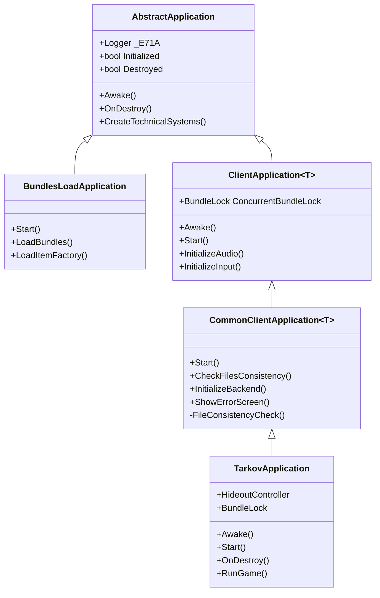
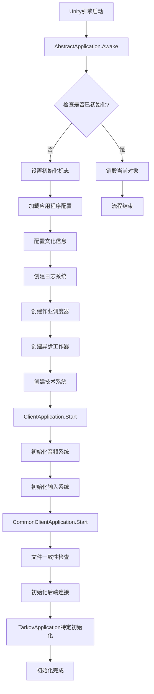
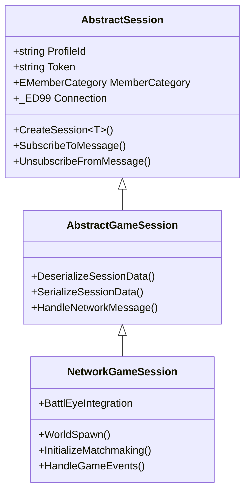
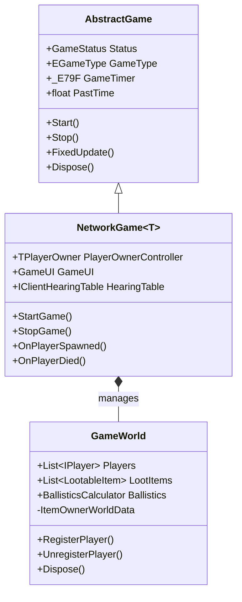
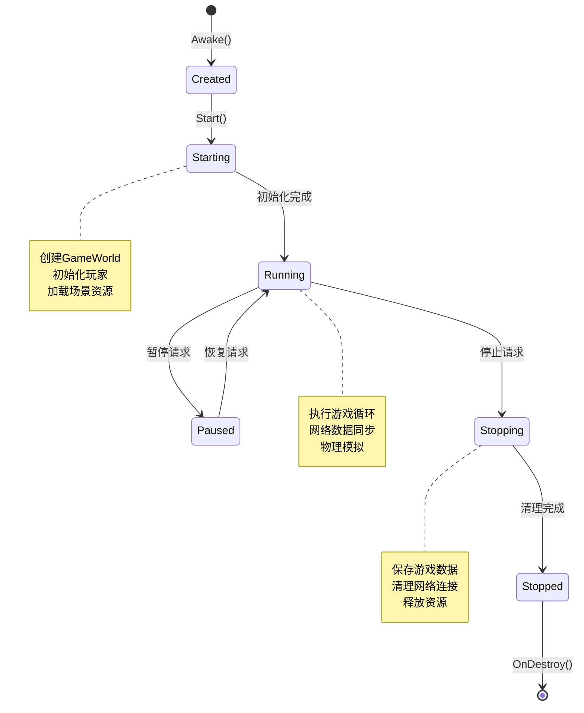
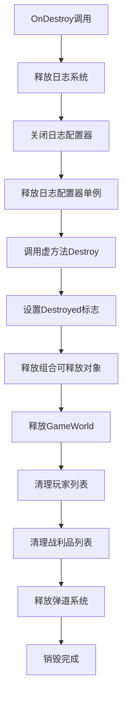
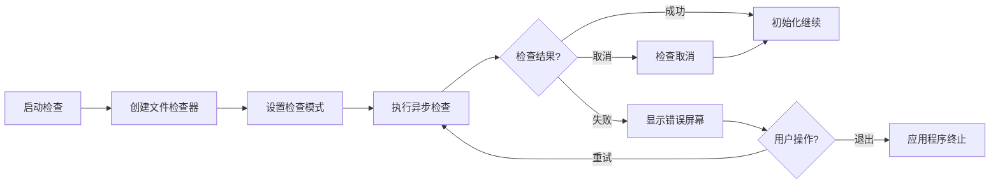
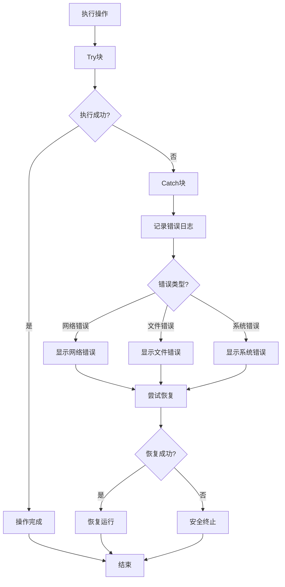

EFT游戏采用分层架构管理应用程序的完整生命周期，从启动初始化到资源释放的全过程都经过精心设计。这个系统通过多层次的抽象类和具体的实现类，确保了代码的可维护性、扩展性和稳定性。理解这个生命周期对于开发人员掌握整个系统的运行机制至关重要。

## 架构层次与核心类

应用程序架构采用清晰的分层设计，每一层都有明确的职责。顶层是具体的实现类，中间层是功能抽象基类，底层是Unity MonoBehaviour和系统接口。这种设计允许在不同层次进行定制和扩展，同时保持核心逻辑的一致性。



**AbstractApplication** 是所有应用程序的抽象基类，负责系统级的初始化工作。它在`Awake()`方法中执行以下关键操作：设置单例标志、配置文化信息、加载应用程序配置、创建日志系统、初始化作业调度器、创建异步工作器、初始化技术系统等。该类确保了应用程序只被初始化一次，如果检测到重复初始化会销毁当前对象并发出警告[Assembly-CSharp/EFT/AbstractApplication.cs#L23-L96]。

**BundlesLoadApplication** 专门用于资源包的预加载，这是游戏启动的第一阶段。它负责加载必要的资源包和物品工厂，确保后续游戏运行所需的资源已经就绪。这个类通常用于开发环境或特定的加载场景[Assembly-CSharp/EFT/BundlesLoadApplication.cs#L1-L150]。

**ClientApplication<T>** 是所有客户端应用程序的抽象基类，它在AbstractApplication的基础上添加了客户端特有的初始化逻辑，包括音频系统初始化、输入系统初始化、UI声音系统初始化、NVIDIA Reflex支持等。这个类还管理着BundleLock，用于控制资源包的并发访问[Assembly-CSharp/EFT/ClientApplication.cs#L1-L200]。

**CommonClientApplication<T>** 在ClientApplication的基础上增加了文件一致性检查和后端初始化功能。它确保游戏文件的完整性，并处理文件损坏或缺失的情况。这个类还管理着错误屏幕的显示，当文件检查失败时会向用户展示错误信息[Assembly-CSharp/EFT/CommonClientApplication.cs#L1-L200]。

**TarkovApplication** 是最终的具体实现类，它整合了所有功能并提供游戏特定的逻辑。它包含藏身处管理器、游戏世界创建、匹配系统集成等高级功能。TarkovApplication是整个应用程序生命周期的最终协调者[Assembly-CSharp/EFT/TarkovApplication.cs#L1-L200]。

## 初始化流程

应用程序的初始化是一个多阶段的过程，每个阶段都有特定的职责和依赖关系。初始化流程从Unity引擎调用`Awake()`方法开始，逐步完成所有必要的系统设置。



**第一阶段：AbstractApplication初始化**

AbstractApplication的`Awake()`方法是整个初始化流程的起点。首先检查`Initialized`静态标志，如果为true表示已经有一个应用程序实例存在，此时会记录警告并销毁当前对象，防止重复初始化[Assembly-CSharp/EFT/AbstractApplication.cs#L26-L32]。如果通过检查，则设置`Initialized`标志为true，确保后续的初始化能够正常进行。

接下来设置线程的默认文化信息为InvariantCulture，这确保了字符串比较、日期格式化等操作在不同地区的系统上表现一致[Assembly-CSharp/EFT/AbstractApplication.cs#L34-L35]。然后加载应用程序配置，如果配置为空则创建默认配置实例[Assembly-CSharp/EFT/AbstractApplication.cs#L37-L40]。

安全证书验证回调被设置为总是返回true，这是为了在开发环境中避免SSL证书验证问题[Assembly-CSharp/EFT/AbstractApplication.cs#L42-L43]。然后创建日志配置器和日志实例，日志系统记录整个应用程序运行期间的所有重要事件[Assembly-CSharp/EFT/AbstractApplication.cs#L45-L53]。

作业调度器（JobScheduler）被添加到游戏对象并设置为单例，它管理着所有异步任务的执行[Assembly-CSharp/EFT/AbstractApplication.cs#L54-L61]。异步工作器（AsyncWorker）也被创建为单例，用于在后台线程执行耗时的操作[Assembly-CSharp/EFT/AbstractApplication.cs#L62-L63]。

**CreateTechnicalSystems()** 方法创建了一系列技术系统组件，包括枪口管理器、光照管理器、闪烁效果系统、武器过热系统等。这些系统以组件的形式注册到GameObject上，并由各自的管理器统一管理[Assembly-CSharp/EFT/AbstractApplication.cs#L98-L120]。

**第二阶段：ClientApplication初始化**

ClientApplication的`Start()`方法负责客户端特定的初始化。它首先初始化音频监听器一致性管理器，确保音频系统的稳定运行[Assembly-CSharp/EFT/ClientApplication.cs#L88-L93]。然后创建GUISounds实例并初始化，这是UI音效系统的核心[Assembly-CSharp/EFT/ClientApplication.cs#L94-L96]。

NVIDIA Reflex支持的检查也在这个阶段进行，如果可用则初始化Reflex组件，否则进行适当的清理[Assembly-CSharp/EFT/ClientApplication.cs#L67-L103]。BundleLock被创建用于管理资源包的并发访问，其最大并发数设置为int.MaxValue，表示几乎不限制并发访问[Assembly-CSharp/EFT/ClientApplication.cs#L105-L107]。

**第三阶段：CommonClientApplication初始化**

CommonClientApplication的`Start()`方法添加了文件一致性检查逻辑。它使用FilesCheckerFactory创建文件检查器实例，然后异步执行文件一致性检查[Assembly-CSharp/EFT/CommonClientApplication.cs#L38-L45]。如果检查失败，会显示错误屏幕通知用户[Assembly-CSharp/EFT/CommonClientApplication.cs#L100-L110]。

后端初始化也是在这个阶段进行，包括与游戏服务器的连接建立、认证处理等[Assembly-CSharp/EFT/CommonClientApplication.cs#L115-L125]。这个阶段的成功是游戏能够正常运行的必要条件。

## 会话管理系统

会话管理是应用程序生命周期中的核心部分，它负责管理游戏会话的创建、维护和销毁。EFT使用分层结构来管理不同类型的会话，确保网络通信、数据同步和游戏逻辑的协调一致。

### 会话类层次结构



**AbstractSession** 是所有会话的基类，它提供了会话的基本功能，包括Profile ID管理、Token管理、成员类别、网络连接管理等。该类使用字典来管理网络消息的订阅，通过`SubscribeToMessage()`和`UnsubscribeFromMessage()`方法实现消息的动态订阅和取消订阅[Assembly-CSharp/EFT/AbstractSession.cs#L1-L150]。

**AbstractGameSession** 在AbstractSession的基础上添加了游戏会话特有的功能，包括会话数据的序列化和反序列化、游戏网络消息的处理等。这个类定义了游戏会话的基本协议和数据结构[Assembly-CSharp/EFT/AbstractGameSession.cs#L1-L200]。

**NetworkGameSession** 是最具体的实现类，它管理网络游戏的实际运行。该类集成了BattlEye反作弊系统、实现了世界生成逻辑、处理匹配过程、管理游戏事件等。NetworkGameSession是客户端与服务器通信的核心桥梁[Assembly-CSharp/EFT/NetworkGameSession.cs#L1-L200]。

### 会话生命周期

会话的生命周期从用户选择进入游戏开始，到游戏结束返回菜单结束。整个过程涉及多个状态转换和大量的网络通信。

| 阶段 | 状态 | 主要操作 | 涉及类 |
|------|------|----------|--------|
| 会话创建 | Creating | 创建会话对象、设置配置 | NetworkGameSession |
| 匹配中 | Matching | 连接服务器、等待玩家 | NetworkGameSession |
| 准备中 | Preparing | 加载资源、生成世界 | NetworkGameSession, GameWorld |
| 游戏中 | Playing | 游戏循环、网络同步 | AbstractGame, NetworkGame<T> |
| 结束中 | Ending | 保存数据、清理资源 | NetworkGameSession, AbstractGame |
| 已结束 | Ended | 释放资源、返回菜单 | TarkovApplication |

会话的创建通过`CreateSession<T>()`静态方法实现，该方法创建新的GameObject，添加指定的会话类型组件，并设置基本的会话参数[Assembly-CSharp/EFT/AbstractSession.cs#L110-L120]。会话销毁时会自动清理所有消息订阅，防止内存泄漏。

## 游戏世界管理

游戏世界是应用程序运行期间的核心对象，它管理着游戏中的所有实体、物理模拟、网络同步等功能。游戏世界的生命周期与会话紧密相关，但又有自己的管理机制。

### 游戏类层次结构



**AbstractGame** 是所有游戏实例的抽象基类，它定义了游戏的基本状态（GameStatus）、游戏类型（EGameType）、游戏计时器等核心属性。该类实现了IDisposable接口，确保游戏资源能够被正确释放[Assembly-CSharp/EFT/AbstractGame.cs#L1-L200]。

**NetworkGame<T>** 是网络游戏的具体实现，它管理着网络同步、玩家控制器、游戏UI、听力系统等网络游戏特有的功能。该类使用泛型参数T来指定玩家所有者的类型，提供了高度的灵活性[Assembly-CSharp/EFT/NetworkGame.cs#L1-L200]。

**GameWorld** 是游戏世界的核心管理器，它维护着玩家列表、战利品列表、弹道计算器等游戏世界的所有核心组件。GameWorld实现了IEnumerable<IPlayer>接口，可以方便地遍历所有玩家[Assembly-CSharp/EFT/GameWorld.cs#L1-L200]。

### 游戏状态机

游戏使用状态机来管理不同运行状态，状态转换遵循严格的规则以确保系统稳定性。



**Created** 状态是游戏的初始状态，此时游戏对象刚刚被创建，但尚未开始运行。在这个状态下，游戏的所有属性都被初始化为默认值[Assembly-CSharp/EFT/AbstractGame.cs#L45-L50]。

**Starting** 状态表示游戏正在初始化过程中。这个阶段包括创建GameWorld实例、初始化玩家、加载场景资源等操作。只有当所有初始化操作都成功完成后，游戏才会转换到Running状态[Assembly-CSharp/EFT/NetworkGame.cs#L300-L350]。

**Running** 状态是游戏的主要运行状态。在这个状态下，游戏循环持续执行，包括物理更新、网络同步、AI逻辑处理等。游戏计时器也在这个状态下持续更新[Assembly-CSharp/EFT/AbstractGame.cs#L100-L120]。

**Paused** 状态允许游戏暂时停止执行，但保持所有游戏状态。当用户暂停游戏或游戏需要等待某些操作完成时会进入这个状态。从Paused状态可以返回到Running状态继续游戏[Assembly-CSharp/EFT/AbstractGame.cs#L125-L135]。

**Stopping** 状态表示游戏正在停止过程中。在这个阶段，游戏会保存所有必要的数据，清理网络连接，释放已分配的资源。这是确保数据不丢失的关键阶段[Assembly-CSharp/EFT/AbstractGame.cs#L140-L160]。

**Stopped** 状态表示游戏已经完全停止。此时所有资源都已被释放，游戏对象即将被销毁。这是游戏生命周期的最后阶段[Assembly-CSharp/EFT/AbstractGame.cs#L165-L180]。

## 资源管理与释放

正确的资源管理是应用程序稳定运行的基石。EFT使用多种机制来确保资源被正确加载和释放，包括单例模式、IDisposable接口、协程清理等。

### 单例管理系统

系统使用大量的单例来管理全局资源和服务，这些单例在应用程序初始化时创建，在销毁时释放。

| 单例类型 | 管理内容 | 创建位置 | 释放位置 |
|---------|---------|---------|---------|
| JobScheduler | 异步任务调度 | AbstractApplication.Awake | AbstractApplication.OnDestroy |
| AsyncWorker | 后台线程操作 | AbstractApplication.Awake | AbstractApplication.OnDestroy |
| GameWorld | 游戏世界实例 | NetworkGame.Start | Singleton.Release |
| AbstractGame | 游戏实例 | GameWorld初始化 | Singleton.Release |
| GUISounds | UI音效系统 | ClientApplication.Start | ClientApplication.OnDestroy |
| AudioListenerConsistencyManager | 音频监听器 | ClientApplication.Start | ClientApplication.OnDestroy |

单例的创建使用`Singleton<T>.Create()`方法，这会检查是否已经存在实例，如果不存在则创建新实例[Assembly-CSharp/EFT/AbstractApplication.cs#L54-L56]。单例的释放使用`Singleton<T>.Release()`方法，这会清理实例引用并调用实例的Dispose方法（如果实现了IDisposable接口）[Assembly-CSharp/EFT/AbstractApplication.cs#L133-L135]。

### 资源释放流程

应用程序的销毁过程遵循严格的顺序，确保所有资源都被正确释放且不会出现访问已释放资源的情况。



**AbstractApplication.OnDestroy()** 是资源释放的入口点。它首先释放日志系统单例，然后关闭并释放日志配置器[Assembly-CSharp/EFT/AbstractApplication.cs#L128-L132]。接着调用虚方法`Destroy()`，允许子类执行特定的清理逻辑[Assembly-CSharp/EFT/AbstractApplication.cs#L133-L136]。

**AbstractGame.Dispose()** 释放游戏的组合可释放对象（CompositeDisposable），这是一个包含所有可释放资源的集合[Assembly-CSharp/EFT/AbstractGame.cs#L200-L210]。通过一次性释放所有订阅和资源，避免了资源泄漏。

**GameWorld.Dispose()** 执行游戏世界的详细清理工作。它遍历所有玩家并调用其Dispose方法，清理所有战利品物品，释放弹道计算器，清理网络同步对象等[Assembly-CSharp/EFT/GameWorld.cs#L500-L550]。

## 错误处理与恢复

应用程序生命周期中不可避免地会遇到各种错误情况。EFT实现了完善的错误处理机制，包括错误检测、错误报告、错误恢复等功能。

### 文件一致性检查

文件一致性检查是应用程序启动时的关键步骤，确保游戏文件的完整性和正确性。



**FileConsistencyCheckOperation** 封装了文件一致性检查的逻辑。它使用FilesChecker执行实际的检查操作，支持两种检查模式：普通文件和关键文件。普通文件使用快速检查模式，关键文件使用完整检查模式[Assembly-CSharp/EFT/CommonClientApplication.cs#L20-L35]。

当检查失败时，系统会显示错误屏幕通知用户。错误屏幕由`PreloaderUI`单例管理，显示文件损坏的详细信息[Assembly-CSharp/EFT/CommonClientApplication.cs#L100-L110]。用户可以选择重试检查或退出游戏。

### 运行时错误处理

运行时错误通过try-catch块进行捕获和处理，确保单个组件的错误不会导致整个应用程序崩溃。



**异步状态机**中的错误处理模式是标准的try-catch-finally结构。在try块中执行正常的逻辑，catch块捕获所有异常并记录到日志系统，finally块确保资源被正确清理[Assembly-CSharp/EFT/CommonClientApplication.cs#L80-L115]。

错误日志使用`Logger.LogError()`方法记录，包含详细的错误信息和堆栈跟踪。这些日志对于诊断问题至关重要[Assembly-CSharp/EFT/AbstractApplication.cs#L50-L53]。

## 性能优化策略

应用程序生命周期管理中集成了多种性能优化策略，确保资源的高效利用和流畅的运行体验。

### 资源异步加载

大量使用异步操作来加载资源，避免阻塞主线程，保持UI的响应性。

```csharp
// 异步加载资源包的示例
ResourceLoadingSystem<IAssetBundleData>._E002[] bundles = ...;
Task loadTask = _E780.LoadBundles(bundles);
await loadTask;  // 非阻塞等待
```

这种模式在`BundlesLoadApplication`中被广泛使用，确保大量资源的加载不会卡住应用程序的启动[Assembly-CSharp/EFT/BundlesLoadApplication.cs#L25-L40]。

### 资源池化与缓存

GameWorld实现了游戏世界的缓存机制，允许在不同会话之间复用已加载的资源，减少重复加载的开销[Assembly-CSharp/EFT/TarkovApplication.cs#L30-L50]。

**BundleLock** 管理资源包的并发访问，避免资源竞争和重复加载[Assembly-CSharp/EFT/ClientApplication.cs#L105-L107]。

### 更新队列管理

应用程序使用不同的更新队列来分配更新任务的优先级，确保关键系统获得足够的CPU时间。

| 队列类型 | 优先级 | 用途 | 更新频率 |
|---------|-------|------|---------|
| High | 最高 | 物理模拟、网络同步 | 每帧 |
| Normal | 中等 | 游戏逻辑、AI行为 | 每帧 |
| Low | 最低 | 后台任务、资源清理 | 每几帧 |

AbstractGame暴露了`UpdateQueue`属性，允许子类指定使用的更新队列[Assembly-CSharp/EFT/AbstractGame.cs#L75-L80]。这种设计使得不同的游戏类型可以优化其更新策略。

## 调试与诊断

为了便于开发和问题诊断，应用程序生命周期管理提供了丰富的调试工具和日志输出。

### 日志系统

日志系统是诊断问题的主要工具。应用程序在不同层次记录日志信息。

**Application级别日志** 记录启动、初始化、销毁等关键生命周期事件[Assembly-CSharp/EFT/AbstractApplication.cs#L50-L53]。

**Session级别日志** 记录会话创建、网络连接、匹配过程等事件[Assembly-CSharp/EFT/NetworkGameSession.cs#L30-L40]。

**Game级别日志** 记录游戏状态变化、玩家行为、游戏事件等[Assembly-CSharp/EFT/AbstractGame.cs#L100-L120]。

### 性能分析

JobScheduler内置了性能分析功能，可以记录异步任务的执行时间和资源使用情况[Assembly-CSharp/EFT/AbstractApplication.cs#L54-L61]。

```csharp
jobScheduler.Init(_E305.Config.Pools.ContinuationProfilerEnabled);
```

当ContinuationProfilerEnabled为true时，系统会收集详细的性能数据，用于性能瓶颈分析。

## 总结与最佳实践

应用程序生命周期管理是EFT架构的基石，它确保了系统的稳定性、可维护性和性能。以下是关键要点和最佳实践：

**架构原则**：使用分层抽象，每一层都有明确的职责。AbstractApplication处理系统级初始化，ClientApplication处理客户端特定功能，CommonClientApplication添加通用功能，TarkovApplication实现游戏特定逻辑[Assembly-CSharp/EFT/AbstractApplication.cs#L1-L216]。

**资源管理**：始终使用IDisposable模式管理资源，确保资源被正确释放。使用单例模式管理全局服务，但要注意单例的创建和释放时机[Assembly-CSharp/EFT/AbstractGame.cs#L200-L210]。

**错误处理**：在异步操作中使用try-catch-finally模式，确保异常被捕获和记录，资源被清理。提供用户友好的错误信息，给出恢复选项[Assembly-CSharp/EFT/CommonClientApplication.cs#L80-L115]。

**性能优化**：使用异步操作避免阻塞主线程。实现资源缓存减少重复加载。合理使用更新队列优化CPU分配[Assembly-CSharp/EFT/BundlesLoadApplication.cs#L25-L40]。

**调试支持**：在关键路径添加日志输出，记录足够的信息用于问题诊断。使用性能分析工具识别瓶颈[Assembly-CSharp/EFT/AbstractApplication.cs#L50-L53]。

要深入了解游戏世界的详细管理机制，建议阅读[游戏世界核心管理器](7-you-xi-shi-jie-he-xin-guan-li-qi)。对于玩家系统的生命周期，请参考[玩家核心类架构](8-wan-jia-he-xin-lei-jia-gou)。