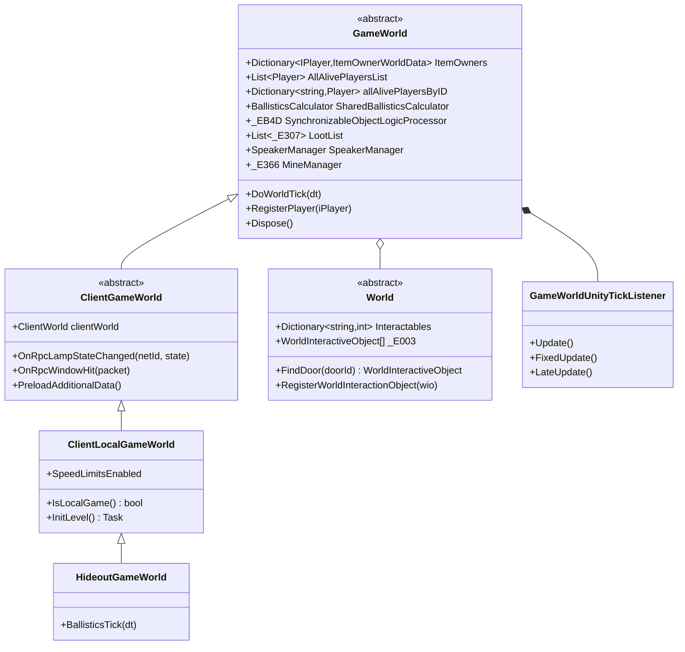
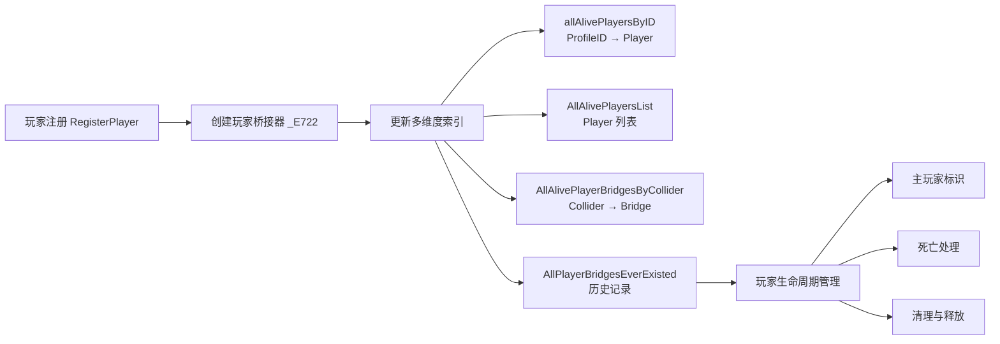
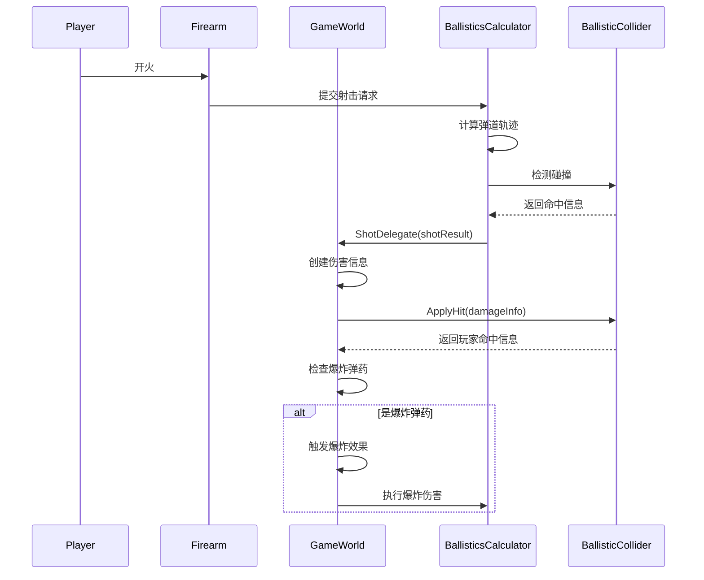
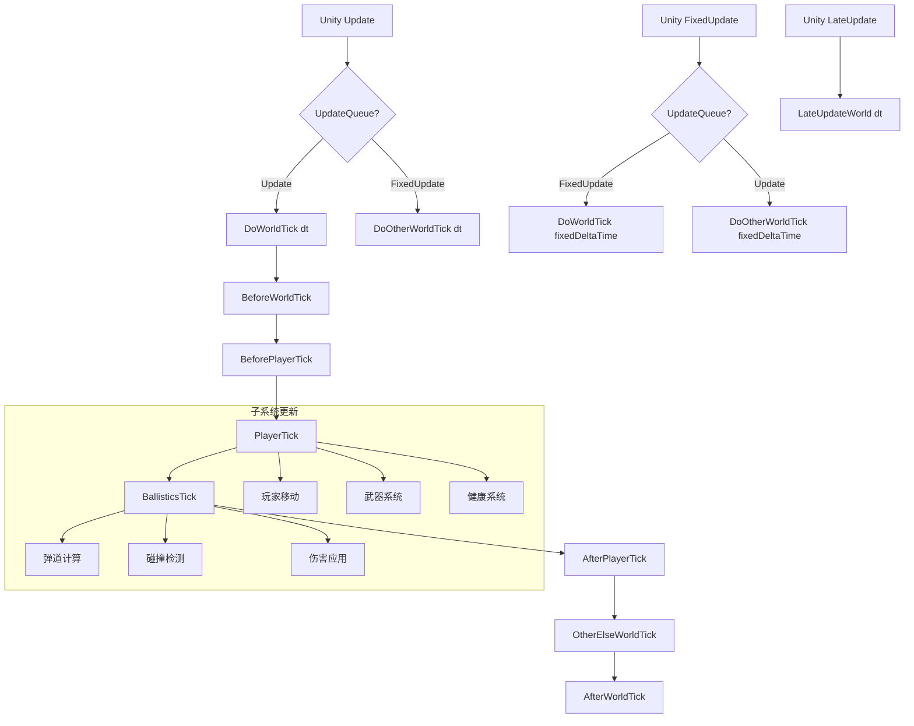
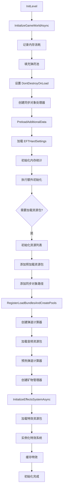
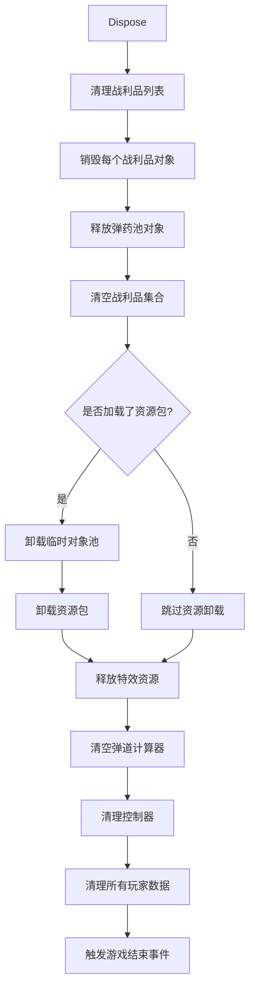

游戏世界核心管理器（GameWorld）是 TarkovUnity 系统中最核心的架构组件，作为游戏世界的统一管理中心，负责协调玩家、物品、物理、网络同步等所有游戏世界的核心功能。它采用抽象基类设计，通过继承层次结构支持不同的游戏模式（本地游戏、在线游戏、藏身处等），是整个游戏运行时架构的中心枢纽。

Sources: [Assembly-CSharp/EFT/GameWorld.cs](Assembly-CSharp/EFT/GameWorld.cs#L1-L200)

## 系统架构概述

游戏世界管理器采用分层继承架构，从抽象基类到具体实现的清晰层次结构，确保了代码的可扩展性和可维护性。顶层 `GameWorld` 定义了所有游戏世界共有的核心接口和功能，子类则根据特定游戏模式实现专用逻辑。

Sources: [Assembly-CSharp/EFT/GameWorld.cs](Assembly-CSharp/EFT/GameWorld.cs#L1-L50), [Assembly-CSharp/EFT/ClientGameWorld.cs](Assembly-CSharp/EFT/ClientGameWorld.cs#L1-L50), [Assembly-CSharp/ClientLocalGameWorld.cs](Assembly-CSharp/ClientLocalGameWorld.cs#L1-L38)

## 核心职责领域

### 玩家管理系统

玩家管理是 GameWorld 的核心功能之一，通过多个数据结构和索引系统实现高效的玩家查找和更新。系统维护玩家注册表、活跃玩家列表、碰撞器映射等多维度索引，支持通过 ProfileID、碰撞器、数字ID等多种方式快速定位玩家对象。

Sources: [Assembly-CSharp/EFT/GameWorld.cs](Assembly-CSharp/EFT/GameWorld.cs#L2000-L2100), [Assembly-CSharp/EFT/GameWorld.cs](Assembly-CSharp/EFT/GameWorld.cs#L3300-L3400)

### 弹道计算系统

弹道系统采用共享计算器模式，`SharedBallisticsCalculator` 负责处理所有弹道计算，包括子弹飞行轨迹、碰撞检测、伤害应用等。系统通过 `ShotDelegate` 回调函数处理射击结果，支持爆炸弹药的特殊逻辑。

Sources: [Assembly-CSharp/EFT/GameWorld.cs](Assembly-CSharp/EFT/GameWorld.cs#L3000-L3100), [Assembly-CSharp/EFT/GameWorld.cs](Assembly-CSharp/EFT/GameWorld.cs#L1000-L1100)

### 战利品管理系统

战利品系统管理所有掉落物品的生命周期，包括静态战利品、动态掉落物品和尸体。系统通过 `LootList` 维护所有活跃的战利品对象，支持创建、更新、销毁和查找操作。

| 战利品类型 | 创建方法 | 物理特性 | 同步支持 |
|-----------|---------|---------|---------|
| 静态战利品 | CreateStaticLoot | 无重力，固定位置 | 否 |
| 动态战利品 | CreateLootWithRigidbody | 有重力，可移动 | 否 |
| 尸体 | SpawnLootCorpse | Ragdoll 物理 | 部分支持 |
| 容器 | CreateLootItemInWorld | 固定位置 | 是 |

Sources: [Assembly-CSharp/EFT/GameWorld.cs](Assembly-CSharp/EFT/GameWorld.cs#L2600-L2800), [Assembly-CSharp/EFT/GameWorld.cs](Assembly-CSharp/EFT/GameWorld.cs#L1500-L1600)

## 主循环架构

游戏世界的主循环通过 `GameWorldUnityTickListener` 实现，它作为 Unity 的 MonoBehaviour 桥接器，将 Unity 的生命周期方法映射到 GameWorld 的更新逻辑中。系统支持两种更新队列：`Update` 和 `FixedUpdate`，确保物理模拟和游戏逻辑的解耦。

Sources: [Assembly-CSharp/EFT/GameWorldUnityTickListener.cs](Assembly-CSharp/EFT/GameWorldUnityTickListener.cs#L1-L52), [Assembly-CSharp/EFT/GameWorld.cs](Assembly-CSharp/EFT/GameWorld.cs#L3100-L3200)

### 更新阶段详解

主循环被划分为多个明确的阶段，每个阶段负责特定的更新逻辑：

- **BeforeWorldTick**: 世界更新前的预处理，触发 `beforeWorldTickAction` 事件
- **BeforePlayerTick**: 玩家更新前的准备工作
- **PlayerTick**: 核心玩家更新逻辑，执行所有活跃玩家的 `UpdateTick` 或 `FixedUpdateTick`
- **BallisticsTick**: 弹道系统更新，手动调用共享弹道计算器的更新
- **AfterPlayerTick**: 玩家更新后的后处理工作
- **OtherElseWorldTick**: 其他世界系统的更新逻辑
- **AfterWorldTick**: 世界更新完成后的清理和事件触发

Sources: [Assembly-CSharp/EFT/GameWorld.cs](Assembly-CSharp/EFT/GameWorld.cs#L3100-L3200)

## 初始化流程

游戏世界的初始化采用异步模式，通过 `InitializeGameWorldAsync` 方法按顺序初始化各个子系统。初始化过程包括内存管理、资源预加载、弹道系统预热、音频系统初始化等关键步骤。

Sources: [Assembly-CSharp/EFT/GameWorld.cs](Assembly-CSharp/EFT/GameWorld.cs#L1000-L1200)

### 特效系统初始化

特效系统初始化是一个独立的异步过程，通过 `InitializeEffectsSystemAsync` 方法实现。系统首先保留特效资源包，然后加载资源、实例化特效游戏对象，最后创建全局 `Effects` 单例并缓存所有特效。

Sources: [Assembly-CSharp/EFT/GameWorld.cs](Assembly-CSharp/EFT/GameWorld.cs#L1200-L1300)

## 网络同步对象管理

GameWorld 通过 `SynchronizableObjectLogicProcessor` 管理所有需要网络同步的游戏对象，包括可开关灯、窗户、手榴弹、绊雷等。这些对象的状态变化需要通过网络同步到所有客户端，确保多人游戏的一致性。

| 同步对象类型 | 存储结构 | 同步方法 | 特殊处理 |
|-------------|---------|---------|---------|
| Turnable | `Dictionary<int, Turnable>` | OnRpcLampStateChanged | 灯光状态同步 |
| WindowBreaker | `_E3CE<int, WindowBreaker>` | OnRpcWindowHit | 窗户破坏同步 |
| Throwable | `_E3CE<int, Throwable>` | 手榴弹状态同步 | 位置和状态 |
| TripwireSynchronizableObject | TripwireManager | 绊雷状态同步 | 伤害区域 |

Sources: [Assembly-CSharp/EFT/GameWorld.cs](Assembly-CSharp/EFT/GameWorld.cs#L1500-L1600), [Assembly-CSharp/EFT/ClientGameWorld.cs](Assembly-CSharp/EFT/ClientGameWorld.cs#L1-L100)

## 交互检测系统

交互检测系统通过射线检测实现玩家与游戏世界的交互。系统使用预定义的层遮罩来优化检测性能，支持战利品拾取、门窗开关、固定武器使用等多种交互场景。

- **_interactiveLootMask**: 包含 Loot、Interactive、LootItem 层，用于战利品检测
- **interactionRaycastMask**: 在交互式战利品基础上添加 Player 层，用于扩展交互
- **playerLayerMask**: 仅包含 Player 层，用于玩家专用检测
- **obstacleLayerMask**: 包含 HighPolyCollider、Terrain 等阻挡层，用于遮挡检测

Sources: [Assembly-CSharp/EFT/GameWorld.cs](Assembly-CSharp/EFT/GameWorld.cs#L3000-L3100), [Assembly-CSharp/EFT/GameWorld.cs](Assembly-CSharp/EFT/GameWorld.cs#L1500-L1600)

## 资源管理与清理

GameWorld 实现了 `IDisposable` 接口，确保在游戏世界销毁时正确释放所有资源。清理过程包括销毁战利品对象、释放对象池、清空集合、清理玩家数据等多个步骤，防止内存泄漏和资源残留。

Sources: [Assembly-CSharp/EFT/GameWorld.cs](Assembly-CSharp/EFT/GameWorld.cs#L3300-L3500)

### 错误处理系统

GameWorld 定义了一套完整的错误类型体系，用于处理各种异常情况。这些错误类继承自 `Error` 基类，提供详细的错误信息和上下文，便于调试和问题排查。

| 错误类型 | 触发条件 | 关键信息 |
|---------|---------|---------|
| ItemOwnerNotFoundError | 无法根据ID找到物品所有者 | ItemOwnerId |
| ContainerSetupError | 容器ID与父级物品不匹配 | ParentItemId, ContainerId |
| ItemNotFoundError | 无法根据ID找到物品 | ItemId |
| DistanceValidationError | 物品距离玩家过远 | Item, PlayerPosition, ItemPosition |
| ItemTransferError | 物品传递失败 | Item, CurrentPlayer, FromPlayer, ToPlayer |
| PlayerDeadError | 对已死亡玩家执行操作 | Player |
| PlayerUnavailableError | 玩家不可用 | Player |

Sources: [Assembly-CSharp/EFT/GameWorld.cs](Assembly-CSharp/EFT/GameWorld.cs#L200-L600)

## 扩展点和定制化

GameWorld 提供了多个虚拟方法和事件，允许子类扩展和定制特定行为：

- **SyncObjectProcessorFactory()**: 工厂方法，子类可重写以创建自定义的同步对象处理器
- **PreloadAdditionalData()**: 异步方法，子类可重写以添加额外的数据预加载逻辑
- **BallisticsTick(dt)**: 虚拟方法，子类可重写以修改弹道更新逻辑
- **PlayerTick(dt)**: 虚拟方法，子类可重写以添加自定义的玩家更新逻辑
- **OnLateUpdate**: 事件，允许外部订阅世界晚期更新事件

Sources: [Assembly-CSharp/EFT/GameWorld.cs](Assembly-CSharp/EFT/GameWorld.cs#L2000-L2100), [Assembly-CSharp/EFT/HideoutGameWorld.cs](Assembly-CSharp/HideoutGameWorld.cs#L1-L18)

## 与其他系统的集成

GameWorld 作为核心管理器，与游戏的多个子系统紧密集成：

- **玩家系统**: 通过 `IPlayer` 接口和 `Player` 类集成，管理玩家的生命周期、状态和行为
- **物品系统**: 通过 `IItemOwner` 接口和 `Item` 类集成，管理物品的所有权、位置和交互
- **物理系统**: 通过 `BallisticsCalculator` 和 `BallisticCollider` 集成，处理弹道计算和碰撞检测
- **网络系统**: 通过 `ClientWorld` 和同步对象处理器集成，实现网络同步
- **音频系统**: 通过 `BetterAudio` 单例集成，管理游戏世界的音频播放
- **特效系统**: 通过 `Effects` 单例集成，管理视觉特效的播放和缓存

Sources: [Assembly-CSharp/EFT/GameWorld.cs](Assembly-CSharp/EFT/GameWorld.cs#L1-L200), [Assembly-CSharp/EFT/World.cs](Assembly-CSharp/EFT/World.cs#L1-L129)

## 下一步学习

理解游戏世界核心管理器后，建议按照以下路径深入学习相关系统：

1. [玩家核心类架构](8-wan-jia-he-xin-lei-jia-gou) - 了解 GameWorld 如何管理 Player 对象
2. [移动系统与物理计算](9-yi-dong-xi-tong-yu-wu-li-ji-suan) - 学习玩家移动和物理交互的实现
3. [弹道计算与伤害系统](22-dan-dao-ji-suan-yu-shang-hai-xi-tong) - 深入了解弹道计算系统的详细实现
4. [网络与同步架构](19-wang-luo-you-xi-hui-hua-guan-li) - 理解多人游戏中的同步机制