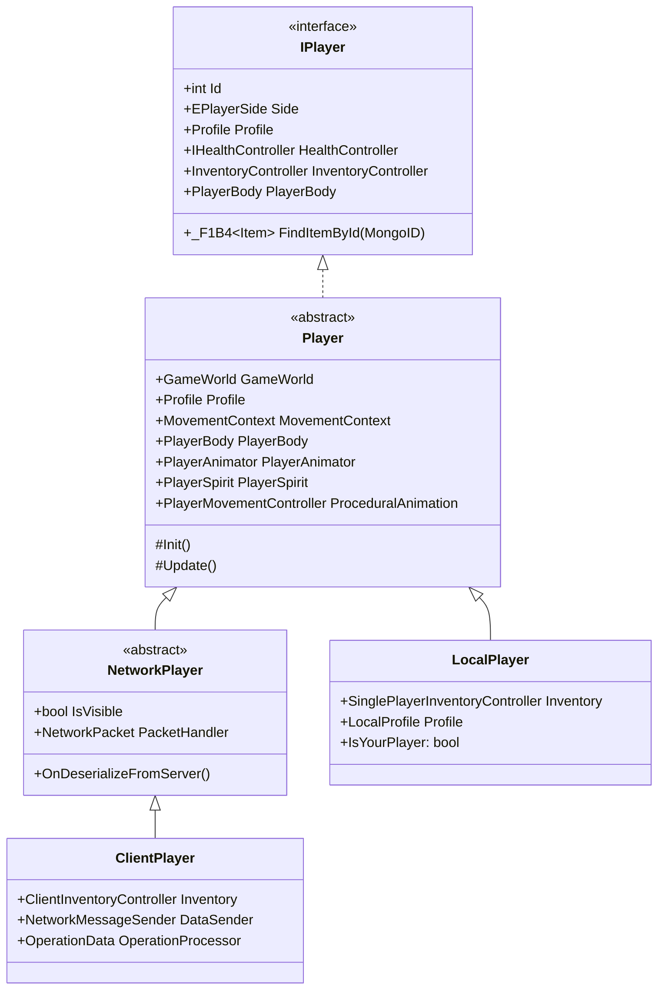
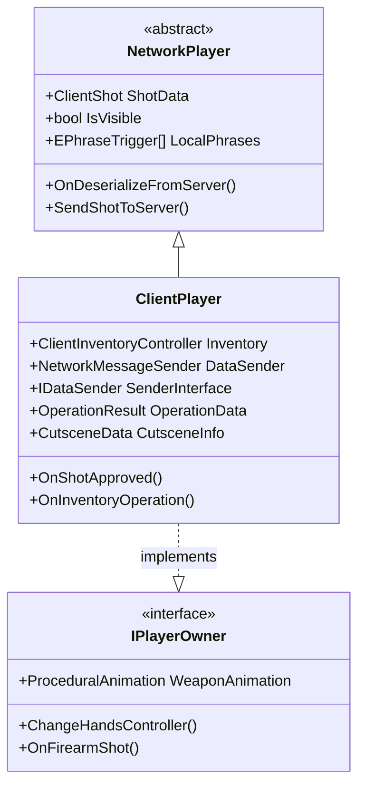

玩家系统是 Tarkov Unity 项目的核心模块之一，采用多层架构设计，通过接口抽象、继承层次和部分类(partial class)的方式实现了高度模块化和可维护的代码结构。本文档将深入剖析玩家核心类的架构设计、组件职责和交互关系。

## 架构概览

玩家系统采用了**分层继承 + 部分类模块化**的混合架构模式。这种设计既保证了类型安全性，又通过部分类将庞大的功能逻辑分解到多个文件中，提升了代码的可维护性。核心层次结构从抽象到具体，依次为接口层、基础实现层、网络抽象层和具体实现层。

这个架构设计的核心优势在于：**IPlayer 接口**定义了玩家的核心契约，确保所有玩家类型都具备基本能力；**Player 基类**提供了共享的初始化、更新和销毁逻辑；**NetworkPlayer** 抽象网络同步功能；**ClientPlayer** 和 **LocalPlayer** 则分别针对网络游戏和单人游戏提供了具体的实现。

Sources: [IPlayer.cs](Assembly-CSharp/EFT/IPlayer.cs#L1-L101), [Player.cs](Assembly-CSharp/EFT/Player.cs#L1-L100), [NetworkPlayer.cs](Assembly-CSharp/EFT/NetworkPlayer.cs#L1-L100), [ClientPlayer.cs](Assembly-CSharp/EFT/ClientPlayer.cs#L1-L100), [LocalPlayer.cs](Assembly-CSharp/EFT/LocalPlayer.cs#L1-L100)

## 核心类层次

### IPlayer 接口层

**IPlayer** 是整个玩家系统的顶层接口，定义了所有玩家类型必须实现的契约。该接口包含约 40 个成员，涵盖了玩家的身份信息、状态查询、物品操作、生命值管理等核心功能。

关键成员包括：
- **身份属性**：`Id`、`Side`、`ProfileId`、`AccountId` - 用于标识玩家的唯一身份
- **状态属性**：`Profile`、`HealthController`、`InventoryController` - 提供玩家的核心状态访问
- **变换属性**：`LookDirection`、`Position`、`Transform`、`WeaponRoot` - 用于定位和渲染
- **交互方法**：`FindItemById`、`OnDeserializeFromServer`、`SetInteractInHands` - 处理玩家交互
- **事件**：`OnIPlayerDeadOrUnspawn` - 玩家死亡或卸载时的通知机制

Sources: [IPlayer.cs](Assembly-CSharp/EFT/IPlayer.cs#L1-L101)

### Player 基类层

**Player** 是实现 IPlayer 接口的抽象基类，是整个玩家系统的核心。由于功能庞大，该类采用了部分类(partial class)的设计模式，将 13,000+ 行代码分散到 9 个独立文件中，每个文件负责特定的功能领域。

Player 基类通过静态工厂方法 `Create<TPlayer>()` 创建实例，该方法负责：
1. 从对象池获取游戏对象
2. 配置动画器和组件
3. 设置更新队列和敏感度
4. 初始化角色控制器模式

Sources: [Player.cs](Assembly-CSharp/EFT/Player.cs#L1-L100), [Player.LifeCycle.cs](Assembly-CSharp/EFT/Player.LifeCycle.cs#L1-L100)

## 部分类模块化设计

Player 类采用了部分类技术，将功能按职责分解到以下 9 个文件中：

| 文件名 | 职责范围 | 主要内容 |
|--------|---------|---------|
| **Player.cs** | 主类定义 | 类声明、核心字段、基础方法 |
| **Player.HandsControllers.cs** | 手部控制器 | 所有手部控制器基类和实现 |
| **Player.FirearmController.cs** | 武器控制器 | 枪械操作、射击、换弹逻辑 |
| **Player.EmptyHandsController.cs** | 空手控制器 | 空手状态下的交互和动画 |
| **Player.InventoryController.cs** | 物品管理 | 背包操作、物品加载、装弹卸弹 |
| **Player.Motion.cs** | 运动系统 | 移动、动画、IK、视觉效果 |
| **Player.LifeCycle.cs** | 生命周期 | 创建、初始化、配置、销毁 |
| **Player.Audio.cs** | 音频系统 | 脚步声、装备声、环境音效 |
| **Player.Helpers.cs** | 辅助工具 | 常量、枚举、混合器、工具方法 |

Sources: [Player.HandsControllers.cs](Assembly-CSharp/EFT/Player.HandsControllers.cs#L1-L100), [Player.Motion.cs](Assembly-CSharp/EFT/Player.Motion.cs#L1-L100), [Player.InventoryController.cs](Assembly-CSharp/EFT/Player.InventoryController.cs#L1-L100), [Player.LifeCycle.cs](Assembly-CSharp/EFT/Player.LifeCycle.cs#L1-L100), [Player.Audio.cs](Assembly-CSharp/EFT/Player.Audio.cs#L1-L100), [Player.Helpers.cs](Assembly-CSharp/EFT/Player.Helpers.cs#L1-L100)

### 核心模块详解

#### HandsControllers 模块

手部控制器模块是玩家系统的核心交互部分，定义了所有手持物品的操作逻辑。包含以下主要控制器：

- **ItemHandsController** (抽象基类) - 提供物品对象创建、手部动画、操作状态管理的基础功能
- **FirearmController** - 处理枪械的射击、换弹、瞄准等操作
- **EmptyHandsController** - 管理空手状态下的交互和动画
- **KnifeController** / **QuickKnifeKickController** - 近战武器控制器
- **GrenadeHandsController** / **QuickGrenadeThrowHandsController** - 手榴弹投掷控制器
- **MedsController** - 医疗用品使用控制器
- **UsableItemController** - 通用可用物品控制器

这些控制器都继承自 `AbstractHandsController` 并实现了 `IItemInHandsController` 接口，形成了一个统一的手部操作框架。

Sources: [Player.HandsControllers.cs](Assembly-CSharp/EFT/Player.HandsControllers.cs#L1-L100)

#### Motion 模块

运动模块负责玩家的物理移动和动画同步，包含以下关键组件：

- **移动控制**：通过 `ICharacterController` 处理物理移动和碰撞检测
- **动画同步**：通过 `PlayerAnimator` 管理动画参数和状态
- **IK 系统**：通过 FinalIK 处理手部瞄准和身体倾斜
- **视觉效果**：处理脚步灰尘、装备摆动等视觉反馈

该模块还定义了 `MovementConstants` 常量类，包含移动速度、角度范围、姿态阈值等核心配置参数。

Sources: [Player.Motion.cs](Assembly-CSharp/EFT/Player.Motion.cs#L1-L100), [Player.Helpers.cs](Assembly-CSharp/EFT/Player.Helpers.cs#L1-L100)

#### InventoryController 模块

物品管理模块是玩家与游戏世界交互的桥梁，负责：

- **PlayerInventoryController** (抽象基类) - 提供背包操作的核心逻辑
- **PlayerOwnerInventoryController** - 玩家拥有的背包控制器
- **SinglePlayerInventoryController** - 单人游戏专用的背包控制器

该模块实现了装弹卸弹、物品操作、弹夹检查等复杂的库存管理逻辑，并通过回调机制处理操作结果。

Sources: [Player.InventoryController.cs](Assembly-CSharp/EFT/Player.InventoryController.cs#L1-L100)

## 支持组件系统

除了部分类模块外，玩家系统还依赖多个支持组件来提供完整的游戏体验：

### PlayerSpirit 系列

**PlayerSpiritBase** 是抽象基类，**PlayerSpirit** 是具体实现，负责管理玩家的"灵体"表现：
- 管理身体和手臂动画器
- 处理角色控制器和导航代理
- 同步玩家骨骼和变换
- 创建和管理脚印
- 支持玩家姿态变化

这个系统用于在玩家死亡、观察模式等特殊情况下显示玩家的替代表现形式。

Sources: [PlayerSpiritBase.cs](Assembly-CSharp/EFT/PlayerSpiritBase.cs#L1-L100), [PlayerSpirit.cs](Assembly-CSharp/EFT/PlayerSpirit.cs#L1-L100)

### PlayerBody

**PlayerBody** 负责玩家的身体模型和装备显示：
- 管理装备槽位视图
- 处理身体部位渲染
- 支持服装皮肤系统
- 管理装备挂载和温度效果
- 处理护甲、头盔等装备的视觉表现

Sources: [PlayerBody.cs](Assembly-CSharp/EFT/PlayerBody.cs#L1-L100)

### PlayerAnimator

**PlayerAnimator** 是动画参数管理的核心组件：
- 封装所有动画参数的哈希与设置方法
- 提供动画层、武器、动作等的统一接口
- 支持动画事件分发与交互系统
- 定义了 20+ 个动画层索引
- 管理缓存的动画参数以提升性能

Sources: [PlayerAnimator.cs](Assembly-CSharp/EFT/PlayerAnimator.cs#L1-L100)

### PlayerMovementController 系列

移动控制系统由两个核心类组成：

- **PlayerMovementContext** (接口) - 定义移动状态管理所需的属性和方法
- **PlayerMovementController** (实现) - 管理移动状态机和动画控制

该系统支持多种移动状态（站立、蹲下、趴下、翻滚、跳跃等），并处理门交互、武器架设、IK 等特殊功能。

Sources: [PlayerMovementController.cs](Assembly-CSharp/EFT/PlayerMovementController.cs#L1-L100), [PlayerMovementContext.cs](Assembly-CSharp/EFT/PlayerMovementContext.cs#L1-L100)

### PlayerOwner

**PlayerOwner** 是玩家输入和手部控制器管理的核心：
- 继承自 `InputNode`，处理玩家输入转换
- 实现 `IPlayerOwner` 接口，提供手部状态管理
- 管理手部控制器的生命周期
- 处理物品操作和切换

Sources: [PlayerOwner.cs](Assembly-CSharp/EFT/PlayerOwner.cs#L1-L100)

## 网络玩家架构

网络玩家系统针对多人游戏进行了专门设计：

**NetworkPlayer** 抽象类提供了网络同步的基础功能：
- 定义了 `ClientShot` 结构体，用于存储射击结果和伤害信息
- 实现了物品查找器类，用于根据 ID 匹配物品
- 定义了本地短语触发器数组，处理语音交流
- 提供了可见性管理和网络反序列化方法

**ClientPlayer** 是网络玩家的具体实现，扩展了以下功能：
- 网络消息发送器委托和接口
- 操作结果数据结构，用于库存操作反馈
- 过场动画数据结构
- 射击批准、库存操作、语音通信等网络同步逻辑

Sources: [NetworkPlayer.cs](Assembly-CSharp/EFT/NetworkPlayer.cs#L1-L100), [ClientPlayer.cs](Assembly-CSharp/EFT/ClientPlayer.cs#L1-L100)

## 状态管理系统

玩家状态通过 **PlayerStateContainerData** 进行管理，该类实现了 `IPlayerStateContainerBehaviour` 接口：

核心状态属性：
- **状态标识**：`Name` (EPlayerState)、`Type` (EStateType)、`IsDefaultState`
- **运动参数**：`RotationSpeedClamp`、`StateSensitivity`、`AuthoritySpeed`
- **行为标志**：`CanInteract`、`DisableRootMotion`、`CreateUniqueMovementStateObject`
- **动画参数**：`AnimationAuthority`、`StateLength`、`StateFullNameHash`

每个状态都可以封装一个 `BaseMovementState` 对象，形成了一个灵活的状态管理系统。

Sources: [PlayerStateContainerData.cs](Assembly-CSharp/EFT/PlayerStateContainerData.cs#L1-L100)

## 架构优势总结

Tarkov Unity 的玩家核心类架构具有以下显著优势：

1. **高度模块化** - 通过部分类将 13,000+ 行代码按职责分解，每个文件专注特定功能领域
2. **清晰的责任分离** - 手部控制器、运动系统、物品管理、音频系统等各司其职
3. **灵活的扩展机制** - 接口定义契约，抽象类提供基础实现，具体类完成特定功能
4. **网络友好的设计** - NetworkPlayer 和 ClientPlayer 专门处理网络同步，与本地玩家逻辑解耦
5. **丰富的支持组件** - PlayerSpirit、PlayerBody、PlayerAnimator 等组件提供完整的游戏体验

这种架构设计使得代码易于理解、测试和维护，同时为未来的功能扩展和性能优化奠定了良好的基础。

Sources: [Player.cs](Assembly-CSharp/EFT/Player.cs#L1-L100), [Player.LifeCycle.cs](Assembly-CSharp/EFT/Player.LifeCycle.cs#L1-L100)

## 相关文档

理解玩家核心类架构后，建议继续阅读以下相关文档以深入了解各个子系统：

- [移动系统与物理计算](9-yi-dong-xi-tong-yu-wu-li-ji-suan) - 深入了解 PlayerMovementController 和状态机系统
- [手部控制器与武器系统集成](10-shou-bu-kong-zhi-qi-yu-wu-qi-xi-tong-ji-cheng) - 学习 HandsControllers 模块的详细实现
- [物品基类与组件系统](11-wu-pin-ji-lei-yu-zu-jian-xi-tong) - 了解 InventoryController 与物品系统的交互

这些文档将帮助你全面掌握 Tarkov Unity 玩家系统的各个层面。