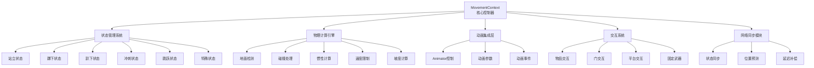

移动系统是Unity Tarkov项目中最复杂且最核心的子系统之一，它负责处理玩家的所有物理运动、状态转换、动画同步以及与游戏世界的交互。该系统通过高度优化的物理计算和智能的状态管理，为玩家提供了流畅、真实的移动体验。

## 系统架构概览

移动系统采用分层架构设计，将复杂的移动逻辑分解为多个职责明确的模块。核心控制器`MovementContext`类作为中央协调器，管理着玩家的移动状态、物理计算和动画集成。



## 核心组件分析

### MovementContext - 移动上下文控制器

`MovementContext`类是整个移动系统的大脑，实现了`IMovementContext`接口。它不仅负责物理计算，还管理着玩家的状态机、动画集成以及与游戏世界的各种交互。

**关键职责包括：**

- **移动状态管理**：通过状态机模式管理玩家在不同姿态下的移动行为
- **物理计算**：处理重力、惯性、碰撞检测、地面检测等物理现象
- **动画控制**：与Unity动画系统深度集成，确保角色动画与物理运动完美同步
- **速度调节**：根据装备重量、身体状态、地形坡度等因素动态调整移动速度
- **交互处理**：管理玩家与环境物体的各种交互操作

**核心数据结构**：MovementContext类包含大量私有字段用于维护移动系统的内部状态，如`_poseLevel`(姿势等级)、`_smoothedPoseLevel`(平滑姿势值)、`_sprintSpeed`(冲刺速度倍数)等。这些字段通过平滑插值算法确保视觉效果的流畅性。Sources: [MovementContext.cs](Assembly-CSharp/EFT/MovementContext.cs#L1-L200)

### 状态管理系统

移动系统使用状态模式来管理玩家不同的移动状态。每个状态都是`BaseMovementState`的子类，封装了特定状态下的行为逻辑。

**支持的主要移动状态：**

| 状态类名 | 对应枚举值 | 特点描述 | 典型应用场景 |
|---------|-----------|---------|-------------|
| StandingMovementState | Standing | 站立姿态，基础移动状态 | 正常战斗、探索 |
| CrouchMovementState | Crouch | 蹲下姿态，降低暴露度 | 潜行、利用掩体 |
| ProneMovementState | Prone | 趴下姿态，最高隐蔽性 | 长距离隐蔽移动、狙击 |
| SprintMovementState | Sprint | 冲刺姿态，最高速度 | 快速转移、逃脱 |
| JumpMovementState | Jump | 跳跃状态，短暂离地 | 跨越障碍、战术机动 |
| BreachDoorMovementState | BreachDoor | 破门动作，特殊交互 | 战术破门 |

状态转换通过`StateChangedDelegate`委托进行通知，允许其他系统响应状态变化。系统还支持状态覆盖机制，通过`OverridenState`字段处理特殊情况如被击中、眩晕等。Sources: [MovementContext.cs](Assembly-CSharp/EFT/MovementContext.cs#L395-L410)

## 物理计算引擎

### 地面检测系统

地面检测是移动系统的核心功能之一，确保角色能够正确识别是否站在地面上。系统使用射线检测和球形投射两种方法进行地面检测，提高了检测的可靠性和精度。

**检测参数配置：**

```csharp
public float CheckGroundedRayDistance = 0.07f;           // 射线检测距离
public float CheckGroundedCastedSphereContraction = 0.1f; // 球形投射收缩参数
```

地面检测数据存储在`RaycastHitData _groundHit`字段中，包含了地面法向量、撞击点等关键信息。系统还维护了垂直速度的滚动平均值(`VerticalSpeed`)和平滑的地面法向量(`_surfaceNormalInterpolated`)，用于计算坠落伤害和调整角色姿态。Sources: [MovementContext.cs](Assembly-CSharp/EFT/MovementContext.cs#L340-L350)

### 碰撞处理机制

移动系统实现了智能的碰撞检测和处理机制，能够识别并响应环境中的各种障碍物。系统使用`List<ObstacleCollider>`来跟踪玩家进入的障碍物区域。

**碰撞处理特性：**

- **坡度检测**：通过`slopeThreshold`(默认0.65f)判断表面是否过于陡峭
- **碰撞忽略**：支持临时忽略特定碰撞器，避免异常碰撞
- **平台适配**：能够识别并适配移动平台，自动补偿平台运动
- **穿透预防**：通过历史数据分析和预测算法防止角色穿墙

碰撞数据通过`CCHits`和`CCAllHits`列表进行收集，系统会分析碰撞方向和强度，决定如何调整角色的运动轨迹。Sources: [MovementContext.cs](Assembly-CSharp/EFT/MovementContext.cs#L320-L330)

### 惯性与倾斜计算

系统实现了逼真的惯性效果，模拟真实世界中启动、停止、转向时的惯性感受。倾斜(`Tilt`)是惯性系统的视觉表现，角色在转向时会根据速度和转向速度产生相应的身体倾斜。

**惯性系统关键参数：**

- `TiltInertia`：基于`EFTHardSettings.Instance.InertiaTiltCurve`曲线计算
- `_maxTiltStep`：最大倾斜步进速度(25度)
- `_tiltStepMultiplier`：倾斜步进倍率
- `_smoothedTilt`：平滑后的倾斜值，用于动画系统

系统使用滚动中位数(`RollingMedian`)对旋转速度和垂直速度进行平滑处理，减少抖动和不自然的运动。Sources: [MovementContext.cs](Assembly-CSharp/EFT/MovementContext.cs#L380-L390)

### 速度限制系统

移动系统实现了复杂的多因素速度限制机制，能够根据各种游戏因素动态调整玩家的移动速度。

**速度限制因素：**

| 限制类型 | 枚举值 | 影响因素 | 典型限制值 |
|---------|-------|---------|-----------|
| 表面坡度 | SurfaceNormal | 地面倾斜角度 | 0.3-1.0 |
| 身体状态 | PhysicalCondition | 体力、受伤程度 | 0.5-1.0 |
| 装备重量 | EquipmentWeight | 装备总重量 | 0.6-1.0 |
| 武器状态 | WeaponState | 是否瞄准、架设 | 0.2-1.0 |
| 特殊效果 | SpecialEffects | 药物、buff/debuff | 0.8-1.2 |

速度限制通过`Dictionary<Player.ESpeedLimit, float> _speedLimits`字典进行管理，每个限制因素都有一个对应的乘数因子。系统会计算所有因素的乘积，得到最终的速度限制值。Sources: [MovementContext.cs](Assembly-CSharp/EFT/MovementContext.cs#L390-L400)

## 动画集成层

### Animator控制系统

移动系统与Unity动画系统深度集成，通过`PlayerAnimator`类控制角色动画的播放。系统使用动画参数(`Animator Parameters`)来驱动角色动画，实现了动画与物理运动的完美同步。

**关键动画参数：**

- **运动参数**：`Speed`(速度)、`Direction`(方向)、`PoseLevel`(姿势等级)
- **状态参数**：`IsGrounded`(是否着地)、`IsSprinting`(是否冲刺)
- **交互参数**：`Tilt`(倾斜)、`HandsToBodyAngle`(手部与身体角度)

系统通过`_smoothedPoseLevel`(平滑姿势等级)和`_smoothedTilt`(平滑倾斜值)等插值变量，确保动画过渡的平滑性。Sources: [MovementContext.cs](Assembly-CSharp/EFT/MovementContext.cs#L210-L220)

### 旋转处理函数

系统为不同的场景提供了专门的旋转处理函数，通过`Action<Player>`委托进行调用。这些函数确保在不同姿态和状态下，角色的手部和相机能够正确旋转。

**旋转函数类型：**

| 函数名称 | 应用场景 | 特殊处理 |
|---------|---------|---------|
| DefaultRotationFunction | 普通状态 | 基础旋转，无特殊处理 |
| VaultingRotationFunction | 跃迁动作 | 限制俯仰角，防止过度倾斜 |
| UtesRotationFunction | 使用固定武器 | 补偿武器铰链位置偏移 |
| AGSRotationFunction | AGS武器架设 | 复杂的多轴旋转补偿 |
| MountingRotationFunction | 武器架设 | 根据架设方向调整旋转中心 |

这些静态函数通过`RotationAction`委托进行调用，系统会根据当前状态自动选择合适的旋转处理逻辑。Sources: [MovementContext.cs](Assembly-CSharp/EFT/MovementContext.cs#L410-L570)

## 交互系统集成

### 环境交互

移动系统与游戏世界中的各种可交互对象紧密集成，包括门、拾取物、固定武器等。系统通过`_E8A8 InteractionInfo`字段存储当前的交互信息。

**支持的交互类型：**

- **门交互**：支持推门、拉门、破门等操作
- **物品拾取**：管理拾取物品时的动画和物理状态
- **固定武器**：处理使用机枪塔等固定武器的特殊逻辑
- **平台交互**：自动识别并适配移动平台

交互系统通过`StationaryWeaponHandler`类处理固定武器的特殊逻辑，当玩家切换到固定武器时，会触发相应的状态变化和动画调整。Sources: [MovementContext.cs](Assembly-CSharp/EFT/MovementContext.cs#L60-L100)

### 移动平台支持

系统能够识别并适配移动平台，如电梯、传送带等。通过`MovingPlatform _platform`字段跟踪当前所在的平台，并使用`PlatformRotation`四元数补偿平台的旋转运动。

**平台适配机制：**

- **位置补偿**：自动计算平台位移，调整角色相对位置
- **旋转补偿**：根据平台旋转调整角色朝向
- **离开冷却**：`GET_OFF_FROM_PLATFORM_COOLDOWN`(2秒)防止频繁上下平台

系统记录`LastBlendMotionDelta`和`InputMotion`等运动数据，用于精确计算平台对角色运动的影响。Sources: [MovementContext.cs](Assembly-CSharp/EFT/MovementContext.cs#L490-L500)

## 性能优化特性

移动系统在实现丰富功能的同时，也注重性能优化，采用了多种技术手段确保系统在复杂场景下的流畅运行。

**优化策略：**

1. **对象池技术**：重用碰撞检测数组(`_overlapColliders`)，减少GC压力
2. **延迟计算**：通过`_speedLimitIsDirty`标志位避免重复计算
3. **空间分区**：使用LayerMask进行高效的碰撞检测过滤
4. **插值优化**：使用滚动中位数(`RollingMedian`)减少抖动
5. **事件驱动**：通过委托和事件系统解耦模块，降低耦合度

系统还支持自适应性能，根据设备性能自动调整物理计算的精度和频率。Sources: [MovementContext.cs](Assembly-CSharp/EFT/MovementContext.cs#L350-L360)

## 与其他系统的集成

移动系统不是孤立运行的，它与游戏中的多个其他系统紧密协作，共同构成完整的游戏体验。

**主要集成点：**

- **玩家系统**：通过`Player`类接收输入指令，反馈运动状态
- **武器系统**：根据武器状态调整移动速度和动画
- **健康系统**：根据身体状态限制移动能力
- **网络系统**：同步移动状态到其他客户端
- **UI系统**：更新速度、姿态等UI显示信息

移动系统通过一系列事件和委托与其他系统通信，确保各模块之间的松耦合和高内聚。Sources: [MovementContext.cs](Assembly-CSharp/EFT/MovementContext.cs#L100-L150)

## 开发建议与实践

### 状态扩展

如果需要添加新的移动状态，建议遵循以下步骤：

1. 创建新的`BaseMovementState`子类
2. 在`MovementContext`构造函数中注册状态到`_states`字典
3. 实现状态特有的物理计算和动画逻辑
4. 在状态转换时触发`StateChangedDelegate`事件

### 性能监控

建议在开发过程中关注以下性能指标：

- 物理计算帧时间(目标<2ms)
- 地面检测成功率(目标>95%)
- 状态切换延迟(目标<50ms)
- 碰撞检测数量(目标每帧<10次)

### 调试技巧

系统提供了丰富的调试支持：

- 使用`_groundHit`数据可视化地面检测结果
- 通过`CCHits`列表分析碰撞情况
- 监控`_speedLimits`字典了解速度限制因素
- 观察`VerticalSpeed`滚动中位数检测异常运动

## 进阶主题阅读

移动系统与游戏的其他核心系统紧密相关，建议读者按以下顺序深入学习：

1. [玩家核心类架构](8-wan-jia-he-xin-lei-jia-gou) - 了解移动系统的使用者
2. [手部控制器与武器系统集成](10-shou-bu-kong-zhi-qi-yu-wu-qi-xi-tong-ji-cheng) - 学习武器对移动的影响
3. [健康系统与状态效果](23-jian-kang-xi-tong-yu-zhuang-tai-xiao-guo) - 理解身体状态如何限制移动
4. [状态预测与插值算法](21-zhuang-tai-yu-ce-yu-cha-zhi-suan-fa) - 掌握网络同步技术

通过系统性地学习这些相关系统，开发者可以全面理解Unity Tarkov的移动与物理计算机制，为开发高质量的战术射击游戏奠定坚实基础。