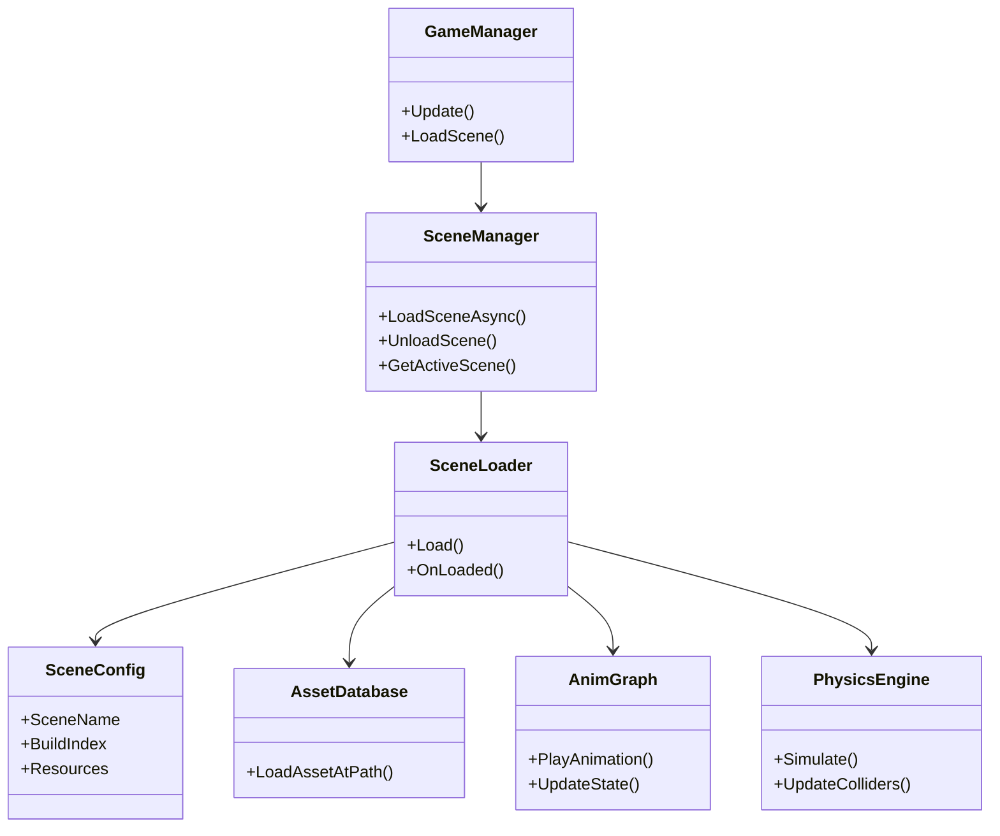
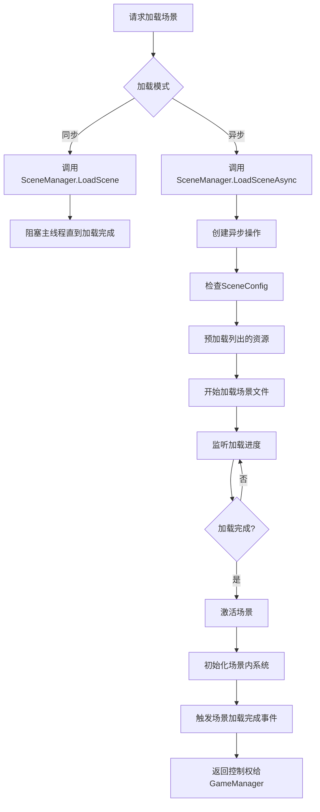

本页面专注于游戏中场景的加载、卸载、切换与状态维护。作为连接资源管理、游戏循环和渲染系统的关键枢纽，场景管理直接影响游戏流畅度与用户体验。本项目基于Unity引擎，场景管理涉及`.unity`场景文件的配置、`EditorBuildSettings`的构建索引、以及与自定义`AnimGraph`动画系统的集成。以下将从架构、工作流程、优化策略与故障排除等方面展开。

## 架构概览
场景管理系统在项目中的作用是协调多个场景的生命周期，并确保资源在正确时机加载与卸载。核心模块包括场景加载器、场景状态机、资源预取器与事件系统。它们与游戏循环、资源数据库和物理引擎紧密交互，形成一个层次化的管理架构。



场景管理器负责响应来自游戏管理器的场景切换请求，通过场景加载器执行异步或同步加载，并通知动画系统和物理引擎进行相应的状态更新。场景配置类存储场景名称、构建索引和所需资源列表，资产数据库提供资源加载支持。

### 组件职责对比
| 组件 | 主要职责 | 与其他模块交互 |
|------|----------|----------------|
| GameManager | 接收用户输入，触发场景切换 | 通知SceneManager |
| SceneManager | 控制场景堆栈，执行加载/卸载 | 调用SceneLoader，更新AnimGraph |
| SceneLoader | 处理加载逻辑，管理加载进度 | 读取SceneConfig，访问AssetDatabase |
| SceneConfig | 存储场景元数据 | 提供给SceneLoader |
| AssetDatabase | 提供资源查询与加载接口 | 被SceneLoader调用 |
| AnimGraph | 在场景激活时播放/暂停动画 | 被SceneManager通知 |
| PhysicsEngine | 在场景加载后恢复物理状态 | 被SceneLoader通知 |

## 场景加载流程
场景加载分为同步加载和异步加载两种模式，异步加载用于避免长时间阻塞主线程，从而保持界面响应。加载流程包括解析场景配置、预加载关键资源、加载场景文件、激活场景以及初始化场景内系统。



异步加载通过`LoadSceneAsync`方法实现，返回一个`AsyncOperation`对象，可用于查询加载进度。加载完成后，系统会自动激活新场景，并触发`SceneManager.sceneLoaded`事件，以便其他系统进行后续初始化。

### 异步加载参数说明
| 参数 | 类型 | 描述 |
|------|------|------|
| sceneName | string | 要加载的场景名称，必须在`BuildSettings`中注册 |
| sceneMode | LoadSceneMode | 场景加载模式（Single、Additive） |
| progress | AsyncOperation.progress | 加载进度（0.0到1.0） |
| isDone | AsyncOperation.isDone | 加载是否完成 |
| allowSceneActivation | bool | 是否允许场景自动激活 |

## 场景切换优化
为了提升场景切换的平滑度和降低内存占用，需要采取多种优化策略，包括资源预加载、场景后台加载、内存管理与异步操作。

### 优化策略对比
| 策略 | 优点 | 缺点 | 适用场景 |
|------|------|------|----------|
| 资源预加载 | 减少场景加载等待时间 | 增加初始内存占用 | 主菜单进入游戏场景 |
| 场景后台加载 | 用户无感知切换 | 实现复杂 | 大型场景切换 |
| 异步加载 | 不阻塞主线程 | 需要处理加载状态 | 所有场景切换 |
| 内存管理 | 防止内存溢出 | 需要精心规划卸载时机 | 资源密集型场景 |

资源预加载通过`Addressables`或`Resources`系统在后台加载关键资源，如角色模型、纹理和音频。场景后台加载使用`LoadSceneAsync`并设置`allowSceneActivation = false`，在加载完成后手动激活。内存管理涉及在切换场景前卸载旧场景的不必要资源，使用`Resources.UnloadUnusedAssets()`和`GC.Collect()`释放内存。

## 场景配置
场景配置通常存储在`ProjectSettings/EditorBuildSettings.asset`文件中，定义了所有可加载场景及其构建索引。此外，每个场景可能有一个对应的配置文件，用于存储场景特定的设置，如光照参数、物理材质和动画状态。

### 场景配置示例
```json
{
  "scenes": [
    {
      "name": "MainMenu",
      "path": "Assets/Scenes/MainMenu.unity",
      "buildIndex": 0,
      "resources": [
        "Assets/UI/MainMenuBackground.png",
        "Assets/Audio/MainMenuMusic.mp3"
      ]
    },
    {
      "name": "Game",
      "path": "Assets/Scenes/Game.unity",
      "buildIndex": 1,
      "resources": [
        "Assets/Characters/Player.fbx",
        "Assets/Environments/Lakehouse.prefab",
        "Assets/Scripts/GameManager.cs"
      ]
    }
  ]
}
```

配置文件中列出了每个场景的名称、路径、构建索引和所需资源列表。在运行时，场景管理器会读取此配置，并根据需要预加载资源。

## 故障排除
在场景管理过程中，可能会遇到各种问题，例如场景加载失败、资源冲突或内存泄漏。以下是一些常见问题及其解决方案。

### 常见问题与解决方案
| 问题 | 可能原因 | 解决方案 |
|------|----------|----------|
| 场景加载失败 | 场景未添加到`BuildSettings` | 在`EditorBuildSettings.asset`中添加场景 |
| 资源缺失 | 资源路径错误或文件丢失 | 检查资源路径，重新导入缺失资源 |
| 内存泄漏 | 旧场景资源未卸载 | 在切换场景时调用`Resources.UnloadUnusedAssets()` |
| 加载进度不准确 | 异步操作未正确处理 | 检查`AsyncOperation.isDone`和`progress` |
| 场景切换卡顿 | 主线程加载耗时过长 | 使用异步加载，并将繁重任务放到后台线程 |

如果场景加载失败，首先检查控制台日志中的错误信息，确认场景是否已添加到构建设置。对于资源缺失问题，使用`AssetDatabase.LoadAssetAtPath`测试资源路径是否正确。内存泄漏通常由静态引用或事件未取消订阅导致，使用Unity Profiler检查内存使用情况。

## 最佳实践
为了确保场景管理的稳定性和可维护性，建议遵循以下最佳实践：

1. **场景组织**：将场景按功能分组，例如主菜单、游戏场景、过渡场景，并使用清晰的命名约定。
2. **资源依赖**：在场景配置中明确列出所有依赖资源，避免运行时加载失败。
3. **异步操作**：始终使用异步加载场景，除非场景非常简单且加载时间极短。
4. **内存管理**：在切换场景前显式卸载旧场景的不必要资源，并在加载完成后进行垃圾回收。
5. **事件驱动**：使用事件系统通知其他模块场景加载完成，避免直接调用。
6. **错误处理**：为所有异步操作添加错误处理逻辑，并提供用户友好的错误信息。
7. **版本控制**：将场景配置文件纳入版本控制，确保团队成员使用相同的配置。
8. **性能测试**：使用Unity Profiler定期测试场景加载性能，识别瓶颈并优化。

遵循这些实践可以减少开发中的问题，提高游戏的整体质量和用户体验。

## 下一步：游戏循环
场景管理是游戏循环的基础，因为游戏循环需要知道当前激活的场景，并根据场景状态更新游戏逻辑。游戏循环还负责调用场景中的更新方法，包括动画更新和物理模拟。因此，在理解场景管理后，建议学习游戏循环的架构和实现。