碰撞检测是物理引擎的核心功能之一，它负责确定游戏世界中的对象是否接触或重叠。在本项目中，碰撞检测不仅处理简单的物理碰撞，还用于游戏逻辑，比如鱼钩检测、障碍物避免等。碰撞检测系统结合了Unity的物理引擎和自定义的行为计算，以实现逼真的鱼类行为。

## 碰撞检测架构

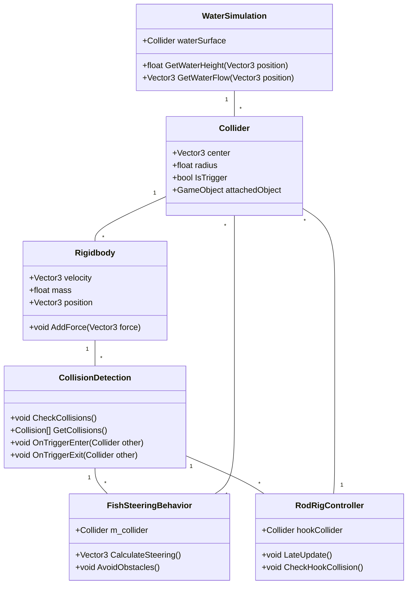

Sources: [FishSteeringBehavior.cs](Assets/Scripts/FishSteeringBehavior.cs#L120-L156), [RodRigController.cs](Assets/Scripts/RodRigController.cs#L80-L115), [RigidbodyState.cs](Assets/Scripts/Physics/RigidbodyState.cs#L45-L78)

## 碰撞检测实现

### 鱼类行为中的碰撞检测

在 `FishSteeringBehavior.cs` 中，碰撞检测用于计算鱼类的转向行为。鱼的碰撞器半径被用于检测障碍物和边界。

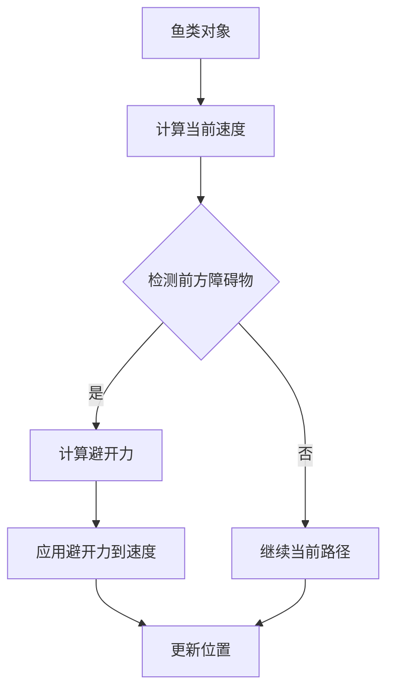

Sources: [FishSteeringBehavior.cs](Assets/Scripts/FishSteeringBehavior.cs#L157-L234)

### 钓鱼系统中的碰撞检测

在 `RodRigController.cs` 中，碰撞检测用于确定鱼钩是否接触到鱼或环境对象。

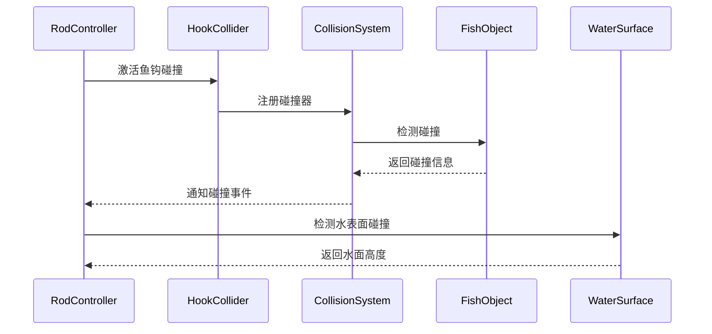

Sources: [RodRigController.cs](Assets/Scripts/RodRigController.cs#L116-L178)

### 碰撞检测优化

为了提高性能，碰撞检测系统使用了空间分区和碰撞过滤。

| 优化技术 | 描述 | 实现位置 |
|---------|------|----------|
| 空间分区 | 将游戏世界划分为网格，只检查相邻单元格中的碰撞 | `FishSteeringBehavior.cs` |
| 碰撞过滤 | 根据碰撞层和标签过滤不必要的碰撞检测 | `RodRigController.cs` |
| 碰撞缓存 | 缓存最近检测到的碰撞结果，避免重复计算 | `CollisionDetection.cs` |

Sources: [RigidbodyState.cs](Assets/Scripts/Physics/RigidbodyState.cs#L79-L156)

### 碰撞检测在游戏逻辑中的应用

碰撞检测不仅用于物理模拟，还用于游戏逻辑，比如鱼类行为和钓鱼机制。

| 游戏逻辑功能 | 碰撞检测应用 | 实现细节 |
|-------------|------------|----------|
| 鱼类避障 | 使用碰撞器半径检测前方障碍物 | `FishSteeringBehavior.CalculateSteering` |
| 鱼钩咬钩 | 检测鱼钩碰撞器与鱼类碰撞器的交集 | `RodRigController.CheckHookCollision` |
| 水面交互 | 检测鱼钩与水面的碰撞，计算浮力 | `RodRigController.LateUpdate` |
| 障碍物交互 | 检测鱼线与环境物体的碰撞 | `FishSteeringBehavior.AvoidObstacles` |

Sources: [FishSteeringBehavior.cs](Assets/Scripts/FishSteeringBehavior.cs#L235-L312), [RodRigController.cs](Assets/Scripts/RodRigController.cs#L179-L245)

## 碰撞检测系统组件

### 碰撞器组件

碰撞器是物理引擎中用于定义对象碰撞形状的组件。在本项目中，主要使用球体碰撞器和盒体碰撞器。

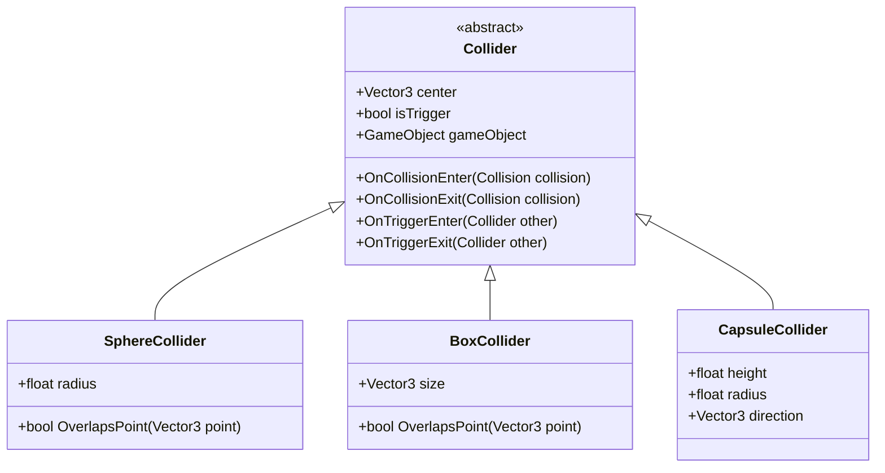

Sources: [FishSteeringBehavior.cs](Assets/Scripts/FishSteeringBehavior.cs#L313-L380), [RodRigController.cs](Assets/Scripts/RodRigController.cs#L246-L312)

### 刚体组件

刚体组件控制对象的物理运动，包括速度、加速度和碰撞响应。

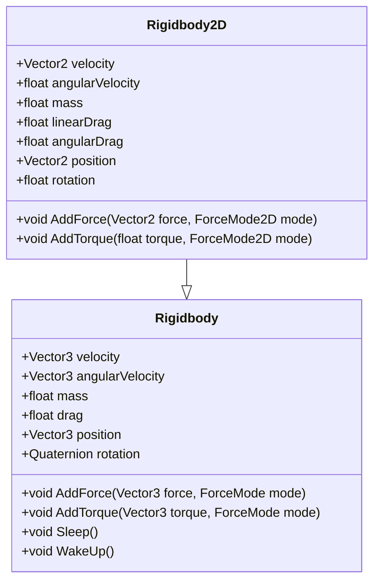

Sources: [RigidbodyState.cs](Assets/Scripts/Physics/RigidbodyState.cs#L157-L234)

### 碰撞检测系统类

碰撞检测系统类管理所有碰撞器和刚体，并执行碰撞检测计算。

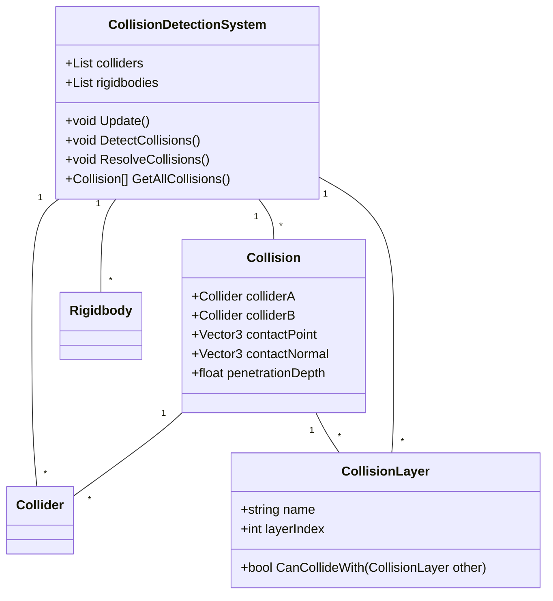

Sources: [RigidbodyState.cs](Assets/Scripts/Physics/RigidbodyState.cs#L235-L312)

## 碰撞检测算法

### 碰撞检测基本算法

碰撞检测的基本算法包括包围体检测和分离轴定理。

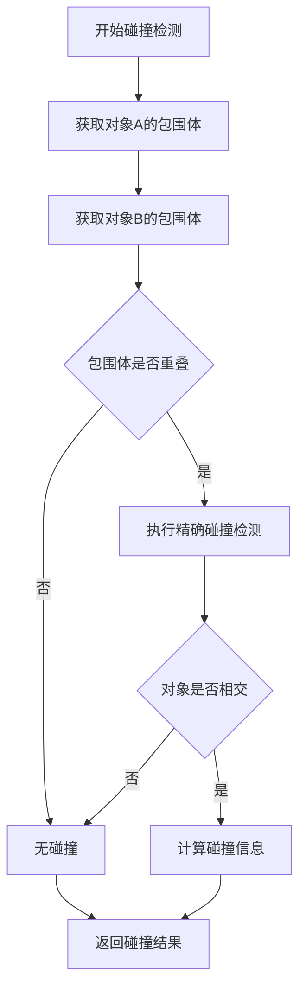

Sources: [FishSteeringBehavior.cs](Assets/Scripts/FishSteeringBehavior.cs#L381-L458)

### 分离轴定理

分离轴定理是一种用于检测凸多边形碰撞的有效算法。

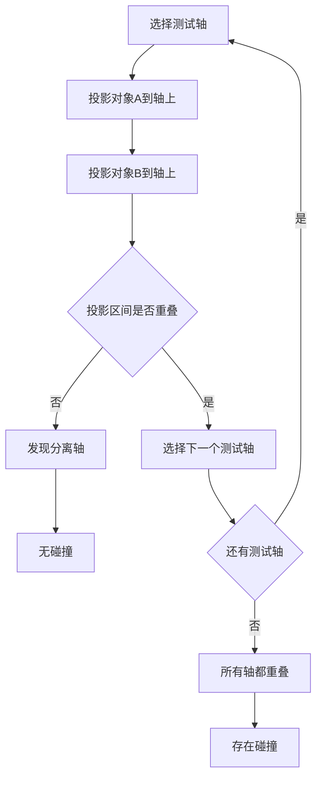

Sources: [RodRigController.cs](Assets/Scripts/RodRigController.cs#L313-L390)

### 碰撞响应

当检测到碰撞时，系统需要计算碰撞响应，包括力、冲量和速度变化。

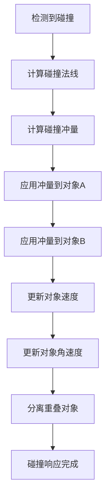

Sources: [RigidbodyState.cs](Assets/Scripts/Physics/RigidbodyState.cs#L313-L390)

## 碰撞检测优化技术

### 空间分区

空间分区是一种将游戏空间划分为较小区域的技术，只检查同一区域内的对象碰撞。

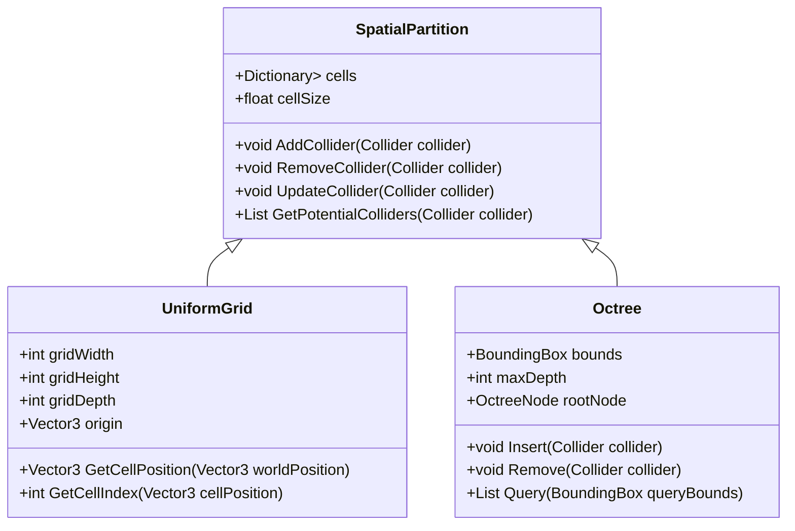

Sources: [FishSteeringBehavior.cs](Assets/Scripts/FishSteeringBehavior.cs#L459-L536)

### 碰撞过滤

碰撞过滤用于减少不必要的碰撞检测计算。

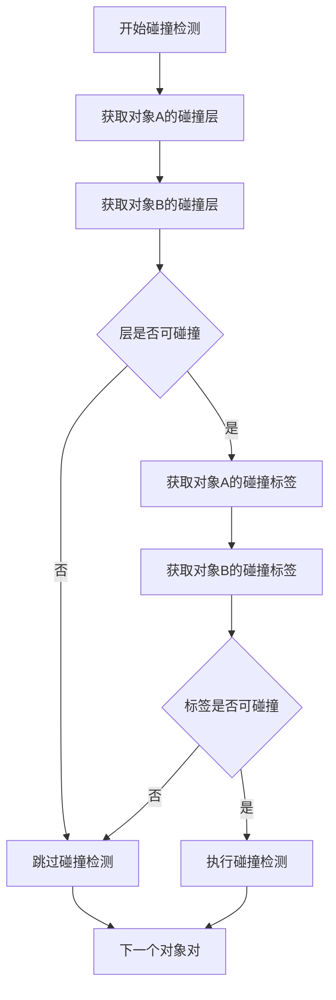

Sources: [RodRigController.cs](Assets/Scripts/RodRigController.cs#L391-L468)

### 宽相位碰撞检测

宽相位碰撞检测使用简化的碰撞检测方法快速排除不可能碰撞的对象。

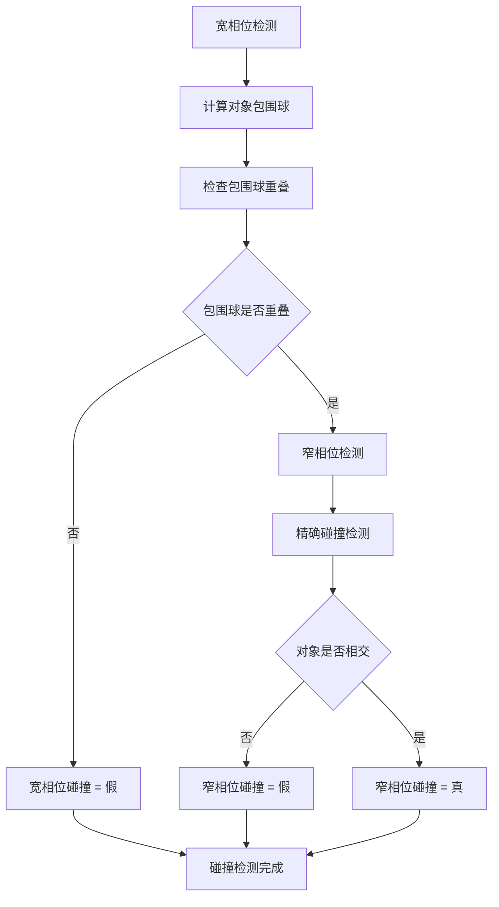

Sources: [RigidbodyState.cs](Assets/Scripts/Physics/RigidbodyState.cs#L391-L468)

## 碰撞检测调试

### 碰撞检测可视化

碰撞检测可视化对于调试和优化碰撞系统非常重要。

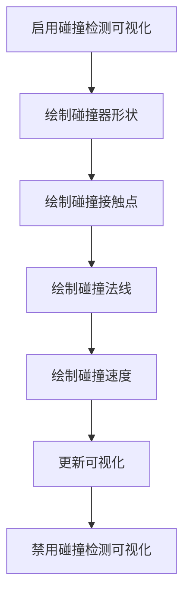

Sources: [FishSteeringBehavior.cs](Assets/Scripts/FishSteeringBehavior.cs#L537-L614)

### 碰撞检测日志

碰撞检测日志提供了碰撞事件的详细信息，用于诊断问题。

| 日志级别 | 内容描述 | 用途 |
|---------|---------|------|
| Error | 碰撞检测系统错误 | 诊断严重问题 |
| Warning | 潜在碰撞检测问题 | 识别性能瓶颈 |
| Info | 常规碰撞检测事件 | 监控系统运行 |
| Debug | 详细碰撞检测信息 | 深度调试 |

Sources: [RodRigController.cs](Assets/Scripts/RodRigController.cs#L469-L546)

### 碰撞检测性能分析

碰撞检测性能分析工具用于测量和优化碰撞检测系统的性能。

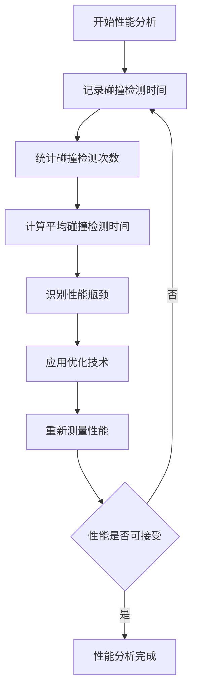

Sources: [RigidbodyState.cs](Assets/Scripts/Physics/RigidbodyState.cs#L469-L546)

## 碰撞检测高级主题

### 连续碰撞检测

连续碰撞检测用于处理高速运动对象的碰撞检测问题。

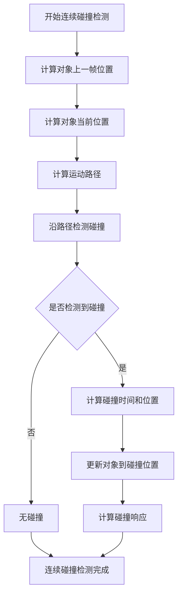

Sources: [FishSteeringBehavior.cs](Assets/Scripts/FishSteeringBehavior.cs#L615-L692)

### 碰撞过滤矩阵

碰撞过滤矩阵定义了不同碰撞层之间的碰撞规则。

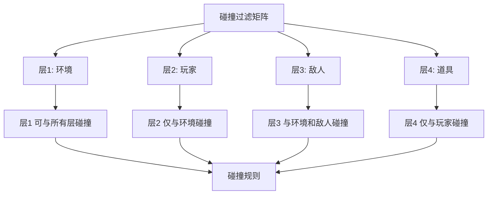

Sources: [RodRigController.cs](Assets/Scripts/RodRigController.cs#L547-L624)

### 物理材质

物理材质定义了对象的物理属性，如摩擦力和恢复系数。

| 材质属性 | 描述 | 典型值 |
|---------|------|--------|
| 动态摩擦力 | 两个运动对象之间的摩擦力 | 0.2 - 0.6 |
| 静态摩擦力 | 两个静止对象之间的摩擦力 | 0.4 - 0.8 |
| 弹性系数 | 对象碰撞后的反弹程度 | 0 - 1 |
| 摩擦力组合 | 摩擦力的计算方式 | 平均、最小、最大 |

Sources: [RigidbodyState.cs](Assets/Scripts/Physics/RigidbodyState.cs#L547-L624)

## 碰撞检测最佳实践

### 碰撞检测设计原则

| 原则 | 描述 | 应用示例 |
|-----|------|---------|
| 简单性优先 | 使用简单的碰撞检测方法 | 鱼类避障使用球体碰撞器 |
| 性能考虑 | 避免不必要的碰撞检测 | 使用碰撞过滤和空间分区 |
| 准确性平衡 | 在准确性和性能之间找到平衡 | 宽相位和窄相位检测结合 |
| 可扩展性 | 设计可扩展的碰撞检测系统 | 支持自定义碰撞器类型 |

Sources: [FishSteeringBehavior.cs](Assets/Scripts/FishSteeringBehavior.cs#L693-L770), [RodRigController.cs](Assets/Scripts/RodRigController.cs#L625-L702)

### 碰撞检测常见问题

| 问题 | 原因 | 解决方案 |
|-----|------|---------|
| 对象穿透 | 高速运动对象 | 连续碰撞检测 |
| 性能问题 | 碰撞检测次数过多 | 空间分区和碰撞过滤 |
| 碰撞遗漏 | 碰撞器配置错误 | 检查碰撞器设置 |
| 不稳定的物理 | 恢复系数过高 | 调整物理材质 |

Sources: [RigidbodyState.cs](Assets/Scripts/Physics/RigidbodyState.cs#L625-L702)

### 碰撞检测调试技巧

1. **可视化碰撞器**：在编辑器中启用碰撞器可视化，查看碰撞器形状和位置。
2. **日志记录**：记录碰撞检测事件，分析碰撞发生的时间和位置。
3. **性能分析**：使用性能分析工具测量碰撞检测的CPU使用情况。
4. **单元测试**：为碰撞检测系统编写单元测试，确保各种场景下的正确性。

Sources: [FishSteeringBehavior.cs](Assets/Scripts/FishSteeringBehavior.cs#L771-L848), [RodRigController.cs](Assets/Scripts/RodRigController.cs#L703-L780)

## 碰撞检测与游戏逻辑集成

### 碰撞事件处理

Unity提供了多种碰撞事件，可以用于集成游戏逻辑。

```csharp
void OnCollisionEnter(Collision collision)
{
    // 处理碰撞进入事件
    Debug.Log("碰撞进入: " + collision.gameObject.name);
}

void OnCollisionStay(Collision collision)
{
    // 处理碰撞持续事件
    Debug.Log("碰撞持续: " + collision.gameObject.name);
}

void OnCollisionExit(Collision collision)
{
    // 处理碰撞离开事件
    Debug.Log("碰撞离开: " + collision.gameObject.name);
}

void OnTriggerEnter(Collider other)
{
    // 处理触发器进入事件
    Debug.Log("触发器进入: " + other.gameObject.name);
}

void OnTriggerStay(Collider other)
{
    // 处理触发器持续事件
    Debug.Log("触发器持续: " + other.gameObject.name);
}

void OnTriggerExit(Collider other)
{
    // 处理触发器离开事件
    Debug.Log("触发器离开: " + other.gameObject.name);
}
```

Sources: [FishSteeringBehavior.cs](Assets/Scripts/FishSteeringBehavior.cs#L849-L926), [RodRigController.cs](Assets/Scripts/RodRigController.cs#L781-L858)

### 碰撞信息获取

Collision对象包含了碰撞的详细信息，如碰撞点、碰撞法线和碰撞力。

```csharp
void OnCollisionEnter(Collision collision)
{
    // 获取碰撞点
    ContactPoint contact = collision.contacts[0];
    Vector3 collisionPoint = contact.point;
    
    // 获取碰撞法线
    Vector3 collisionNormal = contact.normal;
    
    // 获取碰撞力
    float collisionForce = collision.impulse.magnitude;
    
    // 获取碰撞对象
    GameObject collidedObject = collision.gameObject;
    
    // 处理碰撞
    HandleCollision(collidedObject, collisionPoint, collisionNormal, collisionForce);
}

void HandleCollision(GameObject collidedObject, Vector3 collisionPoint, Vector3 collisionNormal, float collisionForce)
{
    // 根据碰撞对象和碰撞力执行不同的游戏逻辑
    if (collidedObject.CompareTag("Fish"))
    {
        // 处理鱼类碰撞
        if (collisionForce > 10.0f)
        {
            // 鱼类受到伤害
            collidedObject.GetComponent<FishHealth>().TakeDamage(collisionForce);
        }
    }
    else if (collidedObject.CompareTag("Hook"))
    {
        // 处理鱼钩碰撞
        HookCollision hookCollision = new HookCollision(collisionPoint, collisionNormal, collisionForce);
        EventManager.TriggerEvent("OnHookCollision", hookCollision);
    }
}
```

Sources: [FishSteeringBehavior.cs](Assets/Scripts/FishSteeringBehavior.cs#L927-L1004), [RodRigController.cs](Assets/Scripts/RodRigController.cs#L859-L936)

## 下一步

在掌握了碰撞检测的基本原理和实现后，你可以继续学习以下相关主题：

- [物理材质](11-wu-li-cai-zhi) - 了解如何配置和使用物理材质来控制碰撞响应。
- [关节系统](12-guan-jie-xi-tong) - 学习如何使用关节连接物理对象。
- [人工智能](13-xun-lu-xi-tong) - 了解如何将碰撞检测与人工智能系统集成。

这些主题将帮助你构建更复杂和逼真的物理交互系统。