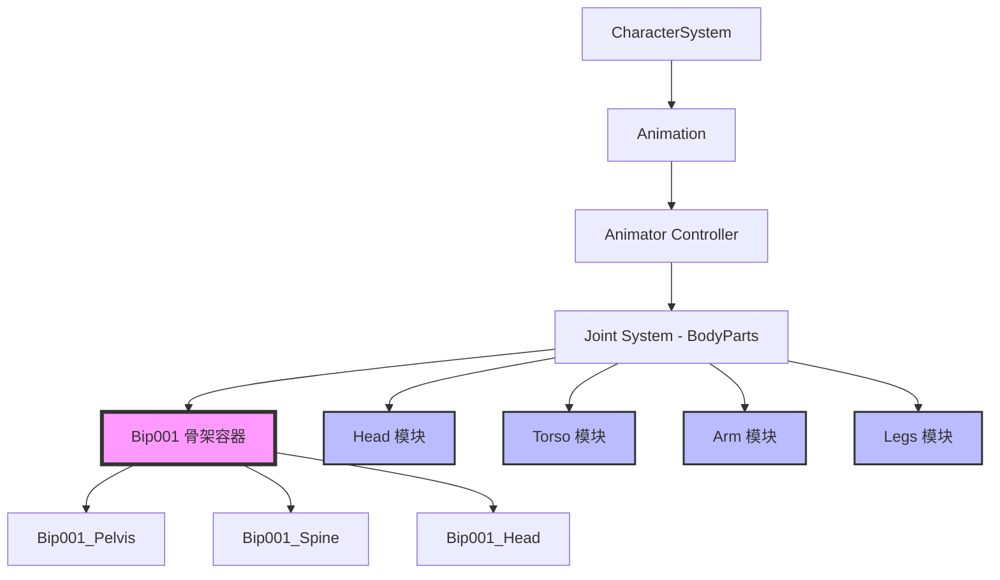

关节系统是游戏角色系统的核心组成部分，负责定义角色的骨骼层级结构、驱动动画蒙皮以及挂载物理交互点。本系统采用了模块化的Biped（双足）骨骼设计，将标准的 `Bip001` 骨架与具体的身体部件（躯干、四肢）分离，以便于动画系统的控制和角色的自定义配置。

## 系统架构概述

关节系统基于标准的Biped（双足）人形骨骼架构进行设计。在项目结构中，它通过 `Animator/BodyParts/` 目录下的文件组织，将骨架节点（`Bip001`）与具体的身体部件模型（如 `Head`, `Torso`, `Arm`, `Legs`）进行解耦。

该架构允许动画系统（可能基于 `BlackJack.AnimGraph`）独立控制骨骼，而模型模块则可以在骨骼上自由替换或挂载，从而支持不同的角色外观或装备方案。

## 核心 Biped 骨架 (Bip001)

系统核心位于 `BodyParts/Bip001/` 目录中，这对应于标准的 3ds Max Biped 命名约定。该目录包含了一系列代表骨骼关键节点的 Prefab、Mesh 和材质文件。

| 骨骼节点名称 | 功能描述 | 文件位置 |
| :--- | :--- | :--- |
| **Bip001_Pelvis** | 骨盆，根骨骼，连接下半身与脊柱。 | `BodyParts/Bip001/` |
| **Bip001_Spine** | 脊柱，连接骨盆与上身。 | `BodyParts/Bip001/` |
| **Bip001_Spine1** | 上脊柱，位于脊柱上方。 | `BodyParts/Bip001/` |
| **Bip001_Head** | 头部节点，通常用于定位头部模型。 | `BodyParts/Bip001/` |
| **Bip001 L_UpperLeg** | 左大腿骨骼。 | `BodyParts/Bip001/` |
| **Bip001 L_Leg** | 左小腿骨骼。 | `BodyParts/Bip001/` |
| **Bip001 L_Foot** | 左脚骨骼。 | `BodyParts/Bip001/` |
| **Bip001 R_UpperLeg** | 右大腿骨骼。 | `BodyParts/Bip001/` |

每一个骨骼节点通常包含一个 Prefab 文件（例如 `Bip001_Pelvis.prefab`），用于在场景或角色层级中实例化该关节。这些 Prefab 可能还关联了材质（`_Diff.png`, `_N.png`）和网格数据（`.fbx` 导出文件），以支持骨骼的可视化或调试。

Sources: [BodyParts/Bip001/Bip001_Pelvis.prefab](Assets/_FishingPlanet/Assets/Assets/Gameplay/Systems/CharacterSystem/Animation/Animator/BodyParts/Bip001/Bip001_Pelvis.prefab)

## 模块化身体部件

为了便于管理和重用，具体的身体部件被划分为独立的模块存放在 `BodyParts/` 的子目录中。这些模块包含了该区域所有骨骼的组合或该部位的蒙皮模型。

### 头部
头部模块 (`Head/`) 包含了头骨组合、面部网格以及相关的材质设置。

Sources: [Head_Head_01.prefab](Assets/_FishingPlanet/Assets/Assets/Gameplay/Systems/CharacterSystem/Animation/Animator/BodyParts/Head/Head_Head_01.prefab)

### 躯干
躯干模块 (`Torso/`) 和 (`Torso_Mesh/`) 定义了角色的上半身结构，包括胸、背等骨骼的配置或纯网格数据。

Sources: [Torso_Mesh_Torso_01_Mesh.prefab](Assets/_FishingPlanet/Assets/Assets/Gameplay/Systems/CharacterSystem/Animation/Animator/BodyParts/Torso_Mesh/Torso_Mesh_Torso_01_Mesh.prefab)

### 四肢
*   **手臂**: `Arm/` 目录包含左/右手臂的骨骼或模块设置。
*   **腿部**: `Legs/` 目录包含大腿、小腿和脚部的模块设置。

Sources: [Arm_Arm_01.prefab](Assets/_FishingPlanet/Assets/Assets/Gameplay/Systems/CharacterSystem/Animation/Animator/BodyParts/Arm/Arm_Arm_01.prefab)

Sourcees: [Legs_Legs_01.prefab](Assets/_FishingPlanet/Assets/Assets/Gameplay/Systems/CharacterSystem/Animation/Animator/BodyParts/Legs/Legs_Legs_01.prefab)

### 臀部
臀部模块 (`Hip/`) 专门处理骨盆区域的骨骼配置。

Sources: [Hip_Hip_01.prefab](Assets/_FishingPlanet/Assets/Assets/Gameplay/Systems/CharacterSystem/Animation/Animator/BodyParts/Hip/Hip_Hip_01.prefab)

## 骨架对齐与审核

在开发过程中，为了确保 `Bip001` 骨架与角色的网格以及动画数据（如钓竿动作）正确对齐，系统进行了详细的审核。

根据 `RodRigFishingSet_Audit_Report.md` 和 `FishingSet_OriginalAlignment_Audit_Report.md` 的记录，开发团队检查了骨骼的旋转、缩放以及位置是否与标准对齐。这对于IK（反向动力学）解算器准确计算角色的手部抓握钓竿至关重要。如果关节发生旋转偏差，IK 系统将无法正确将角色手部放置在钓竿的握把位置。

Sources: [RodRigFishingSet_Audit_Report.md](RodRigFishingSet_Audit_Report.md)
Sources: [FishingSet_OriginalAlignment_Audit_Report.md](FishingSet_OriginalAlignment_Audit_Report.md)

## 关节系统与动画的集成

关节系统是动画系统的基础。`BlackJack.AnimGraph` 包负责处理状态机和过渡，但其底层操作的对象正是这些 `Bip001` 关节节点。

动画数据（可能在其他目录）通过 `Animator` 组件驱动 `Bip001` 的 Transform（位置、旋转）。由于采用了标准的 Biped 命名，这使得系统可以兼容通用的动画资源，或者重用现有的动画资源。

Sources: [BlackJack.AnimGraph.csproj](BlackJack.AnimGraph.csproj)

## 总结

本项目的关节系统采用了一个稳健的模块化方案：
1.  使用标准 **Biped** 骨骼定义作为核心。
2.  通过 **BodyParts** 文件夹分离不同区域的数据。
3.  提供 **Mesh** 文件夹专门处理外观资源。
4.  通过严格的 **审核流程** 保证骨架与动画的匹配性。

这种设计不仅简化了角色资源的更新流程，也方便了后续扩展（如增加新的角色外观或装备）。

## 下一部分

[群体行为](15-qun-ti-xing-wei)