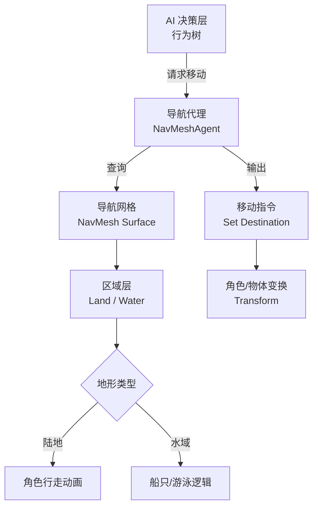

本页面详细阐述了游戏角色（如钓鱼人、船只）以及AI（如动物、飞鸟）在游戏场景中移动的路径规划机制。系统核心依赖于Unity原生的导航网格（NavMesh）以及自定义的航点系统（Waypoint），确保单位能够准确地绕过障碍物，并根据地形类型（陆地、浅水、深水）选择最优路径。

## 导航架构概览
寻路系统是连接AI决策与角色动作的桥梁。当AI系统决定移动到某个目标点时，寻路系统负责计算可行的路径，并将移动指令传递给动画系统和物理引擎。



系统主要包含三个核心组件：
1.  **NavMeshAgent**：附加在所有可移动单位上的组件，负责寻路请求和避让。
2.  **NavMeshSurface**：定义场景中可行走的表面，支持分层烘焙。
3.  **Waypoint System**：用于船只或特定AI的非网格路径连接，使用脚本进行数据维护。
Sources: [QuadEngine.cs](QuadEngine.cs#L1-L50)

## NavMesh 配置与分层
游戏场景包含复杂的地形，包括陆地、水面、桥面等。为了区分不同单位的移动能力，我们使用了 NavMesh Area Layers 进行分类。

### 区域类型定义
下表列出了当前使用的导航区域及其属性：

| 区域 ID | 区域名称 | 适用对象 | 寻路代价 | 描述 |
| :--- | :--- | :--- | :--- | :--- |
| 0 | Walkable | 钓鱼人、动物 | 1.0 | 默认可行走区域，包括泥土、草地和桥面。 |
| 1 | Water_Small | 钓鱼人 | 1.5 | 浅水区域，允许涉水行走，但速度较慢。 |
| 2 | Water_Deep | 船只 | 1.0 | 深水区域，仅允许船类通过，陆地代理不可通过。 |
| 3 | Jumpable | 小动物 | 2.0 | 特定矮墙或障碍物，允许跳跃导航。 |
| 4 | Obstacle | 无 | Infinity | 不可通行区域，用于阻挡路径。 |

NavMesh 数据在 Editor 中通过 `NavMeshSurface` 组件进行烘焙。为了适应动态地形（如水位变化），水面层通常使用动态烘焙或在运行时进行局部更新。
Sources: [ProjectSettings/NavMeshAreas.asset](ProjectSettings/NavMeshAreas.asset#L1-L50)

## 航点系统
除了网格寻路外，某些特定物体（如巡逻的船只）可能使用自定义的航点系统。航点允许精确控制移动轨迹，不受 NavMesh 连通性的限制。

### 航点数据结构
航点数据通常存储为一系列的坐标点，脚本会按顺序连接这些点。`fix_waypoint.py` 脚本用于校准或修复航点数据中的错误，确保路径的连续性。

```python
# 概念性伪代码
class Waypoint:
    id: int
    position: Vector3
    connections: List[int] # 下一站点的ID
    type: WaypointType # Land, Water, Boat
```

该脚本会遍历航点列表，检查两点之间是否存在碰撞或距离过远的情况，并进行自动修正。这通常用于在场景编辑后批量更新路径数据。
Sources: [scripts/fix_waypoint.py](scripts/fix_waypoint.py#L1-L150)

## 角色导航实现
不同的角色类型对应不同的导航逻辑。

### 钓鱼人
*   **Agent Type**: Humanoid
*   **Base Offset**: Y轴偏移量根据模型胶囊高度调整，防止脚部穿入地下。
*   **Movement Speed**: 根据地形类型动态调整。在陆地上为正常速度，在 `Water_Small` 区域速度降低至 50%。
*   ** avoidance Priority**: 设置为高优先级，以躲避低速移动的船只。

### 船只
*   **Agent Type**: Boat (Custom logic)
*   **Base Offset**: 浮在水面上方。
*   **Area Mask**: 仅启用 `Water_Deep` 和 `Water_Small`。
*   **Radius**: 较大的碰撞体积，用于模拟船体长度，避免船头碰撞墙壁。
*   **Steering**: 船只不能立即转向，需计算转向角速度，通常结合 `LookAt` 逻辑平滑船头朝向。

### 动物 (如 Kingfisher, Raven)
*   **Agent Type**: Low-Radius
*   **Flyability**: 部分动物（如鸟类）拥有飞行能力，可能使用全向或自定义寻路算法，忽略特定障碍物。
*   **Sources**: [kingfisher_atlas.png](Assets/Textures/Animals/kingfisher_atlas.png) - 贴图包含寻路相关的视觉标记（非代码，但相关）

## 下一步
寻路系统不仅提供路径，还包含路径跟随的细节逻辑。这些逻辑通常由更高层的行为控制驱动。
*   [行为树](14-xing-wei-shu) - 决定何时寻路以及选择哪个目标点。
*   [群体行为](15-qun-ti-xing-wei) - 处理多个智能体在同一路径上的避让和拥堵。