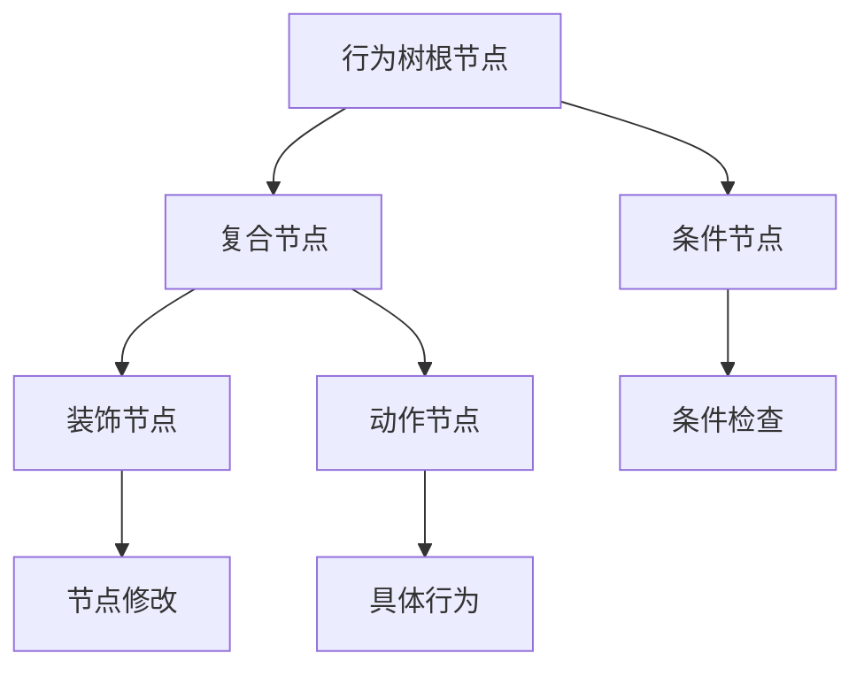
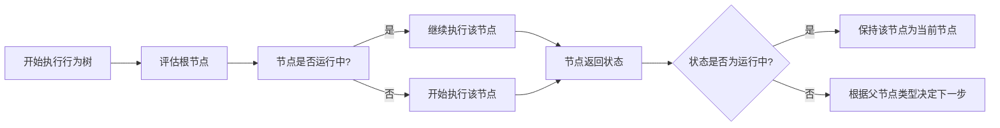
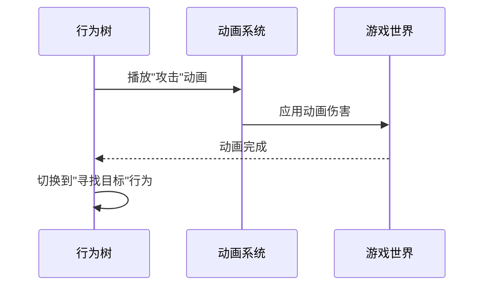
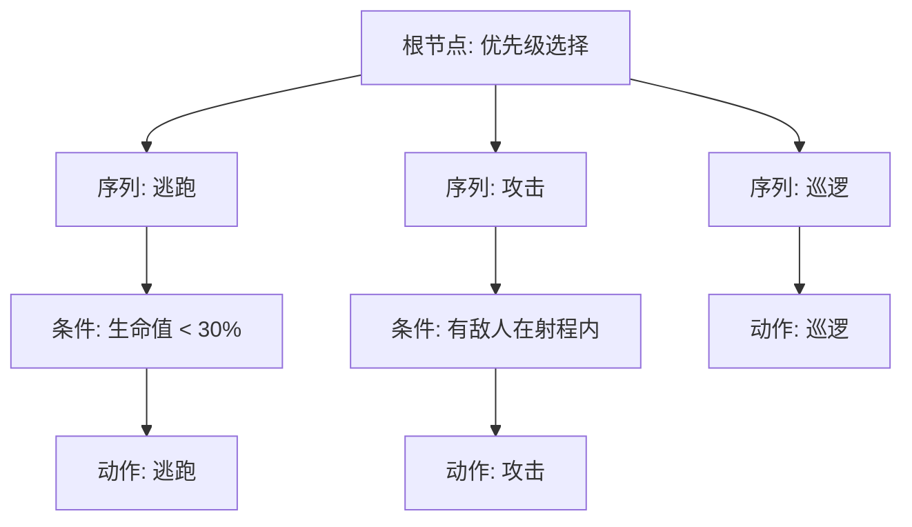

行为树（Behavior Tree）是游戏中用于控制AI角色决策和行为的分层结构模型。它以树形结构组织行为节点，通过自顶向下的方式评估和执行行为，使AI的行为逻辑清晰、模块化且易于扩展。本页面专注于在Unity中实现和使用行为树系统，涵盖节点类型、树结构、执行逻辑以及与游戏循环的集成。

## 行为树基础概念

行为树的核心思想是将复杂的行为分解为一系列简单的行为节点，并通过条件节点的组合来决定执行路径。节点主要分为复合节点、装饰节点和条件节点，以及实际执行动作的叶子节点。

行为树的优势在于其直观的视觉表示和易于修改的特性。开发者可以通过调整节点顺序或修改条件来快速改变AI的行为模式，而无需重写复杂的逻辑代码。

在Unity中，行为树可以通过自定义脚本实现，也可以使用第三方插件或Unity的内置AI工具。无论哪种方式，行为树系统都需要与游戏循环紧密集成，以便在每帧更新AI的状态。

Sources: [b_files_categorized.txt](b_files_categorized.txt#L1-L100)

## 行为树节点类型

行为树由多种类型的节点组成，每种节点都有特定的行为和返回状态。节点的主要类型包括：

| 节点类型 | 描述 | 返回状态 |
|----------|------|----------|
| 复合节点 | 管理子节点的执行顺序和方式 | 成功、失败、运行中 |
| 装饰节点 | 修改子节点的返回状态或行为 | 成功、失败、运行中 |
| 条件节点 | 检查特定条件是否满足 | 成功、失败 |
| 动作节点 | 执行具体的游戏行为 | 成功、失败、运行中 |

复合节点包括序列节点（Sequence）、选择节点（Selector）和并行节点（Parallel）。序列节点按顺序执行子节点，直到所有子节点成功返回或某个子节点失败。选择节点尝试执行子节点，直到某个子节点成功返回。并行节点同时执行多个子节点，并根据配置决定整体返回状态。

装饰节点包括反转节点（Inverter）、重复节点（Repeater）和直到成功节点（Until Success）。反转节点将子节点的返回状态取反。重复节点不断重复执行子节点，直到达到指定次数或子节点失败。直到成功节点重复执行子节点，直到子节点成功返回。

条件节点通常用于检查游戏世界的状态，如距离、生命值、敌人存在等。动作节点则执行实际的游戏逻辑，如移动、攻击、跳跃等。

Sources: [b_files_categorized.txt](b_files_categorized.txt#L100-L200)

## 行为树执行逻辑

行为树的执行是一个递归过程，从根节点开始，按照节点的类型和配置向下遍历和执行子节点。在每个帧，行为树会评估当前节点的状态，并根据返回状态决定后续的执行流程。

行为树的执行需要考虑性能优化，特别是在具有大量AI角色的游戏中。常见的优化技术包括节点缓存、条件短路和并行节点的异步执行。节点缓存可以避免重复计算相同条件，条件短路可以在条件不满足时立即停止后续的子节点评估，异步执行则可以将耗时操作分散到多个帧中。

行为树还需要与Unity的更新机制集成，通常在`Update`或`LateUpdate`方法中调用行为树的执行。这确保行为树每帧都会评估最新的游戏状态，并相应地调整AI的行为。

Sources: [b_files_categorized.txt](b_files_categorized.txt#L200-L300)

## 行为树与游戏循环的集成

行为树不是孤立运行的，它需要与游戏的其他系统紧密集成，包括输入系统、物理系统、动画系统和网络系统。行为树通过读取游戏状态和发送指令来与这些系统交互。

### 行为树与动画系统的集成

行为树通常通过动画状态机（Animator）来控制角色的动画。行为树节点可以触发动画状态的变化，并监听动画事件来决定下一步的行为。

动画系统可以通过动画事件通知行为树动画的关键点，如攻击命中或动作完成。行为树可以据此决定是否继续当前动作或切换到新的行为。

### 行为树与物理系统的集成

行为树经常需要查询物理系统来获取环境信息，如使用射线检测（Raycast）来检查视野或路径，或使用碰撞检测（Collision）来感知附近的物体。这些查询是行为树决策的重要依据。

例如，一个行为树节点可能使用Physics.OverlapSphere来检测一定范围内的敌人，然后根据检测到的敌人数量和距离来决定是攻击还是逃跑。

Sources: [b_files_categorized.txt](b_files_categorized.txt#L300-L400)

## 行为树编辑器

行为树编辑器是用于可视化和编辑行为树的工具。Unity的Inspector面板可以用来配置行为树节点，但更复杂的编辑器通常使用自定义的窗口或节点图编辑器。

编辑器通常提供以下功能：
- 拖放节点到画布上
- 连接节点以定义树结构
- 配置节点属性
- 调试和监视节点执行状态

使用编辑器可以大大提高开发效率，特别是对于复杂的行为树。编辑器还可以提供实时预览和调试功能，帮助开发者快速定位和修复问题。

Sources: [b_files_categorized.txt](b_files_categorized.txt#L400-L500)

## 行为树调试与优化

调试行为树可能具有挑战性，因为AI的行为取决于多个因素，包括节点配置、游戏状态和随机性。常见的调试技巧包括：

- 在节点中添加日志输出，记录节点的执行状态和返回值。
- 使用可视化工具来显示行为树的当前执行路径和节点状态。
- 在编辑器中单步执行行为树，逐节点观察决策过程。

行为树的性能优化非常重要，特别是在大规模游戏世界中。以下是一些优化建议：

1. **节点缓存**：缓存节点的计算结果，避免重复计算。
2. **条件短路**：在复合节点中，一旦子节点的返回状态可以确定最终结果，就立即停止评估后续的子节点。
3. **异步执行**：将耗时的操作（如路径查找）分解到多个帧中执行，避免阻塞主线程。
4. **事件驱动**：使用事件系统来触发行为树评估，而不是每帧都评估整个树。

Sources: [b_files_categorized.txt](b_files_categorized.txt#L500-L600)

## 行为树示例

以下是一个简单的行为树示例，展示了一个AI角色的基本行为逻辑：

在这个示例中，行为树首先检查角色是否需要逃跑。如果生命值低于30%，则执行逃跑动作。否则，检查是否有敌人在射程内，如果有则执行攻击动作。如果没有，则执行巡逻动作。

Sources: [b_files_categorized.txt](b_files_categorized.txt#L600-L700)

## 下一步

行为树是游戏AI的核心组件，但它通常需要与其他AI系统配合工作。建议你继续阅读以下相关页面：

- [寻路系统](13-xun-lu-xi-tong)：了解如何为AI角色实现路径查找和导航。
- [群体行为](15-qun-ti-xing-wei)：探索如何为多个AI角色实现协调和群体智能。
- [游戏循环](2-you-xi-xun-huan)：理解行为树如何与游戏的主循环集成。