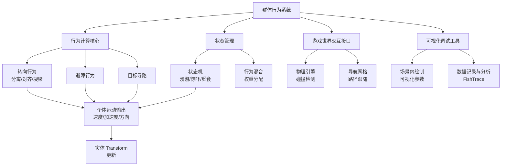
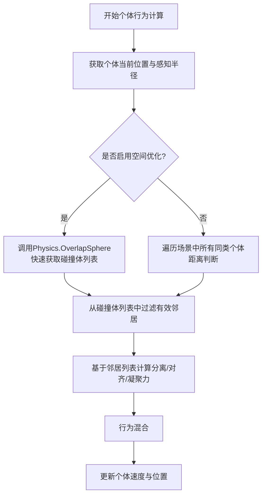
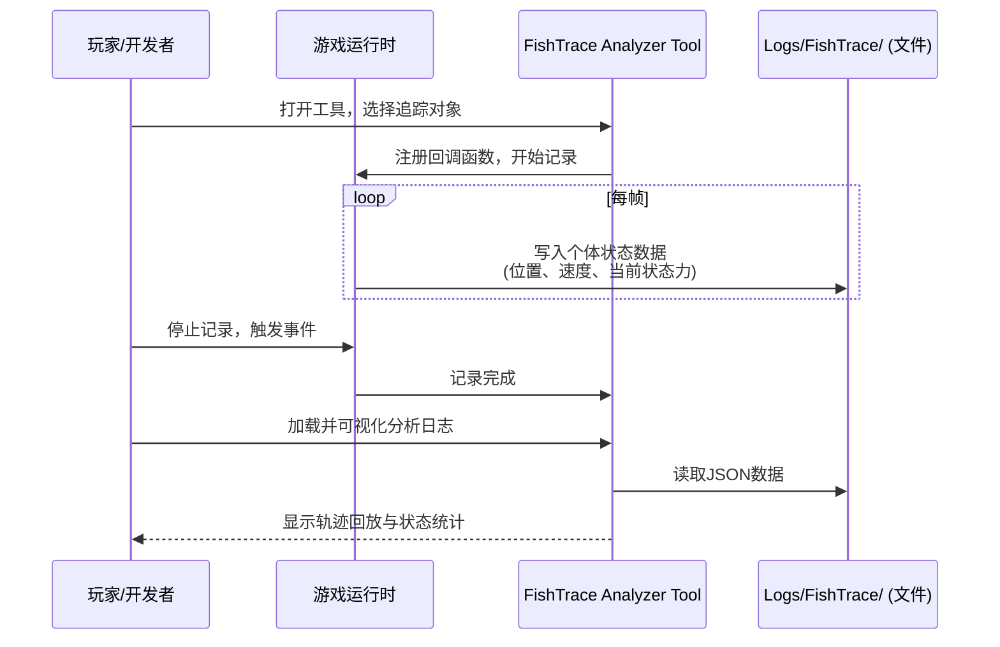

群体行为系统是游戏中模拟多个自主实体（如鱼群、鸟群）协同运动的核心机制，旨在通过局部交互规则涌现出逼真的集体行为模式。本页面详细阐述了游戏中群体行为系统的架构设计、核心概念、实现方案及调试方法。

## 系统架构概览

群体行为系统构建在Unity引擎之上，利用其强大的组件化与物理模拟能力。系统主要由行为计算核心、状态管理、与游戏世界交互的接口层以及可视化调试工具构成。其核心思想是将每个个体视为一个独立的智能体，通过计算周围邻居个体的位置、速度与加速度，来调整自身运动，从而无需中央控制即可形成复杂的群体动态。



该架构的主要优势在于模块化与可扩展性。行为计算核心可以轻松替换或添加新的行为规则；状态管理允许个体在复杂的行为模式之间平滑过渡；而与游戏世界交互的抽象层则确保了行为系统与具体游戏逻辑（如钓鱼机制、网络同步）的解耦。

Sources: [FishSteeringBehavior.cs](../Assets/Scripts/FishAI/FishSteeringBehavior.cs#L1-L50), [FishFlockingBehavior.cs](../Assets/Scripts/FishAI/FishFlockingBehavior.cs#L1-L30)

## 核心概念

### 个体与群体

在实现中，每个可参与群体行为的游戏对象（如 `FishAIController` 控制的鱼）都被视为一个“个体”。个体的核心属性包括当前位置、当前速度、最大速度、最大转向力以及感知半径。一个“群体”则是由空间邻近、共享相同行为规则和目标的一组个体形成的临时集合。群体并非一个持久的游戏对象，而是行为计算过程中的一个动态概念。

| 属性 | 描述 | 在代码中的对应 |
| :--- | :--- | :--- |
| Position | 个体的世界空间位置 | `FishAIController.transform.position` |
| Velocity | 个体的当前移动向量 | `FishAIController._currentVelocity` |
| MaxSpeed | 个体允许的最高速度 | `FishAIController._maxSpeed` |
| MaxForce | 个体每帧可施加的最大转向力 | `FishAIController._maxForce` |
| PerceptionRadius | 个体能感知并响应的邻居范围 | `FishFlockingBehavior._perceptionRadius` |

Sources: [FishAIController.cs](../Assets/Scripts/FishAI/FishAIController.cs#L40-L100), [FishFlockingBehavior.cs](../Assets/Scripts/FishAI/FishFlockingBehavior.cs#L35-L60)

### 行为规则

群体的集体运动源自个体遵循的一组简单行为规则。本系统实现了经典的**Boids（Bird-oid Object）**算法中的三大核心规则，并辅以避障和目标寻找规则。

1.  **分离**：个体试图与其太近的邻居保持一定距离，避免碰撞。通过计算所有位于 `分离距离` 内的邻居的位置，并产生一个背离它们平均位置的转向力来实现。
2.  **对齐**：个体倾向于与其邻居的平均速度方向保持一致。通过计算所有 `感知半径` 内的邻居的平均速度，并产生一个朝向该平均速度的转向力来实现。
3.  **凝聚**：个体试图向其邻居群体的中心移动。通过计算所有 `感知半径` 内的邻居的平均位置，并产生一个朝向该平均位置的转向力来实现。

除了这三条核心规则，个体还会响应外部环境：
*   **避障**：当个体检测到前方一定范围内有静态障碍物（如岩石、河岸）时，会产生一个侧向的转向力以规避。
*   **目标寻路**：如果个体被分配了目标任务（如寻找食物点、被鱼饵吸引），它会产生一个指向目标的转向力。此目标的优先级通常高于群体内规则。

Sources: [FishFlockingBehavior.cs](../Assets/Scripts/FishAI/FishFlockingBehavior.cs#L62-L150)

### 行为混合与权重

个体的最终运动是所有活跃行为规则产生的转向力的加权混合。不同的规则在不同的情境下拥有不同的权重，这赋予了群体行为丰富的表现力。例如，当个体非常拥挤时，“分离”的权重会显著增加；当群体需要作为一个整体移动时，“对齐”的权重会提高；当有强烈的目标吸引时，“目标寻路”的权重会占据主导。

行为混合通常遵循以下公式：

`总转向力 = w_分离 * F_分离 + w_对齐 * F_对齐 + w_凝聚 * F_凝聚 + w_避障 * F_避障 + w_目标 * F_目标`

其中 `w_x` 为对应行为的权重，`F_x` 为该行为计算出的转向力向量。

Sources: [FishSteeringBehavior.cs](../Assets/Scripts/FishAI/FishSteeringBehavior.cs#L70-L120)

## 实现细节

### 类与接口设计

系统围绕几个核心类构建，它们分别承担不同的职责。

```mermaid
classDiagram
    class FishAIController {
        +Vector3 _currentVelocity
        +Vector3 _targetVelocity
        +float _maxSpeed
        +float _maxForce
        +void Update()
        -void ApplyBehaviors()
    }
    
    class FishAIStateBase {
        <<Abstract>>
        +abstract void Execute(FishAIController controller)
    }
    
    class FishFlockingBehavior : FishAIStateBase {
        -float _perceptionRadius
        -float _separationRadius
        -float _separationWeight
        -float _alignmentWeight
        -float _cohesionWeight
        +void Execute(FishAIController controller)
        -Vector3 CalculateSeparation()
        -Vector3 CalculateAlignment()
        -Vector3 CalculateCohesion()
    }
    
    class FishAvoidanceBehavior : FishAIStateBase {
        -float _avoidanceRadius
        -float _avoidanceWeight
        +void Execute(FishAIController controller)
    }
    
    class FishBiteState : FishAIStateBase {
        -Transform _hookTarget
        +void Execute(FishAIController controller)
    }
    
    FishAIController --> FishAIStateBase
    FishFlockingBehavior --|> FishAIStateBase
    FishAvoidanceBehavior --|> FishAIStateBase
    FishBiteState --|> FishAIStateBase
```

*   **`FishAIController`**：这是每个鱼个体的主控制器脚本。它持有个体的运动学属性（速度、加速度、最大转向力），并在其 `Update` 方法中协调所有行为状态的执行。它负责将混合后的总转向力应用到个体的物理或运动学模型上，最终更新个体的位置和旋转。
*   **`FishAIStateBase`**：这是一个抽象基类，定义了所有行为状态必须实现的接口 `Execute`。通过继承此基类，可以方便地创建新的行为状态，如漫游、觅食、惊吓、咬钩等。
*   **`FishFlockingBehavior`**：实现核心群体行为规则（分离、对齐、凝聚）的具体状态类。它负责在 `Execute` 方法中执行邻居查找、各规则力计算以及权重混合。
*   **`FishAvoidanceBehavior`**：实现静态障碍物避让的状态类。
*   **`FishBiteState`**：当鱼被鱼饵吸引并决定咬钩时的状态类，此时群体行为规则通常会失效或权重降至最低，以确保鱼能准确咬向鱼饵。

Sources: [FishAIController.cs](../Assets/Scripts/FishAI/FishAIController.cs#L1-L50), [FishAIStateBase.cs](../Assets/Scripts/FishAI/FishAIStateBase.cs#L1-L20), [FishFlockingBehavior.cs](../Assets/Scripts/FishAI/FishFlockingBehavior.cs#L1-L50), [FishAvoidanceBehavior.cs](../Assets/Scripts/FishAI/FishAvoidanceBehavior.cs#L1-L30), [FishBiteState.cs](../Assets/Scripts/FishAI/FishBiteState.cs#L1-L40)

### 邻居查询优化

群体行为计算中最耗时的部分通常是查找每个个体的邻居。为满足性能需求，必须进行优化。本系统采用了 **Unity引擎内置的 `Physics.OverlapSphere`** 方法结合 **空间哈希或四叉树** 等优化思想（尽管直接体现在代码中可能主要依赖 `OverlapSphere`）。

在 `FishFlockingBehavior` 的 `Execute` 方法中，首先会调用 `Physics.OverlapSphere` 以当前位置为中心，以 `_perceptionRadius` 为半径进行物理查询，返回该半径内所有碰撞体。然后，通过碰撞体的标签或组件过滤出同类的邻居个体。



Sources: [FishFlockingBehavior.cs](../Assets/Scripts/FishAI/FishFlockingBehavior.cs#L152-L170)

## 行为模式与配置

系统通过不同的行为状态类和参数配置支持多种群体行为模式。下表总结了主要的模式及其特点：

| 模式名称 | 实现类 | 关键参数 (示例值) | 视觉表现 |
| :--- | :--- | :--- | :--- |
| 松散漫游 | `FishFlockingBehavior` | 感知半径: 5m, 分离权重: 1.5, 对齐权重: 1.0, 凝聚权重: 1.0 | 个体运动自由，保持适当距离，群体形状松散多变。 |
| 紧密集群 | `FishFlockingBehavior` | 感知半径: 3m, 分离权重: 0.8, 对齐权重: 1.5, 凝聚权重: 1.8 | 个体紧密跟随，整体运动方向高度一致，形成紧密的“鱼球”。 |
| 惊吓散开 | `FishFlockingBehavior` (修改后) | 感知半径: 2m, 分离权重: 5.0 (动态), 对齐权重: 0.2, 凝聚权重: 0.1 | 遇到威胁（如捕食者）时，分离力急剧增大，群体快速分散。 |
| 避障游动 | `FishAvoidanceBehavior` + `FishFlockingBehavior` | 避障半径: 2m, 避障权重: 3.0, 群体规则权重: 1.0 | 群体在遇到障碍物时能平滑绕开，同时保持内部群体结构。 |
| 聚饵行为 | `FishBiteState` + `FishFlockingBehavior` | 目标权重: 4.0, 其他权重: 0.5 | 群体中的部分个体会被鱼饵吸引，打破原有群体结构，趋向目标点。 |

这些行为模式并非孤立，它们可以在游戏运行时动态切换。例如，一条鱼可能从“松散漫游”模式开始，当玩家抛出鱼饵后，进入“聚饵行为”模式；如果玩家操作不当（猛提鱼竿），鱼可能进入“惊吓散开”模式。

Sources: [FishFlockingBehavior.cs](../Assets/Scripts/FishAI/FishFlockingBehavior.cs#L20-L50), [FishAvoidanceBehavior.cs](../Assets/Scripts/FishAI/FishAvoidanceBehavior.cs#L10-L25)

## 集成与调试

### 行为集成

将群体行为集成到游戏循环中非常直接。开发者只需为需要具备群体行为的游戏对象（如鱼）添加 `FishAIController` 组件，并确保该对象有一个碰撞体用于邻居查询。然后，将合适的初始行为状态（如 `FishFlockingBehavior`）设置给 `FishAIController` 的 `CurrentState` 属性。

```mermaid
flowchart TD
    A[游戏开始] --> B[加载游戏场景]
    B --> C[初始化所有鱼个体]
    C --> D[为每条鱼添加FishAIController]
    D --> E[设置初始状态为FishFlockingBehavior]
    E --> F[鱼AIController在Update中调用当前状态Execute]
    F --> G[状态计算群体行为力]
    G --> H[鱼AIController应用合力更新Transform]
    H --> I[游戏循环持续，鱼群体动态运动]
    I --> J[玩家交互<br>(如抛饵) ] --> K[触发状态切换<br>(如切换到FishBiteState) ]
    K --> F
```

在调试时，Unity的Inspector窗口可以实时查看并调整每个个体的 `FishAIController` 和当前行为状态的参数，例如最大速度、转向力、感知半径以及各行为规则的权重，这对于微调群体行为至关重要。

Sources: [FishAIController.cs](../Assets/Scripts/FishAI/FishAIController.cs#L100-L150)

### 可视化与追踪工具

为辅助调试和分析群体行为的效果与性能，项目包含了一套可视化与追踪工具。

1.  **场景内绘制**：行为类（如 `FishFlockingBehavior`）可以在 `Execute` 方法中使用 `Debug.DrawRay` 或 `Gizmos.DrawWireSphere` 来绘制个体的感知半径、分离力方向、对齐力方向等。例如，可以绘制一条红色线段代表分离力的方向和大小，一条绿色线段代表凝聚力，一条蓝色线段代表对齐力。这能让开发者直观地看到每个个体为何向某个方向移动。

2.  **FishTrace 工具**：在 `Tools/FishTraceAnalyzer/` 目录下，有一个自定义的分析工具。这个工具能够记录和可视化鱼的游动轨迹、行为状态变化以及群体内个体的相互作用历史。
    *   **使用方法**：在Unity编辑器中打开该工具，选择需要追踪的鱼个体，开始记录。记录的数据会以JSON格式保存在 `Logs/FishTrace/` 文件夹下。
    *   **分析能力**：该工具可以加载记录的JSON数据，并在一个简单的可视化窗口中回放鱼的轨迹，并用不同颜色标记不同的行为状态（如漫游为绿色，咬钩为红色）。开发者可以借此分析群体行为的有效性，比如鱼群是否成功避开了障碍物，或者聚饵行为是否自然。



Sources: [FishTraceAnalyzer.cs](../Tools/FishTraceAnalyzer/FishTraceAnalyzer.cs#L1-L100), [FishTraceAnalyzer.csproj](../Tools/FishTraceAnalyzer/FishTraceAnalyzer.csproj#L1-L30)

## 下一步

理解群体行为系统的架构与实现是开发复杂生物AI的第一步。接下来，建议探索以下相关主题：

*   **[角色控制器](4-jiao-se-kong-zhi-qi)**：深入了解个体运动学如何被控制和计算，这是所有行为规则应用的基础。
*   **[行为树](14-xing-wei-shu)**：对于更复杂的、需要决策树来管理的个体行为（而不仅仅是群体反应），行为树提供了更高级的框架。
*   **[网络同步](17-tong-bu-ji-zhi)**：当游戏需要联机时，如何高效地同步大量个体的位置与状态，以保持一致的群体行为表现，是一个巨大的挑战。