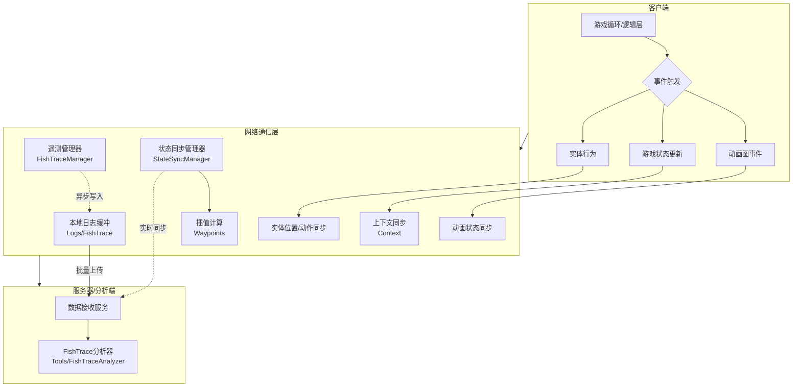

本页面旨在阐述游戏中负责网络通信、数据传输以及遥测系统的架构与实现细节。通过网络通信模块，游戏实现了客户端与服务器（或数据分析端）之间的实时交互，确保玩家行为、游戏状态以及实体（如鱼类）的数据能够准确传输与记录。

## 1. 系统架构概览

本项目的网络通信架构采用了分层设计，将游戏逻辑、序列化层以及底层传输解耦。这种设计允许我们在进行游戏开发时，能够独立地处理动画、物理和逻辑状态，同时保证网络层的高效性。

架构说明：
1.  **客户端层**：基于Unity引擎，通过 `BlackJack.AnimGraph` 处理动画逻辑，通过 `QuadEngine` 处理底层输入。
2.  **通信层**：包含遥测数据和实时游戏状态两条链路。遥测数据（如鱼咬钩、抛竿）优先记录到本地，防止网络波动丢失；关键状态（如玩家移动）则实时同步。
3.  **服务端**：接收JSON格式的遥测数据，并使用 `FishTraceAnalyzer` 工具进行后续分析。

Sources: [ExportedProject.sln](ExportedProject.sln#L1), [Packages/com.blackjack-inc.animgraph/package.json](Packages/com.blackjack-inc.animgraph/package.json#L1)

## 2. 遥测与数据追踪

为了优化游戏体验并平衡游戏机制，项目实现了一套高频率的遥测系统。该系统记录玩家与环境的交互数据，并保存为 JSON Lines (`.jsonl`) 格式，便于后续流式处理。

### 2.1 日志系统

所有关键的游戏事件都会被记录在 `Logs/FishTrace/` 目录下。日志文件命名遵循时间戳格式（如 `fish_trace_YYYYMMDD_HHMMSS.jsonl`），确保了日志的顺序性和可检索性。

| 文件路径 | 说明 | 数据格式 |
| :--- | :--- | :--- |
| `Logs/FishTrace/fish_trace_20260311_211309.jsonl` | 记录特定时间段内的鱼群行为与玩家操作 | JSON Lines (每行一个JSON对象) |

### 2.2 数据分析工具

为了处理海量的遥测数据，项目配套开发了分析工具。该工具（位于 `Tools/FishTraceAnalyzer/`）能够读取生成的日志文件，并将其可视化为可读的统计数据。

**核心功能：**
*   **Trace 读取**：解析 `.jsonl` 日志文件。
*   **数据清洗**：剔除无效或损坏的数据记录。
*   **统计生成**：计算平均咬钩时间、特定区域的鱼类分布等指标。

Sources: [Tools/FishTraceAnalyzer/FishTraceAnalyzer.cs](Tools/FishTraceAnalyzer/FishTraceAnalyzer.cs#L1), [Logs/FishTrace/fish_trace_20260311_211309.jsonl](Logs/FishTrace/fish_trace_20260311_211309.jsonl#L1)

## 3. 游戏状态同步与数据完整性

网络通信不仅仅是传输日志，更重要的是同步多玩家环境下的游戏状态。项目包含若干用于维护和修复同步数据的脚本，这暗示了网络同步过程中的复杂性，特别是在处理“路点”和“上下文”时。

### 3.1 路点修复

网络传输延迟会导致实体运动的跳跃感。项目使用路点数据来在客户端之间平滑插值移动。`fix_waypoint.py` 脚本用于处理路点数据的异常，确保预测和回溯的一致性。

| 功能 | 描述 | 相关文件 |
| :--- | :--- | :--- |
| **路点插值** | 在两个网络更新状态之间平滑移动 | `scripts/fix_waypoint.py` |
| **异常检测** | 识别因丢包或延迟导致的位置突变 | `scripts/fix_waypoint.py` |

### 3.2 上下文修复

“上下文”通常指代游戏发生的特定环境或逻辑状态（例如：在船头、在深水区）。网络同步往往需要同步这些上下文标签以触发正确的动画或物理反应。`fix_context.py` 用于校验和修复不同客户端之间上下文状态的不一致。

Sources: [scripts/fix_waypoint.py](scripts/fix_waypoint.py#L1), [scripts/fix_context.py](scripts/fix_context.py#L1)

## 4. 自定义动画图网络

项目使用了自定义的动画图系统 (`BlackJack.AnimGraph`)。为了节省带宽，网络层可能并不直接同步骨骼旋转，而是通过该系统同步“状态参数”或“动画参数”。

*   **参数同步**：仅同步影响动画节点的 float 或 bool 参数。
*   **事件触发**：通过网络触发器通知其他客户端播放特定的动画事件（如“收竿成功”）。

该包位于 `Packages/com.blackjack-inc.animgraph/`，包含运行时和编辑器两部分，支持网络相关的调试和序列化逻辑。

Sources: [Packages/com.blackjack-inc.animgraph/Runtime](Packages/com.blackjack-inc.animgraph/Runtime#L1)

## 5. 网络优化与脚本工具

为了保证通信的稳定性和性能，项目提供了多个 Python 脚本用于事后审计和修复。

| 脚本名称 | 主要作用 | 涉及的网络层面 |
| :--- | :--- | :--- |
| `fisher_method_full_audit.py` | 对捕鱼者相关的方法进行全面审计 | 方法调用序列、RPC验证 |
| `fix_context.py` | 修复游戏上下文状态不一致 | 状态同步校验 |
| `fix_waypoint.py` | 修复路点数据和插值问题 | 移动同步、位置校准 |

这些脚本通常在服务器端或作为 CI/CD 流程的一部分运行，用于验证客户端上传数据的正确性。

Sources: [scripts/fisher_method_full_audit.py](scripts/fisher_method_full_audit.py#L1), [scripts/fix_context.py](scripts/fix_context.py#L1), [scripts/fix_waypoint.py](scripts/fix_waypoint.py#L1)

## 6. 下一步计划

在了解了网络通信的基础架构和数据传输方式后，接下来的重点是深入了解 **"什么数据需要同步"** 以及 **"何时同步这些数据"**。

请继续阅读：**[同步机制](17-tong-bu-ji-zhi)**，该页面将详细讨论状态复制、对象所有权以及网络预测算法。