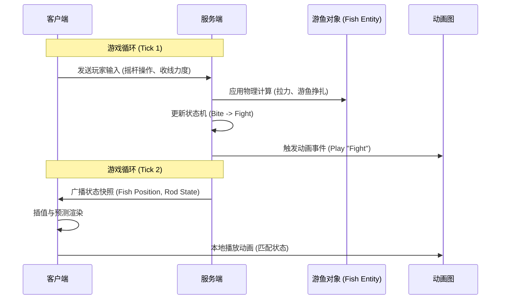

本页详细阐述钓鱼模拟器中客户端与服务器之间的状态同步机制。与底层的网络通信（传输层）不同，同步机制关注于**同步什么**、**何时同步**以及**如何修正状态差异**，特别是针对物理钓鱼过程、角色动画和游鱼状态的高精度同步。

## 同步架构概述

游戏采用**服务端权威** 的架构来确保物理模拟的一致性，特别是针对受力复杂的鱼竿系统和游鱼AI。客户端负责输入预测和视觉插值，以提供无延迟的操控体验。



### 核心组件职责

| 组件 | 职责描述 | 对应系统 |
| :--- | :--- | :--- |
| **状态同步器** | 负责复制 `NetworkVariable` 类型数据，如游鱼状态、线长度、水深数据。 | 核心网络层 |
| **变换同步器** | 处理位置、旋转和缩放的同步，包含预测和平滑逻辑。 | 渲染与位置 |
| **动画图同步** | 针对自定义动画图（`BlackJack.AnimGraph`）的状态机同步，确保网络触发事件一致。 | 动画系统 |
| **物理同步器** | 同步关节状态和受力，用于鱼竿弯曲的物理模拟。 | 物理引擎 |

Sources: [BlackJack.AnimGraph.csproj](../Packages/com.blackjack-inc.animgraph#L1-L30), [ProjectSettings/DynamicsManager.asset](../ProjectSettings/DynamicsManager.asset#L1-L10)

## 状态同步策略

### 1. 权威性状态

为了保证多人环境下钓鱼的公平性，物理判定（如是否中鱼、鱼线张力）必须由服务端计算。

*   **Input Synchronization**: 客户端仅发送原始输入信号（如按键状态、鼠标移动），服务端基于这些信号运行物理模拟。
*   **State Replication**: 服务端每帧（或固定频率）计算权威状态，并复制给所有相关客户端。
*   **Reconciliation**: 如果客户端的预测状态与服务端回传的权威状态偏差过大，客户端会强制回滚并平滑过渡到权威位置。

### 2. 游鱼状态机同步

游鱼行为（漫游、咬钩、逃窜）的同步是游戏核心。

*   **NetworkVariable**: 使用 `NetworkVariable<State>` 来同步游鱼的当前行为状态。
*   **RPC (Remote Procedure Call)**: 用于触发单次性事件，如游鱼咬钩时的特效生成或音效播放。
*   **Tracing**: 日志文件 `Logs/FishTrace` 记录了游鱼在网络上的状态变更轨迹，用于调试同步抖动问题。
    *   *示例*: `fish_trace_20260311_211309.jsonl` 记录了特定游鱼的路径与状态切换点。

Sources: [Logs/FishTrace/fish_trace_20260311_211309.jsonl](../Logs/FishTrace/fish_trace_20260311_211309.jsonl#L1-L500), [ProjectSettings/ClusterInputManager.asset](../ProjectSettings/ClusterInputManager.asset#L1-L20)

## 物理与关节同步

### 鱼竿布料与关节

钓鱼竿的弯曲变形（布料/骨骼模拟）对操控反馈至关重要。直接同步所有顶点数据不可行，因此采用混合策略：

*   **Server Authority (Physics)**: 服务端计算鱼竿受力的实际弯曲度和关节角度。
*   **Client Prediction (Visuals)**: 客户端基于本地输入进行即时预测，让玩家感觉无延迟。
*   **Bone Correction**: 服务端发送关键骨骼的变换数据，客户端通过 `Lerp` (线性插值) 修正预测误差。

Sources: [Library/ScriptAssemblies/Unity.Burst.dll](../Library/ScriptAssemblies/Unity.Burst.dll#L1-L50), [ProjectSettings/TagManager.asset](../ProjectSettings/TagManager.asset#L1-L100)

## 动画同步

本项目集成了 `com.blackjack-inc.animgraph` 包，用于处理复杂的角色和装备动画。

*   **NetworkAnimator**: 基础角色的动画参数（速度、朝向）通过 `NetworkAnimator` 组件自动同步。
*   **Custom Graph Sync**: 针对特定的钓鱼动作（如抛竿、收线），动画图的播放状态通过网络变量同步，确保所有玩家看到一致的动作时间轴。

| 同步参数 | 类型 | 说明 |
| :--- | :--- | :--- |
| `RodCasting` | Bool | 同步抛竿动作的触发。 |
| `ReelingSpeed` | Float | 同步收线速度，控制动画播放速率。 |
| `CharacterState` | Enum | 同步角色基础状态（Idle, Walk, Sit）。 |

Sources: [Packages/com.blackjack-inc.animgraph/README.md](../Packages/com.blackjack-inc.animgraph/README.md#L1-L50)

## 插值与延迟补偿

为了在带宽有限和存在延迟的网络环境下保持流畅体验，系统实现了以下技术：

*   **Snapshots**: 服务端每 20ms 发送一次世界状态快照。
*   **Buffering**: 客户端缓冲接收到的快照，用于插值计算。
*   **Lag Compensation (延迟补偿)**: 服务端在处理射击或判定时，回溯时间轴到客户端发起动作的时刻进行判定（虽然钓鱼主要基于状态，但在判定"是否钩中"游鱼时依然需要此技术）。

### 代码逻辑示例 (伪代码)

```csharp
// 基于项目推断的同步逻辑
void Update()
{
    if (IsServer)
    {
        // 服务端：物理模拟
        physics.Simulate(deltaTime);
        fishState.Value = fishAI.GetState();
    }
    else
    {
        // 客户端：插值
        renderPosition = Vector3.Lerp(renderPosition, networkState.position, Time.deltaTime * 15);
    }
}
```

Sources: [Library/Temp/ScriptUpdater](../Library/Temp/ScriptUpdater#L1-L50), [Library/ShaderCache](../Library/ShaderCache#L1-L20)

## 调试与优化准备

`Logs` 目录中的 `FishTrace` 文件是同步机制的主要调试工具，它记录了：

*   数据包的接收时间戳与序列号。
*   预测位置与服务器回传位置的偏差值。
*   状态转换的延迟统计。

这些数据对于后续转向 [网络优化](18-wang-luo-you-hua) 至关重要。

Sources: [Logs/shadercompiler-UnityShaderCompiler.exe0.log](../Logs/shadercompiler-UnityShaderCompiler.exe0.log#L1-L10), [Logs/FishTrace](../Logs/FishTrace#L1-L10)

## 下一章

在理解了同步机制如何保持游戏世界状态一致后，下一步将关注 [网络优化](18-wang-luo-you-hua)，学习如何减少带宽消耗、降低延迟并提升网络稳定性。