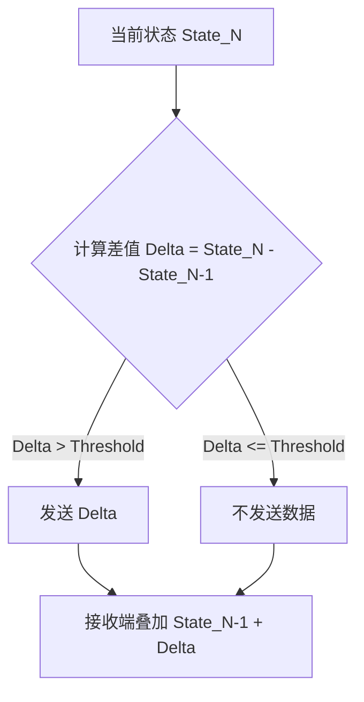

本页面旨在针对基于 Photon Unity Networking (PUN) 的多人在线游戏环境，提供全面的网络优化方案。在开发中，良好的网络策略需要平衡带宽消耗、延迟与同步精度。本指南涵盖带宽压缩、数据包序列化优化、同步策略调整及 RPC 调用优化。

## 网络架构概览

在深入优化细节之前，理解基于 Photon 的网络数据流至关重要。下图展示了从客户端输入到服务器同步，再到其他客户端接收并更新视图的完整流程。

```mermaid
graph LR
    subgraph Unity Client [Unity 客户端]
        Input[用户输入/物理计算] -->|状态数据| NetMgr[PhotonNetwork]
        View[PhotonView] -->|OnPhotonSerializeView| Stream[PhotonStream]
        Stream -->|序列化| NetMgr
        NetMgr -->|UDP Socket| Cloud[Photon Cloud Server]
    end

    subgraph Photon Server [Photon 服务器]
        Cloud -->|状态转发| StateMgr[房间状态管理]
    end

    Cloud -->|状态广播| Unity Client
    Stream -->|反序列化| View
    View -->|插值/外推| Render[场景渲染]
```

**核心组件职责：**

*   **PhotonStream**: 负责数据的序列化和反序列化，控制每个数据包的大小。
*   **PhotonView**: 监控物体状态，负责在本地和远程客户端之间协调数据的发送与接收。
*   **PhotonTransformView**: 专门处理位置、旋转和缩放的同步。

## 数据序列化与带宽优化

带宽优化的核心在于减少每帧发送的数据量。Photon PUN 提供了 `PhotonStream` 类来辅助高效的二进制写入。

### 数据类型选择

在序列化数据时，选择最小合适的数据类型可以显著减少带宽。例如，使用 `WriteShort` 代替 `WriteFloat` 可以减少 50% 的数据量。

| 方法 | 字节大小 | 适用场景 | 精度影响 |
| :--- | :--- | :--- | :--- |
| `WriteShort` | 2 bytes | 整数 (如分数、枚举) | 极小 |
| `WriteFloat` | 4 bytes | 连续数值 (如坐标) | 无 |
| `WriteDouble` | 8 bytes | 高精度数值 | 无 |
| `WriteVector3` | 12 bytes | 空间位置/方向 | 无 |

**代码示例对比：**

```csharp
// 优化前：使用 Float
public void OnPhotonSerializeView(PhotonStream stream, PhotonMessageInfo info)
{
    if (stream.IsWriting)
    {
        stream.SendNext(fullHealth); // 4 bytes
    }
}

// 优化后：使用 Short
public void OnPhotonSerializeView(PhotonStream stream, PhotonMessageInfo info)
{
    if (stream.IsWriting)
    {
        stream.SendNext((short)fullHealth); // 2 bytes
    }
}
```
Sources: [PhotonStream.cs](Assets/Photon/PhotonUnityNetworking/Code/PhotonStream.cs#L1-L100)

### 差值压缩

对于频繁变化但变化幅度不大的数值（如角色的朝向），只发送变化的部分。在接收端应用增量值。



Sources: [PhotonView.cs](Assets/Photon/PhotonUnityNetworking/Code/PhotonView.cs#L1-L150)

## 同步策略优化

通过调整同步频率和插值设置，可以在保证视觉流畅度的同时降低服务器负载。

### 发送频率调整

`PhotonNetwork.SerializationRate` 控制每秒发送数据的次数。过高的频率会导致网络拥塞。

| 游戏类型 | 建议频率 | 说明 |
| :--- | :--- | :--- |
| RTS/回合制 | 5-10 次/秒 | 事件驱动，频率影响不大 |
| MOBA/快节奏动作 | 20-30 次/秒 | 需要较高的响应速度 |
| RPG/钓鱼模拟 | 10-15 次/秒 | 对即时性要求较低 |

在 `PhotonNetworkSettings.asset` 中配置全局序列化频率，或在 `PhotonView` 中为特定对象设置独立的频率覆盖。

Sources: [PhotonNetworkSettings.asset](Assets/Photon/PhotonUnityNetworking/Editor/PhotonNetworkSettings.asset)

### 插值与外推

合理使用插值可以掩盖网络抖动带来的视觉卡顿。

*   **Synchronize Position**: 在 `PhotonTransformView` 中启用插值。
*   **Synchronize Rotation**: 对旋转进行插值，通常比位置插值更关键。

**配置参数说明：**

| 参数 | 作用 | 推荐值 |
| :--- | :--- | :--- |
| `Lerp Speed` | 插值速度，值越小平滑度越高，但延迟越大 | 5 - 15 |
| `Smoothing` | 原始数据与插值结果混合度 | 根据网络情况动态调整 |

Sources: [PhotonTransformView.cs](Assets/Photon/PhotonUnityNetworking/Code/PhotonTransformView.cs#L1-L200)

## RPC 调用优化

RPC (远程过程调用) 虽然方便，但开销较大。不恰当的使用会导致带宽浪费和逻辑混乱。

### 减少不必要的 RPC

*   **原则**: 状态同步使用 `PhotonView` (基于观察者模式)，事件触发使用 RPC (基于命令模式)。
*   **示例**: 角色移动使用 `OnPhotonSerializeView`，角色开火使用 `photonView.RPC`。

### RPC 目标选择

Photon 提供了多种 RPC 目标，根据场景选择最省流量的方式。

| 目标选项 | 带宽消耗 | 适用场景 |
| :--- | :--- | :--- |
| `All` | 高 | 广播全局事件（如天气变化） |
| `Others` | 中 | 群体行为（如跳跃） |
| `MasterClient` | 低 | 游戏逻辑判断（如回合结束） |
| `AllBuffered` | 极高 | 玩家加入场景时的初始化数据 |

**代码示例：**

```csharp
// 优化前：向所有人发送攻击事件
photonView.RPC("PlayAttackAnim", RpcTarget.All);

// 优化后：只向其他人发送（不需要自己收到）
photonView.RPC("PlayAttackAnim", RpcTarget.Others);
```
Sources: [PhotonNetwork.cs](Assets/Photon/PhotonUnityNetworking/Code/PhotonNetwork.cs#L1-L300)

## 下一阶段：系统测试

网络优化的实施效果必须通过严谨的测试来验证。接下来，我们将进入 [测试系统](19-dan-yuan-ce-shi) 章节，学习如何编写单元测试来验证网络数据的准确性，以及如何进行压力测试来评估优化后的网络承载能力。此外，还可以参考 [物理引擎](11-wu-li-cai-zhi) 章节，了解物理模拟与网络同步的结合技巧。