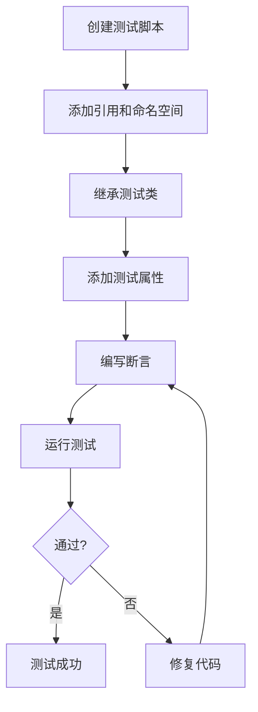

本文档介绍ExportedProject项目中的单元测试系统，包括测试框架、组织结构、最佳实践以及如何编写和运行单元测试。单元测试用于验证代码的独立功能模块，确保其在预期条件下正确运行，从而提高代码质量和维护性。

## 测试项目架构
单元测试通过独立的测试项目进行组织，分为运行时测试和编辑器测试。测试框架采用NUnit，并通过Unity Test Runner集成到Unity编辑器中。

### 架构图
以下Mermaid图展示了测试项目、程序集及它们之间的依赖关系：

```mermaid
graph TD
    subgraph Unity编辑器
        A[BlackJack.AnimGraph.Tests.Editor.csproj] --> B[BlackJack.AnimGraph.Tests.Editor.dll]
        C[BlackJack.AnimGraph.Tests.csproj] --> D[BlackJack.AnimGraph.Tests.dll]
        B --> E[Unity Test Runner (Editor)]
        D --> E
    end
    subgraph 运行时
        F[BlackJack.AnimGraph.csproj] --> G[BlackJack.AnimGraph.dll]
        D --> G
    end
    E --> H[NUnit Framework]
    H --> I[com.unity.ext.nunit]
```

### 测试项目说明
| 项目名称 | 类型 | 说明 | 依赖 |
|---------|------|------|------|
| BlackJack.AnimGraph.Tests | 运行时测试 | 包含运行时环境下的测试用例，验证游戏逻辑、动画系统等功能。 | BlackJack.AnimGraph.dll |
| BlackJack.AnimGraph.Tests.Editor | 编辑器测试 | 包含编辑器扩展、工具和自定义编辑器窗口的测试用例。 | BlackJack.AnimGraph.dll, UnityEditor.TestRunner.dll |
| BlackJack.AnimGraph.Insight | 调试工具 | 动画图的运行时可视化调试，也可用于验证动画状态。 | - |
| BlackJack.AnimGraph.Insight.GameDebugger | 调试工具编辑器 | 动画图调试器的编辑器扩展。 | - |

Sources: [BlackJack.AnimGraph.Tests.csproj](BlackJack.AnimGraph.Tests.csproj#L1-L10), [BlackJack.AnimGraph.Tests.Editor.csproj](BlackJack.AnimGraph.Tests.Editor.csproj#L1-L10)

## 测试类型
在Unity中，单元测试分为两种主要类型：EditMode测试和PlayMode测试。

| 测试类型 | 运行环境 | 适用场景 | 特点 |
|---------|---------|---------|------|
| EditMode测试 | 编辑器模式下运行 | 验证编辑器脚本、资源处理、序列化、算法等不涉及游戏运行时的逻辑。 | 速度快，不启动游戏实例。 |
| PlayMode测试 | 游戏模式下运行 | 验证游戏运行时逻辑、组件交互、物理、AI等。 | 模拟真实游戏环境，需要加载场景。 |

Sources: [Packages/com.blackjack-inc.animgraph/Tests](Packages/com.blackjack-inc.animgraph/Tests)

## 编写单元测试
编写单元测试需要遵循NUnit规范和Unity Test Runner的特定要求。以下步骤展示了如何创建并编写一个简单的单元测试。

### 步骤流程


### 示例代码
以下是一个简单的Edit测试示例，用于验证QuadEngine类的初始化：

```csharp
using NUnit.Framework;
using UnityEngine;

namespace BlackJack.AnimGraph.Tests
{
    [TestFixture]
    public class QuadEngineTests
    {
        [Test]
        public void Initialize_ShouldSetCorrectPosition()
        {
            // Arrange
            var engine = new GameObject("QuadEngine").AddComponent<QuadEngine>();
            
            // Act
            engine.Initialize(Vector3.zero);
            
            // Assert
            Assert.AreEqual(Vector3.zero, engine.transform.position);
        }
    }
}
```

Sources: [QuadEngine.cs](QuadEngine.cs#L1-L10)

### 测试编写最佳实践
- **单一职责**：每个测试方法只验证一个功能点。
- **AAA模式**：遵循Arrange（准备）、Act（执行）、Assert（断言）结构。
- **命名规范**：使用描述性的方法名，如 `MethodName_ShouldExpectedResult_WhenCondition`。
- **独立性**：测试方法之间不应有依赖，可按任意顺序运行。
- **使用Setup和TearDown**：对于公共的初始化和清理逻辑，使用 `[SetUp]` 和 `[TearDown]` 属性。

Sources: [BlackJack.AnimGraph.Tests.csproj](BlackJack.AnimGraph.Tests.csproj#L20-L30)

## 运行测试
Unity Test Runner提供了图形界面和命令行两种方式来运行测试。

### 图形界面运行
1. 打开菜单：`Window > General > Test Runner`。
2. 在Test Runner窗口中，选择运行EditMode或PlayMode测试。
3. 点击“Run All”执行所有测试，或右键特定测试集进行运行。
4. 测试结果将显示在Test Runner窗口的底部面板。

### 命令行运行
可通过Unity命令行参数运行测试，适用于持续集成（CI）环境：
```bash
Unity.exe -runTests -testPlatform EditMode -projectPath /path/to/project
Unity.exe -runTests -testPlatform PlayMode -projectPath /path/to/project
```
常用参数：
- `-testPlatform`：指定测试平台（EditMode/PlayMode）。
- `-testResults`：指定测试结果输出目录。
- `-batchmode`：以批处理模式运行，不显示图形界面。

Sources: [ProjectSettings/EditorBuildSettings.asset](ProjectSettings/EditorBuildSettings.asset#L1-L5)

## 测试覆盖率
为了评估单元测试对代码的覆盖程度，可以使用覆盖率工具。Unity Test Runner本身不提供覆盖率统计，但可通过第三方工具集成。

### 工具集成
- **JetBrains Rider / Visual Studio**：内置覆盖率工具，通过测试运行器获取报告。
- **OpenCover + ReportGenerator**：开源覆盖率工具，支持生成详细报告。
- **Codecov**：将覆盖率报告上传到在线平台，便于跟踪。

配置覆盖率通常需要在测试运行脚本中附加相应参数，并在构建过程中启用覆盖率收集。

Sources: [Packages/com.blackjack-inc.animgraph/Tests](Packages/com.blackjack-inc.animgraph/Tests)

## 下一步
掌握单元测试后，建议进一步了解集成测试，以确保系统各模块协同工作的正确性。
- 阅读：[集成测试](20-ji-cheng-ce-shi)
- 阅读：[性能测试](21-xing-neng-ce-shi)
- 阅读：[单元测试](19-dan-yuan-ce-shi) (当前页)