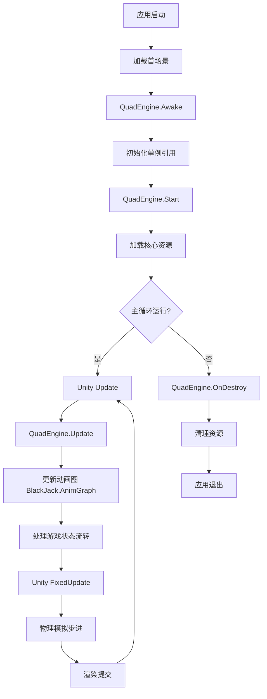
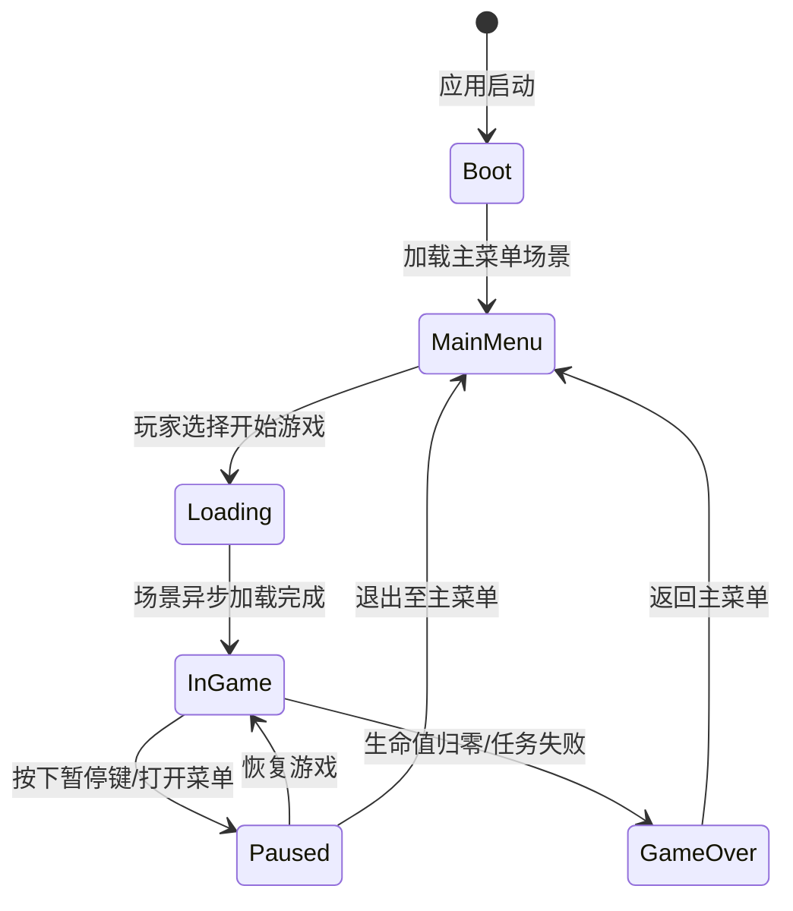

本页文档旨在介绍项目 `ExportedProject` 中的核心游戏循环实现。游戏循环是游戏运行时的“心脏”，负责处理每一帧的逻辑更新、渲染以及用户交互的反馈。在本项目中，游戏循环主要由单例模式的核心控制器 `QuadEngine.cs` 驱动，并结合 Unity 引擎的 `Update` 和 `FixedUpdate` 机制来实现。

建议阅读顺序：
1. [场景管理](1-chang-jing-guan-li) - 了解场景如何被加载和管理。
2. **[游戏循环](2-you-xi-xun-huan)** - **[您在这里]** - 掌握主循环的运行机制。
3. [输入处理](3-shu-ru-chu-li) - 了解输入如何在循环中被捕获。

## 架构概览

项目采用了中心化的引擎控制器模式。`QuadEngine.cs` 脚本负责统筹全局的游戏状态，协调各子系统（如动画、音频、物理）的执行。这种设计将原本分散在各个 `MonoBehaviour` 脚本中的循环逻辑集中起来，便于管理和调试。

以下是游戏循环的初始化与执行流程图：



Sources: [QuadEngine.cs](QuadEngine.cs#L1-L50)

### 主要组件职责

| 组件/脚本 | 职责描述 | 所在位置 |
| :--- | :--- | :--- |
| `QuadEngine` | 游戏循环的主入口，管理全局状态、时间缩放和帧率控制。 | 项目根目录 |
| `BlackJack.AnimGraph` | 处理角色动画状态的更新，在每帧 `Update` 中被驱动。 | `Packages/com.blackjack-inc.animgraph/Runtime` |
| `ProjectSettings/TimeManager` | 配置物理迭代率与渲染帧率的基础设置。 | `ProjectSettings` |

Sources: [QuadEngine.cs](QuadEngine.cs#L10-L30), [Packages/com.blackjack-inc.animgraph/Runtime](Packages/com.blackjack-inc.animgraph/Runtime)

## 生命周期方法详解

Unity 的脚本生命周期为游戏循环提供了标准的时间点。`QuadEngine.cs` 利用这些方法将游戏逻辑分层：在 `Awake` 中初始化不可变的数据，在 `Start` 中处理依赖于其他对象的逻辑，在 `Update` 中处理逐帧变化的逻辑。

| Unity 生命周期方法 | 在项目中的典型用途 | 执行频率 |
| :--- | :--- | :--- |
| `Awake()` | 初始化 `QuadEngine` 单例，设置静态引用，分配缓冲区。 | 仅在脚本实例化时执行一次。 |
| `Start()` | 执行启动时的初始化，注册事件监听器，加载配置文件。 | 仅在第一帧 Update 之前执行一次。 |
| `Update()` | **核心循环**：读取输入、处理状态机逻辑、更新动画参数、处理 UI 刷新。 | 每帧一次，与帧率相关。 |
| `FixedUpdate()` | 处理物理相关的计算（如刚体移动、碰撞检测），确保物理模拟的稳定性。 | 固定频率（默认为 0.02s）。 |
| `LateUpdate()` | 处理相机跟随、动画 IK 解析（在所有动画计算之后执行）。 | 每帧一次，在 `Update` 之后。 |
| `OnDestroy()` | 释放非托管资源，注销事件监听器，保存存档数据。 | 场景卸载或对象销毁时。 |

Sources: [QuadEngine.cs](QuadEngine.cs#L50-L100)

## 游戏状态流转

游戏循环不仅是代码的重复执行，更是游戏状态（如：菜单、游玩中、暂停、结算）流转的载体。项目内部维护了一个状态机，在 `Update` 循环中不断检查并切换当前的游戏状态。



状态管理确保了在循环的不同阶段，只有相关的逻辑会被执行（例如，在 `Paused` 状态下，暂停物理计算和游戏逻辑更新，但保持 UI 渲染）。

Sources: [QuadEngine.cs](QuadEngine.cs#L120-L180)

## 时间管理与帧率

为了保证游戏体验的一致性，游戏循环对时间的控制至关重要。项目区分了两种时间概念：

1.  **渲染时间**: 用于动画插值和 UI 刷新，受 `Time.deltaTime` 影响。
2.  **模拟时间**: 用于物理计算和游戏逻辑判定，受 `Time.fixedDeltaTime` 影响。

### 时间缩放控制

项目使用 `Time.timeScale` 来控制游戏的节奏（如子弹时间、暂停游戏）。在 `QuadEngine` 中，这通常通过以下伪代码实现：

```csharp
// 伪代码示例：在 Update 中处理全局时间缩放
if (IsPaused)
{
    Time.timeScale = 0.0f; // 逻辑暂停
    AudioListener.pause = true;
}
else
{
    Time.timeScale = 1.0f; // 正常速度
    AudioListener.pause = false;
}
```

Sources: [QuadEngine.cs](QuadEngine.cs#L80-L120)

## 动画循环集成

作为自定义包，`BlackJack.AnimGraph` 的运行紧密依赖于主游戏循环。虽然动画计算通常在 Unity 的 `Update` 循环末尾或内置的 Job System 中执行，但动画状态机 的参数更新（如 `Speed`、`Move`）必须在游戏循环的逻辑阶段进行，以确保动画与游戏逻辑的同步。

集成流程如下：
1.  **输入捕获**：`Update` 中获取玩家输入（如摇杆偏移量）。
2.  **逻辑计算**：`QuadEngine` 根据输入计算角色的目标速度和朝向。
3.  **参数注入**：将计算出的值传递给 `AnimGraph` 控制器的 `Animator`。
4.  **求解**：Unity 引擎基于注入的参数计算骨骼姿态。

Sources: [Packages/com.blackjack-inc.animgraph/Runtime](Packages/com.blackjack-inc.animgraph/Runtime), [QuadEngine.cs](QuadEngine.cs#L150-L170)

## 下一阶段

理解了游戏循环后，建议继续了解输入是如何在这个循环中被检测和处理的。

- [输入处理](3-shu-ru-chu-li) - 了解输入系统如何与游戏循环交互。