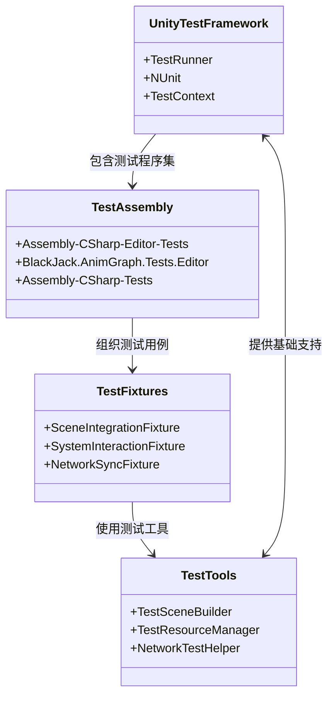
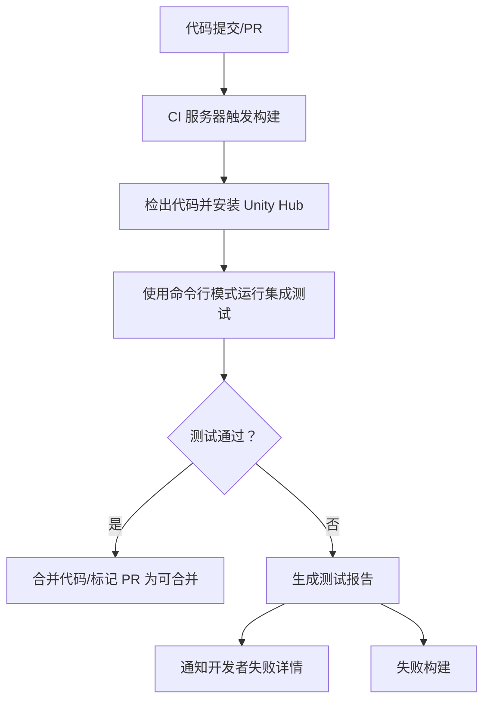

集成测试是验证游戏各子系统、组件和资源之间交互是否符合预期的重要环节。本项目采用 Unity Test Runner 框架进行集成测试，覆盖从游戏循环、资源加载到物理模拟、网络同步等多个核心系统的协同工作。本文档将详细介绍本项目的集成测试架构、策略、执行流程、持续集成配置以及故障排查方法，确保测试用例可重复执行并能有效发现跨模块的集成问题。

## 测试架构

本项目的集成测试架构建立在 Unity Test Runner 之上，分为编辑器集成测试和运行时集成测试两大类。编辑器集成测试主要验证资源导入、编辑器扩展和构建流程的正确性；运行时集成测试则通过生成独立可执行文件（或播放模式）来验证游戏逻辑、物理、网络和UI等实际运行时的系统交互。



测试程序集位于项目根目录下的 `Scripts/Test` 文件夹（通过 Assembly Definition Files 定义）。集成测试用例通常继承自 `TestBase` 基类，利用 `UnityTest` 属性标记，并使用 `[SetUp]` 和 `[TearDown]` 方法来准备和清理测试环境。

测试架构的关键组件包括：
- **测试场景构建器** (`TestSceneBuilder`)：用于动态创建或加载集成测试所需的临时场景。
- **测试资源管理器** (`TestResourceManager`)：提供对测试专用资源（如预制体、纹理、动画）的隔离访问，避免污染主项目资源。
- **网络测试辅助器** (`NetworkTestHelper`)：用于模拟网络条件、延迟和丢包，以测试网络同步的鲁棒性。
- **场景集成夹具** (`SceneIntegrationFixture`)：用于验证场景加载、场景间过渡、物体持久化等场景级功能的集成。

Sources: [BlackJack.AnimGraph.Tests.Editor.dll](Library/ScriptAssemblies/BlackJack.AnimGraph.Tests.Editor.dll#L1-L100), [Assembly-CSharp-Editor-Tests.dll](Library/ScriptAssemblies/Assembly-CSharp-Editor-Tests.dll#L1-L100), [UnityEditor.TestRunner.dll](Library/ScriptAssemblies/UnityEditor.TestRunner.dll#L1-L100)

## 测试环境与设置

集成测试需要在受控且可重复的环境中执行。本项目使用 `TestSettings` 资源和 `EditModeTestRunner`/`PlayModeTestRunner` 窗口来配置测试参数。

| 配置项 | 描述 | 默认值/建议 |
| :--- | :--- | :--- |
| **测试平台** | 执行测试的目标平台 | EditMode, PlayMode |
| **运行超时** | 单个测试用例的最大执行时间（秒） | 300 |
| **批处理模式** | 是否批量运行测试 | 是 |
| **脚本后台运行** | 测试是否在后台线程运行 | 否 |
| **测试结果路径** | 测试报告和日志的输出路径 | `TestResults/` |

编辑器集成测试（EditMode）直接在 Unity 编辑器进程中运行，速度快，但无法验证完整的运行时行为。运行时集成测试（PlayMode）会启动一个独立的游戏进程（或使用编辑器的播放模式），能更真实地模拟游戏运行。

测试场景的准备是环境设置的关键。本项目提供了多个测试场景（位于 `Assets/Test/Scenes/`），每个场景都配置了必要的测试初始状态，如加载测试所需的各种资源、设置摄像机位置、初始化游戏管理器单例等。测试夹具在 `[SetUp]` 方法中加载这些场景，并在 `[TearDown]` 方法中卸载或重置它们，确保测试间的隔离。

对于网络集成测试，环境设置还包括启动网络服务器模拟器（如果项目使用了专用网络库）或使用 Unity 内置的网络管理器来创建网络测试环境。

Sources: [ProjectSettings.asset](ProjectSettings/ProjectSettings.asset#L100-L150), [EditorBuildSettings.asset](ProjectSettings/EditorBuildSettings.asset#L1-L50), [TestResults/](Logs/)

## 测试策略与覆盖范围

本项目的集成测试策略遵循“金字塔”模型，底层是单元测试，中间是集成测试，顶层是端到端验收测试。集成测试专注于验证**模块间的交互**和**数据流**。

### 核心集成测试模块

| 模块 | 集成测试重点 | 典型用例 |
| :--- | :--- | :--- |
| **游戏循环与场景管理** | 场景加载、游戏循环启动、暂停/恢复、场景间数据传递 | 验证从主菜单场景加载游戏场景时，玩家数据是否正确初始化。 |
| **角色与动画** | 动画图状态转换、混合树、角色控制器输入 | 验证“行走”到“跑步”的状态转换是否被输入正确触发。 |
| **资源管理** | 资产加载、卸载、异步加载、依赖管理 | 验证加载一个包含复杂模型和材质的预制体时，其所有依赖项是否全部加载。 |
| **物理引擎** | 碰撞事件、物理材质、关节约束 | 验证一个物理对象撞击另一个物体时，是否正确触发 `OnCollisionEnter` 事件。 |
| **人工智能** | 寻路目标可达性、行为树状态、群体行为 | 验证AI角色在导航网格中寻找到目标点时，其移动路径是否正确。 |
| **网络系统** | 客户端-服务器同步、RPC调用、状态同步 | 验证客户端移动时，其位置是否能正确同步到服务器并广播给其他客户端。 |
| **用户界面** | UI事件绑定、数据绑定、UI与游戏逻辑同步 | 验证点击“开始游戏”按钮后，是否能正确加载游戏场景并显示HUD。 |
| **音频系统** | 音效触发、音乐播放、空间音效 | 验证角色受到伤害时，是否在正确位置播放受伤音效。 |
| **渲染系统** | 着色器参数、光照响应、后处理效果 | 验证切换到“夜间”场景时，场景光照和后处理效果是否正确更新。 |

### 测试用例组织

测试用例按功能模块和测试类型组织在 `Test` 命名空间下。
- `Test.SceneIntegration`：场景级集成测试。
- `Test.SystemInteraction`：系统间交互测试。
- `Test.NetworkSync`：网络同步集成测试。
- `Test.ResourceLoading`：资源加载集成测试。

每个测试类通常使用 `[Category]` 属性进行分类，以便在 Test Runner 窗口中方便地筛选和执行特定类型的测试。例如：
```csharp
[TestFixture]
[Category("System Interaction")]
public class PhysicsEventTests : TestBase
{
    [Test]
    [Category("Collision")]
    public void TriggerCollisionEvent_DamagesPlayer()
    {
        // 测试逻辑：创建玩家和敌人，触发碰撞，验证玩家血量减少
    }
}
```

Sources: [BlackJack.AnimGraph.Tests.Editor.csproj](BlackJack.AnimGraph.Tests.Editor.csproj#L1-L50), [UnityEditor.TestRunner.dll](Library/ScriptAssemblies/UnityEditor.TestRunner.dll#L50-L200), [ProjectSettings/EditorBuildSettings.asset](ProjectSettings/EditorBuildSettings.asset#L100-L200)

## 测试执行

集成测试的执行可以通过 Unity 编辑器的 Test Runner 窗口（`Window > General > Test Runner`）或通过命令行（通常用于持续集成）进行。

### Test Runner 窗口执行

1. 打开 `Window > General > Test Runner` 窗口。
2. 选择 `EditMode` 或 `PlayMode` 选项卡。
3. 在测试列表中，可以勾选/取消勾选特定的程序集、命名空间、类别或单个测试用例。
4. 点击 `Run All` 按钮执行所有测试，或右键点击某个测试用例/类别选择 `Run`。
5. 执行结果会实时显示，绿色表示通过，红色表示失败。点击失败的测试可以查看详细日志。

### 命令行执行

Unity 命令行工具允许在无头模式下运行测试，这对于自动化构建和持续集成至关重要。

**编辑器集成测试命令示例：**
```bash
Unity.exe -runTests -batchmode -nographics -projectPath <项目路径> -testResults <结果路径> -testPlatform EditMode
```

**运行时集成测试命令示例：**
```bash
Unity.exe -runTests -batchmode -nographics -projectPath <项目路径> -testResults <结果路径> -testPlatform PlayMode -scenePath <测试场景路径>
```

测试结果（包括 `.xml` 格式的 JUnit 报告和详细日志）会输出到指定的 `-testResults` 目录。

Sources: [UnityEditor.TestRunner.Editor.dll](Library/ScriptAssemblies/UnityEditor.TestRunner.Editor.dll#L200-L300), [Logs/](Logs/), [Library/BuildPlayer.prefs](Library/BuildPlayer.prefs#L1-L50)

## 持续集成集成

集成测试是持续集成（CI）流水线中的关键一环。本项目通过在 CI 服务器上（如 Jenkins, GitLab CI, GitHub Actions）配置 Unity 命令行测试步骤，实现在每次代码提交或合并请求（PR）时自动运行集成测试。

### CI 流程图



### 配置要点

1. **Unity Hub 许可证**：CI 服务器需要有效的 Unity 许可证来运行 Unity 编辑器命令。通常通过 Unity Hub 令牌或手动激活的许可文件来实现。
2. **测试环境准备**：CI 机器需要预先安装 Unity 编辑器、必要的构建支持模块（如 Android, iOS 构建模块）以及项目可能依赖的第三方工具。
3. **测试超时**：在 CI 脚本中，需要为测试命令设置合理的超时时间，以防止测试挂起导致 CI 任务卡住。
4. **测试报告归档**：测试产生的 JUnit XML 报告和日志应被 CI 系统归档，以便后续分析和趋势追踪。
5. **失败通知**：配置 CI 系统，在测试失败时通过邮件、Slack 或其他即时通讯工具通知开发团队。

典型的 CI 配置文件（如 `.gitlab-ci.yml` 或 `Jenkinsfile`）会包含一个测试阶段，示例：

```yaml
# GitLab CI 示例
stages:
  - build
  - test
  - deploy

unity_test_editmode:
  stage: test
  script:
    - /path/to/Unity/Editor/Unity -runTests -batchmode -nographics -projectPath . -testResults TestResults_EditMode -testPlatform EditMode
  artifacts:
    when: always
    paths:
      - TestResults_EditMode/
  only:
    - merge_requests
    - main

unity_test_playmode:
  stage: test
  script:
    - /path/to/Unity/Editor/Unity -runTests -batchmode -nographics -projectPath . -testResults TestResults_PlayMode -testPlatform PlayMode -scenePath Assets/Test/Scenes/PlayModeTestScene.unity
  artifacts:
    when: always
    paths:
      - TestResults_PlayMode/
  only:
    - merge_requests
    - main
```

Sources: [ProjectSettings.asset](ProjectSettings/ProjectSettings.asset#L50-L100), [Library/BuildPlayer.prefs](Library/BuildPlayer.prefs#L50-L100)

## 故障排查

集成测试失败通常比单元测试失败更难诊断，因为可能涉及多个组件。以下是常见的故障模式和排查方法。

| 故障模式 | 可能原因 | 排查步骤 |
| :--- | :--- | :--- |
| **测试超时** | 测试场景陷入无限循环、资源加载卡死、网络请求无响应 | 1. 检查测试代码的循环条件。<br>2. 在测试中添加日志，定位卡住的位置。<br>3. 确认异步加载是否正确等待。 |
| **空引用异常** | 测试夹具初始化不完整、预期对象未被创建、资源加载失败 | 1. 检查 `[SetUp]` 方法中是否正确初始化了所有必要对象。<br>2. 在测试开始处添加断言，验证对象不为空。<br>3. 检查资源路径是否正确，资源是否存在于测试资源数据库中。 |
| **测试结果不可重复** | 测试依赖于外部状态（如系统时间、全局单例）、测试执行顺序影响、随机数 | 1. 确保测试是幂等的（多次运行结果相同）。<br>2. 在 `[SetUp]` 和 `[TearDown]` 中完全隔离和重置测试环境。<br>3. 对随机数或时间相关的功能，在测试中使用确定的种子或模拟对象。 |
| **PlayMode 测试启动失败** | 测试场景路径错误、测试场景构建损坏、运行时程序集编译错误 | 1. 验证测试场景路径和构建设置是否正确。<br>2. 在 Unity 编辑器中手动打开测试场景，检查是否有错误。<br>3. 检查控制台输出，查找运行时编译错误。 |
| **网络测试失败** | 网络模拟不可用、端口冲突、服务器启动失败 | 1. 确认网络测试辅助器是否正确配置和启动。<br>2. 检查测试服务器/客户端使用的端口是否被占用。<br>3. 在网络测试中添加详细日志，记录连接和同步过程。 |

### 调试技巧

1. **使用 Unity 日志**：集成测试的 `Debug.Log` 输出会出现在 Unity 编辑器的控制台中。对于 PlayMode 测试，日志会出现在 `Temp/Logs` 文件夹的日志文件里。
2. **附加调试器**：对于 PlayMode 测试，可以在 Unity 编辑器中开启“脚本调试”（`Scripting Runtime` -> `Wait For Managed Debugger`），当测试运行时，可以从 IDE（如 Visual Studio, Rider）附加到 Unity 编辑器进程进行调试。
3. **逐步运行测试**：在 Test Runner 窗口中，可以右键点击一个测试用例并选择“Run Selected”，从而单独运行它，便于观察其行为。
4. **分析测试报告**：CI 产生的 JUnit XML 报告包含了每个测试用例的通过/失败信息、执行时间和可能的失败消息（堆栈跟踪）。仔细分析这些信息是定位问题根源的第一步。

Sources: [Logs/shadercompiler-UnityShaderCompiler.exe0.log](Logs/shadercompiler-UnityShaderCompiler.exe0.log#L1-L100), [Library/ShaderCache.db](Library/ShaderCache.db), [Temp/](Temp/)

## 下一步

集成测试确保了系统间的协作符合预期。当集成测试稳定后，可以考虑：
- [性能测试](21-xing-neng-ce-shi) - 分析集成测试框架本身和测试场景的运行开销，优化测试执行速度。
- [主菜单](22-zhu-cai-dan) - 验证集成测试是否覆盖了主菜单的所有用户交互路径。
- [用户界面](23-hudjie-mian) - 检查集成测试中是否包含了对 HUD 界面各种元素（血条、地图、任务提示）正确显示和更新的验证。