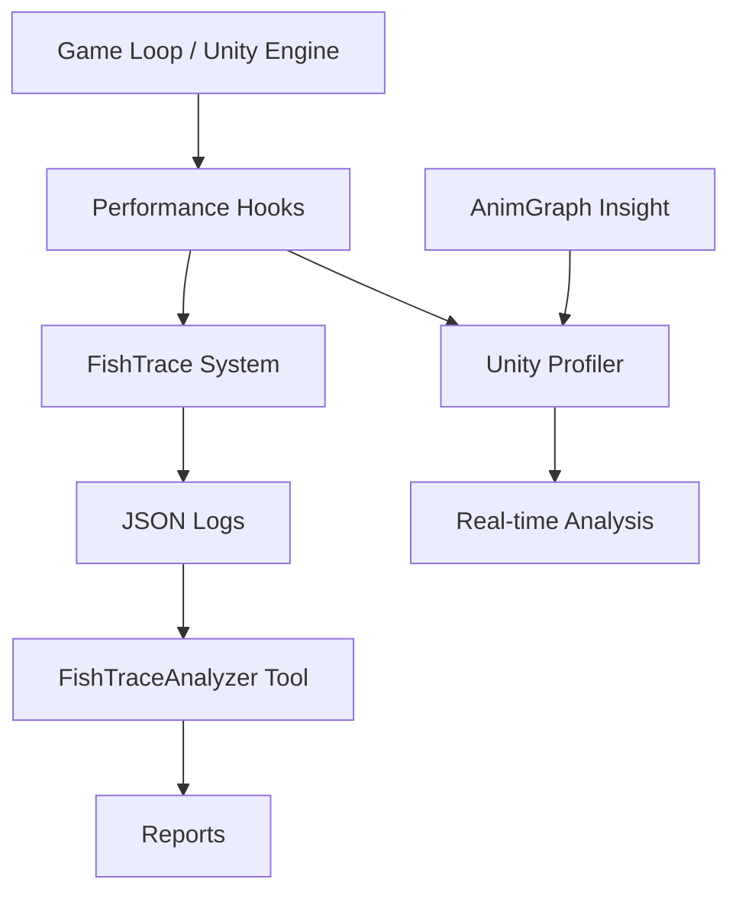

欢迎来到性能测试系统文档。在 Fishing Planet 项目中，性能监控不仅仅依赖于 Unity 原生的 Profiler，我们还内置了一套自定义的追踪系统 和可视化分析工具。本页面将指导你如何利用这些工具进行帧率分析、资源加载监控以及自定义游戏事件的性能回溯。

## 阅读导航与系统概览

性能测试是确保游戏体验流畅的关键环节。建议按照以下顺序阅读相关文档，以形成从底层单元测试到顶层性能监控的完整知识体系：

1.  [当前页面：性能测试](21-xing-neng-ce-shi) —— 监控与分析工具链路
2.  [单元测试](19-dan-yuan-ce-shi) —— 确保代码逻辑的低延迟执行
3.  [集成测试](20-ji-cheng-ce-shi) —— 在完整场景中验证性能指标

### 架构设计

我们的性能测试架构结合了 Unity 引擎的底层能力与项目级的自定义数据采集。数据流从游戏运行时的 `FishTrace` 接口收集，记录为 JSON 格式，最后通过离线工具进行分析。



### 项目结构可视化

性能测试相关的工具和日志主要分布在项目的根目录工具集和日志文件夹中：

```
Tools/
└── FishTraceAnalyzer/      # 自定义性能日志分析器
    ├── FishTraceAnalyzer.cs  # 分析核心逻辑
    └── bin/                   # 编译后的工具可执行文件
Logs/
└── FishTrace/               # 游戏运行时生成的性能追踪日志
    ├── fish_trace_20260312_211309.jsonl
    └── ...
Packages/
└── com.blackjack-inc.animgraph.Insight/ # 动画性能运行时调试包
    └── Runtime/
```

Sources: [Tools/FishTraceAnalyzer/FishTraceAnalyzer.cs](Tools/FishTraceAnalyzer/FishTraceAnalyzer.cs)

## 核心：FishTrace 自定义追踪系统

为了捕获 Unity 原生 profiler 难以定制的特定游戏逻辑（如抛竿动作的耗时、鱼群 AI 的计算负载），项目内置了 FishTrace 系统。该系统将关键性能节点序列化为 JSON 文件，存储在 `Logs/FishTrace/` 目录下。

### 数据采集与存储

游戏在运行时会根据配置生成带有时间戳的 JSONL（JSON Lines）日志文件。每一行代表一个特定的帧或事件，包含时间戳、帧序号以及自定义的性能标记。

*   **日志位置**: 所有追踪数据默认输出到 `Logs/FishTrace/` 目录。
*   **数据格式**: 采用 `.jsonl` 后缀，便于流式读取和离线处理。
*   **示例日志**: `fish_trace_20260312_223612.jsonl`。

Sources: [Logs/FishTrace/fish_trace_20260312_223612.jsonl](Logs/FishTrace/fish_trace_20260312_223612.jsonl)

## 工具：FishTraceAnalyzer 分析器

`FishTraceAnalyzer` 是一个独立的 C# 工具，用于解析 `FishTrace` 生成的 JSON 日志。它可以将原始的时间戳数据可视化为图表，帮助开发者识别特定的卡顿点或加载峰值。

### 使用方法

该工具位于 `Tools/FishTraceAnalyzer/` 目录下。通常在开发过程中，我们会先运行游戏进行一段时间的 Trace 记录，然后关闭游戏，运行此工具对生成的日志进行批量处理。

1.  **源码位置**: `Tools/FishTraceAnalyzer/FishTraceAnalyzer.cs`。
2.  **编译产物**: 工具编译后的二进制文件位于 `Tools/FishTraceAnalyzer/bin/`。
3.  **功能**: 支持帧时间分析、事件标记统计以及导出 CSV 报表。

Sources: [Tools/FishTraceAnalyzer/FishTraceAnalyzer.cs](Tools/FishTraceAnalyzer/FishTraceAnalyzer.cs#L1-L50)

## 模块：动画性能

本项目使用了高度定制的动画系统 `AnimGraph`。为了调试动画计算对 CPU/GPU 的压力，我们集成了 `AnimGraph.Insight` 包。这是一个专为 BlackJack 动画图开发的运行时调试器。

### 功能特性

`AnimGraph.Insight` 允许我们在 Unity Editor 运行时直接查看动画节点的计算成本。它不仅显示节点的执行顺序，还能标记出哪些节点的评估耗时过高，这对于优化复杂角色的动画状态机至关重要。

*   **包路径**: `Packages/com.blackjack-inc.animgraph.Insight/`
*   **主要组件**: 位于 `Runtime/` 命名空间下的调试逻辑。

Sources: [Packages/com.blackjack-inc.animgraph.Insight](Packages/com.blackjack-inc.animgraph.Insight)

## 编译与着色器性能

性能不仅发生在运行时，也体现在编译阶段。Unity 的构建系统缓存 和着色器缓存 直接影响开发迭代速度和游戏启动时的着色器变体编译时间。

### Build Pipeline (Bee)

Unity 使用 Bee 构建系统来管理增量编译。相关的构建图数据和缓存位于 `Library/Bee/`。

*   **输入数据**: `Library/Bee/1900b0aEDbg-inputdata.json`。
*   **构建图**: `Library/Bee/1900b0aEDbg.dag`。
*   **分析**: 如果构建时间异常，可以检查 DAG 文件以确定依赖关系断裂或无效缓存。

Sources: [Library/Bee/1900b0aEDbg-inputdata.json](Library/Bee/1900b0aEDbg-inputdata.json)

### Shader Compilation

着色器的编译日志是排查启动卡顿的另一个重要窗口。日志文件包含了每个着色器变体编译的耗时统计。

*   **日志路径**: `Library/shadercompiler-UnityShaderCompiler.exe0.log`。
*   **内容**: 记录了 HLSL 到 GLSL/Metal 的编译错误和耗时。

Sources: [Library/shadercompiler-UnityShaderCompiler.exe0.log](Library/shadercompiler-UnityShaderCompiler.exe0.log)

## 脚本性能

对于大量的计算密集型任务（如物理模拟、AI 寻路），我们使用了 Burst 编译器。Burst 会将 C# 代码 (Jobs) 编译为高度优化的本机代码。

### Burst Cache

Burst 编译器使用了 JIT (Just-In-Time) 和 AOT (Ahead-Of-Time) 两种缓存机制。

*   **JIT 缓存**: `Library/BurstCache/JIT/`。
*   **AOT 缓存**: `Library/BurstCache/` (例如 `burst-aot0471knje.059` 文件)。
*   **作用**: 首次运行 Job 时会较慢，后续启动通过缓存加载代码，极大提升运行时性能。

Sources: [Library/BurstCache/JIT](Library/BurstCache/JIT)

## 性能测试工具对比

为了在不同开发阶段选择合适的性能测试方法，下表对比了项目内可用的几种主要工具：

| 工具名称 | 适用阶段 | 数据来源 | 主要用途 |
| :--- | :--- | :--- | :--- |
| **Unity Profiler** | 开发实时调试 | 引擎底层 | CPU/GPU 内存分析，Draw Call 统计 |
| **AnimGraph.Insight** | 动画调试期 | 运行时数据 | 动画图节点执行耗时与状态检查 |
| **FishTrace** | Playtest/QA | 游戏内逻辑 | 特定游戏逻辑的帧率与事件回溯 |
| **FishTraceAnalyzer** | Playtest后 | JSON 日志文件 | 生成卡顿报告，分析长期运行趋势 |

Sources: [Tools/FishTraceAnalyzer/FishTraceAnalyzer.cs](Tools/FishTraceAnalyzer/FishTraceAnalyzer.cs)

## 最佳实践与工作流

在 Fishing Planet 的日常开发中，我们遵循以下性能测试工作流：

1.  **本地开发**: 使用 `AnimGraph.Insight` 实时监控复杂角色的动画消耗。
2.  **里程碑测试**: 在 Release 版本中开启 `FishTrace`，让 QA 团队进行 30 分钟以上的游戏会话，重点测试高负载场景（如多人联机钓鱼）。
3.  **数据复盘**: 将 `Logs/FishTrace/` 中的日志文件通过 `FishTraceAnalyzer` 处理，生成图表，识别是否存在内存泄漏或帧率突降。
4.  **构建优化**: 检查 `Library/Bee/` 和 `Library/ShaderCache/` 的命中率，确保 CI/CD 流水线中不要出现不必要的全量着色器编译。