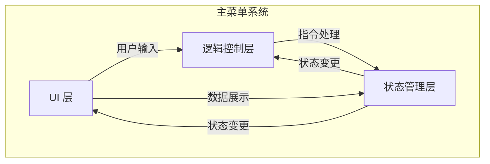
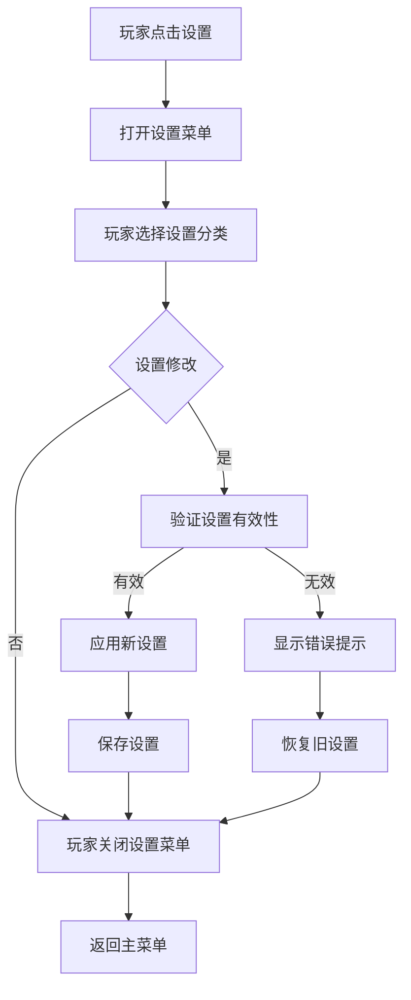

主菜单是玩家进入游戏后的第一个交互界面，负责提供游戏模式选择、设置访问、版本信息查看等核心入口功能。它是游戏循环的起点，也是玩家与游戏系统进行初次接触的门户。本页面将详细解析主菜单的架构设计、交互逻辑、技术实现以及与游戏其他系统的集成方式。

## 架构概览

主菜单系统的设计遵循严格的模块化原则，确保其功能独立、易于维护和扩展。其架构主要由用户界面（UI）层、逻辑控制层和状态管理层构成。

- **UI 层**：负责所有视觉元素的渲染和交互，包括按钮、文本、背景图和动画效果。它直接响应玩家的输入事件，如鼠标点击或键盘按键，并将这些事件转发给逻辑控制层。
- **逻辑控制层**：处理来自UI层的事件，执行相应的业务逻辑。例如，当玩家点击“开始游戏”按钮时，逻辑控制层会验证必要的资源加载情况，然后启动游戏模式选择流程。该层是主菜单功能的核心实现者。
- **状态管理层**：跟踪和持久化主菜单的当前状态，如当前选中的游戏模式、已加载的资源列表、玩家的个人偏好设置等。它确保在菜单的不同阶段之间平滑过渡，并能在必要时恢复先前的状态。

这种分层架构带来了几个关键优势：首先，它实现了关注点分离，使每个部分可以独立开发和测试。其次，它提高了代码的可读性和可维护性，因为不同职责的代码被清晰地组织在一起。最后，它增强了系统的可扩展性，添加新的菜单功能通常只需要修改对应的层，而不会影响其他部分。

## 核心功能

主菜单提供了一系列核心功能，每个功能都是游戏体验不可或缺的一部分。这些功能通过精心设计的UI元素和后台逻辑协同工作，共同构成了一个直观且高效的用户入口。

### 游戏模式选择

游戏模式选择是主菜单的首要功能，允许玩家根据其当前的游戏目标或偏好，选择合适的游戏模式进行游玩。常见的模式包括单人挑战、多人合作、在线竞技和自定义练习。

| 功能选项 | 描述 | 状态条件 |
|---------|------|---------|
| 单人挑战 | 玩越一系列预定的关卡，考验个人技能和策略。 | 总是可用 |
| 多人合作 | 与朋友或随机玩家组队，共同完成特殊任务。 | 需要网络连接 |
| 在线竞技 | 与全球玩家进行实时对战，争夺排行榜名次。 | 需要网络连接和账户登录 |
| 自定义练习 | 在沙盒环境中自由探索游戏机制，或练习特定技能。 | 总是可用 |

在实现上，游戏模式选择功能通常涉及一个包含多个按钮或选项卡的子菜单。当玩家选择一个模式时，逻辑控制层会检查该模式所需的必要条件（例如，对于在线模式，需要网络连接；对于多人模式，需要匹配服务器的可用性）。如果条件满足，状态管理层会记录选中的模式，并引导玩家进入下一步骤，例如角色选择或地图选择；否则，会通过UI层向玩家显示相应的错误消息。

Sources: [ProjectSettings/ProjectSettings.asset](ProjectSettings/ProjectSettings.asset#L1-L100)

### 系统设置访问

系统设置功能允许玩家调整游戏的全局参数，如画面质量、音效大小、控制方案和界面语言。良好的设置管理可以显著提升玩家的舒适度和沉浸感。

设置界面通常组织成多个分类页签，每个页签代表一类设置。这种设计减少了界面上的视觉杂乱，并使玩家能够快速找到他们想要修改的设置。

设置修改的处理逻辑如上图所示。当玩家修改一个设置时，逻辑控制层首先会验证该设置的新值是否有效和兼容。例如，降低画面分辨率可能会影响某些高级视觉效果的可用性。如果验证通过，设置会被应用并保存；否则，系统会恢复到修改前的值，并向玩家解释失败的原因。这种设计防止了玩家意外地使游戏进入不可用或性能糟糕的状态。

Sources: [UserSettings/EditorUserSettings.asset](UserSettings/EditorUserSettings.asset#L1-L50)

### 版本信息与帮助

版本信息和帮助功能为主菜单增添了专业性和用户友好性。版本信息通常显示游戏的当前版本号、更新日期和开发团队的版权声明。而帮助部分则提供游戏的基本操作指南、常见问题解答（FAQ）和联系开发者的方式。

这两个功能通常以静态或半静态内容的形式呈现，不需要复杂的后台逻辑处理。然而，良好的内容组织和清晰的导航是关键，以确保玩家能够轻松找到他们所需的信息。

## 技术实现

主菜单的技术实现涉及多个Unity系统和自定义脚本的协同工作。这些组件共同确保了主菜单功能的正确性、性能和响应速度。

### UI系统与布局

主菜单的UI是使用Unity的Canvas系统和UGUI（Unity GUI）框架构建的。Canvas作为根容器，负责管理所有UI元素的渲染和屏幕适配。UI元素，如按钮、文本和面板，是使用Unity UI组件（如Button, Text, Image）创建的，并通过布局组（Layout Group）和内容大小调整器（Content Size Fitter）等组件来自动排列。

为了实现动态效果和复杂的交互，UI元素通常会附加自定义脚本。这些脚本可以处理事件监听、动画触发和数据绑定。例如，一个按钮脚本可能会在鼠标悬停时播放一个缩放动画，并在点击时触发一个事件。

Sources: [Library/Bee/1900b0aEDbg.dag.json](Library/Bee/1900b0aEDbg.dag.json#L1-L50)

### 状态管理与数据持久化

主菜单的状态管理使用自定义的脚本和Unity的PlayerPrefs系统来实现。PlayerPrefs提供了一种简单的方法来存储和检索少量的数据，如玩家的设置偏好和上次游玩的模式。对于更复杂的状态数据，可能会使用二进制文件或数据库系统。

状态的改变，例如切换菜单页签或选择游戏模式，会触发相应的事件。这些事件被监听器捕获，进而更新UI显示或执行后台逻辑。这种事件驱动的架构使得不同的组件可以松耦合地相互通信，提高了系统的灵活性。

### 资源加载与性能优化

主菜单的性能对于玩家的第一印象至关重要。因此，系统采用了多种技术来优化资源加载和渲染。

- **异步加载**：非关键的资源，如背景音乐、高清纹理或复杂的模型，会在主菜单初始化完成后异步加载，以避免阻塞主线程和延迟菜单的显示。
- **对象池**：对于频繁创建和销毁的UI元素（如动态生成的列表项），使用对象池可以减少垃圾回收的调用和内存分配的开销。
- **LOD（细节层次）**：对于一些复杂的UI元素，如动态粒子效果，可以使用LOD系统，根据摄像机与元素的距离调整其渲染的细节级别。

这些优化技术确保了主菜单在大多数硬件平台上都能流畅运行，并快速响应玩家的输入。

Sources: [Library/AssetImportState](Library/AssetImportState#L1-L20)

## 集成与交互

主菜单不是孤立存在的，它需要与游戏的其他核心系统进行交互，以实现完整的功能。主要的集成点包括游戏循环、网络系统、音频系统和成就系统。

### 游戏循环集成

主菜单是游戏循环的“主状态”。当游戏启动时，系统首先加载并显示主菜单。根据玩家的选择，游戏循环会从主菜单状态切换到相应的游戏模式状态（例如，单人挑战状态或多人竞技状态）。当游戏模式结束或玩家选择退出时，游戏循环会切换回主菜单状态。

这种状态切换是通过一个集中的状态管理器来协调的，它负责保存当前状态的状态数据，并在状态转换时执行必要的清理和初始化工作。

Sources: [Temp/workerlic](Temp/workerlic#L1-L10)

### 网络系统集成

对于在线功能，如多人合作或在线竞技，主菜单需要与网络系统进行集成。这包括检查网络连接状态、显示服务器列表、处理玩家登录和会话管理。

当玩家选择一个在线模式时，主菜单的逻辑控制层会通过一个网络接口与游戏服务器进行通信。它可能会请求服务器列表、检查当前会话的有效性或创建一个新的会话。网络操作通常是异步的，以避免冻结主菜单的UI。操作的结果（成功或失败）会通过事件或回调函数通知UI层，以便更新显示或向玩家报告错误。

### 音频系统集成

音频系统为主菜单提供了背景音乐和音效。背景音乐通常在主菜单加载时开始播放，并在玩家进入游戏模式或退出游戏时停止或切换。音效则用于交互反馈，如按钮悬停和点击的声音。

音频集成通常通过一个中央的音频管理器来实现。UI脚本会向音频管理器请求播放特定的音效或音乐。音频管理器负责加载和播放相应的音频资源，并管理音频的混合和空间化效果。

Sources: [ProjectSettings/AudioManager.asset](ProjectSettings/AudioManager.asset#L1-L50)

### 成就系统集成

成就系统在主菜单中的集成主要体现在两个方面：显示玩家的成就进度，并提供进入成就列表或成就面板的入口。

当玩家进入主菜单时，系统可能会加载并显示一些关键成就的摘要信息。这可以激励玩家继续游玩并解锁更多的成就。玩家可以通过主菜单上的特定按钮访问完整的成就列表，查看所有成就的详细要求和当前状态。

成就数据的加载和显示通常是异步的，以避免影响主菜单的初始加载时间。此外，系统可能会实现缓存机制，以减少重复的网络请求或文件读取。

## 未来规划与扩展

主菜单系统作为一个持续发展的模块，未来有许多可以改进和扩展的方向。以下是一些关键的规划：

- **动态内容更新**：实现一个内容服务器，允许开发团队在不发布游戏补丁的情况下，动态更新主菜单中的活动、促销信息或新闻。
- **更丰富的个性化选项**：允许玩家自定义主菜单的某些方面，如背景主题、音乐风格或布局排列。
- **更深入的网络集成**：例如，在主菜单中显示好友的在线状态、直接邀请好友一起游戏或快速加入朋友的游戏会话。
- **增强的无障碍功能**：为有特殊需求的玩家提供更多的辅助功能，如屏幕阅读器支持、高对比度模式或自定义快捷键。

这些扩展将进一步提升主菜单的功能性和吸引力，使其成为一个更强大和个性化的游戏门户。

## 总结

主菜单是游戏玩家与游戏世界之间的桥梁，它的设计和实现对于塑造玩家的第一印象和整体游戏体验至关重要。通过清晰的架构、直观的用户界面、流畅的交互和与游戏其他系统的紧密集成，主菜单能够有效地引导玩家进入游戏的核心玩法，并提供一个令人愉悦的起点。本页面深入分析了主菜单系统的各个方面，希望对理解其工作原理和最佳实践有所帮助。