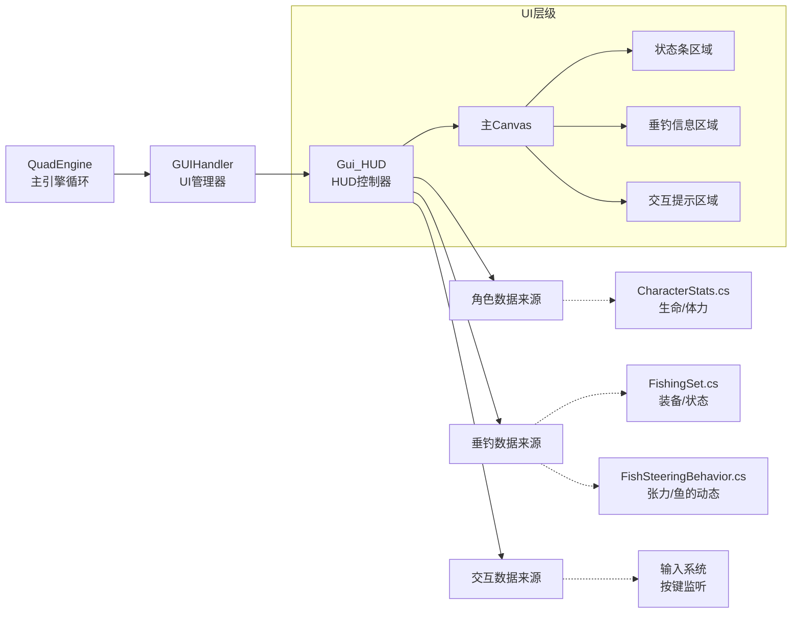

HUD（Heads-Up Display）界面是玩家在游戏过程中最直接的视觉反馈系统，负责实时显示玩家状态（如生命值、体力）、当前垂钓任务进度（如鱼线张力、鱼的状态）以及交互提示。本页面将详细解析HUD系统的架构、数据流转及其与游戏核心系统的交互方式。

## HUD 架构概览

HUD系统基于Unity的UI Canvas实现，通过专门的`Gui_HUD`类进行统一管理。该类作为游戏循环的观察者，每一帧从核心游戏逻辑（如角色属性、垂钓逻辑）中提取数据，并更新UI元素的显示。



该架构设计确保了UI逻辑与游戏玩法的解耦，`Gui_HUD`仅负责数据的展示（View层），而实际的数据变化发生在对应的Logic类中。

## 核心功能模块

HUD界面主要由三个核心模块组成：玩家状态显示、垂钓机制显示以及交互提示。

### 1. 玩家状态显示

该模块负责展示角色的基本生存指标，包括生命值和体力。数据来源于角色属性统计系统。

| UI 元素 | 数据源 | 描述 |
| :--- | :--- | :--- |
| 生命值条 | `CharacterStats` | 显示当前HP与最大HP的比率 |
| 体力值条 | `CharacterStats` | 显示当前Stamina与最大Stamina的比率，影响奔跑和钓鱼消耗 |
| 经验/等级 (可选) | `CharacterStats` | 显示当前等级及经验进度 |

在`CharacterStats`中，属性值发生变化时会触发事件，`Gui_HUD`监听这些事件以更新UI，避免每一帧进行无意义的查询。
*Sources: [CharacterStats.cs](Assets/Scripts/RPG/Stats/CharacterStats.cs)*

### 2. 垂钓机制显示

这是本游戏HUD的核心特色部分。由于游戏模拟了真实的垂钓手感（通过`FishSteeringBehavior`），HUD需要实时反馈鱼线的物理状态。

*   **张力指示器**: 显示当前鱼线的张力。如果张力过大，UI可能会变色或发出警告。
*   **鱼的挣扎状态**: 当玩家正在溜鱼时，HUD可能会显示当前鱼的疲劳度或游动方向。
*   **装备信息**: 当前使用的鱼饵、鱼线等信息。

这些数据主要通过`FishingSet`（当前玩家的装备配置）和`FishSteeringBehavior`（实时的物理计算结果）获取。
*Sources: [FishingSet.cs](Assets/Scripts/World/Fishing/FishingSet.cs), [FishSteeringBehavior.cs](Assets/Scripts/Player/FishSteeringBehavior.cs)*

### 3. 交互提示

当玩家靠近可交互对象（如商店、NPC、可拿取物品）时，屏幕底部会出现提示，例如“按 [E] 购买商品”。

这通常通过射线检测或触发器碰撞实现。一旦检测到可交互对象，`Gui_HUD`会实例化一个提示预制件或启用已存在的提示文本组件。
*Sources: [GUIHandler.cs](Assets/Scripts/UI/GUIHandler.cs)*

## 视觉资源与渲染

HUD的视觉表现依赖于UI纹理资源和Canvas的渲染设置。

*   **纹理资源**: 主要UI图标和界面元素存储在`gui_additional.png`中。这通常包含了血条背景、张力图标、技能冷却遮罩等。
*   **渲染层级**: HUD Canvas通常设置为 "Screen Space - Overlay" 以确保其始终覆盖在3D场景之上，且不受场景相机的影响（例如不受迷雾遮挡）。

HUD的更新通常在`LateUpdate`或`Update`中执行，以确保帧率的同步性。
*Sources: [gui_additional.png](Assets/StreamingAssets/Textures/gui_additional.png), [QuadEngine.cs](Assets/Scripts/QuadEngine.cs)*

## 代码逻辑示例

`Gui_HUD.cs` 通常负责维护UI元素的引用，并在`Update`循环中调用逻辑层的方法来刷新文本和进度条。

```csharp
// 伪代码示例：Gui_HUD.cs 的更新逻辑
void Update() {
    // 更新生命值条
    float hpPercent = CharacterStats.Instance.CurrentHP / CharacterStats.Instance.MaxHP;
    hpBarImage.fillAmount = hpPercent;

    // 更新垂钓相关信息
    if (FishingSet.Instance.IsActiveFishing) {
        float tension = FishSteeringBehavior.Instance.CurrentLineTension;
        tensionBarImage.fillAmount = tension; // 假设 0.0 - 1.0 为张力范围
        
        // 张力过高视觉反馈
        if (tension > 0.9f) {
            tensionWarningImage.enabled = true;
        } else {
            tensionWarningImage.enabled = false;
        }
    }
}
```
*Sources: [Gui_HUD.cs](Assets/Scripts/UI/Gui_HUD.cs)*

## 下一步

HUD界面展示了实时的游戏状态，而游戏的深度配置和个性化选项则由设置界面处理。

下一节：[设置界面](24-she-zhi-jie-mian)