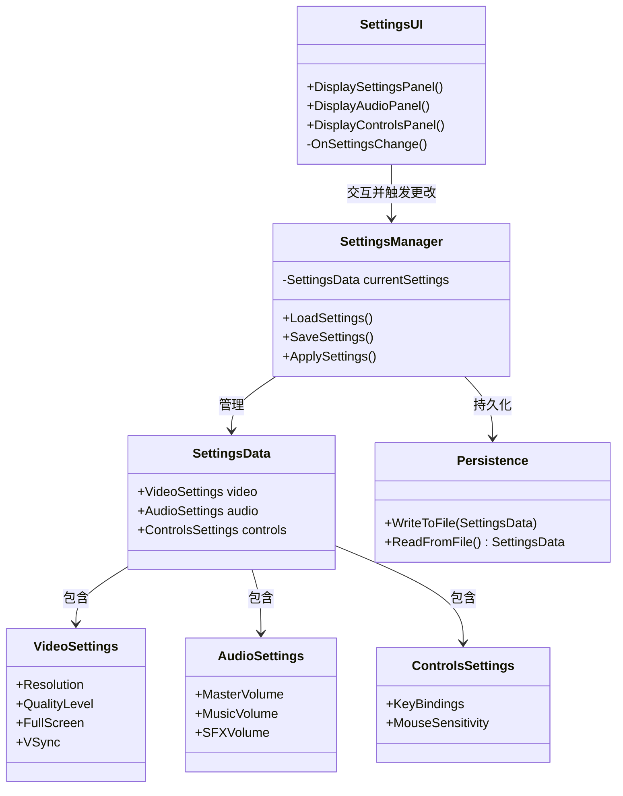
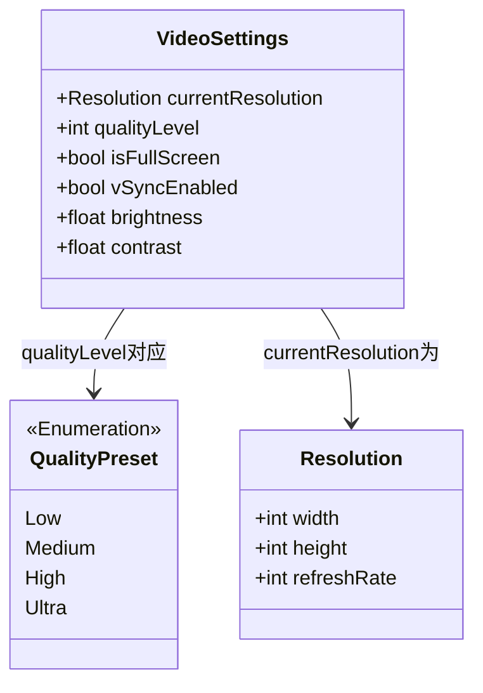
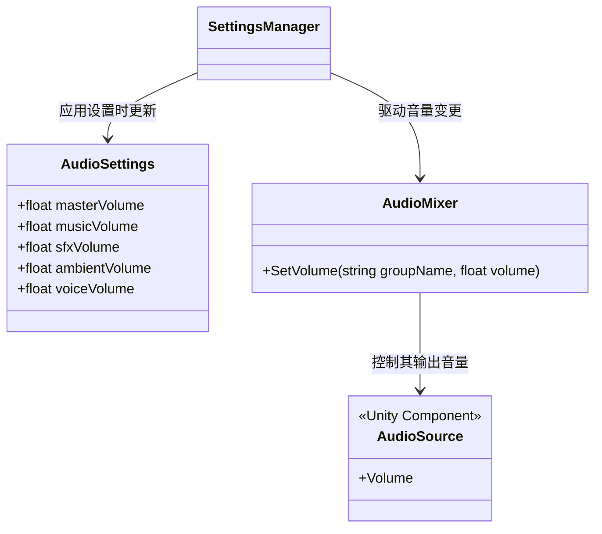
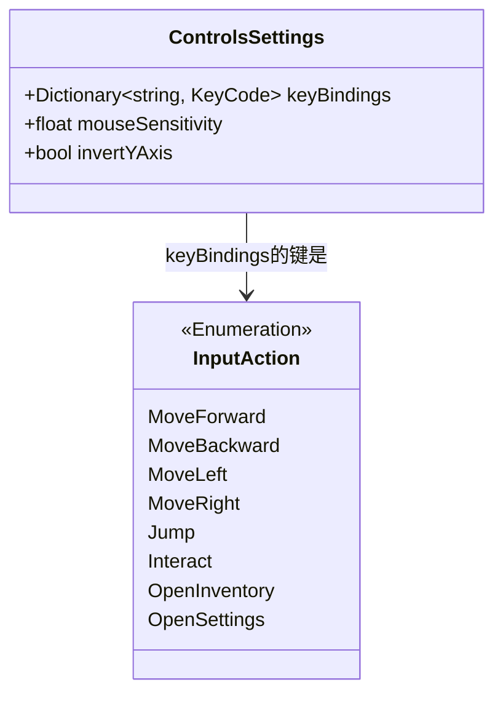
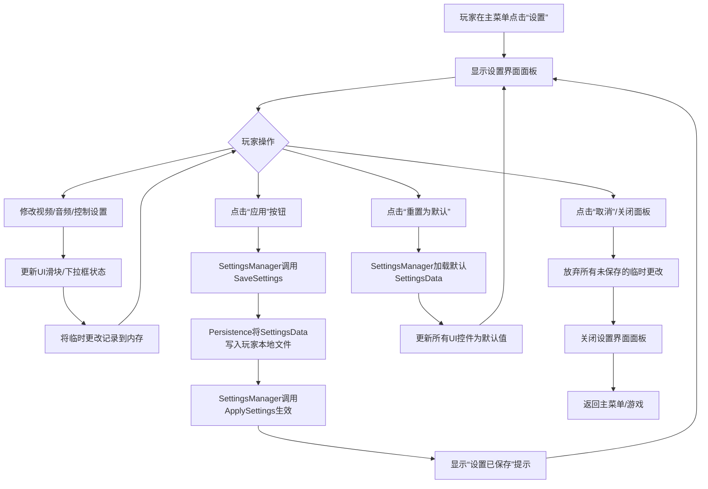
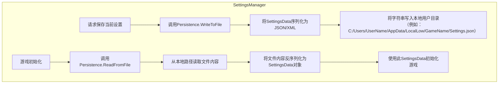

设置界面模块是游戏用户界面的核心组件之一，负责管理玩家的游戏内偏好配置。它提供了视频、音频、控制及游戏性等多维度设置的访问与调整能力，确保每个玩家都能根据自身硬件条件和个人习惯获得最佳体验。该模块将设置数据持久化存储，并在游戏启动或需要时应用这些设置。

## 设置界面架构概述

设置界面采用分层架构设计，将界面表现、数据模型和持久化逻辑清晰分离。以下是其核心组件关系示意图：



该架构中，`SettingsManager` 作为中央协调器，负责加载、保存和应用设置。`SettingsUI` 负责界面渲染，并将用户操作委托给 `SettingsManager`。`SettingsData` 是所有设置数据的容器，而 `Persistence` 负责与文件系统的读写交互。这种设计确保了逻辑的解耦，便于维护和扩展。

## 核心设置分类详解

设置界面通常按类别组织，以下是其核心分类及典型设置项的对比表：

| 设置分类 | 典型设置项 | 数据类型 | 默认值说明 | 影响范围 |
| :--- | :--- | :--- | :--- | :--- |
| **视频** | 分辨率 | `Resolution` | 系统原生或最高支持 | 渲染目标缓冲区大小 |
| | 画面质量 | `QualityLevel` | `int` (预设等级) | 根据硬件自动检测 | 阴影、纹理、特效细节 |
| | 垂直同步 | `bool` | `true` | 帧率同步显示器 | 渲染帧率稳定性 |
| **音频** | 主音量 | `float` (0-1) | `1.0` | 所有音频的增益 |
| | 背景音乐音量 | `float` (0-1) | `0.7` | 游戏背景音乐的增益 |
| | 效果音音量 | `float` (0-1) | `0.8` | UI交互、环境音效的增益 |
| **控制** | 键位绑定 | `Dictionary<InputAction, KeyCode>` | 官方预设 | 玩家操作的输入映射 |
| | 鼠标灵敏度 | `float` | `2.5` | 视角旋转速度 |

### 视频设置

视频设置直接影响游戏的渲染性能和视觉质量。其核心数据模型 `VideoSettings` 通常如下所示：



`QualityLevel` 通常对应于 Unity 的质量预设系统（Quality Settings）。更改此值会触发一系列渲染参数（如阴影距离、纹理分辨率、抗锯齿级别）的批量更新。

### 音频设置

音频设置控制游戏声音的输出。`AudioSettings` 数据模型负责存储各类音源的音量。其简化结构如下：



在实际实现中，音量值通常不会直接赋给单个 `AudioSource` 组件，而是传递给 `AudioMixer`，通过 Mixer 的 `Expose Parameters` 功能来混合控制成百上千个音源的总体输出，这种方式更高效且易于管理。

### 控制设置

控制设置定义了玩家如何与游戏世界交互。它核心是键位绑定，`ControlsSettings` 模型可能如下：



键位绑定系统需要处理冲突检测。当玩家尝试将一个按键重新绑定为一个新的动作时，系统需要检查该按键是否已被其他动作占用，并提示玩家或自动替换旧绑定。

## 设置界面交互流程

从玩家打开设置界面到最终应用更改并退出，整个交互过程可以概括为以下步骤流程图：



此流程强调了“内存中临时更改”与“持久化文件”的区别。大多数游戏设置（如音量、分辨率）可以立即在内存中预览，但只有显式调用“保存”时，才会写入磁盘。而“取消”操作则会丢弃所有未保存的临时更改。

## 设置持久化机制

`Persistence` 组件负责将 `SettingsData` 序列化并写入到玩家设备上的指定路径。其核心职责可由以下代码片段示意：



选择 JSON 作为序列化格式是因为它易于阅读和调试，并且跨平台兼容性好。保存路径通常使用 `Application.persistentDataPath`，这是一个 Unity 提供的跨平台目录，专门用于存放需要持久化的玩家数据。

## 设置界面实现基础

以下是一个概念性的 Unity C# 脚本框架，展示了 `SettingsUI` 如何通过 `SettingsManager` 来驱动设置面板。

```mermaid
classDiagram
    class SettingsUI : MonoBehaviour {
        -SettingsManager settingsManager
        -Slider masterVolumeSlider
        -Dropdown resolutionDropdown
        -Toggle fullScreenToggle
        -Button applyButton
        -Button resetButton
        -Button cancelButton
        +Awake()
        +OnEnable()
        +OnDisable()
        +ApplySettings()
        +ResetSettings()
        +OnSettingsChanged()
    }
    
    class SettingsManager : ScriptableObject {
        -SettingsData currentSettings
        +LoadSettings()
        +SaveSettings()
        +ApplySettings()
        +GetSettingsData()
    }

    class SettingsData : ScriptableObject {
        -VideoSettings video
        -AudioSettings audio
        -ControlsSettings controls
    }

    SettingsUI --> SettingsManager : 持有引用
    SettingsManager --> SettingsData : 持有引用
```

在 `OnEnable` 方法中，UI 控件（如 `Slider`, `Dropdown`）会从 `SettingsManager` 处获取当前的 `SettingsData` 并初始化自身。当玩家交互（如拖动滑块）触发事件时，`OnSettingsChanged` 方法被调用，此时应更新内存中的临时数据，但可以立即让玩家看到效果（如音量变化）。只有当玩家点击 `applyButton` 时，`SettingsManager.SaveSettings()` 才会被调用，将数据持久化。

## 下一步建议

在理解并实现设置界面后，您可能希望继续探索游戏用户界面的其他核心部分。根据项目导航上下文，建议下一步查看：

- **主菜单**：[主菜单](22-zhu-cai-dan) - 设置界面通常从主菜单入口进入，了解其整体流程和与其他模块的交互。
- **HUD界面**：[HUD界面](23-hudjie-mian) - HUD中的某些元素（如快捷栏）也可能有快捷设置入口，了解二者如何关联。
- **输入处理**：[输入处理](3-shu-ru-chu-li) - 设置中的控制选项，尤其是键位绑定，与底层输入处理系统紧密相关。