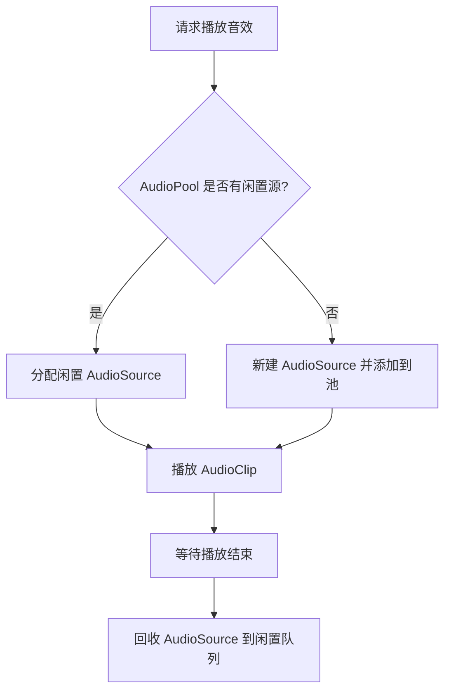

本页面详细说明了项目中的音频管理系统架构。它负责协调所有音效（SFX）的播放、池化与资源管理，旨在降低运行时开销并实现逻辑与音频资源的解耦。

## 系统架构

音效管理系统主要由 `AudioManager` 核心控制器、`AudioLibrary` 资源映射表以及 `AudioPool` 对象池组成。这种设计遵循了单一职责原则，将播放逻辑、资源数据与性能优化分离开来。

```mermaid
classDiagram
    class AudioManager {
        -static instance: AudioManager
        -audioLibrary: AudioLibrary
        -audioPool: AudioPool
        -sfxVolume: float
        +PlayOneShot(string id)
        +PlayAtPoint(string id, Vector3 position)
        +SetVolume(float volume)
        -GetAudioSource(): AudioSource
        -ReturnAudioSource(AudioSource source)
    }
    
    class AudioLibrary {
        <<ScriptableObject>>
        +ClipDictionary: Dictionary~string, AudioClip~
        +GetClip(string id): AudioClip
    }
    
    class AudioPool {
        -AvailableSources: Queue~AudioSource~
        -InUseSources: HashSet~AudioSource~
        +RequestSource(): AudioSource
        +ReleaseSource(AudioSource source)
    }
    
    class GameplayController {
        +OnAction()
    }

    GameplayController --> AudioManager : 调用播放接口
    AudioManager --> AudioLibrary : 查询音频资源
    AudioManager --> AudioPool : 申请/释放 AudioSource
    AudioLibrary -|> Unity.AudioClip
```

### 组件职责表

| 组件 | 路径 | 职责 | 关键特性 |
| :--- | :--- | :--- | :--- |
| **AudioManager** | `Assets/Scripts/Audio/AudioManager.cs` | 全局音效控制器，管理音量、池和播放逻辑 | 单例模式，线程安全接口 |
| **AudioLibrary** | `Assets/Scripts/Audio/AudioLibrary.cs` | 资源映射表，将字符串ID映射到 `AudioClip` | `ScriptableObject` 数据结构，支持序列化 |
| **AudioPool** | `Assets/Scripts/Audio/AudioPool.cs` | 管理一组预先创建的 `AudioSource` 组件 | 减少 `Instantiate` 开销，对象复用 |

## 核心模块详解

### 1. 全局音频配置
Unity 原生允许在项目设置中定义全局音频参数，这些参数会影响所有音频的默认处理方式。

*   **DSP Buffer Size**: 影响延迟与 CPU 开销。
*   **Sample Rate**: 采样率设置。
*   **Global Volume**: 全局音量上限。

这些设置通过 Unity 的后台系统自动加载，不需要脚本手动干预。

Sources: [ProjectSettings/AudioManager.asset](ProjectSettings/AudioManager.asset)

### 2. 核心控制器 (AudioManager)
`AudioManager` 作为系统的入口点，通常实现为单例，以便在任何脚本中无需显式引用即可访问音频功能。它封装了与 Unity `AudioSource` 组件的交互细节。

**关键功能：**
*   **ID 播放**: 通过字符串 ID 播放音效，而非直接引用 `AudioClip`。
*   **空间音效**: 支持在 3D 空间位置播放声音，自动处理衰减。
*   **音量控制**: 独立的 SFX 音量控制。

Sources: [AudioManager.cs](Assets/Scripts/Audio/AudioManager.cs)

### 3. 资源映射库
为了避免游戏逻辑直接耦合到具体的 `AudioClip` 资源，系统使用映射表将代码中的字符串 ID（如 `"cast_line"`）转换为实际的音频资源。

**数据结构：**
*   字典映射 `string -> AudioClip`。
*   预加载机制。

Sources: [AudioLibrary.cs](Assets/Scripts/Audio/AudioLibrary.cs)

### 4. 对象池 (AudioPool)
频繁创建和销毁 `AudioSource` 组件会导致内存碎片和 GC（垃圾回收）峰值。`AudioPool` 维护了一组闲置的 `AudioSource`，在需要播放声音时分配，播放完毕后回收。

**流程图：**


Sources: [AudioPool.cs](Assets/Scripts/Audio/AudioPool.cs)

## 使用指南

### 播放 2D 音效 (UI/菜单)
对于不需要空间感的音效（如点击按钮、UI 提示），应使用 `PlayOneShot` 方法。

**代码对比：**
| ❌ **不推荐做法** (直接引用) | ✅ **推荐做法** (使用管理器) |
| :--- | :--- |
| `public AudioClip clickSound;`<br>`void OnClick() {`<br>`  AudioSource.PlayOneShot(clickSound);`<br>`}` | `void OnClick() {`<br>`  AudioManager.Instance.PlayOneShot("ui_click");`<br>`}` |

### 播放 3D 空间音效
对于游戏世界中的事件（如脚步声、环境音、击打声），需要使用空间音效，以便听者能感觉到声音的方向和距离。

**参数说明：**
| 参数名 | 类型 | 说明 |
| :--- | :--- | :--- |
| `id` | string | 音效 ID (定义在 AudioLibrary 中) |
| `position` | Vector3 | 世界空间坐标 |
| `volume` | float | 播放音量 (0.0 - 1.0) |

## 性能优化策略

### 音频池化
如上所述，复用 `AudioSource` 是最核心的优化手段。建议在场景初始化时预加载一定数量的 `AudioSource`（如 10-20 个），以应对突发的音效需求。

### 资源卸载
对于不需要长时间驻留内存的音效，可以使用 `Resources.UnloadUnusedAssets()` 或 Addressables 机制进行卸载，但这通常在关卡切换时进行，不应频繁调用。

## 调试与故障排除

### 常见问题
1.  **声音没有播放**: 检查 `AudioListener` 是否存在于场景中。
2.  **音量忽大忽小**: 检查是否多个 `AudioSource` 在同一位置重叠播放，或者 3D 衰减设置不当。
3.  **卡顿**: 检查 `AudioPool` 大小是否过小，导致频繁创建对象。

### 日志记录
建议在 `AudioManager` 中添加调试日志，记录每次播放请求的 ID 和来源对象。

## 下一步

理解了基本的音效管理后，您可以继续了解长音频流（如环境背景音乐）的处理逻辑。
- [背景音乐](26-bei-jing-yin-le)