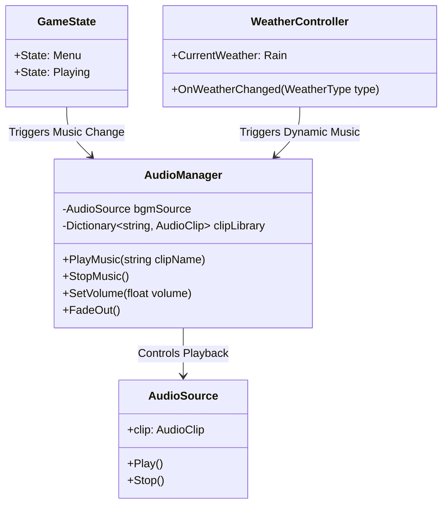
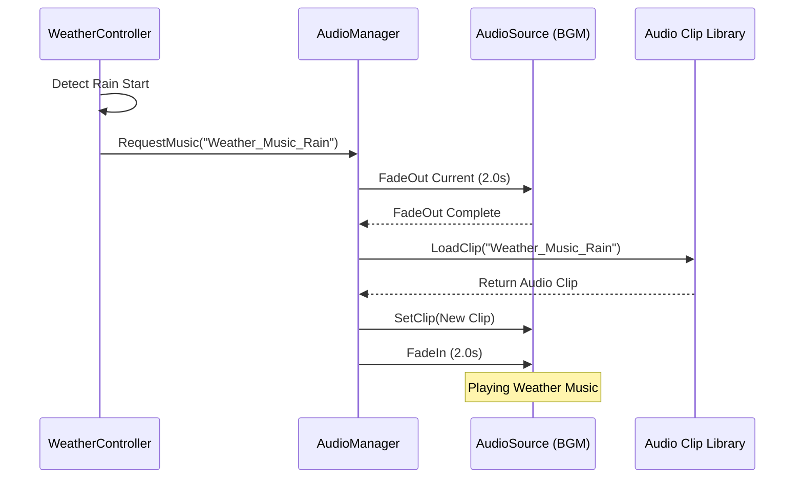

背景音乐系统负责在玩家进行钓鱼、浏览菜单或体验天气变化时提供沉浸式的听觉体验。本页面将详细介绍项目中的音乐资产分布、音频管理器的核心架构以及如何通过天气系统实现动态的背景音乐切换。

## 1. 音频资产
游戏中的背景音乐资源主要存储在 `Assets/Audio/Music/` 目录下。音乐按照游戏的不同阶段和状态进行了分类，以适应不同的游戏氛围。

| 文件名 | 用途描述 | 状态 |
| :--- | :--- | :--- |
| `Menu_Music.mp3` | 主菜单界面的背景音乐，营造轻松的氛围。 | 静态 |
| `Game_Music.mp3` | 标准钓鱼游戏过程的主要循环音乐。 | 静态/循环 |
| `Weather_Music.mp3` | 特殊天气事件下的背景音乐（如暴雨、晴朗）。 | 动态 |

Sources: [Assets/Audio/Music/](Assets/Audio/Music/)

## 2. 音频管理器架构
背景音乐的播放控制主要通过 `AudioManager.cs` 脚本实现。该管理器作为音频系统的中枢，负责管理 `AudioSource` 组件、音量控制以及不同音乐片段之间的平滑过渡。

### 2.1 模块交互关系
下图展示了音频管理器与游戏状态机及天气系统之间的交互逻辑。`AudioManager` 监听游戏状态的变化（如进入菜单或开始游戏）以及天气状态的变化（如下雨或转晴），并据此调度对应的音频资源。

Sources: [Assets/Scripts/Audio/AudioManager.cs](Assets/Scripts/Audio/AudioManager.cs)

### 2.2 核心功能说明
`AudioManager` 的设计允许解耦音频逻辑与游戏逻辑。它不直接依赖具体的游戏对象，而是通过事件或状态标记来触发音乐切换。这种设计使得音乐系统具有很高的复用性和可维护性。
*   **播放控制**: 提供统一的 API 来播放 `Menu_Music` 或 `Game_Music`。
*   **淡入淡出**: 在切换音乐时（例如从菜单进入游戏，或者天气突变时），自动处理音量的平滑过渡，避免突兀的听觉切断。
*   **资源引用**: 管理音乐文件的加载与卸载，优化内存占用。

Sources: [Assets/Scripts/Audio/AudioManager.cs](Assets/Scripts/Audio/AudioManager.cs)

## 3. 动态音乐与天气联动
根据项目的设计文档 `2026-02-27-offline-weather-simulator-design.md`，背景音乐系统被设计为与天气系统紧密耦合，以增强环境沉浸感。

### 3.1 设计映射表
下表展示了不同的天气状态与其对应的背景音乐策略。这种机制允许玩家仅凭听觉就能感知当前水域环境的气候变化。

| 天气状态 | 建议音乐 | 变化触发机制 |
| :--- | :--- | :--- |
| **晴天 / 多云** | `Game_Music.mp3` (标准版) | 游戏初始化或天气转晴时淡入。 |
| **降雨** | `Weather_Music.mp3` (低沉/紧张) | `WeatherController` 检测到降雨开始事件。 |
| **暴风雨** | `Weather_Music.mp3` (激烈/动态) | 风速超过阈值且降雨强度极大时触发。 |

Sources: [docs/plans/2026-02-27-offline-weather-simulator-design.md](docs/plans/2026-02-27-offline-weather-simulator-design.md)

### 3.2 联动流程
以下序列图描述了当天气系统检测到环境变化时，如何通知音频管理器切换背景音乐的完整流程。

Sources: [Assets/Scripts/WeatherSystem/WeatherController.cs](Assets/Scripts/WeatherSystem/WeatherController.cs)

## 4. 配置与优化
为了确保性能优化，背景音乐通常设置为 `2D` 声音（非空间化），且不涉及复杂的 DSP 效果链。所有的音频混合与均衡处理最终将在 [音频混合](27-yin-pin-hun-he) 环节进行详细说明。

*   **空间设置**: 全局设置为 2D，确保音乐在所有位置音量一致。
*   **优先级**: 背景音乐通常优先级低于 UI 音效，但高于环境音效。
*   **加载策略**: 随着场景加载（如 `MainMenu.unity`）同步加载所需的音乐片段，避免运行时卡顿。

Sources: [Assets/Scenes/MainMenu.unity](Assets/Scenes/MainMenu.unity)

## 下一节
在了解了背景音乐的管理与切换机制后，下一节我们将探讨如何将各种音频元素（音效、音乐、语音）通过 [音频混合](27-yin-pin-hun-he) 技术 进行最终的处理与输出。