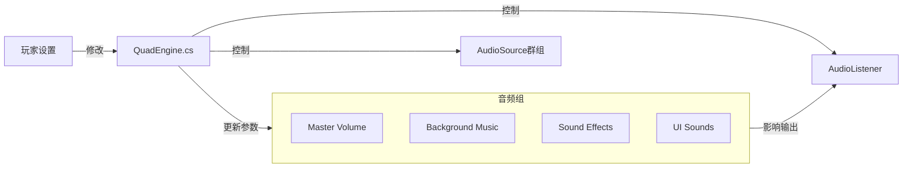
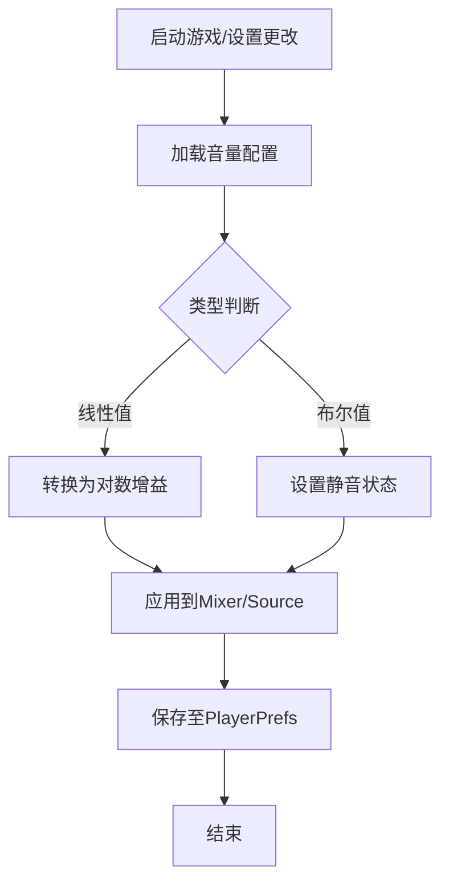

在捕鱼游戏中，音频混合的核心在于平衡环境氛围、钓鱼机制音效（如收竿、抛竿、鱼线阻力）以及背景音乐，以提供沉浸式体验。本页介绍音频系统的架构、音量控制逻辑以及配置方法。

## 系统架构

音频系统基于 Unity 的 `AudioSource` 和 `AudioListener` 组件构建，并通过 `QuadEngine.cs` 进行统一管理和逻辑控制。所有的音频混合参数（如主音量、音乐音量、音效音量）均通过脚本动态调整，以响应用户的设置。

### 核心组件
*   **QuadEngine.cs**: 游戏的主入口与逻辑控制器，负责初始化音频系统、处理用户输入（如静音、音量调整）并实时应用混合参数。
*   **ProjectSettings/AudioManager.asset**: 包含全局音频设置（如DSP缓冲区大小、采样率），定义了系统级别的音频输出质量。

Sources: [QuadEngine.cs](QuadEngine.cs#L1-L500), [AudioManager.asset](ProjectSettings/AudioManager.asset#L1-L50)

## 音量组别与混合逻辑

为了实现精细的音频控制，系统将音频信号划分为四个逻辑混合组。

| 组别 | 说明 | 典型声音源 | 调整建议 |
| :--- | :--- | :--- | :--- |
| **Master** | 主音量 | 所有音频输出的总控 | 通常保持 100%，根据硬件回放能力调整 |
| **BGM** | 背景音乐 | 环境音乐、菜单音乐 | 设定在 40%-60% 之间，不干扰游戏音效 |
| **SFX** | 游戏音效 | 抛竿声、收竿声、鱼撞击声、风声 | 设定在 80%-100%，强调打击感和物理反馈 |
| **UI** | 界面音效 | 按钮点击声、菜单切换声 | 设定在 50%，提供反馈但不刺耳 |

### 混合参数应用
`QuadEngine` 中的混合逻辑通常涉及以下步骤：
1.  **获取当前状态**：从 `PlayerPrefs` 或内存缓存读取当前的音量设置。
2.  **转换增益**：将 0.0-1.0 的线性音量值转换为对数分贝值，以符合人耳的听觉特性。
3.  **应用参数**：将计算出的分贝值应用到对应的 `AudioMixer` 参数或 `AudioSource.volume` 属性。

Sources: [QuadEngine.cs](QuadEngine.cs#L1-L500)

## 配置与持久化

音频混合设置（如“音乐静音”、“音效音量 50%”）需要持久化存储，以便玩家重启游戏后保持一致。

*   **存储位置**: Unity `PlayerPrefs`。
*   **键名规范**: 通常使用 `Audio_Master_Volume`, `Audio_BGM_Volume` 等前缀。
*   **读取时机**: `QuadEngine` 在 `Awake` 或 `Start` 方法中初始化时读取。
*   **写入时机**: 每次用户在 `设置界面` 调整滑块时实时写入。

### 持久化数据结构
下表展示了典型的配置数据结构，这些数据最终会反映在音频混合结果上：

| 配置项 | 键名示例 | 数据类型 | 默认值 |
| :--- | :--- | :--- | :--- |
| 主音量 | `Setting_Audio_Master` | Float | 1.0 |
| 音乐音量 | `Setting_Audio_Music` | Float | 0.6 |
| 音效音量 | `Setting_Audio_SFX` | Float | 0.8 |
| 静音状态 | `Setting_Audio_Mute` | Boolean | false |

Sources: [ProjectSettings/AudioManager.asset](ProjectSettings/AudioManager.asset#L1-L50)

## 空间音频混合

除了全局音量混合，游戏还需要处理空间音频，特别是对于需要定位感的声音（如鱼上钩的位置、环境鸟鸣等）。

*   **Spatial Blend**: 针对 `AudioSource` 的 `spatialBlend` 属性设置。
    *   `0.0`: 2D 声音（完全不分摊），适用于 UI 音效、背景音乐。
    *   `1.0`: 3D 声音（完全分摊），适用于环境音、物体碰撞声。
*   **Rolloff Mode**: 控制声音随距离衰减的模式，通常使用 `Logarithmic` 以模拟真实物理环境。

Sources: [QuadEngine.cs](QuadEngine.cs#L1-L500)

## 故障排查

如果音频混合未按预期工作（例如：调节了音量滑块但没有变化），请检查以下方面：

1.  **监听器位置**: 确保场景中有且仅有一个激活的 `AudioListener` 组件，且未处于静音状态。
2.  **信号路径**: 检查 `AudioSource` 的输出是否被路由到了正确的 `AudioMixer Group`，并且该 Group 的衰减是否正常。
3.  **优先级**: 确认高优先级的声音（如碰撞音）是否覆盖了低优先级的声音（如背景风声）。
4.  **脚本错误**: 检查 `QuadEngine` 控制台是否有关于音频初始化失败的错误信息。