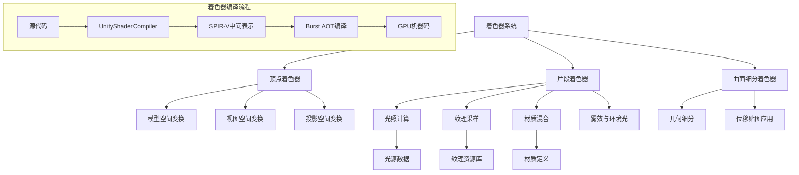
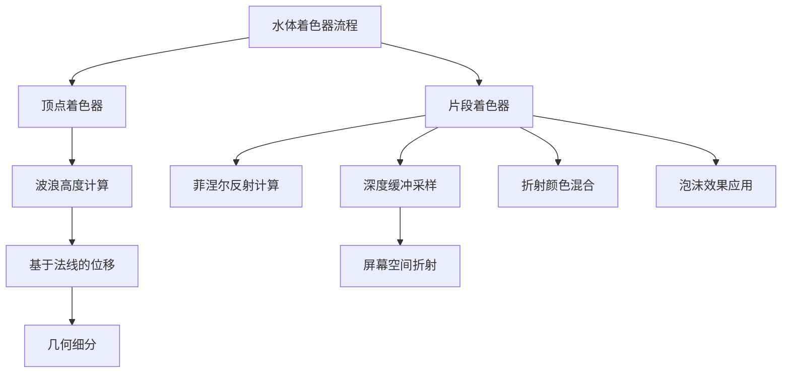
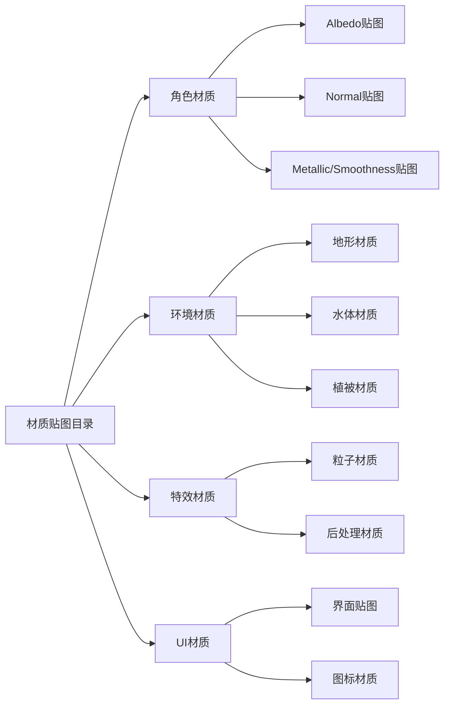
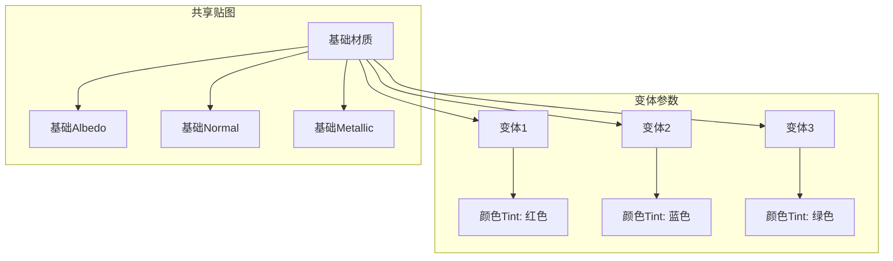
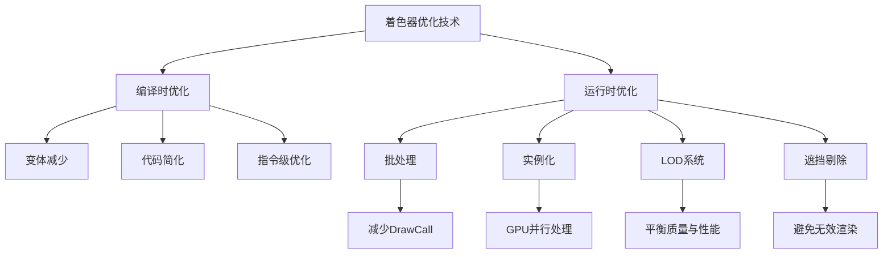
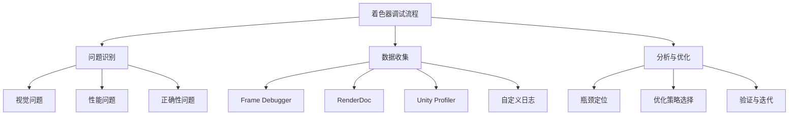
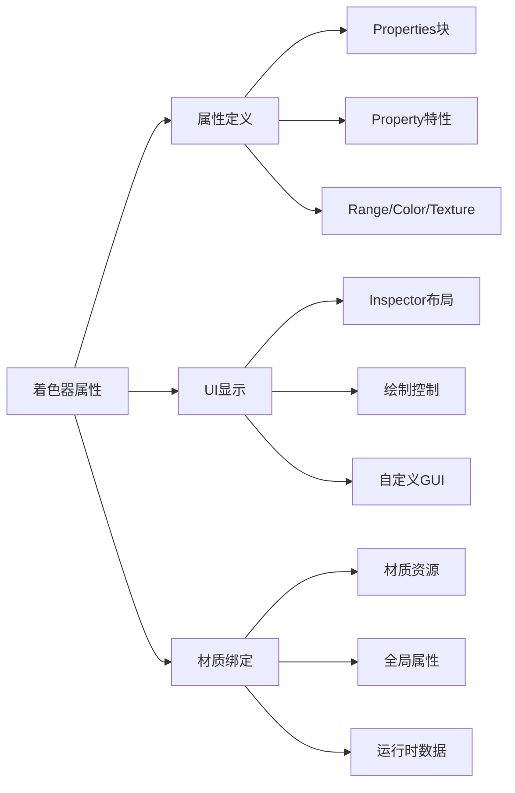
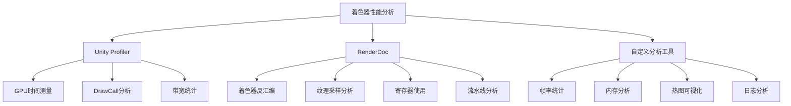

本文档全面介绍了项目中使用的着色器系统架构、实现细节、材质工作流以及调试技巧。着色器是图形渲染管线中的核心组件，负责定义物体表面如何与光线交互，是视觉表现力的关键决定因素。

## 1. 系统架构概览

着色器系统在图形渲染管线中扮演核心角色，它将顶点数据和纹理信息转化为屏幕上的最终像素颜色。本项目采用 Unity 的标准渲染管线，结合自定义着色器实现特定视觉效果。

## 2. 着色器类型与实现

### 2.1 内置着色器

项目使用了 Unity 内置的标准着色器，这些经过优化的着色器提供了广泛的渲染功能：

| 着色器类型 | 用途 | 性能特点 | 引用示例 |
|---------|------|----------|----------|
| Standard | 通用PBR渲染 | 中等 | 项目中大量材质使用 |
| Unlit | 不受光照影响 | 极高 | 用于UI元素和特效 |
| Mobile/VertexLit | 移动端优化 | 高 | 用于低端设备 |
| Terrain | 地形渲染 | 中等 | 复杂地形区域 |

### 2.2 自定义着色器

项目包含一些自定义着色器实现，用于特定的视觉效果：

**水体着色器**：实现了真实的水面效果，包括波浪、反射和折射。从日志文件可以看出，水体着色器使用了复杂的顶点着色器计算来模拟波浪运动。

**植被着色器**：优化用于大量植被对象的渲染，包含了风效动画和视锥剔除优化。

> **注意**：自定义着色器的编译输出存储在 `Temp/Burst/` 目录下，这些文件包含了编译后的GPU机器码，用于运行时加载。

## 3. 材质工作流

### 3.1 材质创建

项目的材质创建遵循PBR（基于物理的渲染）工作流，每个材质包含以下贴图：

- **Albedo（反照率）**：定义表面颜色和基础纹理
- **Normal（法线）**：定义表面微小的凹凸细节
- **Metallic（金属度）**：定义表面像金属一样的程度
- **Smoothness（光滑度）**：定义表面的粗糙程度
- **AO（环境光遮蔽）**：定义表面自遮挡阴影

材质贴图存储在 `Assets/Art/Textures/` 目录中，按类型组织：

### 3.2 材质变体系统

项目使用材质变体系统来优化内存使用和渲染效率，相似的材质共享基础贴图，只改变参数：

## 4. 着色器优化技术

### 4.1 编译优化

项目使用了Unity的着色器编译优化技术，从编译日志可以看出：

- **变体编译**：只为需要的功能编译着色器变体
- **关键字剔除**：移除不必要的着色器功能
- **批处理友好**：设计着色器以支持GPU实例化

> **编译日志分析**：`shadercompiler-UnityShaderCompiler.exe0.log` 文件记录了着色器编译过程，显示了优化选项和编译时间。

### 4.2 运行时优化

运行时着色器优化包括：

- **LOD（细节层次）切换**：根据距离使用不同复杂度的着色器
- **批处理**：合并使用相同材质和着色器的绘制调用
- **遮挡剔除**：不渲染被其他物体遮挡的着色器

## 5. 特效着色器

特效着色器用于实现视觉特效，如粒子系统、光效和后处理效果：

**粒子着色器**：
- 支持纹理动画
- 包含顶点色混合
- 实现软粒子效果

**光效着色器**：
- 加法混合模式
- 旋转UV动画
- 衰减效果

**后处理着色器**：
- 全屏效果应用
- 顺序执行
- 性能敏感

> **注意**：特效着色器通常使用简单的着色器模型，优先考虑视觉效果和性能。

## 6. 调试与分析

### 6.1 着色器调试工具

项目提供了多种着色器调试工具：

- **Frame Debugger**：捕获单帧渲染过程
- **RenderDoc集成**：高级着色器分析
- **着色器变体统计**：查看编译的着色器变体数量

### 6.2 性能分析

着色器性能分析包括：

- **GPU时间**：测量着色器执行时间
- **带宽使用**：分析纹理采样带宽
- **指令计数**：比较不同着色器的复杂度

### 6.3 常见问题与解决

| 问题 | 可能原因 | 解决方案 | 相关文件 |
|-----|---------|---------|---------|
| 材质显示黑色 | 着色器编译失败 | 检查编译日志，重新编译 | `shadercompiler-*.log` |
| 法线贴图无效 | 纹理导入设置错误 | 修正法线贴图导入设置 | 材质贴图文件 |
| 性能下降 | 过度复杂的着色器 | 简化着色器，使用LOD | `Temp/Burst/*.dll` |
| 闪烁效果 | Z-fighting | 调整深度偏移或阴影距离 | 场景文件 |

## 7. 材质资源管理

### 7.1 资源导入设置

材质资源需要正确的导入设置才能在着色器中正常工作：

**Albedo贴图设置**：
- 纹理类型：默认
- 最大尺寸：2048或4096
- 压缩格式：ASTC 6x6（移动端）/ ETC2（旧设备）或 DXT5（PC）

**Normal贴图设置**：
- 纹理类型：法线贴图
- 最大尺寸：1024或2048
- 压缩格式：ASTC 6x6或 BC5（PC）

**Metallic/Smoothness贴图设置**：
- 纹理类型：默认
- 最大尺寸：512或1024
- 压缩格式：ASTC 4x4或 BC4（PC）

### 7.2 内存优化

材质内存优化策略包括：

- **纹理图集**：合并小纹理到大的图集纹理中
- **Mipmap生成**：为所有纹理生成Mipmap链
- **纹理压缩**：使用平台特定的纹理压缩格式
- **按需加载**：只在需要时加载材质资源

> **注意**：`Library/Artifacts/` 目录包含了导入后的资源数据，可以用于分析内存使用情况。

## 8. 着色器编程与脚本

### 8.1 着色器语言

项目支持多种着色器语言：

- **HLSL**：Windows平台的主要语言
- **GLSL**：移动端和部分PC平台
- **Metal**：macOS和iOS平台

Unity着色器语言（ShaderLab）作为高级抽象层，处理跨平台差异。

### 8.2 着色器属性

着色器属性控制材质在Inspector中的显示和编辑：

## 9. 着色器变体系统

### 9.1 变体编译

着色器变体系统允许单个着色器文件生成多个编译版本，每个版本支持不同的功能组合：

- **光照模型变体**：前向渲染、延迟渲染、无光照
- **阴影支持变体**：无阴影、硬阴影、软阴影
- **平台特性变体**：移动端、PC、控制台

> **注意**：变体数量直接影响内存使用和加载时间，需要合理控制。

### 9.2 变体剔除

项目使用变体剔除技术来减少编译的着色器变体数量：

- **平台剔除**：只为当前平台编译需要的变体
- **功能剔除**：移除项目中不使用功能的变体
- **层级剔除**：基于质量设置剔除高级特性

## 10. 着色器性能分析工具

### 10.1 Unity Profiler

Unity Profiler提供了着色器性能分析功能：

- **GPU时间**：测量着色器在GPU上的执行时间
- **带宽使用**：分析纹理采样和帧缓冲带宽
- **指令计数**：比较不同着色器的复杂度

### 10.2 RenderDoc

RenderDoc提供了更详细的着色器分析：

- **着色器反汇编**：查看编译后的着色器代码
- **纹理采样分析**：分析每次纹理采样的开销
- **寄存器使用**：分析GPU寄存器压力

## 下一步：渲染管线

着色器系统与渲染管线密切相关，建议阅读 [渲染管线](29-guang-zhao-yu-yin-ying) 文档以了解整个图形渲染流程。