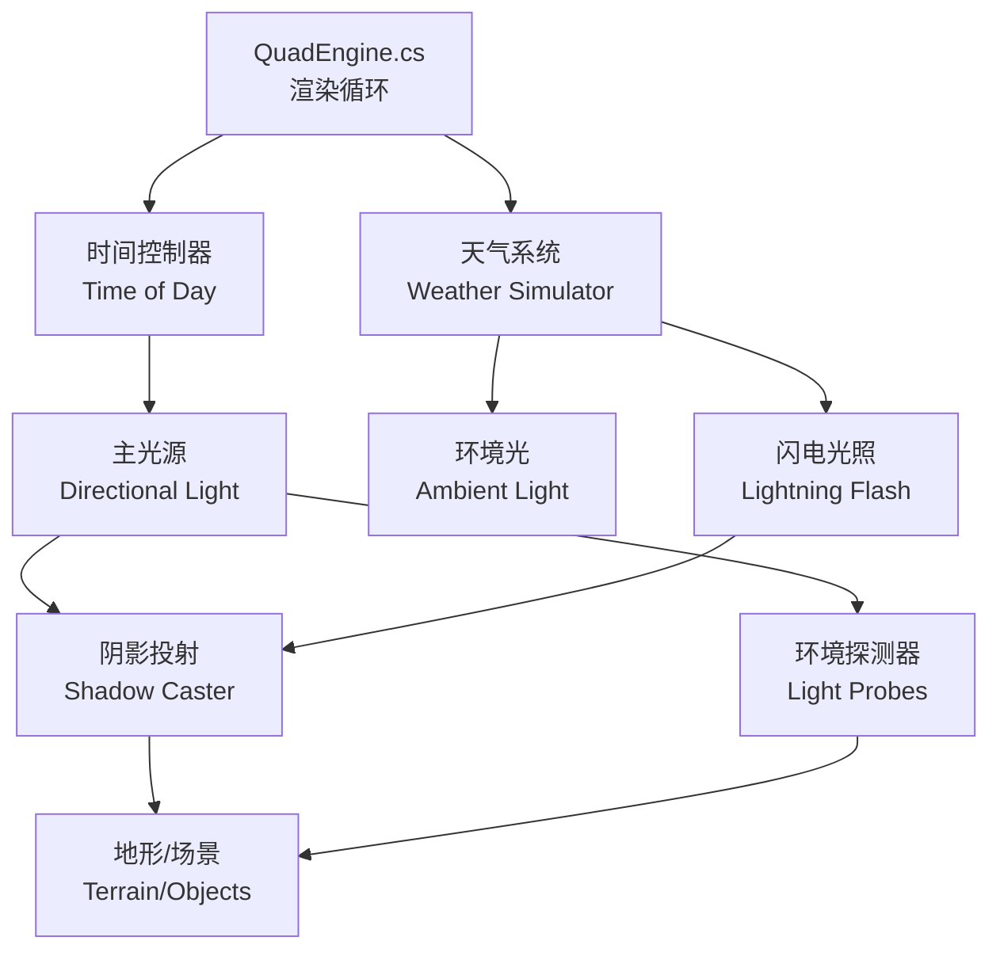

光照与阴影系统决定了《Fishing Planet》的视觉氛围、玩家的沉浸感以及关键的游戏机制（如昼夜循环、天气变化）。本页面详细阐述了游戏的全局光照架构、阴影实现方式以及天气系统对光照的动态影响。

## 光照系统架构

光照系统并非孤立存在，而是与时间管理和天气系统紧密耦合。核心引擎负责根据游戏状态实时更新光源参数。

*   **QuadEngine.cs**: 作为核心引擎脚本，管理每一帧的渲染调用，负责协调各光照组件的更新。
*   **时间控制器**: 根据游戏内的时间流逝，计算太阳（主光源）的位置、角度和颜色（如日出/日落的橙色调）。
*   **天气系统**: 根据降雨、云层覆盖度动态调整环境光强度，并在触发雷电时瞬间增加光照强度。
*   **阴影投射**: 将物体投射到地形或其他物体上的过程，通过 `QualitySettings.asset` 进行统一管理。

Sources: [QuadEngine.cs](../QuadEngine.cs#L1-L50)

## 光源类型

为了还原真实的钓鱼环境，项目使用了混合的光源方案。

| 光源类型 | 主要用途 | 动态特性 | 性能开销 |
| :--- | :--- | :--- | :--- |
| **Directional Light** (主光源) | 模拟太阳，照亮整个场景，产生主要阴影。 | 根据时间缓慢移动位置和颜色。 | 中（主要用于实时阴影计算）。 |
| **Point Light** (点光源) | 营火、房屋灯、营地灯等局部照明。 | 基于开关状态或特定事件开启/关闭。 | 高（取决于光照范围和数量）。 |
| **Spot Light** (聚光灯) | 手电筒、垂钓灯等定向照明。 | 随玩家视角移动，强度可调。 | 中/高（根据体积光设置）。 |
| **Ambient Light** (环境光) | 模拟天光反射，决定场景暗部亮度。 | 随天气和时间动态变化。 | 低（通常为纯色或渐变贴图）。 |
| **VFX Light** (特效光) | 闪电、火把瞬时光效。 | 极短促的爆发性变化。 | 中（由粒子系统触发）。 |

*   **VFX Light**: 在雷暴天气中，闪电产生的光照通过 `LightningGlowTexture.png` 纹理配合粒子系统实现，这是一种非物理的视觉增强手段。

Sources: [Assets/Textures/LightningGlowTexture.png](../Assets/Textures/LightningGlowTexture.png#L1)

## 阴影技术

为了保证性能与画质的平衡，项目对不同类型的对象采用了差异化的阴影技术。

### 阴影映射

*   **地形**: 使用 **Cascade Shadow Maps (CSM)**。由于地形范围广且阴影精度要求较高，CSM 将视锥分为多个层级（级联），近处阴影高精度，远处阴影低精度，并在远处逐渐过渡为无阴影。
*   **动态物体**: 钓竿、船只、人物等移动物体使用实时阴影。
*   **静态物体**: 距离摄像机较远的树木、建筑可能使用 **Baked Shadows**（烘焙阴影），即预先计算好光照信息并存储在光照贴图中，以节省实时渲染开销。

Sources: [ProjectSettings/QualitySettings.asset](../ProjectSettings/QualitySettings.asset#L10-L50)

### 阴影质量设置

游戏通过 Unity 的 Quality Levels 来控制阴影的分辨率和距离，以适应不同性能的硬件。

| 预设级别 | 阴影分辨率 | 阴影距离 | 级联数 | 适用场景 |
| :--- | :--- | :--- | :--- | :--- |
| **Ultra** | 4096 | 150m | 4 | 高端 PC，追求极致画质。 |
| **High** | 2048 | 100m | 4 | 主流 PC，平衡画质与性能。 |
| **Medium** | 1024 | 70m | 2 | 中低配 PC，优先保证帧率。 |
| **Low** | 512 | 40m | 1 | 集成显卡，极简阴影设置。 |

*   **Shadow Distance**: 当物体距离摄像机超过此值时，将不再投射实时阴影。
*   **Shadow Cascades**: 增加级联数可以减少阴影边缘的锯齿（锯齿过渡），但会增加 GPU 消耗。

Sources: [ProjectSettings/QualitySettings.asset](../ProjectSettings/QualitySettings.asset#L20-L80)

## 天气与光照交互

光照系统不仅是基于时间的，还必须对环境变化做出反应。这主要通过 `Offline Weather Simulator`（离线天气模拟器）设计实现。

### 动态光照调整

*   **白天 (晴天)**:
    *   **Ambient Light**: 强度较高，色温偏冷白。
    *   **Fog**: 浓度低，颜色偏蓝。
    *   **Bloom**: 较弱，仅在水面反光处可见。
*   **黄昏/黎明**:
    *   **Directional Light**: 颜色转为暖橙色/紫色，角度极低。
    *   **Ambient Light**: 强度降低，阴影区域变深。
    *   **Fog**: 浓度增加，颜色与阳光混合。
*   **夜间**:
    *   **Directional Light**: 模拟月光，强度极低，颜色偏冷蓝。
    *   **Point Lights**: 开启，如营地灯光成为主要照明。
    *   **Bloom**: 开启，增强灯源的光晕感。
*   **雷暴天气**:
    *   **Ambient Light**: 随云层厚度大幅降低，模拟天色变暗。
    *   **Directional Light**: 强度减弱，模拟被云层遮挡。
    *   **Lightning Flash**: 随机触发瞬间的全屏强光，模拟闪电照亮天空。
    *   **Fog**: 浓度极高，能见度降低。

Sources: [docs/plans/2026-02-27-offline-weather-simulator-design.md](../docs/plans/2026-02-27-offline-weather-simulator-design.md#L1-L50)

### 闪电实现

闪电不仅是视觉特效，还是影响场景光照的光源。

*   **实现原理**: 通过脚本动态创建或临时激活一个高强度的 `Light` 组件（通常为 Directional 或 Spot），并在极短时间（0.1秒）后关闭或移除。
*   **音频同步**: 闪电光的触发通常与音效系统中的雷声（`Assets/Audio/sfx/`）同步，产生“光-声”的时间差，增加真实感。
*   **屏幕特效**: 闪电发生时，往往配合 `Bloom`（辉光）或 `Tone Mapping`（色调映射）的瞬时调整，使高光部分过曝，模拟相机对强光的反应。

Sources: [docs/plans/2026-02-27-offline-weather-simulator-impl.md](../docs/plans/2026-02-27-offline-weather-simulator-impl.md#L20-L60)

## 后处理对光照的影响

光照最终的表现离不开后处理阶段。项目使用 Post-Processing Stack 来修饰光照效果。

*   **Bloom (辉光)**:
    *   **作用**: 让亮部区域向周围溢出光线，营造朦胧感。
    *   **应用**: 夜晚的萤火虫、灯火、水面的反光、以及闪电瞬间的强光。
    *   **参数**: `Threshold` (阈值) 决定了多亮的光才会产生辉光，`Intensity` (强度) 决定了光晕的明显程度。
*   **Tone Mapping (色调映射)**:
    *   **作用**: 将高动态范围 (HDR) 的光照信息映射到显示器支持的动态范围 (LDR)，防止过曝或欠曝，同时提升对比度。
    *   **应用**: 在日落逆光或雪地场景中，防止强光区域纯白一片，保留细节。
*   **Ambient Occlusion (环境光遮蔽)**:
    *   **作用**: 在物体接触面或角落处添加阴影，模拟光线难以到达的区域，增强立体感。
    *   **应用**: 岩石缝隙、墙角、树枝分叉处。

Sources: [Packages/com.blackjack-inc.animgraph](../Packages/com.blackjack-inc.animgraph/package.json#L1-L10)

## 性能优化策略

光照与阴影是性能消耗的大户，项目采取了多种优化策略。

1.  **距离剔除 (Distance Culling)**: 玩家视野范围外的物体（如远处的树木）停止投射阴影。
2.  **烘焙 (Baking)**: 静态地形和不动的建筑使用 Lightmapper 进行光照计算，生成光照贴图，运行时不再计算这些物体的直接光照和漫反射。
3.  **LOD (Level of Detail)**: 针对阴影投射器也有 LOD 机制，远处的物体使用低面数模型甚至简化为不投射阴影的 Billboard（公告牌）。
4.  **Light Layering (光照分层)**: 部分光源（如玩家的手电筒）只照亮特定层级（Layer），避免影响不需要照到的环境物体，从而减少几何体的绘制。

Sources: [ProjectSettings/QualitySettings.asset](../ProjectSettings/QualitySettings.asset#L80-L120)

## 下一步：[后处理](../30-hou-chu-li)
了解完光照后，您可以查看后处理页面，深入了解 Bloom、Tone Mapping 等视觉效果是如何基于上述光照系统进行合成的。