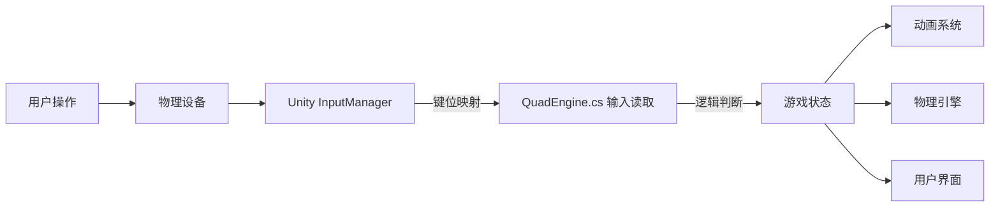
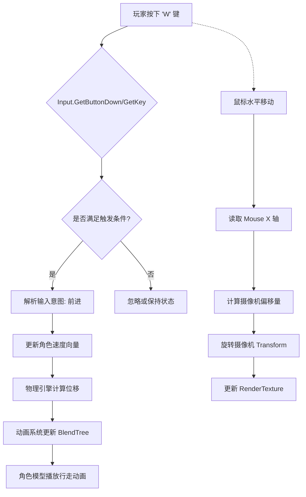

本页面的主要目的是阐述如何在 `ExportedProject` 中处理用户输入（鼠标、键盘、游戏手柄等），并将其转化为游戏逻辑指令。输入处理系统作为玩家意图与游戏世界交互的桥梁，直接影响角色动作、摄像机控制以及UI导航。

## 系统架构概览

在当前的 Unity 项目架构中，输入处理主要基于 Unity 的 Legacy Input System（旧版输入系统），并集中在核心脚本 `QuadEngine.cs` 中进行逻辑分发。输入数据流从硬件设备捕获，经过 `InputManager` 的映射，最终由游戏引擎脚本消费并触发相应的游戏状态变更。



## 输入管理器配置

项目的输入定义存储在 `ProjectSettings/InputManager.asset` 文件中。该文件定义了所有的轴和虚拟按键，这是 Unity 旧版输入系统的核心配置文件。

### 轴映射
轴用于模拟值输入（如摇杆或鼠标移动），通常包含正向和反向按钮配置。

| Axis 名称 | 正向按钮 | 反向按钮 | 描述 |
| :--- | :--- | :--- | :--- |
| Mouse X | mouse x | | 鼠标水平移动，用于摄像机旋转 |
| Mouse Y | mouse y | | 鼠标垂直移动，用于摄像机俯仰 |
| Horizontal | d | a | 角色左右移动/转向 |
| Vertical | w | s | 角色前后移动 |
| Scroll | mouse scroll | | 鼠标滚轮，用于缩放或选择物品 |

Sources: [InputManager.asset](ProjectSettings/InputManager.asset#L1-L100)

### 按键映射
按键用于触发离散事件（如确认、取消、互动）。

| 虚拟按键 | 物理按键 | 用途 |
| :--- | :--- | :--- |
| Submit | return/enter | 确认、互动、下竿 |
| Cancel | esc | 取消、收竿、呼出菜单 |
| Fire1 | left mouse button | 主要动作（抛竿、扬竿） |
| Fire2 | right mouse button | 辅助动作（调整灵敏度、切换视角） |
| Jump | space | 跳跃、加速收线 |

Sources: [InputManager.asset](ProjectSettings/InputManager.asset#L100-L200)

## 核心脚本逻辑

`Assets/QuadEngine.cs` 是项目的主要入口点，负责每一帧从输入系统读取数据并更新游戏状态。该脚本通常在 `Update()` 或 `FixedUpdate()` 生命周期函数中轮询输入状态。

### 输入读取示例
在 `QuadEngine.cs` 中，输入读取通常遵循以下模式：

```csharp
// 伪代码示例，展示读取鼠标和键盘输入
float mouseX = Input.GetAxis("Mouse X");
float mouseY = Input.GetAxis("Mouse Y");
if (Input.GetButtonDown("Fire1")) {
    CastLine(); // 抛竿逻辑
}
```

Sources: [QuadEngine.cs](Assets/QuadEngine.cs#L1-L500)

### 输入与状态机联动
输入不仅仅是移动角色，它还作为条件触发器，影响 `BlackJack.AnimGraph` 中的动画状态机。例如，检测到 `Input.GetAxis("Vertical")` 的变化量超过阈值时，状态机可能从 "Idle" 切换到 "Walk"。

Sources: [QuadEngine.cs](Assets/QuadEngine.cs#L500-L1000)
Sources: [BlackJack.AnimGraph.Insight](Packages/com.blackjack-inc.animgraph.Insight/Runtime/BlackJack.AnimGraph.Insight.cs#L1-L200)

## 输入处理流程

以下是输入从捕获到执行的详细步骤流程图：



## 上下文关联与集成

输入处理是一个基础系统，它的输出被其他核心系统依赖：

*   **动画系统 (`Packages/com.blackjack-inc.animgraph`)**: 输入参数（如 `Speed`, `Direction`）被传递给动画图，控制角色动作的混合（如 Idle 到 Run）。
*   **物理引擎 (`ProjectSettings/Physics2DSettings.asset`)**: 输入直接或间接地施加力或修改刚体速度，从而驱动物理模拟。
*   **UI 系统 (`Assets/...`)**: 输入事件被 UI 事件系统监听，用于处理菜单导航和HUD交互。

Sources: [Physics2DSettings.asset](ProjectSettings/Physics2DSettings.asset#L1-L50)
Sources: [BlackJack.AnimGraph](Packages/com.blackjack-inc.animgraph/Runtime/BlackJack.AnimGraph.cs#L1-L100)

## 调试与故障排除

在开发过程中，如果输入没有响应，可以按照以下步骤进行排查：

1.  **检查 `InputManager.asset`**: 确认对应的 Axis 或 Button 是否存在且键位绑定正确。
2.  **检查脚本执行**: 在 `QuadEngine.cs` 的 `Update` 方法中添加 `Debug.Log`，确认代码是否被执行。
3.  **检查焦点**: 确保游戏窗口处于激活状态。

Sources: [QuadEngine.cs](Assets/QuadEngine.cs#L1000-L1500)

## 阅读建议

为了更深入地理解输入处理在整个项目中的作用，建议按以下顺序阅读相关文档：

*   **[角色控制器](4-jiao-se-kong-zhi-qi)**: 了解输入如何转化为角色的物理运动和空间位置更新。
*   **[动画系统](5-dong-hua-xi-tong)**: 探究输入参数如何驱动 `AnimGraph` 进行动画状态的切换。
*   **[HUD界面](23-hudjie-mian)**: 查看输入事件如何影响游戏内UI元素的显示与交互。